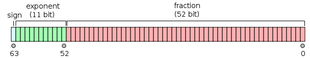
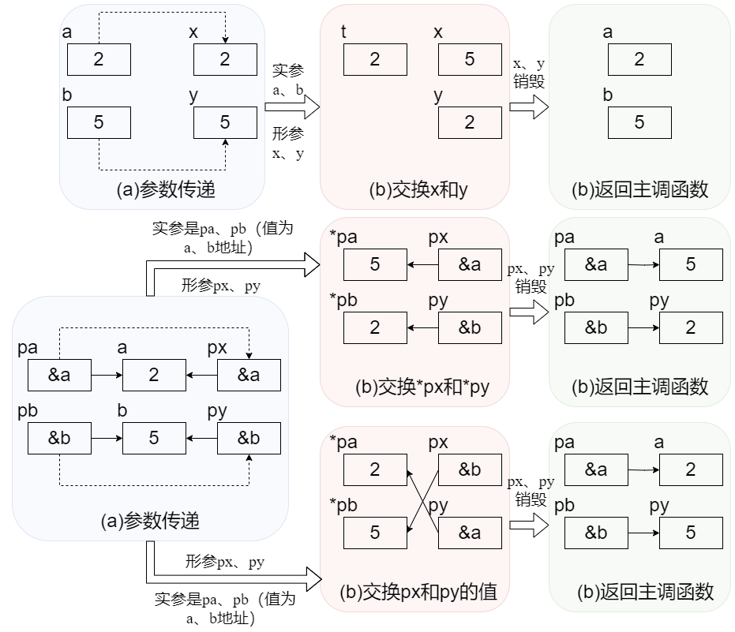
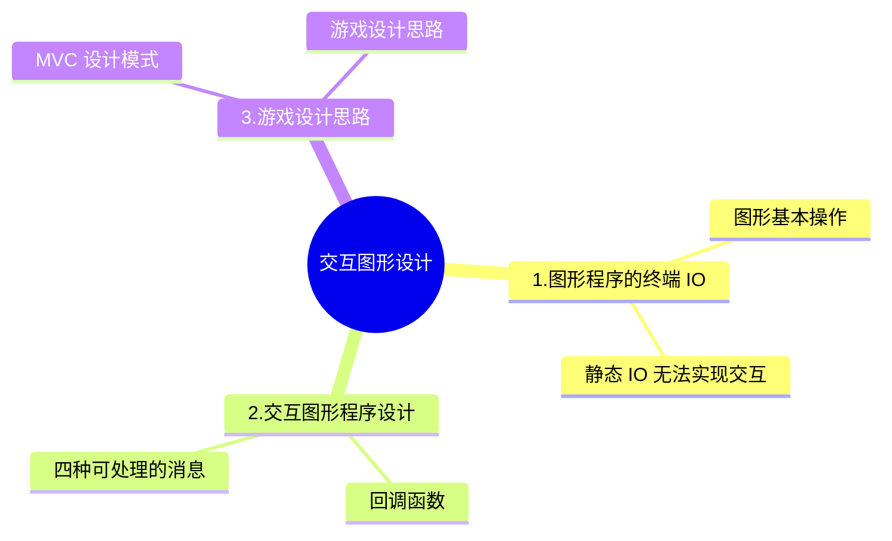

# C 语言程序设计

## 程序设计入门——C 语言

### 第一章：程序设计与 C 语言

#### 1.计算机和编程语言

**课程目的**

* 通过学习编程，来理解计算机是怎样解决问题的。

**人和计算机的区别**

* 人：What to do

* 计算机：How to do

* 重复是计算机最擅长的事情

* 程序设计语言必须具有**数据表达**和**数据处理(称为控制)**的能力
* 程序设计语言的 3 个基本内容——数据表达、运算和流程控制

**程序的执行**

* 解释：借助一个程序，那个程序能试图理解你的程序， 然后按照你的要求执行 

* 编译：借助一个程序，就像一个翻译，把你的程序翻译成计算机真正能懂的语言——机器语言——写的程序，然后，这个机器语言写的程序就能直接执行了

**解释语言 vs 编译语言**

* 语言本无编译/解释之分，只是常用的执行方式而已

* 解释型语言有特殊的计算能力(比如计算中修改代码)

* 编译型语言有确定的运算性能

- [x] **课后讨论 1.1.1：关于编程语言和计算机**

> 计算机里的 CPU 可以直接运行人类编写的程序吗？为什么说编程语言不是和计算机交谈的语言。
>

讨论：

* 不能，因为 CPU 可以直接识别的是机器语言，而编程语言要经过转换才能形成 0101 的机器语言，所以不能直接运行；编程语言是要求计算机做事情，是要求，而不是交谈，交谈是点开了一个 APP，它能给我显现内容（这也是交互性吧）

- [x] **课后讨论 1.1.2：编译执行与解释执行**

> ​    有的编程语言，源代码经过编译后形成目标代码，但是这样的目标代码不能直接在 CPU 上执行，而是需要由一个仿真器程序来解释执行。这样的执行方式是编译的还是解释的？
>

讨论：

* 判断是**解释执行**还是**编译执行**最根本的方法是判断是否产生可直接运行的机器代码。编译执行的步骤，一般包括：编译、链接和执行。在编译、链接后，会产生可直接运行的机器代码。在产生机器代码之后，可以单独运行执行（VC 中的！，DEV-C++ 中的 F10）程序即可重复运行。不需要再次编译和链接。在本题中，目标代码必须要仿真器程序才能得到再次执行，说明在执行过程中没有产生并保存机器代码。仿真器程序的本质还是对目标代码进行逐条解释，并执行。所以，认为是解释执行的。

#### 2.C 语言

**为什么历史选择了 C**

* 单片机、操作系统等等很多地方都往往用 C 来编写。而 Java 等语言有很多可以替代的语言。

* 现代的编程语言在语法上的差异很小

* 几乎都是 C-like 语言，语言的能力和适用领域主要是由库和传统决定的

* C 语言起源于 1969 年夏天，“It was the summer of '69'”

**C 语言的发展**

* C 语言是从 B 语言发展而来的，B 语言是从 BCPL 发展而来的，BCPL 是从 FORTRAN 发展而来的

* BCPL 和 B 都支持**指针间接方式**，所以 C 也支持了

* C 语言还受到了 PL/1 的影响，还和 PDP-11 的机器语言有很大的关系

* 1973 年 3 月，第三版的 Unix 上出现了 C 语言的编译器

* 1973 年 11 月，第四版的 Unix(System Four) 发布了，这个版本是完全用 C 语言重新写的

**C 的发展与版本**

* 经典教材：《The C Programming Language》即 K&R the C

* The C Programming Language, by Brian Kernighan and Dennis Ritchie, 2nd Edition, Prentice Hall

**C 的发展与版本-标准**

* 1989 —— ANSI C

* 1990 —— ISO 接受了 ANSI 的标准 C89

* 1995 和 1999 两次更新，分别为 C95 和 C99

* 所有当代的编译器都支持 C99 标准了

**C 语言用在哪里**

* 操作系统 

* 嵌入式系统

* 驱动程序

* 底层驱动

* 图形引擎、图像处理、声音效果

**C 语言是一种工业语言**

* 开发效率>>学习过程

* 开发效率>>开发乐趣

* 日常应用很少直接用 C 语言编写

* 学习 C 的过程主要是写练习代码而非真实软件

**结构化程序**

* 结构化程序由三种基本结构组成，三种基本结构组成的算法<u>可以完成任何复杂的任务</u>。

* 结构化程序的设计方法：a.自顶向下 b.逐步求精 c.模块化 d.结构化

1. **自顶向下**：程序设计时，应先考虑总体步骤，后考虑步骤的细节；先考虑全局目标，后考虑局部目标。先从最上层的总目标开始设计，逐步使问题具体化，不要一开始就追求众多的细节。

2. **逐步求精**：对于复杂的问题，其中大的操作步骤应该再将其分解为一些子步骤的序列，逐步明晰实现过程。

3. **函数实现**：通过逐步求精，把程序要解决的全局目标分解为局部目标，再进一步分解为具体的小目标，把最终的小目标用函数来实现。问题的逐步分解关系构成了函数间的调用关系。

**C 语言需要编译运行**

* 所以你需要编译器、编辑器或者 IDE(Integrated Development Environment)集成开发环境

* 推荐的编译器——Dev C++(可以在代码托管网站——soureceforge.net 上下载)

* C 语言的编译器很多，因为早期为其配置编译器的厂家很多，所以会导致很多个人因素夹杂其中的“方言”

* 后面很多语言，为其做编译器的厂商往往只掌握在少数厂商手上，反而容易选了:)

**C 语言的编辑-编译-连接**

* C 语言编写的程序称为**源程序**，它以 ASCII 代码形式存放在一个**文本文件**中，NotePad++,Source Insight，Visual Studio Code 是常用的文本代码编辑器，该文件一般以“**.c**”作为文件扩展名。

* 编译是指将已经编辑好的源程序编译成二进制代码表示的**目标程序**的过程。编译分为预处理和编译处理，如果存在语法错误，编译程序会指出语法错误所在，不会生成二进制代码，没有语法错误则生成一个**二进制文件**，后缀为"**.obj**"。

* 上述过程产生的文件还不能直接运行，还需要编程环境提供的库函数进行连接(Link)，形成**可执行的程序**，是一个**二进制机器指令文件**，后缀为“**.exe**”。

* 源程序中的每条可执行语句最终都将被转换成二进制机器指令，而像注释这样的非执行语句将会在编译时就被忽略。


<center style="color:#C0C0C0">图 1.0 编辑-编译-连接</center>

#### 3.第一个 C 程序

**程序框架**

```c
#include <stdio.h>

int main()
{
    /*Code*/
    return 0;
}
```

* C 语言规定必须用 main 作为主函数名，程序将从此开始执行，在此结束，一个 C 源程序至少应包含一个 main() 函数。

* C 程序的基本组成单位是**语句**。

* C 程序中，{ }括起的许多语句成为**复合**语句。

下面是本课程个人喜欢的程序框架，注释之间有空行代表代码有空行。

```c
//头文件区 start
#include <stdio.h>
#include <math.h>
//end
int main()
{
    /*
        定义区
    */

    /*
        初始化区(包括一些 scanf() 也可以放这里)
    */
    /*
        程序核心算法区
    */
    /*
        输出区 printf()
    */

    return 0;
}
```

**输出 `printf()`**

```c
printf("Hello World!\n");
```

* ""里面的叫字符串，`printf()`会将其中的内容原封不动的输出。

* 如果需要在最终黑色的控制台调整输出内容，可以加入转义字符，比如`'\n'`表示需要在输出结果后面换一行

* 后面可以插入表达式做运算

```c
printf("%d\n", 20 + 25);
```

* C 程序实现的算法可以没有输入，但是必须要有输出(没输出这个程序有什么意义呢?)

* 保留 2 位小数，以及保留 2 位，以及补零。

```c
printf("%m.nf", x);  //m 为宽度限定词，意为保留宽度 m，不足 m 则左端补空格，大于 m 则按实际位数输出; 小数点后 n 位。
printf("%.2f", x);   //保留两位小数
printf("%2f", x);    //保留两位宽度
printf("%02f", x);   //保留两位宽度，不足前面补零
```

**程序中的错误**

* C 语言的代码可以写在不同的两行，是符合语法的。

* 编译的时候发现的错误所在的地方会以红色的底表示出来 (Dev-C++为例)

* 具体的错误原因以英文列在下方的窗口里

* C 的编译器给出的错误提示往往不那么好“猜”

* 不要用中文，C 编译器只能识别半角的英文符号

* 关于数字 0，为了防止和英文字母 O 混淆，编译器往往在 0 的中间加点或者斜线区分，这个是有一定历史渊源的

* 调试是在程序中查找错误并修改错误的过程。(错误包括**逻辑错误(语义错误)**和**语法错误**)

* 有时调试可以不借助编译器的调试工具，而是在程序某些节点插入 printf()，把值直接打印出来观察是否有异常。

**关于 GCC**

* C 编译器最早是机器自带的，cc 指的是 Compile Collection（编译器生成器）

* gcc 就是 GNU 操作系统下的 CC，后来 GNU 的编译器打败了 Unix 自己做的编译器，于是很多 Unix 机器也开始使用 GCC，90 年代，GCC 也跑在 Linux 上

* 同样，DOS(Disk Operating System) 磁盘操作系统上，最早使用的是 mscc(微软的 cc)，也就是后来 VS 6、VS20xx 的前身。

**那么如何移植 GCC 到个人计算机的主流系统 Windows 上呢？**

移植 gcc 本身

* gcc →API（应用程序接口）→ windows

移植 library 库


<center style="color:#C0C0C0">图 1.1 连接的过程</center>

如何移植 library 有两种方案

1. 使用 Cygwin(一个在 Windows 平台上运行的类 UNIX 模拟环境)

* 在 Windows 上给一个 Unix Lib.，Cygwin 下 gcc 编译的 .c 文件在和 Unix lib. 共同努力下，变成一个可以在 Windows 上运行的 Unix 程序


<center style="color:#C0C0C0">图 1.2 利用 Cygwin 移植 library</center>

* 可以知道，Cygwin 底下的 gcc 编译出的程序，不是在 Windows 上直接运行的，而是在 Unix 上可以直接运行的，但 Cygwin 给了一个可以在 windows 上运行 Unix 程序的接口，于是你的程序就可以运行了。

2. 使用 MinGW(Minimalist GNU for Windows——Windows 上可以跑的最小 GNU 的集合)

* 它是一个可自由使用和自由发布的 Windows 特定头文件和使用 GNU 工具集导入库的集合，允许你在 GNU/Linux 和 Windows 平台生成本地的 Windows 程序而不需要第三方 C 运行时（C Runtime）库。目前已经停更很多年了，原来版本是 MinGW32，现在最新的是 MinGW64。另外，现在也有其它选择——<u>TDM-GCC</u>，这是衍生自 MinGW 和 MinGW-w64 的类似项目，但是由另外的机构开发的，分为 32 位与 64 位两个版本，32 位版本的编译目标仅兼容 32 位应用程序，此外，MinGW-w64 还有基于 <u>LLVM 构建的 Clang</u> 编译器。TDM-GCC 安装较为简单，所以可以优先选用。

* MinGW(读音“民基 W”，不要读成“明 W”)，MinGW 的做法如下


<center style="color:#C0C0C0">图 1.3 利用 MinGW 移植 library</center>

* MinGW 和 Cygwin 的区别是，MinGW 用 GNU 编译出 Windows 下可以运行的程序，而 Cygwin 编写的是 Unix 可以直接运行的程序。

**GCC 下载与安装**

* TDM-GCC 官网：tdm-gcc.tdragon.net

* Visual Studio Code 官网：code.visualstudio.com

* 注意，Visual Studio 是一个编辑器，一开始是不能直接运行 C/C++ 程序的，应该使用拓展插件。

* 下载 **C/C++** 语法高亮、Code Runner 两个插件就可以

* 多个 .c 文件处理比较复杂，Visual Studio 肯定不只是用来解决一个 .c 文件的处理，多文件处理应该使用 **Work Space(工作区)**。Work space 建立方式不能直接建立，而是通过**新建文件夹→Open Folder**来建立。

**Work Space 的使用**

* 如果工作区初始完全为空，则通过 new file 建立文件

* 如果工作区初始非空，VS 会自动识别文件夹内的工程文件，并显示在左侧边文件预览栏内，但此时不能直接 Run 我们想要运行的第一个 .c 文件，会显示编译不成功。因为 VS 只能认当前那第一个 .c 文件内的代码，其他使用到的 work space 里的其他库文件没有成功编译进去。解决方法有两个：

1. 使用 View 下的 Terminal(终端)

​    在 Terminal 内编译需要的其他 .c 文件，将这些文件一起编译。

2. 使用 Make file .

​    把 make file 拷贝到目录下，在 terminal 内，使用自带的 mingw32-make，通过 make 把这些.c 文件合并为一个大文件。

- [x] **课后讨论 1.3.1：我们是在学习 GCC 吗？**

> 常听到有人说他学的是 Visual C，有人学的是 Turbo C，不是我们学的什么 Dev C，是他们的比我们的高级吗？还有 GCC 到底是什么？

讨论：

1. Visual C、Turbo C 和 Dev C 都是 C 语言的开发工具，Visual C 是由微软公司开发维护 C/C++的开发工具（1993 年首次推出），Turbo C 由美国 Borland 公司开发的一套 C 语言开发工具，它出现最早，于 1987 年首次推出，Dev C 由个人开发者 Colin Laplace 主导开发维护，目前已经不再更新维护，而包含 Visual C 的 Visual Studio 一直在更新，但是 Visual Studio 非常庞大，如果需要轻量的编译工具，推荐 Code Blocks。当然，Code Blocks 与上述这些工具没有本质上的区别。

2. C 语言可移植性体现在不依赖具体实现，也就是说在 Visual C 下成功编译并执行的代码，用 Turbo C 和 Dev C 也能编译并成功执行，而且功能一致。这些工具之间的区别在于其所提供的代码编辑功能等有差异，比如有些工具不支持代码高亮或 C 语言关键字着色等等。当然，也有相似功能但操作方式不一样的情况，比如调试功能的操作方式。

3. GCC 原名为 GNU C Compile，原本只能处理 C 语言，后来发展成为 Fortran、Pascal、Objective-C、Java、Ada,Go 等多种语言的编译器，便改名为 GNU Compiler Collection。

- [x] **课后讨论 1.3.2：main() 的样子**

> 为什么看到有的书上的`main()`是`void main()`，而我们课件上是`int main()`？还有`main()`里面那句`return 0`; 是必须的吗？
>

讨论：

* main 函数的返回值用于说明程序的退出状态。如果返回 0，则代表程序正常退出。返回其它数字的含义则由系统决定。通常，返回非零代表程序异常退出。

**1.void main（）**

* 有一些书上的 main()，都使用了 void main() ，其实这是错误的。C/C++ 中从来没有定义过`void main() `。C++ 之父 Bjarne Stroustrup 在他的主页上的 FAQ 中明确地写着 “The definition void main() { /* … */ } is not and never has been C++, nor has it even been C.”

* 这可能是因为在 C 和 C++ 中，不接收任何参数也不返回任何信息的函数原型为“void foo(void);”。可能正是因为这个，所以很多人都误认为如果不需要程序返回值时可以把 main 函数定义成 void main(void) 。然而这是错误的！main 函数的返回值应该定义为 int 类型，C 和 C++ 标准中都是这样规定的。虽然在一些编译器中，void main（） 可以通过编译，但并非所有编译器都支持 `void main ()` ，因为标准中从来没有定义过 void main 。g++3.2 中如果 main 函数的返回值不是 int 类型，就根本通不过编译。而 gcc3.2 则会发出警告。所以，为了程序拥有很好的可移植性，一定要用` int main ()`。

**2.main（）**

* 那既然 main 函数只有一种返回值类型，那么是不是可以不写？规定：不明确标明返回值的，默认返回值为 int，也就是说 main() 等同于`int main()`，而不是等同于`void main()`。在 C99 中，标准要求编译器至少给` main() `这种用法来个警告，而在 c98 中这种写法是被允许的。但为了程序的规范性和可读性，还是应该明确的指出返回值的类型。

- [x] **章末习题：Hello World”（5 分）**

> **题目内容：**
>
> 请输出一行，内容为
>
> Hello World
>
> 请注意大小写。
>
> 由于这一周只是简单地介绍了 C 程序的基本框架，还不能做很多事情，甚至还不能做数据的输入，所以这一周的题目也非常简单。第二周会仔细介绍如何在中 M 和拼题 A 做题，如果你一时无法搞定如何提交这周的作业，没关系，可以先在在线编程环境或 IDE 中做好程序，下周学过之后再来提交作业。。所以，你可以慢慢来，一点点能跟上来就可以了。
>
> **输入格式:**
>
> 无输入
>
> **输出格式：**
>
> 一行文字
>
> **输入样例：**
>
> 无
>
> **输出样例：**
>
> Hello World
>

---

解答：

```c
#include <stdio.h>

int main()
{
    printf("Hello World");
    
    return 0;
}
```


### 第二章：计算

#### 1.变量

```c
#include <stdio.h>

int main()
{
    const int AMOUNT = 100;           /*Line 1*/
    int price = 0;                    /*Line 2*/

    printf("请输入金额（元）：");
    scanf("%d", &price);

    int change = AMOUNT - price;

    printf("找您 %d 元。\n", change);

    return 0;
}
```

* 受到之前`printf()`做计算的启发，我们想到能否不要每次都输入`printf()`，而是只给两个数字就能计算呢？这就要利用到变量来实现了。

**变量的设想与定义**

* 我们需要：① 有地方放输入的数字 ② 有办法输入数字 ③ 输入的数字能参与计算

* 上述程序`int price = 0`，定义了一个变量，变量的名字是 price，类型是 int，初始值是 0。

* 变量就是一个保存数据的地方，只有用变量保存了数据，这个数据才能参与到后面的运算中去。

* 变量定义的一般形式是：<类型名称><变量名称>

* 变量需要一个名称，变量的名字就是一种“标识符”

* 标识符有标识符的构造规则，基本规则是只能由**下划线、字母、数字**组成，数字不能出现在第一个位置上，C 语言的<u>关键字</u>(或叫<u>保留字</u>)，不可用做标识符。

**如何输入**

1. 输入也在终端窗口中。

2. 输入是以行为单位进行的，行结束标志就是你按下回车键，在你按下回车键之前程序不会读到任何内容。

3. C 语言中，数据的输入和输出都是通过函数调用实现的。

**变量的赋值和初始化**

* `int price = 0`除了定义了一个新变量，还是一个赋值语句，`=`表示将右边的值赋值给左边的变量。因为这个语句是在定义变量时赋值，所以又称为**初始化**。对 C 语言来说，赋值和初始化差异并不大，但对其他语言两者差异可能会比较大。

```c
<类型名称><变量名称> = <初始值>  /*初始化操作*/
```

* 注意，一行如果有多个变量要初始化，你必须一个一个赋值，而不能只赋给一个，那样其他变量值不确定。

* 赋值与数学不同，a=b 在数学中表示关系，即 a、b 的值一样，但在 C 语言中表示动作，把 b 的值赋给 a。关系是静态的，动作是动态的，前者 a=b 和 b=a 是等价的，但后者意义却截然相反。

* C 语言不强制要求所有变量都在定义的地方做初始化，但是所有变量在第一次被使用(出现在赋值运算符的右侧)之前，应该被赋值一次。

* 赋值“=”也是运算符，有运算符的式子就叫**表达式**。

**变量类型**

* C 是一种有类型的语言，所有变量在使用之前必须定义或声明，所有的变量必须有确定的数据类型。数据类型表示变量可以存放什么样的数据，变量中也只能存放指定类型的数据，程序运行过程中也不能改变变量类型。

* ANSI C 只能在开头定义变量，C99 支持任何要使用时定义变量即可。

**scanf()**

```c
    scanf("%d", &price);
    scanf("%d %d", &a, &b);
    scanf("%d,%d", &a, &b);
```

* `scanf()`是 C 语言中的一个输入函数,用于从标准输入设备（通常是键盘）读取数据。**它的全称是“scan formatted”**,表示按照指定的格式扫描输入数据。

​    ① 要求这个函数读入下一个整数，读到的结果赋值给变量 price。

​    ② 小心 price 前面的 &

​    ③ 特别注意，`scanf()`两个双引号之间，是你要输入的内容，而不是它会展示的内容，比如中间如果有逗号，你两个整数输入中间也要输入逗号，如果格式控制符是连续的，你也必须连续输入，`scanf()`才能正确运行，。

​    ④ `scanf()`可以读多个变量

​    ⑤ 如果格式控制符和变量类型不对应，比如 double 类型用了 %f 输入，则`scanf()`会输出 0。

```C
#include <stdio.h>

int main()
{
    int a;
    int b;

    printf("请输入两个整数：");
    scanf("%d %d", &a, &b);
    printf("%d + %d = %d\n", a, b, a + b);

    return 0;
}
```

**常量**

```c
int change = 100 - price;
const int AMOUNT = 100;    //更好的方式
```

* 固定不变的数，是常数。直接写在程序里，我们称作直接量 (literal)。

* 更好的方式，是定义一个常量，如上面第二行代码。

* 我们把出现在程序里面莫名其妙的数字叫 Magic Number（魔术数字），别人很难快速理解其含义。

**const**

* const 是一个修饰符，加在 int 的前面，用来给这个变量加上一个 const（不变的）属性。这个 const 属性表示这个变量只要初始化了，就不能再修改了。一般用**全大写字母**突出强调该变量是 const 变量。

```c
int change = AMOUNT -price;
```

* 如果你试图对常量做修改，把它放在赋值运算符的左边，编译器会报错。

```c
[Error] assignment of read-only variable 'a'
```

* 如果我们想让用户输入 AMOUNT 初始值，而不是使用固定初始值，可以使用下述代码。

```c
    int amount = 100;           /*给个初值没问题*/
    int price = 0;

    printf("请输入金额（元）：");
    scanf("%d", &price);

    printf("请输入票面（元）：");
    scanf("%d", &amount);

    int change = amount - price;

    printf("找您 %d 元。\n", change);
```

#### 2.计算

```c
#include <stdio.h>

int main()
{
    printf("请分别输入身高的英尺和英寸，"
        "如输入\"5 7\"表示 5 英尺 7 英寸：");

    double foot;
    double inch;

    scanf("%lf %lf", &foot, &inch);

    printf("身高是 %f 米。\n", 
        ((foot + inch / 12) * 0.3048));

    return 0;
}
```

**C 语言世界的数字运算**

* 两个整数的运算结果只能是整数

```c
10/3*3 = 9
```

* 10 和 10.0 在 C 中是完全不同的数

```c
10.0      //是浮点数
```

**浮点数**

* 带小数点的数值。浮点意思就是这个数小数点是可以浮动的，是计算机内部表达数字的一种方式，另一种方式叫**定点数**。不过 C 语言中你不会遇到定点数，人们借用浮点数这个词来表达所有带小数点的数。

* 但整数和浮点数放在一起运算时，C 语言会将整数转换为浮点数，然后进行浮点数的运算。

* 根据上一条，我们发现只要把其中一个变量设为浮点数并参与运算，表达式的结果就会转换为浮点数了，但需要注意，将整型变量赋值`sum = 0.5;`sum 的结果依然为 0。

```c
//执行以下程序段，sum 的值是 1。
int i, sum;
sum = 0;
for (i = 1; i <= 2; i++)
{
    sum = sum + 1.0/i;
}
//执行以下程序段，sum 的值是 0。
int i;
double sum;
sum = 0;
for (i = 2; i <= 4; i = i + 2)
{
    sum = sum + 1/i;
}
```

**double**

* double 的意思是“双”，它本来是“双精度浮点数”的第一个单词，人们用来表示浮点数类型。除了 double，还有 float，表示单精度浮点数。

* double 类型的变量，`scanf()`和`printf()`函数都需要更改相应格式控制符。

```c
int a; float b; double c;
scanf("%d", &a); printf("%d", a);
scanf("%f", &b); printf("%f", b);
scanf("%ld", &c); printf("%f", c);
```

**整数**

* 数据类型不能表达小数部分的数，整数和整数的运算结果还是整数。

* 计算机里面会有纯粹的整数，因为它运算快，占空间小。而现实生活中也在大量做整数的运算，所以整数的作用还是很大的。

#### 3.表达式

* **表达式**是一系列运算符和操作数的组合，用来计算一个值。

```c
total = 57;
count = count + 1;    //注意，count 和 赋值运算符 和 右边的 count + 1 一起构成表达式。
```

**运算符&操作数、取余运算**

* 运算符 (operator) 是指进行运算的动作，比如加法运算符“+”，减法运算符“-”；

* 操作数 (operand) 是指参与运算的值（也可以称为算子），这个值可能是常数，也可能是变量，还可能是一个方法的返回值。

* 取余运算就是求两个整数相除后的余数，用 A%B 来表示。C 语言中，求余运算符两边，必须为整型数。

* `x % n`的结果是 [0，n - 1] 的一个整数。

**计算时间差**

如果直接分别减，有可能会出现分钟借位的情况，所以要有所处理。

```c
int hour1, minute1;
int hour2, minute2;

scanf("%d %d", &hour1, &minute1);
scanf("%d %d", &hour2, &minute2);

int t1 = hour1 * 60 + minute1;    //转换为分钟单位
int t2 = hour2 * 60 + minute2;

int t = t2 - t1;

printf("时间差是 %d 时 %d 分。", t/60, t%60);  //t÷60 小时部分 t%60 分钟部分
```

**运算符优先级**

```c
//求平均值
#include <stdio.h>

int main()
{
    int a,b;

    scanf("%d %d", &a, &b);

    double c = (a+b)/2.0;
    
    printf("%d 和 %d 的平均值 = %f\n", a, b, c);

    return 0;
}
```

<center style="color:#C0C0C0">表-运算符优先级</center>

| 优先级 | 运算符 |   运算   | 结合关系 | 举例  |
| :----: | :----: | :------: | :------: | :---: |
|   1    |   +    | 单目不变 | 自右向左 | a* +b |
|   1    |   -    | 单目取负 | 自右向左 | a* -b |
|   2    |   *    |    乘    | 自左向右 | a * b |
|   2    |   /    |    除    | 自左向右 | a / b |
|   2    |   %    |   取余   | 自左向右 | a % b |
|   3    |   +    |    加    | 自左向右 | a + b |
|   3    |   -    |    减    | 自左向右 | a - b |
|   4    |   =    |   赋值   | 自右向左 | a = b |

* 运算符优先级：单目 > 算术 > 关系 > 逻辑 > 赋值 > 逗号

**赋值运算符**

* 赋值也是运算，也有结果

* `a = 6`的结果是 a 被赋予值 6，`a = b`的结果是 b

* 由于赋值运算符是**自右向左**结合，所以`a = b = 6`等价于`a = (b = 6)`

* 赋值表达式的运算过程：
  1. 计算赋值运算符右侧表达式的值
  2. 将赋值运算符右侧表达式的值赋给赋值运算符左侧的变量
  3. 将赋值运算符左侧的变量的值作为赋值表达式的值

* **嵌入式赋值**:不利于阅读，且容易产生错误，不建议使用。
  * 根据赋值运算符的优先级，x = 2 和 y = 2 可以写成 x = y = 2 的**连赋值**形式。

```c
int a = 6;
int b;
int c = 1 + (b = a);
```

* **复合赋值**：+ - * / %都可以和赋值运算符“=”结合起来，形成复合赋值运算符
  * 如“+=”、“-=”、“*=”、“/=”、“%=”

<center style="color:#C0C0C0">表-复合算术赋值运算符</center>

| 运算符 |   名称   |     等价关系      |
| :----: | :------: | :---------------: |
|   +=   |  加赋值  |  x+=a 等价于 x=x+a  |
|   -=   |  减赋值  |  x-=a 等价于 x=x-a  |
|   *=   |  乘赋值  | x\*=a 等价于 x=x*a |
|   /=   |  除赋值  |  x/=a 等价于 x=x/a  |
|   %=   | 取余赋值 |  x%=a 等价于 x=x%a  |

注：a 可以常量、变量、表达式，若 a 为表达式，则外侧自带括号。比如 x /= y + 5 等价于 x =x / (y + 5)

* 注意符合赋值运算符的**两个运算符中间**不要有空格，否则编译器会提示语法错误，“**[Error] expected expression before '=' token**”

```c
total += 2;
total = total + 2;   //二者等价
```

- [x] **课后讨论 2.3.1：不好的表达式**

> 看看如何分析这个表达式：
>
> a=5;
>
> c = (b=a+2) - (a=2);

讨论：

* 括号先算，从左往右，所以应该是 b=5+2=7，后面的括号 a=2，再是 7-2=5，这个值在赋给 c，所以 c 是 5。最后结果是 a = 2，b = 7，c = 5.

**交换两个变量的值**

* 程序是顺序执行的，所以简单的`a = b`，`b = a`是不行的，这样只能让两个变量都成为 b 的值。

* 为了交换两个容器的值，我们想到可以借用第三个容器。

```c
#include <stdio.h>

int main()
{
    int a = 2;
    int b = 5;
    int t;
    t = a;
    a = b;
    b = t;
    printf("a = %d, b = %d", a, b);
    
    return 0;
}
```

* 可以通过调试功能，观察上述各变量在交换过程中值是如何变化的。调试过程中可以在某一行设置断点，程序运行到此处时就会暂停，调试界面可以看到各变量的值。

* 上述代码就是 C 语言中，交换两个数的一般做法。学习编程，只学习语法是不够的，还需要积极积累“套路”，了解这个问题一般别人是怎么解决的，这样以后遇到类似问题处理起来就能得心应手了。学习套路的方式之一就是阅读。

```c
    a = a + b; 
    b = a - b; 
    a = a - b;
//上述代码可以实现不依靠中间变量交换两者的值
```

**递增递减运算符**

* “++”、“--”是两个很特殊的运算符，它们是单目运算符，这个操作数还必须是**变量**。这两个运算符分别叫作递增和递减运算符，它们的作用就是给这个变量+1、-1。

```c
count ++;
count = count + 1;
count += 1;      //三者等价
```

* 前缀、后缀：++、-- 既可以放在变量前面，叫作前缀形式，也可以放在变量后面，叫后缀形式。

* `a++`的值（结果）是 a+1 以前的值，`++a`的值是 a+1 之后的值，但无论如何，这两段代码执行后 a 自己的值都 +1 了。

```c
int a;
a = 10;
printf("a++ = %d\n", a);
printf("a = %d\n", a);
printf("++a = %d\n", a);
printf("a = %d\n", a);
//输出结果
a++ = 10
a = 11
++a = 12
a = 12
```

<center style="color:#C0C0C0">表-自增自减运算符</center>

| 表达式  |    运算    |   表达式的值    |
| :-----: | :--------: | :-------------: |
| count++ | 给 count 加 1 |  count 原来的值  |
| ++count | 给 count 加 1 | count+1 之后的值 |
| count-- | 给 count 减 1 |  count 原来的值  |
| --count | 给 count 减 1 | count-1 之后的值 |

* 这两个运算符有其历史来源

* 可以单独使用，但是不要组合进表达式里

* 自增自减运算符，它们的运算对象可以是 char 型变量、int 型变量和 float 型变量

```c
++i++;
i++++;
a = b += c ++ -d + --e/-f;   //组合进表达式就太复杂了
```

- [x] **课后讨论 2.3.2：上课提到的那个复杂表达式该怎么理解？**

> a = b+=c++-d+--e/-f 

讨论：

* 这个表达式包含了多个赋值和增减操作。为了更好地理解它，我们可以逐步拆解：
  1. `c++`: 这是后置自增操作。它返回`c`的当前值，并在返回之后将`c`增加 1。
  2. `--e`: 这是前置自减操作。在返回`e`的值之前，它将`e`减少 1。
  3. `b += ...`: 这是复合赋值操作。它将`b`的当前值加上`...`的结果，并将结果赋给`b`。
  4. `a = ...`: 这是普通的赋值操作。它将`...`的结果赋给`a`。

* 现在，我们可以结合上述操作来分析整个表达式：

```c
a = b += c++ - d + --e / -f
```

* 按照操作的优先级和结合性，这个表达式可以解释为：
  1. 首先计算`c++ - d`。这将使用`c`的当前值（然后`c`会增加 1）和`d`的值。
  2. 接下来，计算`--e / -f`。首先，`e`会减少 1，然后将结果除以`-f`。
  3. 将上述两个结果相加，得到`b += ...`的右侧的值。
  4. 更新`b`的值，并将结果赋给`a`。

* 请注意，这个表达式虽然在语法上是有效的，但是从代码可读性和维护性的角度来看，它是复杂的，因为它在一个简短的语句中包含了很多操作。这使得其他开发者（或甚至是你自己在一段时间后）很难理解其含义和目的。因此，在实践中，我们通常建议将这种复杂的表达式分解为多个更简单、更直观的语句。

```c
    int a = 1;
    int b = 3;
    int c = 7;
    int d = 15;
    int e = 24;
    int f = 35;
    
    a=b+=c++-d+--e/-f;
    
    printf("a=%d  b=%d  c=%d  d=%d e=%d  f=%d", a, b, c, d, e, f);
    
    //输出结果：a=-5  b=-5  c=8  d=15 e=23  f=35
```

#### 4.在线评判系统 (Online Judge、OJ)

**注意事项**

* 除了题目要求的输出，不能输出其他内容，也不用设置任何用户友好型提示。

**各类提交状态提示**

1. 通过**(Accept，AC)**
   * 表示代码通过了 OJ 的所有测试点。有些 OJ 系统设有部分通过的提示，说明有些测试点或者边界条件没有通过。
2. 答案错误**(Wrong Answer，WA)**
   * 表示代码有错误，需要 debug
3. 运行时间超限**(Time Limit Exceeded，TLE)**
   * 有两种情况：
   * 代码运行过程中出现了死循环，需要进行 debug
   * 代码时间复杂度过高，无法在规定时间之内处理所有数据，需要优化
   * 解决方法：printf() 调试大法、优化算法时间复杂度

4. 编译错误**(Compile Error，CE)**
   * 说明代码中有不合法语句，需根据提示进行修改

5. 运行空间超限**(Memory Limit Exceeded，MLE)**
   * 一般有两种情况
   * 递归栈爆了
   * 数组空间开太多了

6. 格式错误**(Presentation Error，PE)**
   * 说明结果没按题目要求输出，请检查空格、换行符等等。
7. 段错误**(Segmentation Fault，SF)**
   * 错误原因比较多，就是访问了不可访问的内存。
   * 比如数组下标越界。
8. 运行时错误**(Runtime Error，RE)** 
   * 运行时错误，这个一般是程序在运行期间执行了非法的操作造成的。可能是下列情况之一
   * 数组越界：把定义的数组开大点
   * 指针越界
   * 数组开得太大，超出了栈的范围，造成栈溢出。
   * 除以 0
   * 非法输入，比如不在合法范围内的 n 的输入有没有特殊处理

9. 非零返回**(Non zero return，NZR)**
   * 当函数执行过程中遇到错误或异常情况时
   * 主函数返回了一个非 0 的值，比如说错把主函数当成子函数写了，返回了一个变量。

**边界测试**

* 程序的边界最容易出错，所以测试程序经常使用边界数据，如有效范围两端的数据、特殊的倍数等等

* 常用的边界数据：端点、0、负数等等

- [x] **章末习题：逆序的三位数**

> ​    程序每次读入一个正 3 位数，然后输出按位逆序的数字。注意：当输入的数字含有结尾的 0 时，输出不应带有前导的 0。比如输入 700，输出应该是 7。
>
> **输入格式：**
>
> 每个测试是一个 3 位的正整数。
>
> **输出格式：**
>
> 输出按位逆序的数。
>
> **输入样例：**
>
> ```in
> 123
> ```
>
> **输出样例：**
>
> ```out
> 321
> ```
>

解答：

```c
#include <stdio.h>

int main()
{
    int n = 0;
    scanf("%d",&n);
    printf("%d",(n % 10) * 100 + (n % 100 / 10) * 10 + (n / 100);
    //printf("%d",(n % 10) * 100 + (n / 10 % 10) * 10 + (n / 100);也可以
    return 0;
}
```


### 第三章：判断与循环

#### 1.判断

**if 语句-根据条件做还是不做**

* 根据之前计算时间差的讨论，如果这次我们就采用直接分别减的方案，判断有没有出现借位可以吗？

* 借位的结果是分钟小于 0，出现借位我们再调整，我们从这里入手。

```c
int hour1, minute1;
int hour2, minute2;

scanf("%d %d", &hour1, &minute1);
scanf("%d %d", &hour2, &minute2);

int ih = hour2 - hour1;  
int im = minute2 - minute1;
if (im < 0)
{
    im = 60 + im;
    ih --;
}

printf("时间差是 %d 时 %d 分。", ih, im);  
```

上述代码中，我们使用了 C 语言中的条件判断语句，我们可以根据条件成立与否来判断接下来的动作是做还是不做。

```c
//if 语句 写法
if (条件成立)
{
    ... 做复合语句内动作 ...
}
```

* if 语句后面可以不用大括号，但是 if 只对紧随其后的一句语句有效，注意，if 语句结束的地方不在条件成立那个圆括号后，而是在后面的语句之后。

**判断的条件-关系运算符**

* 计算两个值之间的关系运算，所以又称为**关系运算符**。

<center style="color:#C0C0C0">表-关系运算符及意义</center>

| 运算符 |    意义    |
| :----: | :--------: |
|   ==   |    相等    |
|   !=   |   不相等   |
|   >    |    大于    |
|   >=   | 大于或等于 |
|   <    |    小于    |
|   <=   | 小于或等于 |

* 关系运算的结果是个**逻辑量**，取值只有 0 和 1，如果关系成立，则为 1，否则为 0。

* 再次强调运算优先级：单目 > **算术 > 关系** > 逻辑 > 赋值 > 逗号

* 而同样在关系运算符内，判断相等的`==`和判断不等的`!=`优先级比其他关系运算符更低，为什么这么设定，是由于可以方便的做出诸如`5 > 3 == 6 > 4`的表达式。

* 连续的关系运算符是<u>从左到右</u>进行的

```c
5 > 3 == 6 > 4    //结果为 1
6 > 5 > 4        //结果为 0
a == b == 6        //结果为 0
a == b > 0        //结果和 a、b 的值有关
```

**找零计算器-判断、注释、流程图**

* 找零计算器需要用户做的两个操作：输入购买的金额、输入支付的票面

* 找零计算器根据用户输入做的动作：计算并打印找零或者提示用户余额不足

* 从计算机角度看，就是意味着程序需要读用户的两个输入，然后进行一些计算和判断，最终输出结果。

```c
#include <stdio.h>

int main()
{
    //    初始化
    int price = 0;
    int bill = 0;
    //    读入金额和票面
    printf("请输入金额：");
    scanf("%d", &price);
    printf("请输入票面：");
    scanf("%d", &bill);
    //    判断票面够不够并计算找零
    if (bill >= price) 
    {
        printf("应该找您：%d\n", bill - price);
    }
    else 
    {
        printf("你的钱不够\n");
    }

    return 0;
}
```

* 上述程序我们使用了**注释 (comment)**，把程序分成了清晰的三部分。注释是插入在程序代码内部，用来向读者提供解释信息，它们对程序功能没有任何影响，编译程序如何处理注释的请看课后讨论 3.1.2。

* 延续多行的注释，使用`/*... ...*/`来写，注释内容由`/*`开始到`*/`结束，也可以用于一行内的注释。

* 注意，`//`单行注释是 C99 的注释，ANSI C 不支持，而多行注释是一直都有的形式。

为了加深对条件判断的理解，这里提供第二个例子，可以画流程图辅助理解。

```c
#include <stdio.h>

int main()
{
    const int MINOR = 35;
    int age = 0;

    printf("请输入你的年龄: ");
    scanf("%d", &age);

    printf("你的年龄是 %d 岁。\n", age);  //人机交互常用方案：先输出刚才读取的内容，方便用户验证和阅览

    if (age < MINOR) 
    {
        printf("年轻是美好的，");
    }

    printf("年龄决定了你的精神世界，好好珍惜吧。\n");

    return 0;
}
```


<center style="color:#C0C0C0">图 3.0 年龄判断流程图</center>

**else{}语句-条件不成立应该做什么？**

* 我们前面知道，if 语句满足条件判断，就会执行内部的复合语句，不满足则会执行 if 语句的下一条语句。可是，如果钱不够，条件不成立，应当做什么呢？简单的在 if 语句后面添加一条`printf("你的钱不够\n");`，会导致无论够不够，都会输出这句话，在钱足够的时候，该程序就会出现 BUG。

* C 语言提供了一种方法，可以在 if 条件不满足时，执行另外的动作，这就是 else()语句，else 表示否则。


<center style="color:#C0C0C0">图 3.1 找零计算器流程图</center>

* else 和 if 一样，后面可以不加大括号，但是 else 只对紧随其后的一句语句有效。

利用条件分支结构，可以很容易实现一个简单的功能——比较两数大小。

```c
int max1(int a, int b)
{
    int max = b;
    if (a > b)
        max = a;
    
    return max;
}

int max2(int a, int b)
{
    int max = 0;
    if (a > b)
        max = a;
    else
        max = b;
    
    return max;
}
```

* max1()似乎更聪明，更简洁，但 max2()足够的傻，傻到任何人都能看懂，从某些评价角度看，也许第二种——让更多人能读懂的代码，要更好一些。

【典例一】应付薪水

```c
#include <stdio.h>

int main()
{
    const double RATE = 8.25;  
    const int STANDARD = 40;   
    double pay = 0.0;
    int hours;

    printf("请输入工作的小时数: ");
    scanf("%d", &hours);
    printf("\n");
    if (hours > STANDARD)
        pay = STANDARD * RATE + 
        (hours-STANDARD) * (RATE * 1.5);
    else
        pay = hours * RATE;
    printf("应付工资: %f\n", pay);

    return 0;
}
```

【典例二】成绩是否通过

```c
#include <stdio.h>

int main()
{
    const int PASS=60;
    int score;

    printf("请输入成绩: ");
    scanf("%d", &score);

    printf("你输入的成绩是 %d.\n", score);
    if (score < PASS)
        printf("很遗憾，这个成绩没有及格。");
    else {
        printf("祝贺你，这个成绩及格了。");
        printf("再见\n");
    }

    return 0;
}
```

【多选题】以下程序段____的功能是：输入一批整数，用负数作为输入的结束标志，统计其中大于 85 的数据个数。

```c
//A
int count = 0, score;
while (score >= 0)
{
    scanf ("%d", &score);
    if (score > 85)
    {
        count++;
    }
}
printf("%d\n", count);
//B
int count = 0, score;
scanf ("%d", &score);
while (score >= 0)
{
    scanf ("%d", &score);
    if (score > 85)
    {
        count++;
    }
}
printf("%d\n", count);
//C
int count = 0, score;
while (1)
{
    scanf ("%d", &score);
    if (score < 0) break;
    if (score > 85)
    {
        count++;
    }
}
printf("%d\n", count);
//D
int count = 0, score;
scanf ("%d", &score);
while (score >= 0)
{
    if (score > 85)
    {
        count++;
    }
    scanf ("%d", &score);
}
printf("%d\n", count);
```

解析：第一个选项进循环前没有对 score 赋值，有可能出问题。第二个选项无法只读入一个合法成绩，而且读入两个或更多合法成绩时第一个成绩会被覆盖，不会被统计，由于是多选题，所以选 CD。

- [x] **课后讨论 3.1.1：为什么强调 if 和 else 后面要用{ }**

讨论：

*  人类可以采用多层缩进的书写格式，使程序层次分明，但 C 语言编译器会忽略缩进符。使用{...}能够明确地标识出这些语句属于 if 和 else 语句的范围，避免了可能的歧义，增加了代码的可读性和可维护性。 如果没有使用花括号，if 和 else 语句只能控制其后的单个语句。 如果在单个语句后紧接着编写另一条语句，那么这条语句将始终会被执行，而不管 if 或 else 语句的条件是否为真或假。 因此，强调在 if 和 else 语句后使用花括号是为了确保代码的正确性和可读性。

- [x] **课后讨论 3.2.2：/* */会被替换为什么？**

> 这个讨论是深入的讨论，第一次学习 C 语言的同学可以围观一下，看不懂也没关系。
> ​/* */是注释，编译器不管其中的内容。但是有没有想过编译器会把它替换成什么呢？是一个空格？还是不留痕迹？可以写代码来测试你用的编译器吗？

讨论：

* 把代码翻译成汇编代码前，有个预处理的步骤，在处理过程中会把注释代码删掉。编译器替换内容，需要看注释在语句中的位置，位置不同，替换内容也不同，语句前及语句中的注释会被替换成空格，语句前注释被替换成等长空格，句中注释被替换成一个空格，语句末的注释 是直接删除。


#### 2.循环

**有些事情就得用循环才能解决**

* if 语句可以判断条件满足时才做相应的动作，而循环语句可以在满足条件时，不断地重复执行一些动作。

* 判断数的位数——程序要读入一个 4 位(含 4 位)的正整数， 然后输出这个整数的位数。

* 人直接通过眼睛看数位，判断数的位数，而计算机不擅长做这个，计算机擅长通过比较数在什么区间判断数的位数，而人是不擅长的，人对文字的处理能力比对数字的处理能力更强。

```c
#include <stdio.h> 

int main()
{
    int x; 
    int n = 1;

    scanf("%d", &x); 
    if (x > 999)
        n = 4;
    else if (x > 99)
        n = 3;
    else if (x > 9) 
        n = 2; 
    else
        n = 1; 

    printf("%d", n);

    return 0;
}
```

上述程序有一个经典错误，就是将 else 全部改成 if，即四个 if 判断四次。但是你需要注意，你写的程序是对步骤的描述，而不是关系或者说明，如果改写成四个 if，那每个都会运行判断一次，最后都会输出 n = 1，显然是不对的。

* 题目明确了输入的是不超过四位的正整数，所以我们的程序可以按上面那样简化判断条件。

* 而且注意我们上面的程序是从高处往低处判断，这样每次判断可以排除掉一个确定的数位区间或者直接确定数位。

```c
if (x > 0)
    n = 1;
else if (x > 9)
    n = 2;
else if (x > 99)
    n = 3; 
else
    n = 4; 
```

* 如果像这样反过来，我们发现任何数都满足`x > 0`于是后面的条件判断都失效了，所以反过来是不可以的。

* 也可以得到推论，判断 x 大于某数，应该从高处往低处判断，x 小于某数，应该从低处往高处判断。

* 但是，本节开篇的代码也有一定局限性，如果位数有很多位的时候，就需要非常多层 if-else 嵌套才能实现数位的判断，如何写一个通用的整数数位判断程序呢？受到人数数（数一个划掉一个）的启发，我们也可以让计算机“数数”，通过 x = x/10，“数”一个数把最右边的一个数划掉，并且让计数器 n ++，最终统计划掉所有数后 n 的值即可。

```c
#include <stdio.h>

int main()
{
    int x;
    int n = 0;

    scanf("%d", &x);

    while (x > 0)
    {
        n ++;
        x /= 10;
    }

    printf("%d", n);

    return 0;
}
```

* int 型在计算机内部有表示整数的范围，所以上述程序依然不能判断任意一个数的整数位数哦！

- [x] **课后讨论 3.2.1：最大能数多大的数**

> 用课程中的那个数数的位数的程序，你能数到多大的数？

讨论：

* C 语言中，int 型数据在内存中的存储形式是**补码**，32 位补码所能表示的整数范围为$[-2^{-31},2^{31}-1]$，$2^{31}-1$ = 2147483647，所以最大可以数到 10 位正整数。

**while 循环-条件满足就不停执行后面的语句**

* 如果我们把 while 翻译作“当”，while 循环就是条件满足时，不断重复循环体内的语句。while 的条件判断表达式可以是任意合法的表达式，循环体语句只能是一条语句（一般为 { } 构成的复合语句）。

```c
while (x > 0)
{
    x /= 10;
    n ++;
}
```

```flow
st=>start: 前面的语句
 
cond=>condition: 条件满足？
 
while=>operation: 循环体
 
e=>end: 后续语句
 
st->cond
 
cond(yes, bottom)->while (left)->cond
 
cond(no)->e

```

<center style="color:#C0C0C0">图 while 循环流程图</center>

* 循环体内要有改变循环条件真假性的操作，否则会导致死循环（或称无限循环）。

* 根据 while 的执行逻辑，while 里的循环体有可能一次都不执行。

* 没有计算机如何验证循环程序的结果？——答案是**手工模拟**：在纸上列出所有变量，随着程序的进行，按步骤不断重新计算变量的值并记录。当程序运行结束之后，手工模拟表格最后得到的值就是程序的最终运行结果。

**do-while 循环：不管三七二十一，先做一次循环**

* 进入循环的时候不做检查，而是在执行完一轮循环体的代码之后，再来检查循环的条件是否满足，如果满足，则进入下一轮循环，不满足则结束循环。

* do-while 和 while 很像，区别只是什么时候判断条件，结果是 do-while 至少会做一次，而 while 有可能一次都不做。

* 记得 do - while 语句结束小括号外有个分号`;`表示语句结束。语句结束一般用`{ }`或`;`，某些语句没结束会导致 C 语言编译不通过。

```c
do{
    <循环体语句>
}while (<循环条件>);
```

```flow
st=>start: 前面的语句

cond=>condition: 条件满足？

while=>operation: 循环体

e=>end: 后续语句

st->while

while->cond(yes)->while

cond(no,left)->e
```

<center style="color:#C0C0C0">图 do-while 循环流程图</center>

**for 循环**

* for 循环像一个计数循环：设定一个计数器，初始化它，然后在计数器达到某值之前重复执行循环体，而每执行一次循环体，计数器就进行一次值的调整。for 中的三个表达式，每个表达式都是可以省略的`for (;条件;)`等价于`while (条件)`

```c
for (初始动作, 条件, 每轮的动作)
{
    ... ...
}
```

* 事实上，for 循环一定可以和 while 循环相互转化。

```c
for (int i = 1; i <= n; i++)
{
    fact *= i;
}
//等价于
int i = 1;
while (i <= n)
{
    fact *= i;
    i ++;
}
```


```flow
st=>start: 前面的语句
 
cond=>condition: 条件满足？
 
for=>operation: 循环体

iadd=>operation: i ++

initialization=>operation: i = 1
 
e=>end: 后续语句
 
st->initialization->cond
 
cond(yes, bottom)->for (left)->iadd->cond
 
cond(no)->e
```

<center style="color:#C0C0C0">图 for 循环流程图</center>

* for 可以读作“对于”，于是下面的 for 循环可以读成：“对于一开始`i = 10`，当`i > 0`时，重复执行循环体，每一轮执行完循环体内语句后，令`i --`。”

```c
for (int i = 10; i > 0; i--)
{
    .../*Code*/...
}
```

下面两种 for 循环的循环次数都是一样的，都为 n，区别在于第一次循环 i 的值以及循环结束后 i 的值。注意，循环结束后，第一段代码的 i 为 n，第二段代码的 i 为 n+1，即对于 for 循环，i 最终的值是**不满足**循环条件的值。

```c
for (i = 0; i < n; i ++)
{
    .../*Code*/...
}
for (i = 1; i <= n; i ++)
{
    .../*Code*/...
}
```

试编写程序，让用户输入 n，计算阶乘 $n! = 1 × 2×3 ... ×n$

```c
double factorial_a(int n)
{
    double product = 1;          //小套路：求积初值设为 1，求和初值设为 0。
    for (int i = 1; i <= n; i++)  //仅有 C99 支持 for 语句内定义初值 i，这里 i 从 2 开始也没问题，可以自行验证
        product *= i;

    return product;
}
//也可以逆向递减计数，实现的功能相同
double factorial_b(int n)
{
    double product = 1;          
    for (int i = n; i > 1; i--)   
        product *= i;

    return product;
}
```

下面是常见的计算**阶乘和**的方法（假设下列变量都已经正确定义），也可以调用函数计算。

```c
//二重循环写法
sum = 0;
for (i = 1; i <= n; i++)
{
    item = 1;
    for (j = 1; j <= i; j++)
    {
        item = item * j;
    }
    sum = sum + item;
}
printf("%.0f\n", sum)
```

```c
//单重循环写法
sum = 0;
item = 1;
for (i = 1; i <= n; i++)
{
    item = item * i;
    sum = sum + item;
}
printf("%.0f\n", sum);
```

- [x] **课后讨论 3.2.2：为什么老师说 for 循环很怪？**

> for 循环是高级语言出现的第一种循环，它和现代的程序设计理念是否存在差距？为什么 Python 语言就没有 C 语言这种形式的 for 循环了？

讨论：

* for 循环不符合人类的语言逻辑，不易理解，因此就造成了第一次接触语言的人觉得 for 循环很怪。而现代程序设计理念更强调与人类语言的逻辑统一性，所以在新兴的 python 语言中祛除掉了 C 中的 for 循环逻辑。但由于 for 循环抽象程度高，所以在掌握语言基础后，其表现逻辑更为简洁易于回溯反而更方便使用。
* Python 语言就没有 for 循环的另一个原因是 Python 里没有累加器。

**循环的选择**

本节三种循环体应该如何选择？

1. 如果有固定循环次数，首选 for 语句。它看起来最清晰，组成部分一目了然。

2. 如果必须先进入循环，循环条件要在循环体中明确，用 do-while 

3. 其他情况——循环次数未知、但循环条件进入循环时已经明确的，用 while

程序设计时一般如果没有指定输入数据的个数，需要自己设置，一般有两种方法

1. 先输入一个正整数 n，代表数据个数，再输入 n 个数据，循环重复 n 次，此时可以用 for 实现。

2. 设定一个**特殊的数据（伪数据）**作为循环结束的标志，比如成绩输入系统可以选负数作为输入结束的标志。由于循环次数未知，此时可以考虑用 while 来实现。

- [x] **章末习题：时间换算（5 分）**

> **题目内容：**
>
> UTC 是世界协调时，BJT 是北京时间，UTC 时间相当于 BJT 减去 8。现在，你的程序要读入一个整数，表示 BJT 的时和分。整数的个位和十位表示分，百位和千位表示小时。如果小时小于 10，则没有千位部分；如果小时是 0，则没有百位部分；如果小时不是 0 而分小于 10 分，需要保留十位上的 0；如果小时是 0 而分小于 10 分的，则不需要保留十位上的 0。如 1124 表示 11 点 24 分，而 905 表示 9 点 5 分，36 表示 0 点 36 分，7 表示 0 点 7 分。
>
> 有效的输入范围是 0 到 2359，即你的程序不可能从测试服务器读到 0 到 2359 以外的输入数据。
>
> 你的程序要输出这个时间对应的 UTC 时间，输出的格式和输入的相同，即输出一个整数，表示 UTC 的时和分。整数的个位和十位表示分，百位和千位表示小时。如果小时小于 10，则没有千位部分；如果小时是 0，则没有百位部分；如果小时不是 0 而分小于 10 分，需要保留十位上的 0；如果小时是 0 而分小于 10 分的，则不需要保留十位上的 0。
>
> 提醒：要小心跨日的换算。
>
> **输入格式：**
>
> 一个整数，表示 BJT 的时和分。整数的个位和十位表示分，百位和千位表示小时。如果小时小于 10，则没有千位部分；如果小时是 0，则没有百位部分；如果小时不是 0 而分小于 10 分，需要保留十位上的 0；如果小时是 0 而分小于 10 分的，则不需要保留十位上的 0。
>
> **输出格式：**
>
> 一个整数，表示 UTC 的时和分。整数的个位和十位表示分，百位和千位表示小时。如果小时小于 10，则没有千位部分；如果小时是 0，则没有百位部分；如果小时不是 0 而分小于 10 分，需要保留十位上的 0；如果小时是 0 而分小于 10 分的，则不需要保留十位上的 0。
>
> **输入样例：**
>
> 803
>
> **输出样例：**
>
> 3

解答：

```c
#include <stdio.h>

int main()
{
    int BJT;
    scanf("%d", &BJT);

    int hour1, minute1, t1;
    int hour2, minute2, t2;

    hour1 = BJT / 100;
    minute1 =  BJT  % 100;
    t1 = 60 * hour1 + minute1;
    t2 = t1 - 60 * 8;

    if (t2 >= 0)
    {
        hour2 = t2 / 60;
        minute2 = t2 % 60;
    }
    else
    {
        t2 = 24 * 60 + t2;
        hour2 = t2 / 60;
        minute2 = t2 % 60;
    }
    if (hour2 == 0)
        printf("%d", minute2);
    else if (minute2 < 10) 
        printf("%d%02d", hour2, minute2);
    else
        printf("%d%d", hour2, minute2);

    return 0;
}
```

- [x] **章末习题：分队列（5 分）**

> **题目内容：**
>
> 班级第一次列队，通常老师会让同学按身高排成一列，然后 1、2 报数，喊到 1 的同学向前一 步，就这样，队伍就变成两列了。假设现在一个班级有 n 个同学，并且他们已经按身高排成了一列，同学按身高从 1 到 n 编号，你能告诉我最后哪些编号的同学站在了第一列么? 
>
> **输入格式:**
>
> 输入一个正整数 n，表示班级的人数。
>
> **输出格式：**
>
> 按顺序输出所有在第一列的同学对应的编号，每两个编号之间用一个空格隔开，最后一个编号后面没有空格。
>
> **输入样例：**
>
> 11
>
> **输出样例：**
>
> 1 3 5 7 9 11

解答：

```c
#include <stdio.h>

int main()
{
    int n;
    scanf("%d", &n);

    int odd = 1;
    if (n % 2 == 0)
        odd = 0;

    for (int i = 1; i <= n; i = i + 2)
    {
        printf("%d", i);
        if (odd == 1)
        {
            if (i != n)
                printf(" ");
        } 
        else
        {
            if (i != n - 1)
                printf(" ");
        }       
    }

    return 0;
}
```


### 第四章：进一步的判断与循环

#### 1.逻辑类型与运算

**bool 类型**

* bool 类型（布尔类型）：最早 C 语言是没有 bool 类型的，C89 开始有这类逻辑运算类型的苗头，C99 正式确立了这种新的类型。它不是 C 语言真正的原生类型，包含 #include <stbool.h> 头文件之后，就可以使用 bool、true 和 false。

* 注意，bool 其实不是一个新类型，它也**属于整数类型**。

* C 语言中最简单的数据类型包括：**整型**、**实型**、**字符型**。

* 此外，C 语言还提供了一些更复杂的数据类型，称为**构造类型**或**导出类型**，它由基本类型按一定规则组合而成。

**逻辑运算**

* **逻辑运算**是对逻辑量进行的运算，结果只有 0 或 1

* **逻辑量**是关系运算或者逻辑运算的结果

* 用逻辑运算符将关系表达式或逻辑量连接起来的式子，称为**逻辑表达式**。

<center style="color:#C0C0C0">表-逻辑运算符</center>

| 运算符 |  描述  |   示例   |                             结果                             |
| :----: | :----: | :------: | :----------------------------------------------------------: |
|   !    | 逻辑非 |    !a    |             如果 a 是 true，结果就是 false，反之则反             |
|   &&   | 逻辑与 |  a && b  | 如果 a 和 b 都是 true，结果才是 true，其中有一个为 false，结果就为 false |
|  \|\|  | 逻辑或 | a \|\| b | 如果 a 和 b 有一个为 true，结果就是 true，两个都为 false，结果才为 false |

* 第三次强调运算符优先级：括号 > 单目 > 算术 > 关系 > 逻辑 > 赋值 > 逗号

* 有一个特殊的地方，逻辑非是单目运算符，还有另一套适用规则

* 优先级：单目运算符 > 双目运算符

* 因此对于表达式`!age < 20`，由于`!age`只能为 0 或 1，所以`!age < 20`表达式永远为 1。

> 注记：
>
> 反之亦然：(p → q) ↔ (q → p);
>
> 反之则反：(p → q) ↔ (﹁p → ﹁q);

同样的，逻辑运算符内部的优先级也不一样，将已学过的所有运算符整理为下表

<center style="color:#C0C0C0">表-逻辑运算符优先级与结合性</center>

| 优先级 |    运算符     |            结合性            |
| :----: | :-----------: | :--------------------------: |
|   1    |      ()       |           从左到右           |
|   2    |  ! + - ++ --  | ==从右到左(单目的 + 和 -)== |
|   3    |     * / %     |           从左到右           |
|   4    |      + -      |           从左到右           |
|   5    |   < <= > >=   |           从左到右           |
|   6    |     == !=     |           从左到右           |
|   7    |      &&       |           从左到右           |
|   8    |     \|\|      |           从左到右           |
|   9    | = += -= *= /= |         ==从右到左==         |

* `a||3+10&&2`等价于`a||((3+10)&&2)`

* 如果要表达数学中的区间，如 x∈(2,5)，应该如何写 C 的表达式呢？

* 通过第三章及本章，我们可以知道 C 语言描述关系和数学语言有一点不同，`2 < x < 5`的表达式在 C 中表达的是一个逻辑值 0 或 1，正确的 C 语言表达式是：`x > 2 && x < 5`

**字符型数据**

* **字符型常量**指的是单个字符，用一对**单引号**及其括起来的字符来表示字符字面量，每个字符都有一个唯一的次序值，即 **ASCII 码**。`scanf()`和`printf()`里用`%c`来输入和输出字符。

* `'$'、''、'\n'、'\063'、'\x41'`都是合法的字符常量，第二个两个单引号之间没任何东西，叫做**空字符常量**（也是一个字符）。第三个是合法的转义字符常量，`'/'`是合法的字符常量，但`'\'`是非法的字符常量。`'\ddd'`表示 1 到 3 位 8 进制整数所代表的字符(d 不能大于等于 8)；形式`'\xhh'`表示 1 到 2 位 16 进制整数所代表的字符。C 语言字符集中的任何一个字符均可用转义字符来表示。上面的`'\ddd'`和`'\xhh'`正是为此而提出的，分别为八进制和十六进制的 ASCII 代码。

* 有一些字符，比如回车符、退格符等控制码，它们不能在屏幕上显示，也无法从键盘上输入，只能用**转义字符**来表示。转义字符由反斜杠加上一个字符或者数字组成，，它表示将反斜杠后面的字符或者数字转换成别的意义。它在形式上由多个字符组成，但实际只代表一个字符。

* 数字字符'0'，'1'，...，'9'、大写字母'A'，'B'，...，'Z'、小写字母'a'，'b'，...，'c'，**分别**都是按 ASCII 码升序连续排列，所以判断一个字符 c 是否为大写字母，可以使用`c>='A' && c <= 'Z'`来判断。

<center style="color:#C0C0C0">表-常见 ASCII 码表</center>

|     字符     | ASCII 码 |
| :----------: | :-----: |
| 空字符('\0') |    0    |
|  空格(' ')   |   32    |
|    0('0')    |   48    |
|    A('A')    |   65    |
|    a('a')    |   97    |

* 可以知道，数字、大写字母、小写字母的 ASCII 码三块，块内连续升序排列但块间不是连续的，而且小写字母的 ASCII 码比大写字母更大。

```c
    //ch 是空格或者回车
    ch == ' ' || ch == '\n'  //要两个 ch 分别判断，和文字描述有点区别，不能 ch == ' ' || '\n'
    //number 是偶数
    number % 2 == 0
    //year 是闰年，即 year 能被 4 整除但不能被 100 整除，或 year 能被 400 整除
    (year % 4 == 0 && year % 100 != 0) || (year % 400 == 0)
    //ch 不是小写字母，注意是“或”
    ch < 'a' || ch > 'z'
    //ch 是英文字母
    (ch >= 'A' && ch  <= 'Z') || (ch >= 'a' && ch  <= 'z')
    //x 为零
    x == 0
    !x
    //x 和 y 不同时为零(可以列真值表验证)
    !(x == 0 && y == 0)
    x != 0 ||  y != 0
    x || y
```

* **字符型变量**在定义时用类型名 char，例如`char op;`定义了一个字符型变量 op，它的值是字符型数据。`op='+'`将字符型常量`'+'`赋给字符型变量 op。char 是一种有符号的**整数**类型，取值范围为 -128~127。

* `scanf()`和`printf()`也可以处理字符型数据的输入输出，在函数调用的格式控制串中相应的格式控制说明为 %c。

```c
scanf("%lf%c%lf", &value1, &op, &value2);
```

* 上述代码就是读入两个操作数和一个运算符，操作数和运算符之间不能出现空格，因为空格本身也是个字符，会被作为输入字符。

**字符型数据的输入与输出**

* 调用字符输入函数 getchar() 可以从**标准输入**读入**一个**字符，设 ch 是字符变量，函数 getchar() 的一般调用格式为：

```c
//调用格式
ch = getchar();
//下面的表达式可以实现输入和比较两种运算，注意，下式不可以省略括号写成 ch= getchar() != '\n';
(ch = getchar()) != '\n';
//函数原型
int getchar(void);
```

* 功能是从标准输入读入一个字符，并赋值给变量 ch

* 返回类型是`int`是为了返回`EOF`(-1)

```c
Windows → ctrl + Z
Unix → ctrl + D
```

* 由于 getchar() 每次只能读入一个字符，要输入多个字符一般采用**循环调用**的方式

* 输入多个字符时，这些字符之间不能有间隔，因为间隔符（如空格）本身也是字符，会被作为输入字符

* 调用字符输出函数 putchar() 可以输出一个字符，函数 putchar() 的一般调用格式为：

```c
//调用格式
putchar(输出参数);
//函数原型
int putchar(int c);//注意输出参数是 int 类型而不是 char 类型，但一次也只能接收一个字符。
```

* 其功能是向标准输出写一个字符型变量或字符型常量

* 返回写了几个字符(正常情况返回 1)，EOF(这个宏的值为 -1)表示写失败

* 字符常量在程序中有单引号，但用户输入输出时，字符两侧没有单引号

* 下列程序顺序输入`'Q'`后，输出`'`

```c
#include <stdio.h>

int main()
{
    char ch;
    ch = getchar();
    putchar(ch);
    
    return 0;
}
```

* 计算机内部，数字`1`和字符`'1'`是不相等的。

```c
#include <stdio.h>

int main()
{
    char c;
    char d;
    c = 1;
    d = '1';
    if (c == d)
    {
        printf("Equal\n");
    }
    else
    {
        printf("Not Equal\n");
    }
    printf("c = %d\n", c);
    printf("d = %d\n", d);
    
    return 0;
}
/*
Not Equal
c = 1
d = 49
*/
```

* 如何输入`'1'`这个**字符**给 char c？(同一个变量以`%c`和`%d`形式输入，结果是不同的！)

```c
scanf("%c", &c);->1

scanf("%d", &i);c=i;—>49
```

* `'1'`的 ASCI 编码是 49，所以当 c==49 时，它代表`'1'`

```c
printf("%i %c\n", c, c);
```

* 一个 49 **各自表述**！ 

* **混合输入**：下面两行代码有何不同？

```c
#include <stdio.h>

int main()
{
    int i;
    char c;
    scanf("%d %c", &i, &c);  //line1,两句任选一句执行
    scanf("%d%c", &i, &c);   //line2,两句任选一句执行
    printf("i = %d, c = %d, c = '%c'\n", i, c, c);
    return 0;
}
//line1:三组输入输出
12 1
i = 12, c = 49, c = '1'
12a
i = 12, c = 97, c = 'a'
12  1
i = 12, c = 49, c = '1'
//line2:三组输入输出
12 1
i = 12, c = 32, c = ' '
12a
i = 12, c = 97, c = 'a'
12  1
i = 12, c = 32, c = ' '
```

* 由实践可以知道，有没有空格是不一样的。如果输入控制符`%d`后面**有空格**，读取数据时会**将后面的空格全部读取掉**，才会读取下一个数据。如果输入控制符`%d`后面**没空格**，说明读取数据只读到整数结束为止，后面的数据给之后的字符类型读取。

**字符计算**

* 一个字符加一个数字得到 ASCII 码表中那个数之后的字符

* 两个字符的减，得到它们在表中的距离

```c
char c = 'A';
c++;
printf("%c\n", c);
```

```c
int i = 'Z' - 'A';
printf("%d\n", i);
```

**大小写转换**

* 字母在 ASCII 表中是顺序排列的

* 大写字母和小写字母是分开排列的，并不在一起

* `'a' - 'A'`可以得到两段之间的距离，于是

* `ch + 'a' - 'A'`可以把一个大写字母 ch 变成小写字母

* 而`ch + 'A' - 'a'`可以把一个小写字母 ch 变成大写字母

**逃逸字符**

* 用来表达无法印出来的控制字符或特殊字符，它由一个反斜杠`\`开头，后面跟上另一个字符，这两个字符合起来，组成了一个字符。

```c
printf("请分别输入身高的英尺和英寸，"
"如输入\"57\"表示 5 英尺 7 英寸：");
```

<center style="color:#C0C0C0">表-逃逸字符</center>

| 字符 |      意义      | 字符 |    意义    |
| :--: | :------------: | :--: | :--------: |
| `\b` |    回退一格    | `\"` |   双引号   |
| `\t` | 到下一个表格位 | `\'` |   单引号   |
| `\n` |      换行      | `\\` | 反斜杠本身 |
| `\r` |      回车      |      |            |

注意：

1. 回退一格意义并**不是删除**，所以不能用于输出诸如末尾不带空格的数据这些格式控制。

* 实际上，不同的 shell 会对不同的控制字符做出不同的处理，所以呈现给用户的输出结果是不一样的。

* Shell 对用户的标准输入执行**行编辑**，当用户按下回车之后，内容会被送入缓冲区中，`getchar()`、`scanf()`就是从缓冲区中读内容并执行后续操作的。

* 例如 Sublime text 是以`BS`字符呈现给用户来表示`\b`，而在 Macintosh 中，是把光标移动到后退一格来表示`\b`，如果不继续输出，在用户看来什么都没发生，如果输出新的字符，则新的字符会覆盖掉前一个字符。`\b`通常在 shell 中被解释为“回退但不删除”，当然也不否认会存在一个终端 shell 将`\b`解释为删除。


<center style="color:#C0C0C0">图 4.1-逃逸字符</center>

2. 制表位

* 每行的**固定位置**（而不是固定的字符数量，所以可以用来对齐）

* 一个`\t`使得输出从下一个制表位开始

* 用`\t`才能使得上下两行对齐

3. `\n`和`\r`意味着换行和回车

* 源于打字机的动作，正好也和计算机编程的动作对应。

* 将打字部分返回最初位置叫作**回车**，控制滚筒滚动纸页到下一行叫作**换行**。

* 之前之所以编程时都只用`\n`是因为大部分 shell 都会把`\n`翻译成**回车和换行两个动作的结合**。

**短路**

* 逻辑运算是自左向右进行的，如果左边的结果已经能够决定右边的结果了，就不会做右边的表达式。

* 对于`&&`来说，左边为 false 时就不做右边了

* 对于`||`来说，左边为 true 时就不做右边了

* 因此，不要把**赋值语句**或者复合赋值组合进表达式，这样就不会因为 C 语言的短路特性导致代码出错。

**条件运算和逗号运算**

* 条件运算符最初起源于 BCPL 程序设计语言，而 B 语言就是 C 语言的前身，所以条件运算符也属于历史遗留问题

```c
//条件运算符格式
条件判断 ? 条件满足 : 条件不满足
```

* 条件运算符的优先级高于赋值运算符，但是低于其他的所有运算符。

* 条件运算符是**自右向左**结合的，所以如果遇到复杂的嵌套条件运算，需要先把分支算清楚再回溯到最外层。

* 条件运算符看似将 if-else 的选择结构简化为了一句语句，但如果表达式存在赋值语句或者存在嵌套条件运算，会大大增加阅读和维护代码的难度，因此不建议使用嵌套的条件表达式。

**逗号运算**

* 逗号在 C 语言中属于一种运算符，其优先级是所有运算符中最低的，甚至比赋值运算还低。

* 带括号的逗号表达式，结果是逗号**后面那个表达式**

```c
 //i 的结果为 7
i = 2 + 5, 5 + 6;
//i 的结果为 11
i = (2 + 5, 5 + 6);
```

* 因此，C 语言中以下 a、b 变量初始化的方式是错误的，它会导致 a 的初值不确定，b 被赋初值 0；

```c
int a, b = 0;
```

* 目前，逗号表达式主要用于 for 语句，如果在 for 内三块区域需要进行多个计算，就可以在区域内使用逗号表达式实现

```c
for (i = 0, j = 10; i < j; i ++, j--)
```

**位运算**

* 位运算是 C 语言相比其他高级语言一个比较有特色的地方，利用位运算可以实现很多**汇编语言**才能实现的功能。

* 位运算是指进行**二进制位的运算**

<center style="color:#C0C0C0">表-位运算符</center>

| 运算符 | 名称       | 操作数个数 | 类型         | 优先级 |
| ------ | ---------- | ---------- | ------------ | ------ |
| &      | 按位“与”   | 二目       | 位逻辑运算符 | 3      |
| \|     | 按位“或”   | 二目       | 位逻辑运算符 | 5      |
| ^      | 按位“异或” | 二目       | 位逻辑运算符 | 4      |
| ~      | 取反       | ==单目==   | 位逻辑运算符 | 1      |
| <<     | 左移       | 二目       | 移位运算符   | 2      |
| >>     | 右移       | 二目       | 移位运算符   | 2      |

注意：

* 位运算所有操作数只能是**整型 (int) **或**字符型 (char) **的数据以及它们的变体。

* 位运算的移位运算不改变原操作数的值（汇编语言位运算会改变原寄存器的值）

* C 语言的位运算符分为**位逻辑运算符**和**移位运算符**两类。

**位逻辑运算符**

<center style="color:#C0C0C0">表-二进制位逻辑运算真值表</center>

| A    | B    | ~A   | A\|B | A&B  | A^B  |
| ---- | ---- | ---- | ---- | ---- | ---- |
| 0    | 0    | 1    | 0    | 0    | 0    |
| 0    | 1    | 1    | 1    | 0    | 1    |
| 1    | 0    | 0    | 1    | 0    | 1    |
| 1    | 1    | 0    | 1    | 1    | 0    |

* 位逻辑运算符的运算规则：先将两个操作数化为二进制数，然后按位运算。

* 位非运算~，将操作数按二进制数逐位取反，即 1 变为 0，0 变为 1。

$$
\frac{\quad\ 01\ 010\ 100(84 的二进制数)\\\&)00\ 111 \ 011(59 的二进制数)}{\quad00\ 010\ 000(16 的二进制数)}
$$
* 注意二进制位逻辑运算和普通逻辑运算的区别。
  * 假设 x=0，y=25，则 x&y 等于 0，x|y 等于 25，而 x&&y 等于 0，x||y 等于 1。

* 对于位“**异或**”运算^有几个特殊的操作。
  1. `a^a = 0`
  2. `a^~a = 二进制全 1`（如果 a 以 16 位二进制表示，则为 65535）
  3. `~(a^~a) = 0`
  4.  `a ^= b ^= a ^= b`，可以不借助临时变量交换 a 和 b 的值。

第四条语句可以这么理解：

```c
b ^= a ^= b;//可解释为: b = b ^ (a ^ b) ⇔ a ^ b ^ b ⇔ a ^ 0 = a;
/*因为操作数的位运算不改变原操作数的值，除了第 1 个 b 外，其余的 a、b 都是指原来的 a、b*/
a = a ^ b;//可解释为: a = a ^ b ⇔ (a ^ b) ^ (b ^ a ^ b) ⇔ a ^ a ^ b ^ b ^ b = b;
//可见异或运算满足交换律
```

**移位运算**

* 移位运算是指对操作数以二进制位单位进行左移或右移的操作。

* a >> b 表示将 a 的二进制右移 b 位，要求 a 和 b 都是整型，b 只能为正数，且不能超过机器字所表示的二进制位数。

* 移位运算具体实现有三种方式：**循环移位**、**逻辑移位**和**算术移位（带符号）**
  1. 循环移位：在循环移位中，移入的位等于移出的位
  2. 逻辑移位：在逻辑移位中，移出的位丢失，移入的位取 0。
  3. 算术移位：在算术移位（带符号）中，移出的位丢失，左移入的位取 0，**右移入的位取符号位**，即最高位代表数据符号，保持不变。

* C 语言中的移位运算方式与具体的 C 语言编译器有关，通常实现中，左移位运算后右端出现空位补 0，移至左端之外的位则舍弃；右移运算与操作数的数据类型是否带符号位有关，不带符号位的操作数右移位时，左端出现的空位补 0，移至右端之外的位则舍弃，带符号位的操作数右移位时，左端出现的空位按符号位复制，其余位补 0，移至右端之外的位则舍弃。

* 例如，假设 a = 58 = 00111010， a << 2 的值为：11101000 = 232 = 58 * 4
* a >> 1 的值为：00011101 = 29 = 58 / 2

* 可见，在数据可表达的范围里，一般左移 1 位相当于乘 2，右移 1 位相当于除 2.

* 再次提醒，**操作数的移位运算不改变原操作数的值**，即经过上述移位运算，a 仍为 58，除非通过赋值 a = a >> 1，改变 a 的值。

* 复合位赋值运算符就是在=前加上位运算符。

**其他运算符**

1. **长度运算符**
   * `siezeof()`见第八章数据类型

2. **特殊运算符**
   * `()`括号：改变运算顺序
   * `[ ]`下标：表示数值元素
   * `*`和`&`：与指针运算有关
   * `->`和`.`：用来表示结构分量

#### 2.级联和嵌套的分支结构

**级联的 else if 语句**

else if 语句是最常用的实现多分支（多路选择）的方法，其一般形式为：

```c
if (表达式 1)
    语句 1;
else if (表达式 2)
    语句 2;
...
else if (表达式 n-1)
    语句 n-1;
else
    语句 n;
```

这里把它称为级联的 else if 语句，执行流程图如下所示。


<center style="color:#C0C0C0">图 4.0 else if 流程图</center>

* else if 语句在仍然保持逻辑清晰的前提下，简化了代码的写法。当然，我们可以把任何一个级联的 else if 分支结构改成只用 if 和 else 语句的分支结构，不过这样就需要利用缩进不断向右缩进，层数很多时代码会变得不简洁、不美观。

* 利用 else if 语句，可以方便地描述下面的分段函数，并打印不同自变量下 f 的值。

$$
y=f(x) = \begin{cases}
  -1 &  x < 0 \\
  0 &  x= 0 \\
  2x & x>0
\end{cases}
$$

```c
int f;
if (x < 0)
    f = -1;
else if (x == 0)
    f = 0;
else
    f = 2 * x;
printf("%d", f);
//另外的实现方式
if (x < 0)
    printf("%d", -1);
else if (x == 0)
    printf("%d", 0);
else
    printf("%d", 2 * x);
```

* 上述两段代码各自都能实现相同的功能，但是从程序设计角度看，更倾向于选择第一种写法。因为它属于**单一出口**(出口是指程序结束的地方，第二段代码有三处地方直接用 printf() 把结果返回给用户看了，第一段代码只有最后一处地方向用户打印值)。

* 第一种写法最后才打印 f 的值，之前不涉及对 f 的操作，如果之后要额外对 f 进行其他计算或者通过函数返回到高层都很容易方便、灵活的添加；

* 而第二种写法，固定了这段代码就只能把分段函数不同自变量下的函数值返回给用户看，不够灵活。如果一个很复杂的工程文件，有个复杂的模块中间有好几个出口，也会给软件测试增大难度。

**嵌套的 if-else 语句**

* 当 if 或 else 条件满足或者不满足的时候执行的语句也可以是一条 if 或者 else 语句，这就是嵌套的 if-else 语句。

* 下面的代码就实现了 4 路分支，必要时第三层语句还可以是基本的 if else 语句，从而实现更多路的分支。

```c
int a, b, c;
scanf("%d %d %d", &a, &b, &c);

int max = 0;
//虽然下面采用省略{}的 if-else 语句，但要注意，这样做编译器、其他阅读者有误解这些 if-else 对应匹配的可能。
//缩进字符只能让人类更便于阅读和理解，并不能在 C 语言中表明 if-else 的匹配
if (a > b)
    if (a > c)
        max = a;
    else
        max = c;
else
    if (b > c)
        max = b;
    else
        max = c;

printf("Tha max number is %d", max);
```


<center style="color:#C0C0C0">图 4.1 比较三个数的大小 流程图</center>

* else 总是和之前与其最近的且不带 else 的那个 if 匹配，通过加大括号，可以改变 if-else 对应的匹配，比如将上面的程序修改为下面这段程序，此时第二个 if 就没有对应的 else 和它匹配了。

```c
if (a > b)
{
    if (a > c)
    max = a;
}
    else
        max = c;
```

* 代码中使用缩进字符只能让人类更便于阅读和理解，并不能在 C 语言中表明 if-else 对应的匹配关系。有时候，虽然某个 else 和 if 书写格式对齐，但由于它与第二个 if 距离最近，于是会与第二个 if 匹配。

* 我们可以保持一个好的代码习惯，使用 C 语言时，在 if 和 else 后面，即使只有一条语句也始终加上大括号{... ...}，这样可以避免很多不必要的麻烦。

* 如果不使用{ }，则需要注意对应关系，且不要随意省略 else 部分，即使其为空语句，这样 if 和 else 数量相同，从内层到外层一一对应，结构清晰，不易出错。

#### 3.switch-case 多路分支

**switch-case 语句：多分支选择**

switch 语句可以处理多分支选择问题，根据其中 break 语句的不同用法，可以实现不同的功能。

```c
switch(控制表达式)
{
    case 常量表达式 1:
        语句段 1
        ...
    case 常量表达式 2:
        语句段 2
        ...
    default:
        语句段 3
        ...
}
```

* 控制表达式只能是整数型的结果

* 常量表达式包括整型或字符型，也可以是常量的运算表达式，所有的常量表达式的**值不能相等**。相等的话编译器会报错，[Error] duplicate case value 和 [Error] previously used here。

* case 后面**不能**是**关系表达式**，也不能是**变量**或**变量表达式**，比如

```c
case op == '+': printf("%d\n", value1 + value2); break;
//
case n % 3: printf("one");
```

* 语句段可以有若干条语句，也可以为空语句

* default 可以省略，省略之后，若控制表达式不满足任何一个常量表达式的值，则什么都不做。

* case 也可以没有，没有 case 就直接执行 default 后面的语句。

**break 语句**

* switch 语句可以看作是一种基于计算的跳转，由下面虚线框可以看到，switch 语句中的“case 常量表达式”和“default”的作用相当于语句标号（分支标号）。计算控制表达式的值后，程序会跳转到相匹配的 case（分支标号）处。

* 分支标号只是说明 switch 内部位置的路标，在执行完分支中的最后一条语句后，如果后面没有 break，就会<u>顺序执行到下面的 case 里去，直到遇到一个 break</u>，或者 switch 结束为止。

* 由此可见，在 switch 语句的所有语句段的末尾使用 break，可以简单、清晰地实现多分支选择，这也是 switch 语句的主要使用方法。


<center style="color:#C0C0C0">图 4.2 swich 语句流程图</center>

break 的用法：

1. **只能**在循环体内或 switch 语句体内使用 break 语句。

2. 当 break 出现在循环体中的 switch 语句体内时，其作用只是跳出该 switch 语句体。

3. break 用于循环体中，用于提前中断**本层**循环(区别 continue 只是跳过本轮循环 continue 后面的语句，进入一下轮，而且 continue 只能用于循环体中)

4. break 和 continue 都只能对它所在的那层循环生效，continue 一般也要与 if 语句配合使用。

5. break 执行之后，不会执行步进(i++)而是直接跳出整个循环，但是 continue 执行之后，仍会执行步进。

for 结构中 break 和 continue 的区别如下图，左一是宏观描绘，右边两幅图是微观描绘，虚线框为 for 的循环体。


<center style="color:#C0C0C0">图-for 结构中 break 和 continue 的区别</center>

也可以选择仅仅在某些语句段末尾使用 break 以实现特殊功能，比如下述代码可以识别读入字符的是不是回车或者空格字符二者其中之一。

```c
char ch = getchar();
int blank = 0;
switch(ch)
{
    case ' ':
    case '\n':
        blank++;
        break;
}
```

下面是一个将一个百分制成绩转换为五分制成绩的程序。类似地，也可以编写一个输入月份转换为对应英文单词的程序。

```c
#include <stdio.h>

int main()
{
    int grade;
    scanf("%d", &grade);
    grade /= 10;

    switch(grade)
    {
        case 10:
        case 9:
            printf("A\n");
            break;
         case 8:
            printf("B\n");
            break;
         case 7:
            printf("C\n");
            break;
         case 6:
            printf("D\n");
            break;
         default:
            printf("E\n");
            break;
    }

    return 0;
}
```

* 这段代码不符合“单一出口”的原则，学习过字符或者字符串数据的处理章节之后可以回过头来把这个程序改写成单一出口的程序。月份转换的程序也可以在学习过数组章节再回过头改写得更加简洁和漂亮。

- [x] **课后讨论 4.3.1：分段函数可以用 switch-case 吗？划算吗？**

> 分段函数可以用 switch-case 吗？划算吗？视频中最后的那个分段函数，真的可以用 switch-case 吗？  

讨论：

* 可以使用，但是还是少不了判断，使用了相当于多了很多步骤，不划算；而且分段函数的自变量 x 是范围，如果硬要用 switch-case 语句实现，需要先做一次判断转化为整型。

```c
int main()
{
    int x, n;
    
    scanf("%d", &x);
    
    if (x < 0)
        n = 1;
    else if (x == 0)
        n = 2;
    else
        n = 3;
    
    switch(n)
    {
        case 1: printf("f = -1\n"); break;
        case 2: printf("f = 0\n"); break;
        case 3: printf("f = %d\n", 2 * x); break;
    }
    
    return 0;
}
```

#### 4.循环的典例

**循环计算**

【典例一】计算$log_2 m$

```c
int x;
int ret = 0;

scanf("%d", &x);
int t = x;
while (x > 1)
{
    x /= 2;
    ret ++;
}

printf("log2 of %d is %d", t, ret);
```

* 小套路：循环过程中可能发生改变的值，可以先保存原始值，后面有可能有用。

* 现在问题是，上述程序代码中，ret 的初值以及 while 满足的条件是如何确定的呢？这两个值其实是息息相关的，而且也不一定只有唯一答案。

* 一个思路是，直接考虑边界条件，1 以 2 为底的对数是 0，所以希望`x = 1`时，不进入 while 循环，于是可以知道 ret = 0，while 里面的条件是`x > 1`或者`x >=  2`，反过来考虑，假如我就想让 while 里面的条件是`X > 0`呢？此时 1 会进入循环，然后`ret ++`，所以，此时的 ret 初值应该设置为`ret = 0`；

* 当然，此类问题初值的确定，主要还是依靠个人经验，熟能生巧。

【典例二】计数循环

```c
int count = 100;
while (count >= 0)
{
    count --;
    printf("%d\n", count);
}
printf("发射！\n");
```

* 这个循环需要执行多少次？循环结束后，有没有输出最后的 0？循环结束后，count 的值为多少？循环最后输出的数字是多少？

* 小套路：要回答上述四个问题，我们可以模拟运行上述程序。如果要模拟运行一个很大次数的循环，可以手工模拟较少的循环次数，然后根据规律归纳并做出推断。

* 手工模拟运行程序，假设 count = 3；模拟后，由下面的表格可以知道 count = 3 时，循环执行了 4 次，0 输出了，循环结束后 count 的值为-1，循环最后输出-1。所以四个原问题的答案为：101 次、有、-1、-1。

<center style="color:#C0C0C0">表-循环的手工模拟</center>

|  n   | 输出结果：2 1 0 -1 |
| :--: | :----------------: |
|  3   |                    |
|  2   |                    |
|  1   |                    |
|  0   |                    |
|  -1  |                    |

**求平均数**

思考，该程序需要哪些变量？

* 平均数要怎么算？$\displaystyle{Average = \frac{\sum_{i = 1}^{n}{x_i}}{n} }$

* 一个读整数的变量变量。

* 一个累加变量。不需要永久记录每个成绩数据，只需要把它依次加到累加里变量里，读完所有成绩后再除以读到个数即可。

* 一个记录累加次数的变量。


<center style="color:#C0C0C0">图 4.3 求平均数 流程图</center>

```c
#include <stdio.h>

int main()
{
    int number;
    int sum;
    int count;
    
    scanf("%d", number);
    while (number != -1)
    {
        sum += number;
        count ++;
        scanf("%d", &number);
    }
    
    printf("%.2f", 1.0 * sum / count);

    return 0;
}
```

**猜数游戏**

* 让计算机来想一个数，然后让用户来猜，用户每输入一个数，就告诉它是大了还是小了，直到用户猜中为止，最后还要告诉用户它猜了多少次。

* 因为需要不断重复让用户猜，所以需要用到循环

* 在实际写出程序之前，我们可以先用文字描述程序的思路

* 核心重点是循环的条件，人们往往会考虑循环终止的条件
* 文字描述：
  1. 计算机随机想一个数，记在变量 number 里；
  2. 一个负责计次数的变量 count 初始化为 0；
  3. 让用户输入一个数字 a；
  4. count 递增（加一）；
  5. 判断 a 和 number 的大小关系，如果 a 大，就输出“大”；如果 a 小就输出“小”；
  6. 如果 a 和 number 是不相等的（无论大还是小），程序转回到第 3 步；
  7. 否则，程序输出“猜中”和次数，然后结束。

```c
#include <stdio.h>
#include <stdlib.h>
#include <time.h>

int main()
{
    srand(time(0));
    int number = rand() % 100 + 1;
    int count = 0 ;
    int a = 0;

    printf("我已经想好了一个 1 到 100 之间的数。");
    do{
        printf("请猜这个 1 到 100 之间数：");
        scanf("%d", &a);
        count ++;
        if (a > number)
        {
            printf("你猜的数大了。");
        } else if (a < number){ 
            printf("你猜的数小了。");
        }
    }while (a != number);

    printf("太好了，你用了 %d 次就猜到了答案。\n", count);

    return 0;
}
```

* `rand()`是一个库函数，每次调用可以得到一个随机数。

* 使用`srand(time(0));`语句保证每次产生的随机数不一样。

- [x] **课后讨论 4.4.1：为什么 100 以内的数猜 7 次就够了？**

> 课程中的猜数游戏，为什么 100 以内的数猜 7 次就够了？  

讨论：

* 使用二分查找在每次进行猜数的时候范围都会缩小 1/2，换句话来说就是每猜测一次，剩下数的数量就会减少一半，而 2 的 7 次方是 128，所以最多猜 7 次。

**整数求逆**

整数的分解：

1. 一个整数是由一至多位数字组成的，要想获得它的逆序，一个思路是分解出它每一位上的数字，然后处理。

2. 对一个整数做 %10 运算，可以获得它的个位。

3. 对一个整数做 /10 的操作，就去掉了它的个位，然后再对结果 %10，就得到原来整数的十位，以此类推。

```c
#include <stdio.h>

int main()
{
    int x;
    scanf("%d", &x);
    
    int digit;
    int ret = 0;
    
    while (x > 0)
    {
        digit = x % 10;
        ret = 10 * ret + digit;
        //printf("x = %d, digit = %d, ret = %d\n", x, digit, ret); //调试信息
        x /= 10;
    }
    
    printf("%d", ret);
    
    return 0;
}
```

* 如果要让逆序之后的数，即使为 0 也保留数位并逆序，比如输入 700，输出 007，可以简单修改上述代码获得。

```c
while (x > 0)
{
    digit = x % 10;
    printf("%d", digit);
    ret = 10 * ret + digit;
    x /= 10;
}
    
//printf("%d", ret);
```

#### 5.判断和循环的常见错误

**代码风格**

* if 和 else 之后必须加上大括号形成语句块。

* 大括号内的语句缩进四个空格(或一个 tab)的位置。

```c
//风格一：可以看的代码行数多、紧凑
if (x < 0){
    f = -1;
}else if (x == 0){
    f = 0;
}else{
    f = 2 * x;
}
//风格二：中庸、括号匹配更清晰
if (x < 0){
    f = -1;
}else if (x == 0)
{
    f = 0;
}else
{
    f = 2 * x;
}
//风格三：括号匹配最清晰、松散、方便用快捷键注释多行
if (x < 0){
    f = -1;
}
else if (x == 0)
{
    f = 0;
}
else
{
    f = 2 * x;
}
```

* “风格是三观……”，上面三种风格依照个人喜好及需要都可以用，但请尽量遵守前两点规则。
* C 语言代码风格简易规范：
    *   ①缩进：使用空格进行缩进，通常每次缩进为 4 个空格。不要使用 Tab 键进行缩进，除非你的项目或团队明确要求使用 Tab 键。
    *   ②运算符空格规则： 双目运算符如“`+ - * / = +=`”等两侧加空格，**一元运算符**及**其他运算符**如“`! ~ . -> ++ -- & * a[i]`”等，两侧不加空格，分隔逗号或分号“`, ;`”后应加一个空格，分隔两部分，如`for (i = 1; i < 0; i++)`
    *   ③函数名、变量名后不加空格：函数名和变量名后不应加空格。如：`add(a, b)`
    *   ④括号的使用： 控制语句（如`if for while`等）的左括号前要加空格，函数调用的括号前后不加空格。
    *   ⑤大括号风格：控制语句的大括号风格可以是左大括号在行的末尾的 K&R 风格，也可以是左大括号在新的一行的 Allman 风格，选择一种风格并在项目中保持一致。
    *   ⑥空行：在不同的逻辑块之间使用空行来分隔，以提高可读性。在函数之间也使用空行。
    *   ⑦注释：单行注释以`//`开始，后面跟一个空格，然后是注释内容。多行注释使用`/* 注释内容 */`。
    *   ⑧预编译指令和库函数之间要加空格：`#include <stdio.h>`

**经典考点**

【典例一】设变量已正确定义，以下____是合法的 switch 语句。(本题假设，在考虑每一句 switch 语句时，其他的 switch 语句都是被注释的状态)

```c
#include <stdio.h>

int main()
{
    char op = '+';
    int value1, value2;
    value1 = value2 = 2; 
    //语句 A：
    switch(op)
    {
       default: printf("Error\n"); break;
    }
    //语句 B：
    switch('/')
    {
       case '*': printf("%d\n", value1 * value2); break;
       case '-': printf("%d\n", value1 - value2); break;
       case '+': printf("%d\n", value1 + value2); break;
       default: printf("Error\n"); break;
    }
    //语句 C：case 后面不能跟关系表达式
    switch(op)
    {
       case op == '+': printf("%d\n", value1 + value2); break;
       default: printf("Error\n"); break;
    }
    //语句 D：
    switch(op+1)
    {
       default: printf("Error\n"); break;
       case '*': printf("%d\n", value1 * value2); break;
       case '+': printf("%d\n", value1 + value2); break;
    }
    //语句 E：有两处 case 值为'*'
    switch(op)
    {
       case '*': printf("%d\n", value1 * value2); break;
       case '+': printf("%d\n", value1 + value2); break;
       case '-': printf("%d\n", value1 - value2); break;
       case '*': printf("%d\n", value1 * value2); break;
       default: printf("Error\n"); break;
    }
    
    return 0;
}
//答案：ABD
```

【典例二】default 位置变了，会对结果产生什么影响。下面代码输入`100 90 82 72 69`，请问输出是____。

```c
#include <stdio.h>

int main()
{
    char grade;
    int i, score;
    for (i = 1; i < 6; i++)
    {
        scanf("%d", &score);
        score = score/10;
        switch(score) 
        {
            case 10: 
            case 9: 
            default: grade = 'F'; break;
            case 8: grade = 'A'; break;
            case 7: grade = 'P'; break;
        }
        putchar(grade);
    }
    
    return 0;
}
//答案：FFAPF
```

* 我们可以推测出以下结论：不管你编写的代码中 default 放在那里，这里的条件判断都是先按顺序比较其他非 default 值，当这些条件都不满足的时候，才跳转到 default 的相应代码处执行，可以参考 switch 语句翻译成的汇编语言来理解。

* 值得注意的是，这并不意味着 default 的位置不影响结果，事实上，如果 default 提前，当其他 case 都不满足时，会从 default 位置执行 default 后面的语句以及之后的 case 语句，直到 break 或 switch 结束。

【典例三】写出与以下 switch 语句等价的 else-if 语句。

```c
switch (ch)
{
    case '0' : case '1' : case '2' : case '3' : case '4' :
    case '-': 
        minus++; break; 
    case '5' : case '6' : case '7' : case '8' : case '9' : 
        digit ++;break;
    default: 
       other ++; break; 
}   
```

答：

```c
if (ch == '-' || (ch >= '0' && ch <= '4'))
 {
    minus++; 
 }
else if (ch >= '5' && ch <= '9')
{
    digit ++;
}
else 
{ 
    other ++;
}
```

【典例四】结尾不要输出空格！

输入一个正整数 n，再输入 n 个整数，输出其中的偶数。要求相邻数字中间用一个空格分开，行末不得有多余空格。补全代码。

```c
# include<stdio.h>
//补全下面注释处的代码(4 分)
int main()
{
    char ch;
    int first, k, n, x; 

    scanf("%d", &n);
    /*             */
    for (k = 1; k <= n; k++)
    {
        scanf("%d", &x); 
        /*             */
        {
            if (first == 1)
            { 
                printf("%d", x); 
                /*         */
            }
            else
            { 
                /*         */ 
            }
        }
    }

    return 0;
}
```

答案：四处按顺序依次为①`first = 1;` ②`if (x % 2 == 0); `③`first = 0; `④`printf(" %d", x);`

- [x] **课后讨论 4.5.1：你犯过哪些错误**

> 做完这几周的编程题，再回来看看这个常见错误的视频，汇报一下你曾经犯过哪些错误。

讨论：

1. scanf 输入忘记加 &

2. 采用中文输入法

3. if (条件判断)后面加分号——这样会导致编译器认为你 if 后面是空语句。

4. 忘记加{ }导致匹配逻辑错误——每个 if、else 后面都习惯性写上{ }即可避免该错误
5. 赋值运算符"="和条件运算符"=="混淆
6. a = b 的值是 b，也可以通过编译器，但会提示 warning，请尊重 warning！

- [x] **章末习题：奇偶个数（5 分）**

> **题目内容：**
>
> 你的程序要读入一系列正整数数据，输入 -1 表示输入结束，-1 本身不是输入的数据。程序输出读到的数据中的奇数和偶数的个数。
>
> **输入格式:**
>
> 一系列正整数，整数的范围是(0,100000)。如果输入 -1 则表示输入结束。
>
> **输出格式：**
>
> 两个整数，第一个整数表示读入数据中的奇数的个数，第二个整数表示读入数据中的偶数的个数。两个整数之间以空格分隔。
>
> **输入样例：**
>
> 9 3 4 2 5 7 -1 
>
> **输出样例：**
>
> 4 2

解答：

```c
#include <stdio.h>

int main()
{
    int n;
    int odd = 0;
    int even = 0;
    
    scanf("%d", &n);
    while (n != -1)
    {
        scanf("%d", &n);
        if (n % 2 == 0)
            even ++;
        else
            odd ++;
    }
    
    printf("%d %d", odd, even);
    
    return 0;
}
```

- [x] **章末习题：数字特征值（5 分）**

> **题目内容：**
>
> 对数字求特征值是常用的编码算法，奇偶特征是一种简单的特征值。对于一个整数，从个位开始对每一位数字编号，个位是 1 号，十位是 2 号，以此类推。这个整数在第 n 位上的数字记作 x，如果 x 和 n 的奇偶性相同，则记下一个 1，否则记下一个 0。按照整数的顺序把对应位的表示奇偶性的 0 和 1 都记录下来，就形成了一个二进制数字。比如，对于 342315，这个二进制数字就是 001101。
>
> 这里的计算可以用下面的表格来表示：
>
> |    数字    |  3   |  4   |  2   |  3   |  1   |  5   |
> | :--------: | :--: | :--: | :--: | :--: | :--: | :--: |
> |    数位    |  6   |  5   |  4   |  3   |  2   |  1   |
> |  数字奇偶  |  奇  |  偶  |  偶  |  奇  |  奇  |  奇  |
> |  数位奇偶  |  偶  |  奇  |  偶  |  奇  |  偶  |  奇  |
> |  奇偶一致  |  0   |  0   |  1   |  1   |  0   |  1   |
> | 二进制位值 |  32  |  16  |  8   |  4   |  2   |  1   |
>
> 你的程序要读入一个非负整数，整数的范围是[0,1000000]，然后按照上述算法计算出表示奇偶性的那个二进制数字，输出它对应的十进制值。
>
> *提示：将整数从右向左分解，数位每次加 1，而二进制值每次乘 2。*
>
> **输入格式:**
>
> 一个非负整数，整数的范围是[0,1000000]。
>
> **输出格式：**
>
> 一个整数，表示计算结果。
>
> **输入样例：**
>
> 342315
>
> **输出样例：**
>
> 13

解答：

```c
#include <stdio.h>

int main()
{
    int n;
    int val = 0;
    int digit = 1;
    int i = 1;
    
    scanf("%d", &n);
    while (n != 0)
    {
        if (n % 2 == digit % 2)
        {
            val += i;
        }
        i *= 2;
        digit ++;
        n /= 10;
    }
    
    printf("%d", val);
    
    return 0;
}
```


### 第五章：循环控制

#### 1.循环控制

**循环控制**

判断素数的程序：

```c
#include <stdio.h>

int main()
{
    int x;
    
    scanf("%d", &x);
    
    int i;
    int isPrime = 1;
    for (i = 2; i < x; i ++)
    {
        if (x % i == 0)
        {
            isPrime = 0;
            break;
        }
    }
    if (isPrime == 1)
    {
        printf("是素数\n");
    }
    else
    {
         printf("不是素数\n");
    }
    
    return 0;
}
```

* `isPrime`的初值设置是有讲究的，不是乱设置的。首先能保证边界条件，x = 2 的时候即使不进入循环，程序也可以判断 2 是素数。

* 其次由于该程序实质上是枚举找反例证伪，找到反例就证明该数不是素数，所以初值设置为 1，如果找到反例就把`isPrime`设为 0，找完全部可能的值都找不到，就说明是素数，让它保持初值 1。

* 由于 x 不可能被大于 x/2 的数整除，所以上述 i 的区间可以缩小为[2，x/2]，由于 C 语言中 int 型的运算特性——x/2 是向下取整的，所以应该是闭区间。

* 然而…… ……还有高手！其实，i 只需要在区间[2，$\sqrt{x}$]取值即可。现作简要说明：因为如果一个数不是素数是合数，那么一定可以由两个自然数相乘得到，其中一个大于或等于它的平方根，一个小于或等于它的平方根，并且成对出现。所以找不到小于或等于 x 的平方根的一个数能整除 x，就说明 x 是素数了。比如 6 是合数，2<=根号 6<=3，是可以找到 2 整除 6 的。

- [x] **课后讨论 5.1.1：利用循环变量来判断素数不好吗？**

> 课程中提到有种“聪明”的做法，可以不设 isPrime，直接利用循环出口处循环变量和终点值的关系来判断循环是否 break 了。你觉得这种做法好吗？
>
> ```c
>   for (i = 2; i < x; i ++)
>    {
>        if (x % i == 0)
>            break;
>    }
>    if (i < x)
>        printf("是素数\n");
>    else
>        printf("不是素数\n");
> ```

讨论：

这段代码可能存在以下问题：

* 当输入的数小于等于 1 时，程序无法正确判断素数。因为在这种情况下，程序内部的 for  循环不会执行，导致无法区分该数是素数还是合数。

* 声明的变量调用的目的越单一越好，减少多处不同目的的调用造成的错误的可能性，也便于阅读理解。

* 变量的命名不够规范，例如变量 i 不易于理解其含义。

* 没有对用户输入进行错误处理。如果用户输入的不是整数，程序就会出现意料之外的错误。变量 i 的类型为 int，如果要判断的数比较大，可能会导致整型溢出的问题。

* 程序中没有考虑多线程的情况，可能会导致线程安全性问题。

#### 2.多重循环

**嵌套的循环：在循环里面还是循环**

输出 100 以内的素数：

* 将前一小节的程序稍加改造即可，此时 x 就不是读出来的，而是额外加一层 for 循环，在外层再从 2 开始到 100 依次把 x 的值赋给内层 for 循环，判断为素数的输出。这种循环体外面还是循环体，这种循环就称为嵌套循环(或者多重循环)。

* 内外层循环变量不能相同。

```c
#include <stdio.h>

int main()
{
    int x; 
    int i;
    
    for (x = 2; x < 100; x ++)
    {
        int isPrime = 1;
        for (i = 2; i < x; i ++)
        {
            if (x % i == 0)
            {
                isPrime = 0;
                break;
            }
        }
        if (isPrime == 1)
        {
            printf("%d ", x);
        } 
    }
    
    return 0;
}
```

* 类似地，增加计数器变量`int cnt = 0`，对上面的程序稍微改造，也可以输出前 100 个素数，不过此时用 while 循环会更合适一点，可以参考章末习题——素数和。

**从嵌套的循环中跳出**

1. **“接力”break**

利用一角、两角、五角凑硬币，使得面额为 x 元，注意：只需要输出一种方案。

```c
int x;
int one, two, five;
int exit = 0;

scanf("%d", &x);
for (one = 1; one < x * 10; one ++)
{
    for (two = 1; one < x * 10 / 2; two ++)
    {
        for (five = 1; five < x * 10 / 5; five ++)
        {
            if (one + two * 2 + five * 5 == x * 10)
            {
                printf("可以用 %d 个 1 角加 %d 个 2 角加 %d 个 5 角得到 %d 元\n", one, two, five, x);
                exit = 1;
                break;
            }
        }
        if (exit) break;
    }
    if (exit) break;
}
```

* 计算机最擅长做这种枚举的问题，只要从 1 开始把三种硬币的组合方案都枚举一遍，所以利用 3 层 for 循环解决问题。为什么用 for 循环呢？因为其实枚举的上限，也就是每层循环次数上限是固定的，10x 个 1 角、5x 个 2 角、2x 个 5 角就已经足够凑出 x 元了，所以不用枚举更多。

* 题目要求只输出一种方案，可是：break 只能跳出其所在的循环，如果利用 break 只能跳出最内层的 for 循环，仍然有可能输出很多组方案。于是我们设想，在每层都设一个 break，内层的 break 跳到外一层的 break 以此类推，这种方案称为**接力 break**。为了防止不满足条件也执行语句 break，所以我们要在每层的 break 外添加上一个条件判断，当最内层找到一种方案时，才把 exit 设为 1，这样才能正确地跳出外面所有的循环。

2. **goto 语句**

* goto 的语法如下，out 为**标号**，自定义其他合法的标识符也是可以的。当程序遇到 goto 语句，就会跳转到 out 所指的地方开始执行。

```c
goto out;
//
//
out:
```

* goto 语句被很多人认为是有害的，不过在上面凑硬币问题中，需要从最内层循环直接跳出多重循环的场合，goto 语句还是很方便的，但其他地方尽量不要使用 goto 语句。

- [x] **课后讨论 5.2.1：goto 怎么了？**

> 这是扩展的讨论内容，初学者可以只是围观看看，看不懂也没关系。
> 为什么课程中说 goto 的名声不好？用 goto 会怎么不好了？

讨论：

* 如果谨慎使用，goto 或许不会让人感到迷惑，然而一旦引入 goto 语句，它们就会遍布于代码之间，就像房子里有了白蚁。一旦允许使用 goto，那么坏的 goto 就会与好的混在一起，所以最好还是禁止使用它们。

1. 反对 goto 的人的观点

* 普遍理由是：没有使用 goto 的代码就是高质量的代码，更容易证明其正确性。

* 原因一：含有 goto 的代码很难安排好格式。用缩进来显示 goto 及其目标的逻辑结构非常难。

* 原因二：使用 goto 的代码破坏编译器的优化特性。有些优化要求程序的控制流程位于不多的几个语句之间，而无条件的 goto 却使得流程变得很难分析，从而削弱了编译器优化代码的能力。

* 原因三：在实践中，使用 goto 会违背代码应该严格自上而下运行的原则，破坏结构化设计风格。

* 原因四：经常带来错误或者隐患，可能跳过变量的初始化以及重要的计算等。

2. 支持 goto 的人的观点：

* goto 的支持者通常都会强调要在特定的场合下谨慎地使用 goto。
* 条件一：如果使用位置恰当，goto 可以减少重复的代码。如果不能一致地修改，重复的代码就会带来问题。重复代码还增加了源代码和可执行文件的体积。与代码重复所带来的问题相比，goto 所具有的一些负面影响就显得不那么重要了。
* 条件二：goto 在分配资源、使用资源后再释放资源的子程序里非常有用。通过使用 goto，你可以在一段代码里执行清理操作。这将减少你在某个检测错误的位置发现问题后忘记释放资源的可能。
* 条件三：在某些情况下，使用 goto 会让代码的运行速度更快，体积更小。

#### 3.循环应用

**前 n 项求和**

典例一、求 $1 + 1/2 + 1/3 + ... $ 的前 N 项之和：

```c
#include <stdio.h>

int main()
{
    double sum = 0;
    int n;
    scanf("%d", &n);

    for (int i = 1; i <= n; i++)
        sum += 1.0/i;

    printf("sum = %.6f", sum);
    
    return 0;
}
```

典例二、求交错序列 $1-2/3+3/5-4/7+5/9-6/11+... $ 的前 N 项之和。

```c
#include <stdio.h>

int main()
{
    double sum = 0, denominator = 1, numerator = 1;
    int n;
    scanf("%d", &n);
    double flag = 1;

    for (int i = 1; i <= n; i++)
    {
        sum += flag * numerator / denominator;
        flag = -flag;
        numerator ++;
        denominator += 2;
    }

    printf("%.3f\n", sum);
    
    return 0;
}
```

**求最大公约数**

1. **枚举**

* 可以通过枚举法来利用计算机求最大公约数，枚举步骤如下
* ① 设 t 为 2；
* ② 如果 u 和 v 都能被 t 整除，则记下这个 t
* ③ t 加 1 后重复第 2 步，直到 t 等于 u 或 v
* ④ 那么，曾经记下的最大的可以同时整除 u 和 v 的 t 就是 gcd(Greatest Common Divisor)

```c
int a, b;

scanf("%d %d", &a, &b);

int ret = 0;
int i;
for (i = 1; i < ((a < b)? a : b); i ++)
{
    if (a % i == 0 && b % i == 0)
    {
        ret = i;  
    }
}

printf("%d 和 %d 的最大公约数是 %d。\n", a, b, ret);
```

* 该程序如果没有最大公约数，那程序也会返回 ret = 1，这是我们所希望的。

* 上面的算法可以解决问题，但是效率不高，因为要枚举所有可能的数。

2. **辗转相除法**

* 辗转相除法更难理解，但是效率更高，算法思想如下：
* ①如果 b 等于 0，则计算结束，最大公约数就是 a

* ②否则，计算 a 除以 b 的余数，让 a 等于 b，而 b 等于结果的余数

* ③回到第一步

```c
#include <stdio.h>

int main()
{
    int a, b;
    int t;
    scanf("%d %d", &a, &b);
    while (b != 0)
    {
        t = a % b;
        a = b;
        b = t;
        printf("a = %d, b = %d, t = %d\n", a, b, t);
    }
    printf("gcd = %d", a);
    
    return 0;
}
```

* 利用代码内插入`printf()`可以方便的看到每一步的执行结果和变量变化，也属于调试代码的一种方法。

* 两个数最小公倍数 lcm(Least Common Multiple) 和 gcm 的乘积为这两个数的乘积（证见数论或离散数学）。

$$
a*b=GCD(a,b)*LCM(a,b)
$$
**整数分解**

将一个正整数按数位顺序分解，中间每个数位之间有空格间隔，但最后一位数没有空格。

```c
#include <stdio.h>

int main()
{
    int x;
    scanf("%d", &x);
    
    x = 0;
    int mask = 1;
    int t = x;
    while (t > 9)
    {
        t /= 10;
        mask *= 10;
    }
    
    while (mask > 0)
    {
        int d = x / mask;
        printf("%d", d);
        if (mask > 9)
        {
            printf(" ");
        }
        x %= mask;
        mask /= 10;
    }
    
    return 0;
}
```

* 第一个 while 的目的是获取和原来数一样位数的 mask
* 第二个 while 目的是通过原数除以 mask 依次获取各个数位的值，这个过程中记得修改相应的变量的值，为下一轮循环做准备。

- [x] **章末习题**

若变量已正确定义，以下 while 循环正常结束时，**累加到 pi 的最后一项** item 的值满足____

```c
flag = 1;
denominator = 1;
item = 1.0;
pi = 0;
while (fabs(item) >= 0.0001)
{
    pi = pi + item;
    flag = -flag;
    denominator = denominator + 2;
    item = flag * 1.0 / denominator;
}
```

解析：

* 注意 item 在累加到 pi 的语句前还是后是有区别，这里累加到 pi 的最后一项 item 的值满足 item>=0.0001，如果 item<0.0001，下一次条件判断就会出循环，不会累加到 pi 上。

- [x] **章末习题：素数和（5 分）**

> **题目内容：**
>
> 我们认为 2 是第一个素数，3 是第二个素数，5 是第三个素数，依次类推。
>
> 现在，给定两个整数 n 和 m，0<n<=m<=200，你的程序要计算第 n 个素数到第 m 个素数之间所有的素数的和，包括第 n 个素数和第 m 个素数。
>
> **输入格式:**
>
> 两个整数，第一个表示 n，第二个表示 m。
>
> **输出格式：**
>
> 一个整数，表示第 n 个素数到第 m 个素数之间所有的素数的和，包括第 n 个素数和第 m 个素数。
>
> **输入样例：**
>
> 2 4
>
> **输出样例：**
>
> 15

解答：

* 注意每处理完内层一个素数，都要在外层循环把`isPrime`置为 1，不要把循环初始化语句放错了位置，混淆了外层循环和内层循环的初始化。

```c
#include <stdio.h>

int main()
{
    int count = 0;
    int isPrime;
    int n, m;
    int sum = 0;

    scanf("%d %d", &n, &m);
    
    int i, j;
    j = 2;
    while (count < m) 
    {
        isPrime = 1;
        for (i = 2; i < j; i ++)
        {
            if (j % i == 0)
            {
                isPrime = 0;
                break;
            }
        }
        if (isPrime == 1)
        {
            count ++;
            if (count >= n && count <= m)
            {
                sum += j; 
            } 
        }
        j ++;
    }
    
    printf("%d", sum);
    
    return 0;
}
```

- [x] **章末习题：念整数（5 分）**

> **题目内容：**
>
> 你的程序要读入一个整数，范围是[-100000,100000]。然后，用汉语拼音将这个整数的每一位输出出来。
>
> 如输入 1234，则输出：
>
> yi er san si
>
> 注意，每个字的拼音之间有一个空格，但是最后的字后面没有空格。当遇到负数时，在输出的开头加上“fu”，如-2341 输出为：
>
> fu er san si yi
>
> **输入格式:**
>
> 一个整数，范围是[-100000,100000]。
>
> **输出格式：**
>
> 表示这个整数的每一位数字的汉语拼音，每一位数字的拼音之间以空格分隔，末尾没有空格。
>
> **输入样例：**
>
> -30
>
> **输出样例：**
>
> fu san ling

解答：

```c
#include <stdio.h>

int main()
{
    int x;
    int mask = 1;
    scanf("%d", &x);
    
    if (x < 0)
    {
        printf("fu ");
        x = -x;
    }
    
    int t = x;
    while (t > 9)
    {
        t /= 10;
        mask *= 10;
    }
    while (mask > 0)
    {
        int d = x / mask;
        switch(d)
        {
            case 0: printf("ling"); break;
            case 1: printf("yi"); break;
            case 2: printf("er"); break;
            case 3: printf("san"); break;
            case 4: printf("si"); break;
            case 5: printf("wu"); break;
            case 6: printf("liu"); break;
            case 7: printf("qi"); break;
            case 8: printf("ba"); break;
            case 9: printf("jiu"); break;
        }
        if (mask > 9)
        {
            printf(" ");
        }
        x %= mask;
        mask /= 10;
    }
    
    return 0;
}
```


### 第六章：数组与函数

#### 1.数组

**初试数组**

* 数据可以存放在变量里，每一个变量有一个名字，有一个类型，还有它的生存空间。如果我们需要保存一些相同类型、相似含义、相同生存空间的数据，我们可以用数组来保存这些数据，而不是用很多个独立的变量。

* 数组是长度固定的数据结构，用来存放指定的类型的数据。一个数组里可以有很多个数据，所有数据的类型都是相同的。

* 第四章我们已经了解过求成绩平均分和及格人数的程序，那个程序并不需要使用数组来记录，因为每次读入数据都可以直接统计总分并统计及格人数，最后可以用总分/人数获得平均分。但现在如果要输出所有大于平均分的分数，就需要利用数组了，因为首次读入数据时并不知道平均分，也就不知道这个分数是否要输出。

```c
#include <stdio.h>

int main()
{
    int x;
    double sum = 0;
    int cnt = 0;
    int number[100];                           //定义数组
    scanf("%d", &x);
    while (x != 0)
    {
        number[cnt] = x;                       //对数组元素赋值
        sum += x;
        cnt ++;
        scanf("%d", &x);
    }
    if (cnt > 0)
    {
        int i;
        double average = sum / cnt;
        for (int i = 0; i < cnt ; i ++)         //18 行
        {
            if (number[i]  > average)
            {
                printf("%d", number[i]);        //使用数组元素
            }
        }                                       //24 行，18-24 行是遍历数组
    }
    
    return 0;
}
```

* 上面的程序其实有安全隐患，因为从来没有检查下标是否会越界，这个程序输入数据是有可能超过 100 个的。

* 一个解决方法是，C99 支持定义时数组下标设为变量，可以先让用户输入合适的数组大小，再计算。

**定义数组**

数组的定义：

* 先要写出数组里**每个<u>元素</u>的数据类型**，简称数组类型，数组名是数组变量的名称，是一个合法的标识符；然后在中括号里写上数组中**元素的数量**，格式如下：

```c
//一般形式为：
类型名 数组名[数组长度]
<Elementype>name[66];
//例子:
int grade[100];
double weight[20];
```

*   TIPS：注意，类型名是数组内**元素**的数据类型，而不是数组**变量**的数据类型，数组变量数据类型是个地址常量，或者说属于**引用型变量**

* 元素的数量必须是整数，C99 之前，数组的下标必须是字面量，不能是变量。

* 由于数组空间一经分配之后在运行过程中不会改变，因此数组名是一个**地址常量**(存放数组内存空间的首地址)，**不允许修改**。

* 数组像一种容器(放东西的东西)，数组的特点：
  1. 其中所有的元素具有相同的数据类型
  2. 一旦创建，不能改变大小
  3. 数组中的元素在内存中是连续排列的

* 容器是现代程序设计里非常重要的一个基本概念，语言提供容器能力的大小，是语言能力大小的一个重要评判标准。

* `int a[10]`就是一个数组：

  1. 它是一个 int 型数组
  2. 有 10 个单元：a[0]、a[1]、...、a[9]（注意，虽然定义 int a[10]，但 a[10]其实是无效的单元，同理，你也可以定义一个长度为 0 的数组，int a[0]，但是没有意义，因为它没有任何一个有效的单元）内存中是连续排列的→|a[0]|a[1]|a[2]|a[3]|a[4]|a[5]|a[6]|a[7]|a[8]|a[9]，所以只要知道了第一个元素的地址以及每个元素所需的字节数，其余各元素的存储地址均可计算。每个单元就是一个 int 类型的变量
  3. 可以出现在赋值号的左边或者右边，出现在左边，就是用来赋值，出现在右边，就是用来读值。出现在赋值号左边的叫作**左值(lvalue)**，出现在赋值号右边的叫作**右值(rvalue)**。
  4. 使用数组时，放在[ ]内的数字叫**下标**或者**索引**，下标从 **0** 开始计数。

  * 其实从 0 开始计数也是有历史渊源的，fortran 语言就有组数了，但是数组下标从零开始是从 C 语言开始的，如果数组固定从零开始，其编译器可以简化很多事情。后面很多 C like 语言也遵从了这一设定，又因为 C 语言的影响力太大了，所以很多人印象中，程序员都是从零开始数数的。

* 定义数组后，就可以使用它了，数组元素的**引用**要指定下标。

* C 语言规定，**只能引用单个的数组元素**，而不能一次引用整个数组。注意**数组的定义**和**数组元素的引用**之间的区别。

* 有效的下标范围：
  1. 无论是对数组单元做读还是写，编译器和运行环境都很少会检查数组下标是否越界，最多是给个 Warning 提示。
  2. 一旦程序运行，越界的数组访问可能造成问题，导致程序崩溃——segmentation fault。
  3. 即使越界，有可能因为运气好没有造成严重后果。有时能运行，有时不能运行；有些机器能运行，其他地方运行不了，有可能就是这个原因。
  4. 程序的责任之一是保证程序只使用有效的下标范围：[0, 数组大小 - 1]

- [x] **课后讨论 6.1.1：字符可以做下标吗？**

> 数组的下标必须是整数，那么字符可以做下标吗？比如：
>
> ```c
> int a[255]; 
> a['A'] = 1;
> ```
>
> 这样的代码可行吗？为什么？

讨论：

* 可以，因为字符串会被识别为 ASCII 码对应的数字，这些数字都是整数所以可以做下标，以下为示例：

```c
#include <stdio.h> 
int main()
{ 
    int a[255]; 
    a['A']=1; 
    printf("a['A']=%d\t'A'=%d\n", a['A'], 'A'); return 0; 
}
```

* 此外，数组下标还可以是**表达式**，比如`a[1>2][1]`，实际上是 `a[0][1]`，也是合法的。

**用数组做散列计算**

```c
#include <stdio.h>

int main()
{
    const int number = 10;          //数组的大小 
    int x, i;
    int count[number];              //定义数组 
    
    for (i = 0; i < number; i ++)  //for loop 初始化数组 →
    { 
        count[i] = 0;          
    }                               //←
    scanf("%d", &x);
    while (x != -1) 
    {
        if (x >= 0 && x <= 9) 
        {
            count[x] ++;               //数组参与运算 
        }
        scanf("%d", &x);
    }
    for (i = 0; i < number; i++)      //遍历数组输出 →
    {
        printf("%d:%d\n", i, count[i]);
    }                                  //←
    return 0;
 } 
```

* 一般来说，使用数组的程序都需要以上这些环节。

**一维数组的初始化**

* 定义数组时，可以直接对数组元素赋初值。其一般形式为：

```c
类型名 数组名 [数组长度] = {初值表}
int a[10] = {1, 2, 3, 4, 5, 6, 7, 8, 9, 10};
```

* 虽然 C 语言规定，只有静态存储的数组才能初始化，但一般的 C 编译系统都允许动态存储的数组赋初值。

```c
static int b[5] = {1, 2, 3, 4, 5};
```

* 上面初始化了静态数组 b。静态存储的数组如果没有初始化，系统会**自动**给所有数组元素**赋初值 0**。即

```c
static int b[5]
//等价于
static int b[5] = {0, 0, 0, 0, 0};
```

* 数组的初始化也可以只针对部分元素，例如

```c
static int b[5] = {1, 2, 3};
//只对前 3 个元素赋初值，其余元素初值为 0。
```

* 数组初始化时，如果对全部元素都赋了初值，就可以**省略数值长度**，此时系统会根据初值个数自动给出数组长度。

* 显然，只对部分元素初始化时，数组长度是不能省略的，所以为了程序可读性，一般在定义数组时，不管是否对全部元素赋初值，都不建议省略数组长度。

```c
//数组的集成初始化
int a[] = {1, 2, 3, 4, 5, 6, 7, 8, 9, 10};
//等价于
int a[10] = {1, 2, 3, 4, 5, 6, 7, 8, 9, 10};
```

**集成初始化时的定位**

```c
//C99 ONLY, 下面表示 a[0] = 2, a[2] = 3, a[3] = 6;
int a[10] = {
    [0] = 2, [2] = 3, 6,
};
```

* 用[n]在初始化数据中给出定位

* 没有定位的数据**接在前面的位置后面**

* 其他位置的值**补零**

* 也可以不给出数组大小，让编译器算

* 特别适合初始**数据稀疏**的数组

**例题**-利用数组计算斐波那契数列的前 10 个数，即 1，1，2，3，5，...，55，并按每行打印五个数的格式输出。

```c
#include <stdio.h>

int main()
{
    int i;
    int fib[10] = {1, 1};
    
    for (i = 2; i < 10; i ++)
        fib[i] = fib[i - 1] + fib[i - 2];
        
    for (i = 0; i < 10; i ++)
    {
        printf("%6d", fib[i]);
        if ((i + 1) % 5 == 0)
            printf("\n");
    }
    
    return 0;
}
```

#### 2.函数的定义与使用

**初见函数**

第五章第 3 节章末习题求素数和代码，我们可以把判定素数这个功能很单纯的代码部分拿出来，单独写成一个函数，使用时只要函数调用即可，而且其他地方也能方便的使用。

```c
#include <stdio.h>
#include <math.h>

int isprime(int x)
{
    int ret = 1;
    for (int i = 2; i <= sqrt(x); i ++)
    {
        if (x % i == 0)
        {
            ret = 0;
            break;
        }
    }

    return ret;
}
```

* 注意，变量名和函数名不要同名，以免引起阅读歧义，而且全局变量和函数名同名会导致编译出错。

【典例】求 1 到 10，20 到 30，35 到 45 三组数的和，试着编写求和函数计算。

```c
#include <stdio.h>

void sum(int begin, int end)
{
    int i;
    int sum = 0;
    for (i = begin; i <= end; i ++)
    {
        sum += i;
    }
    printf("%d + ... + %d = %d\n", begin, end, sum);
}

int main()
{
    sum(1, 10);
    sum(20, 30);
    sum(35, 45);
    
    return 0;
}
```

* 如果不利用函数，我们就需要 ctrl + c/v 复制三段 for 循环放到程序里，然后改变循环条件。

* “代码复制”(Code Duplication) 是程序质量不良的表现，程序内部尽量不要出现多段几乎一模一样的代码。因为你要维护代码时，可能面临要把代码修改多处的问题。解决方法是把代码重复的部分，提炼改写成一个函数。

- [x] **课后讨论 6.2.1：为什么要用函数？**

> 写了函数有什么好处？有没有什么亲身感受能体会到函数的好、函数的美？

讨论：

1. 将代码划分为较小的功能块，每个功能块由一个函数实现，使得代码更易于理解和维护。每个函数都可以看作是一个独立的模块，这有助于提高代码的模块化程度。

2. 函数允许将一段代码抽象为一个可重用的单元。如果需要在程序的不同部分执行相似的操作，可以调用同一个函数，减少了代码的冗余。

3. 将功能划分为函数使得单元测试更加容易。可以独立测试每个函数，确保其行为符合预期，从而提高代码的可靠性        

4. 通过将代码分解成小的、可管理的部分，整体的复杂性得以降低。这使得调试和修改代码更为容易。

5. 在团队中工作时，使用自定义函数可以促进分工合作。每个团队成员可以负责实现和测试特定的功能，而不会过于依赖其他部分的具体实现。

**函数的定义和使用**

1. **什么是函数**？

* 函数是一块代码，接收零个或多个参数，做一件事，并返回零个或一个值。从计算功能上看，它和数学里的函数 $y = f(x)$ 十分相似。函数是一个完成特定工作的独立程序模块，包括**库函数**和**自定义函数**两种。

2. **函数的组成**


<center style="color:#C0C0C0">图 函数的组成</center>

* 返回类型**空类型**就是**没有返回值**的函数

* 函数返回值的类型最终**取决于函数定义时在函数首部所说明的函数类型**（不取决于 return 中表达式的类型）

* 函数命需要命名清晰，方便理解

* 大括号里面的语句叫**函数体**，函数无论如何**不可以省略大括号**

* 参数表由若干变量类型以及变量组成，参数表两边的圆括号可以说是辨别函数的一大特征，没有这对圆括号，你就很难辨别是变量还是函数。

* C 语言不允许函数的嵌套定义，但是可以在函数里放另一个函数的声明。

3. **调用函数**

* 函数名(参数值)，其中()起到了表示函数调用的重要作用，即使没有参数也需要()。

* 如果有参数，则需要给出正确的数量和顺序，这些值会被按照顺序依次用来初始化函数中的参数（可以参考上面的求和函数 sum(a，b)）

* 可以传递给函数的值是表达式的结果，包括：字面量、变量、函数的返回值、计算的结果

* 函数的调试，Dev cpp 里可以采用“**单步进入**”的方法调试，观察函数内部是否有逻辑错误。

* 调用函数 f(a, b)时，圆括号里的逗号仅仅是标点符号，不是运算符，但如果是 f((a,b))，里面的逗号就是运算符了，二者的区别是传了两个，还是一个表达式的值进函数。

```c
#include <stdio.h>

void cheer()
{
    printf("cheer\n");
}

int main()
{
    cheer;
    cheer();
    
    return 0;
}
```

* 上述例子，可以正常编译，有些编译器会给警告——warning: expression result unused，但是只会打印一个 cheer，也就是第一个`cheer;`语句不会执行，函数指针那个章节，你就知道这个`cheer;`到底是什么意思。

**从函数中返回**

1. **从函数中返回值**

```c
#include <stdio.h>

int max(int a, int b)
{
    int ret;
    if (a > b)
        ret = a;
    else
        ret = b;
    
    return ret;
}

int main()
{
    int a, b, c;
    a = 2;
    b = 5;
    c = max(2, 5);
    c = max(a, b);
    c = max(c, 25);
    printf("%d\n", max(a, b));
    
    return 0;
}
```

运行上述代码，我们可以发现，从函数中返回的值，可以：

* ①赋值给变量

* ②再传递个函数

* ③直接丢弃，甚至直接丢弃编译器和环境也不会给 warning 和 error，因为有时候不需要用其返回值。

2. **函数返回**：

* 被调函数知道每一次是哪里调用它，执行完毕会返回到主调函数正确的地方。

* `return `停止函数的执行，并送回**一个**值。可以使用`return ;`或者`return 表达式;`表达式外面有括号也可以，但不要这么写，多此一举，而且有把 return 误解为函数的可能性。表达式的类型要和函数类型一致，不一致则以后者为准。

* 一个函数可以出现多个 return 语句，但不符合单一出口的理念，不是一个好的写法。

3. **没有返回值的函数**：

* `void 函数名(参数表)`**不能**使用**带值**的 return，可以没有 return；没有 return 的 void 类型的函数，当函数体内所有语句执行完毕后遇到大括号返回主调函数。如果函数有返回值，则必须使用带值的 return。

* 不返回结果的函数定义中，void 不能省略；否则，函数类型被**默认**定义为 int。

* 调用的时候不能做返回值的赋值

#### 3.函数的参量和变量

**函数原型**

函数的先后关系

* 参照前面的例子，max()要写在 main()的上面，这是因为 C 的编译器是自上而下顺序分析你的代码，这样在 main()中看到 max(2, 5)时，它就知道函数要几个参数，每个参数类型如何，返回什么类型，这样编译器才能检查你对函数的调用是否正确。如果不知道，它会猜测一个函数和返回类型，然后继续往后面编译，不同编译器处理方法可能有所不同。

函数原型

* ①函数头以分号“;”结尾，就构成了函数原型(声明)，原型声明不是函数。

* ②函数原型的目的是告诉编译器这个函数长什么样——名称、参数（数量及类型）、返回类型

* ③旧标准习惯一般把函数原型声明写在调用它的函数里面，C 语言接受`int i, j, sum(int a, int b);`这种声明。

* ④现在标准一般把原型声明写在调用它的函数前面，编译器后面仍然会检查函数原型和函数定义的类型是否一致。

* ⑤原型里可以不写参数名字，甚至只用类型对，变量名称不和函数定义一致都行，但是一般写上，而且保持和函数定义的函数头一致，方便人类阅读和理解。

```c
#include <stdio.h>

int max(int a, int b);

int main()
{
    int a, b, c;
    a = 2;
    b = 5;
    c = max(2, 5);
    c = max(a, b);
    c = max(c, 25);
    printf("%d\n", max(a, b));
    
    return 0;
}

int max(int a, int b)
{
   ... ...
}
```

* ⑥当原型声明没有参数时，比如是用`void f(void)；`还是`void f()；`

1. 前者是明确表示没有参数，

2. 后者在传统 C 中**表示 f 的参数表未知，并不表示没有参数**，但是“正确的”，能通过编译器，编译器遇到原型声明的参数表为空的时候，编译器会猜测函数参数的类型。而且，由上面④点，编译器虽然会检查原型和定义类型会不会一致，但由于原型是空参数表，之后函数定义中参数类型是任意一种都有可能，所以欺骗过了编译器，也不会报错。

3. 于是导致，有可能编译器前面猜测了两个 int 类型的数，并成功编译了，但是实际上函数定义是 double，就会导致出错。因此，不要写出空参数表的函数原型，一定要把函数原型写全。

**参数传递**

1. **类型不匹配？**

* 调用函数时给的值与参数不匹配是 C 语言传统上最大的漏洞，编译器总是悄悄替你把类型转换好，但是这很可能不是你所期望的，后续的语言，比如 C++/Java 在这方面很严格。

2. **值传递**

* C 语言在调用函数时，永远只能传值给函数，所以下面的 swap 函数不能交换 a 和 b 的值，swap 里面的 a 和 b 和 main 里面的 a 和 b 只有值是一样的，即使 swap 中的 a 和 b 的值发生改变，也不会影响 main 中 a 和 b 的值。调试可以发现，从 main 进入 swap 函数时，main 里面的 a 和 b 变量显示“Not found in current context”。

* 每个函数都有自己的变量空间，参数也位于这个独立的空间中，和其他函数没有关系。

* 过去，对于函数参数表中的参数，叫做“**形式参数**”，调用函数时给的值，叫做“**实际参数**”。由于容易让初学者误会实际参数就是实际在函数中进行计算的参数，误会调用函数的时候把变量而不是值传进去了，所以我们不建议继续用这种古老的方式来称呼它们。

* 我们认为，它们是参数和值的关系，在两者之间，C 语言函数发生的只有一件事情——**传值**。

```c
void swap(int a, int b)
{
    int t = a;
    a = b;
    b = t;
}

int main()
{
    int a = 2;
    int b = 5;
    
    swap(a, b);
    printf("a = %d, b = %d", a, b);
    
    return 0;
}
```

**递归函数**

* **递归**是一种**独特**的定义方式。如果在**定义**某个事物的时候，又**直接**或**间接**地引用了这个事物本身，就称之为**递归**定义。

把 $n!$ 以递归方式进行定义：
$$
n! =  \begin{cases}    n\times(n-1)! & 当 n>1 &递归式子 \\    1 & 当 n=1 或 n=0 & 递归出口 \end{cases}
$$
即求 $n!$ 可以在 $(n-1)!$ 的基础上再乘上 $n$。如果把求 $n!$ 写成函数`fact(n)`，则`fact(n)`的实现依赖于`fact(n-1)`。

```c
#include <stdio.h>
double fact(int n);
int main(void)
{
    int n;
    
    scanf("%d", &n);
    printf("%f", fact(n));
    
    return 0;
}

double fact(int n)
{
    double result;
    
    if (n == 1 || n == 0)
        result = 1;
    else
        result = n * fact(n - 1);
    
    return result;
}
```

* 本例中函数出现了一种新的调用方法，即`fact(n)`函数中再次调用了`fact(n-1)`，这种函数自己调用自己的形式称为函数的**递归调用**。

递归函数编程时，要抓住递归方法的两个要点：**递归出口**与**递归调用式子**。

1. **递归出口**：即递归的结束条件，到何时不再递归调用下去。

2. **递归式子**：递归的表达式，如 $fact(n) = n * fact(n-1)$，有点类似数学归纳法的思想。

注意点：

* 函数 fact() 中的局部变量 n 和 f 均属于自动变量，在每一次调用 fact() 时，都要重新给 fact() 分配内存，因此每一次调用中的 n 和 f ，都与**另一次**调用中的 n 和 f 相互**独立**，互**不相关**。

* 函数 fact() 通过 return 返回每次函数调用产生的结果，并将最终结果返回主函数。

* 代码不能写成递归表达式 fact(n) = n * fact(n-1)。因为从赋值表达式语法规则上说，赋值号左边必须是变量，而 fact(n) 表示的是函数调用。

* fact(n) 的定义是完整的。虽然不知道 fact(n-1)，但是给出了执行规律和递归出口，fact(n-1) 如何求得可以由计算机自行计算。类似于循环程序也只是给出执行规律，并不会重复书写所有循环体语句。

* 函数的定义不可以嵌套，但**函数的调用可以嵌套**。

 函数的调用返回过程.png)

<center style="color:#C0C0C0">图 6.3 fact() 函数的调用返回过程</center>

**局部变量**

* 函数的每次运行，就产生了一个独立的**变量空间**，在这个空间中的变量，是函数的这次运行所独有的，称作局部变量（Local Variable、本地变量、自动变量(关于变量生存期的命名)）

* 使用局部变量可以避免各函数之间的变量相互干扰，不同函数可以使用同名变量，它们有各自不同的变量实体和使用范围，不会互相干扰，C 语言这个特性在结构化程序设计中非常有用。

* 定义在函数内部的变量就是本地变量，参数也是本地变量

* 凡是函数中**未指定存储类别**的局部变量，其隐含的**存储类型为自动(auto)**。

* **寄存器(register)变量**是一种特殊的自动变量，它被优化为存储在处理器的寄存器中，以提高访问速度。

**变量的生存期和作用域**

* **生存期**：什么时候这个变量开始出现(开始分配存储单元)了，到什么时候它消亡(存储单元被回收)了

* **作用域**：在(代码的)什么范围内可以访问这个变量(什么地方这个变量可以起作用)。

* 有时候，变量不在作用域，但是还在生存期里，比如上例中 main()中的 a 和 b，在 swap 函数内，不是他们的作用域，在当前的上下文无法访问他们，但是出了 swap 它们又可以访问了，并没有消亡。

* 对于本地变量，这两个问题的答案是统一的：大括号内——块

* 大括号可以是函数的大括号，也可以是 if 的大括号，甚至可以单独不依附任何语句的大括号内，定义在块内的变量，生存期和作用域都在块内。

**本地变量的规则**

* 本地变量是定义在块内的，它可以是定义在函数的块内，也可以定义在语句的块内，甚至可以随便拉一对大括号来定义变量

* 程序运行进入这个块之前，其中的变量不存在，离开这个块，其中的变量就消失了

* 块外面定义的变量在里面仍然有效，块里面定义了和外面同名的变量则掩盖了外面的

* 不能在一个块内定义同名的变量

* 本地变量不会被默认初始化

* 参数在进入函数的时候被初始化了

**全局变量**

* 局部变量虽然保证了函数的独立性，但程序设计有时还要考虑不同函数之间的数据交流，及各函数的某些统一配置。

* 当一些变量需要被多个函数共用时，参数传递虽然是一个办法，但必须通过调用函数才能实现，并且函数最多只能返回一个结果，很大限制了程序设计。为了解决这个问题，C 语言允许定义全局变量。

* 定义在函数外而不属于任何函数的变量称为全局变量，全局变量(Global Variable)也称环境变量，不过非自动变量有两种，全局变量和静态变量（static variable）。

* 全局变量的作用范围是从定义开始到程序所在文件的结束，它对作用范围内所有函数都起作用，**一般**把全局变量写在程序最前面。

**变量存储的内存分布**

* 自动变量和全局变量的生存周期不同，为了方便计算机的存储管理，C 语言把保存所有变量的数据区分成动态存储区和静态存储区。它们的管理方式完全不同，动态存储区用堆和栈管理。


<center style="color:#C0C0C0">图. 变量存储的内存分布（内存模型）</center>

根据内存的分配情况，分为静态存储区和动态存储区;

1. **静态存储区**按读写方式可分为：只读数据(READONLY DATA)区、读写数据(RW DATA)区、未初始化区(BSS)。它们都是在程序编译连接阶段确定的，在程序执行的阶段不会改变。

2. **动态存储区**分为堆和栈。都是程序执行的过程中动态分配的，大小也随之动态变化。

根据内存的管理和使用方式划分为五大分区：

1. 代码区——程序执行代码存放在代码区，其值不能修改（若修改则会出现错误），字符串常量和 define 定义的常量也有可能存放在代码区。

2. 文字常量区——程序运行期间，常量区的内容不可以被修改。

3. 静态区——通常是用于那些在编译期间就能确定存储大小的变量的存储区，但它用于的是在整个程序运行期间都可见的全局变量和静态变量。 全局区有 .bss 段 和 .data 段组成，可读可写。

4. 堆区——由程序员分配内存和释放。若程序员不释放，程序结束时可能由操作系统回收。

5. 栈区——由编译器自动分配释放，由操作系统自动管理，无须手动管理。（局部变量是**自顶向下**分配内存的，先定义的变量在内存的**高地址**处）

* BSS 段——通常是指用来存放程序中未初始化的或者初始化为 0 的全局变量和静态变量的一块内存区域。特点是可读写的，在程序执行之前 BSS 段会自动清 0。

* 冷知识：局部 const 变量既然在栈中，那其本身就应该处于可以修改的内存位置，运用指针等某些非常规手段可以修改。而全局 const 变量是存放于 rodata 区的，无论如何都不能修改。

**静态变量**

* 静态区里除了有全局变量外，还有一种特殊的局部变量——静态(static)局部变量。它存放在静态存储区，不会信普通局部变量那样因为函数调用结束而被系统收回，它的**生命周期会持续到程序结束**。但静态局部变量受变量作用范围限制，不能作用于其他函数（包括主函数）。

* 由于存储单元被保留，一旦含有静态局部变量的函数被再次调用，则静态局部变量会被重新激活，上一次函数调用后的值仍然保存着，可供本次调用继续使用。

* 静态变量的定义格式：

```c
static 类型名 变量表
```

* 自动变量如果没有赋初值，其存储单元将是随机值，而对静态变量和全局变量而言，如果没有赋初值，系统会自动赋初值 0。并且赋初值只在函数第一次调用时起作用，以后每次调用都按前一次调用保留的值使用该变量。

**关于 main()**

* int main（）也是一个函数

* 要不要写成 int main (void)？完全可以，如果不需要 main 的返回值的话。

* main 是 C 语言程序的入口，虽然是你写的代码中第一个被执行的地方，但其实不是程序被执行的第一条代码

* return 的 0 有人看吗？有的，main 是函数，也有返回值，会返回给调用它的一小段代码，然后这段代码会报告给你的操作系统 main()的执行情况。下面三个系统可以用不同指令看到返回值，return 0 是正常的，其他值都是异常的。

```c
/* Windows 批处理: */if error level 1...

/* Unix Bash:     */echo $?

/*Csh:            */echo $status
```

* 冷知识，return -1，返回的值是 255，由于返回值是 8 位 unsigned 数，只能取 0~255，-1 的补码表示是 11111111，所以 unsigned 的数为 255。

#### 4.二维数组

**二维数组**

二维数组的**定义**形式为：

```c
类型名 数组名[行长度][列长度]
```

`int a[2][5]`通常指的是一个 2 行 5 列的矩阵，其实在内存中和一维数组是一样的连续排列成一行。

```c
    |a[0][0]|a[0][1]|a[0][2]|a[0][3]|a[0][4]|
    |a[1][0]|a[1][1]|a[2][2]|a[3][3]|a[4][4]|
```

* 二维数组需要一个**二重循环**才能遍历整个数组，外面遍历行号，内层遍历列号。

* 和一维数组类似，注意**行下标**和**列下标**不要越界，行、列下标最大值都只能到**行、列长度-1**。

```c
for (i = 0; i < 2; i ++)
{
    for (j = 0; j < 5; j ++)
    {
        a[i][j] = i * j;
    }
    printf("\n");
}
```

* `a[i][j]`是一个 int 类型的数，表示第 i 行第 j 列上的数(从零开始编号)，`a[i, j]`等价于 a[j]，不是二维数组的正确表达方式。

<center style="color:#C0C0C0">表-矩阵的术语与二维数组下标的对应关系</center>

| 术语     | 含义                         | 下标规律       |
| -------- | ---------------------------- | -------------- |
| 主对角线 | 从矩阵的左上角至右下角的连线 | i == j         |
| 上三角   | 主对角线以上的部分           | i <= j         |
| 下三角   | 主对角线以下的部分           | i >= j         |
| 副对角线 | 从矩阵的右上角至左下角的连线 | i + j == N - 1 |

注：行下标`i`和列下标`j`的取值范围都为[0, N - 1]，此时矩阵为**方阵**。

**二维数组的初始化**

* 初始化方法有两种：1.**分行赋初值**   2.**顺序赋初值**

```c
//分行赋初值（不省略）
int a[2][5] = 
{
    {0, 1, 2, 3, 4},
    {2, 3, 4, 5, 6},
}
//分行赋初值（省略行）
int a[][5] = 
{
    {0, 1, 2, 3, 4},
    {2, 3, 4, 5, 6},
}
//顺序赋初值
int a[2][5] = 
{0, 1, 2, 3, 4, 2, 3, 4, 5, 6}
```

* **列数必须给出**，行数可以由编译器来数（列出全部行，就可以省略行长度，但建议不要省略）

* 每行一个｛ ｝，逗号分隔。给出列数可以看成是现在定义了一个大数组，里面每个小数组都有 5 个元素，所以大括号里面还需要大括号

* 最后的逗号可以存在，有古老的传统

* 如果**省略，表示补零**（注意，只有 0 可以这么赋值，其他，比如字符'0'，不可以使用 char a[10] = {'0', }赋值全体数组元素为字符 0。）

* 也可以用定位，直接用两个中括号给出具体单元的值(＊C99 ONLY)

* 可见，**分行赋初值**的方法直观清晰，不容易出错

* 二维数组的初始化也可以只针对部分元素，例如

```c
//分行赋初值，只对第 0 行全部元素和第 2 行前两个元素赋初值，其余元素赋初值 0
static int b[4][3] = {{1, 2, 3}, { }, {4, 5, }};
//顺序赋初值，等价于上面的分行赋初值
static int b[4][3] = {1, 2, 3, 0, 0, 0, 4, 5};
```

**tic-tac-toe 游戏**

读入一个 3X3 的矩阵，矩阵中的数字为 1 表示该位置上有一个 X，为 O 表示为 O

程序判断这个矩阵中是否有获胜的一方，输出表示获胜一方的字符 X 或 O，或输出无人获胜

```c
#include <stdio.h>

int main()
{
    const int size = 3;
    int board[size][size];
    int i, j;
    int numOfX;
    int numOfO;
    int result = -1;       //-1 没人赢，1：X 赢，0：O 赢 
    //读入矩阵
    for (i = 0; i < size; i ++)
    {
        for (j = 0; j < size; j ++)
        {
            scanf("%d", &board[i][j]);
        }
    }
    //检查行
    for (i = 0; i < size && result == -1; i ++)
    {
        numOfO = numOfX = 0;
        for (j = 0; j < size; j ++)
        {
            if (board[i][j] == 1)
            {
                numOfX ++;
            }
            else
            {
                numOfO ++;
            }
        }
        if (numOfO == size)
        {
            result = 0;
        }
        else if (numOfX == size)
        {
            result = 1;
        }
    }
    //检查列
    if (result == -1)
    {
        for (j = 0; j < size && result == -1; j ++)
        {
            numOfO = numOfX = 0;
            for (i = 0; i < size; i ++)
            {
                if (board[i][j] == 1)
                {
                    numOfX ++;
                }
                else
                {
                    numOfO ++;
                }
            }
            if (numOfO == size)
            {
                result = 0;
            }
            else if (numOfX == size)
            {
                result = 1;
            }
        }
    }
    //检查主对角线
    if (result == -1)
    {
        numOfO = numOfX = 0;
        for (i = 0; i < size; i ++)
        {
            if (board[i][i] == 1)
            {
                numOfX ++;
            }
            else
            {
                numOfO ++;
            }
        }
        if (numOfO == size)
        {
            result = 0;
        }
        else if (numOfX == size)
        {
            result = 1;
        }
    }
    //检查副对角线
    if (result == -1)
    {
        numOfO = numOfX = 0;
        for (i = 0; i < size; i ++)
        {
            if (board[i][size - i - 1] == 1)
            {
                numOfX ++;
            }
            else
            {
                numOfO ++;
            }
        }
        if (numOfO == size)
        {
            result = 0;
        }
        else if (numOfX == size)
        {
            result = 1;
        }
    }
    
    printf("返回值为：%d\n", result); 
    
    return 0;
}
```

- [x] **课后讨论 6.4.1：如何用一个两重循环实现行和列的检查？**

> 视频中所说的用一个两重循环实现行和列的检查该怎么做？

讨论：

* 将循环中判断行列的`i`和`j`调换位置，即`board[i][j]`判断行，`board[j][i]`判断列，在遍历的同时一起进行判断即可；

```c
#include <stdio.h>
int main()
{
    const int size = 3;
    int board[size][size];
    int i, j;
    int numOfX,numOfXX;
    int numOfO,numOfOO;
    int result =-1;          //  -1:没人赢，1：X 赢，0:0 赢；
    
    for (i = 0; i < size; i ++)
    {
        for (j = 0; j < size; j ++)
        {
            scanf("%d", &board[i][j]);
        }
    } 
    for (i = 0; i < size && result == -1; i ++)
    {
        numOfO = numOfX = 0;
        numOfXX = numOfOO = 0;
        for (j = 0; j < size; j ++)
        {
            if (board[i][j] == 1)
            {
                numOfX ++; 
            }
            else if (board[i][j] == 0)
            { 
                numOfO ++;
            }
            if (board[j][i] == 1)
            {
                numOfXX ++;
            }
            else if (board[j][i] == 0)
            {
                numOfOO ++;
            }
        } 
    }
    if (numOfO == size || numOfOO == size)
    {
        result = 0;
    }
    else if (numOfX == size || numOfXX == size)
    {
        result = 1;
    }
    
    return 0;
}
```

- [x] **章末习题：高精度小数（10 分）**

> **题目内容：**
>
> 由于计算机内部表达方式的限制，浮点运算都有精度问题，为了得到高精度的计算结果，就需要自己设计实现方法。
>
> (0,1)之间的任何浮点数都可以表达为两个正整数的商，为了表达这样两个数的商，可以将相除的结果以多个整数来表示，每个整数表示结果的一位。即商的第一位用一个整数来表示，第二位用另一个整数来表示，以此类推，就可以输出一个高精度的除法结果了。
>
> 如 16/19 的结果 0.8421052631...就可以依次输出 8、4、2、1、0、5、2、6、3、1...。
>
> 而除法的过程，则可以模仿人工列竖式做除法的方式，先将被除数乘以 10，得到一位商以后，将余数乘以 10 作为下一轮计算的被除数：
>
> 160/19->8 余 8
>
> 80/19->4 余 4
>
> ...
>
> 当某次余数为 0 时，则表明除尽。
>
> 现在，请写一个程序，输入一个分数，计算出它的小数形式。无论是否可以除尽，输出最多小数点后 200 位。
>
> **输入格式:**
>
> 形如
>
> a/b
>
> 的两个数，其中 10<=a<b<100。也就是说，这个小数一定是小于 1 的正数。
>
> 提示：输入是带着两个数中间的“/”的，所以 scanf 应采用“%d/%d”这样的输入格式。
>
> **输出格式：**
>
> 形如
>
> ```
> 0.xxxxxxxxx
> ```
>
> 的小数，小数点后最多 200 位。输出结束的时候要带着回车换行。如果 a/b 是一个有限不循环小数，则输出完所有的有效位就可以了，不需要再输出后面的 0 来凑满 200 位。
>
> **输入样例：**
>
> ```
> 16/19
> ```
>
> **输出样例：**
>
> ```
> 0.84210526315789473684210526315789473684210526315789473684210526315789473684210526315789473684210526315789473684210526315789473684210526315789473684210526315789473684210526315789473684210526315789473684
> ```

解答：

* 本题由于结果计算完一位可以直接输出，所以不一定需要利用数组来解决。

```c
#include <stdio.h>

int main()
{
    int a, b, n;
    
    scanf("%d/%d", &a, &b);
    
    n = 0; 
    printf("0.");
    while (n < 200 && a != 0)
    {
        printf("%d", a * 10 / b);
        a = a * 10 % b;
        n ++;
    }
    printf("\n"); 

    return 0;
}
```


### 第七章：数组运算

#### 1.数组运算

**数组运算**

* 在一组给定的数据中，如何找出某个数据是否存在？

```c
#include <stdio.h>

/*
找出 key 在数组 a 中的位置
＠param key 要寻找的数字
＠param a 要寻找的数组
＠param length 数组 a 的长度
＠return 如果找到，返回其在 a 中的位置(下标从 0 开始);如果找不到则返回—1
*/


int search(int key, int a[], int length);

int main(void)
{
    int a[] = {2, 4, 6, 7, 1, 3, 5, 9, 11, 13, 23, 14, 32};
    int x;
    int loc;
    printf("Please enter a number:");
    scanf("%d", &x);
    loc = search(x, a, sizeof(a) / sizeof(a[0]));
    if (loc != -1)
    {
        printf("%d in the %d position\n", x, loc);
    }
    else
    {
        printf("%d absent\n", x);
    }
    
    return 0;
}

int search(int key, int a[], int length)
{
    int ret = -1;
    int i;
    for (i = 0; i < length; i ++)
    {
        if (a[i] == key)
        {
            ret = i;
            break;
        }
    }
    
    return ret;
}
```

* 主函数第一行代码使用了一维数组的**集成初始化**（详见之前的章节 6.1）

* 数组的大小：

```c
sizeof(a) / sizeof(a[0]);
```

* sizeof(a)给出整个数组所占据的内容的大小，单位是**字节**。

* sizeof(a[0])给出数组中单个元素的大小，于是相除就得到了数组的单元个数

* sizeof(数组)/sizeof(数组第一个单元) = 数组有多少个元素

* 这样的代码，一旦修改数组中初始的数据，**不需要修改遍历的代码**

* 数组作为函数参数时，往往必须再用另一个参数来传入数组的大小，因为：
  * 不能在[]中给出数组的大小
  * 不能再利用 sizeof() 来计算数组的元素个数（传入的是指针）！不借助另一个参数就很难做数组运算了。

**数组的赋值**

* 前面说过，数组变量本身是 const 地址常量类型，不能被赋值。

```c
//下列用法不正确
int a[] = {2, 4, 6, 7, 1, 3, 5, 9, 11, 13, 23, 14, 32};
int b[] = a[];
```

* 要把一个数组的所有元素交给另一个数组，必须采用**遍历**。

**遍历数组**

```c
for (i = 0; i < length; i ++)
{
    b[i] = a[i];
}
for (i = 0; i < number; i ++)
{
    count[i] = 0;
}
//
for (i = 0; i < length; i ++)
{
    if (a[i] == key)
    {
        ret = i;
        break;
    }
}
//
for (i = 0; i < cnt; i ++)
{
    if (number[i] > average)
    {
        printf("%d", number[i]);
    }
}
for (i = 0; i < number; i ++)
{
    printf("%d:%d\n", i, count[i]);
}
```

* 通常都是使用 for 循环，让循环变量`i`从`0`到`数组长度 - 1`，这样循环体内最大的 i 正好是数组最大的有效下标。

常见错误是：

* 循环结束条件是`＜＝`数组长度

* 离开循环后，继续用`i`的值来做数组元素的下标！（因为出`for`循环后`i`的值正好越界）

**数组例子：素数**

​    最初，我们判断一个数是否是素数，就利用循环从 2 开始到这个数减 1 是否能整除这个数。后来，我们发现，只要不是 2 的偶数都不是素数，所以循环次数可以**减为一半**。再后来，利用数学知识可以知道，只需要循环到这个数的**平方根**即可，又提升了程序的运行效率，还有没有其他更有效方法呢？就是这一节的内容——判断素数，即判断该数 **x 能否被已知的且小于 x 的素数整除**。

```c
#include <stdio.h>

int isPrime(int x, int knownPrimes[], int numberOfKnownPrimes)
{
    int ret = 1;
    int i;
    for (i = 0; i < numberOfKnownPrimes; i ++)
    {
        if (x % knownPrimes[i] == 0)
        {
            ret = 0;
            break;
        }
    }
}

int main(void)
{
    const int number = 10;
    int prime[number] = {2};
    int count = 1;
    int i = 3;
//    {
//        int i;
//        printf("\t\t\t\t");
//        for (i = 0; i < number; i ++)
//        {
//            printf("%d\t", i);
//        }
//        printf("\n");
//    }
    while (count < number)
    {
        if (isPrime(i, prime, count))
        {
            prime[count++] = i;
        }
//        {
//            printf("i=%d \tcnt=%d", i, count);
//            int i;
//            for (i = 0; i < number; i ++)
//            {
//                printf("%d\t", prime[i]);
//            }
//            printf("\n");
//        }
        i ++;
    }
    for (i = 0; i < number; i ++)
    {
        printf("%d", prime[i]);
        if ((i + 1) % 5) printf("\t");
        else printf("\n");
    }
    
    return 0;
}
```

根据上面算法的逆向思路，我们可以按如下思路**构造素数表**。

欲构造 n 以内的素数表：

1. 令 x 为 2

2. 将 2x、3x、4x、...直至 ax<n 的数标记为非素数

3. 令 x 为下一个没有被标记为非素数的数，重复②；直到所有数都已经尝试完毕。

伪代码表示：

1. 开辟 prime[n]，初始化其所有元素为 1， prime[x]为 1 表示 x 是素数

2. 令 x=2

3. 如果 x 是素数，则对于`(i=2;x*i<n;i++)`令`prime[i*x]=0`

4. 令 x++，如果 x<n，重复第三步，否则结束

代码实现如下：

```c
#include <stdio.h>

int main()
{
    const int maxNumber = 25;
    int isPrime[maxNumber];
    int i;
    int x;
    for (i = 0; i < maxNumber; i ++)
    {
        isPrime[i] = 1;
    }
    for (x = 2; x < maxNumber; x ++)
    {
        if (isPrime[x])
        {
            for (i = 2; i * x < maxNumber; i ++)
            {
                isPrime[i * x] = 0;
            }
        }
    }
    for (i = 2; i < maxNumber; i ++)
    {
        if (isPrime[i])
        {
            printf("%d\t", i);
        }
    }
    printf("\n");
    
    return 0;
}
```

* 人的思维可能是直接从素数定义入手，但计算机可能更擅长排除掉不是素数的数，留下的数即为素数。可见算法不一定和人的思维相同。

#### 2.搜索

**线性搜索**

* 搜索的定义：在一个数组中找到某个数的位置（或确认是否存在）

* 基本方法：遍历

```c
/*search 函数符合单一出口，而且 i 和 ret 变量各自作用很清晰，避免一专多能。 */
#include <stdio.h>

int search(int key, int a[], int len)
{
    int ret = -1;
    for (int i = 0; i < len; i ++)
    {
        if (key == a[i])
        {
            ret = i;
            break;
        }
    }
    
    return ret; 
}

int main()
{
    int a[] = {1, 3, 2, 5, 12, 14, 23, 6, 9, 45};
    int r = search(12, a, sizeof(a) / sizeof(a[0]));
    printf("%d\n", r);
    
    return 0;
}
```

**搜索的例子**

* 有时候，搜索并不是查找某一个值，而是查找某一个值输出**对应的英文单词**，这种搜索怎么做呢？数据结构这门课里会讲到，使用**散列表(Hash Table)**比较适合做这件事。

* 如果我们仅仅使用 C 语言的知识来解决这个问题，可以利用两个数组，a 数组记录面额，查找 a 数组返回对应下标的位置，再输出 b 数组对应位置存放对应的单词即可。

| 面额 |    名词     |
| :--: | :---------: |
|  1   |    penny    |
|  5   |   nickel    |
|  10  |    dime     |
|  25  |   quarter   |
|  50  | half-dollar |

```c
#include <stdio.h>

int amount[] = {1, 5, 10, 25, 50};
char *name[] = {"penny", "nickel", "dime", "quarter", "half-dollar"};

int search(int key, int a[], int len)
{
    int ret = -1;
    for (int i = 0; i < len; i ++)
    {
        if (key == a[i])
        {
            ret = i;
            break;
        }
    }
    
    return ret;  
}

int main()
{
    int k = 25;
    int r = search(k, amount, sizeof(amount) / sizeof(amount[0]));
    if (r > -1)
    {
        printf("%s\n", name[r]);
    }
    
    return 0;
}
```

* 当然，这样做简单，但是有问题，因为这段程序用到的两个数组是割裂的，对于 cache 是不友好的（详情见计算机组成原理），所以我们希望面额和名词放在一起。即定义一个结构体，将面额和对于的名词放在一起，这种做法是对 cache 更为友好的一个方法。

* (如果用`char *name[]`，编译器会报 warning——`deprecated conversion from string constant to 'char*'`，这里仅需要对字符串指针`char *name[]`进行读取，所以设置成不能修改的常量指针即可。)

```c
#include <stdio.h>

int amount[] = {1, 5, 10, 25, 50};
const char *name[] = {"penny", "nickel", "dime", "quarter", "half-dollar"};

struct
{
    int amount;
    const char *name;
}
coins[] = 
{
    {1, "penny"},
    {5, "nickel"},
    {10, "dime"},
    {25, "quarter"},
    {50, "half-dollar"},
};

int search(int key, int a[], int len)
{
    int ret = -1;
    for (int i = 0; i < len; i ++)
    {
        if (key == a[i])
        {
            ret = i;
            break;
        }
    }
    
    return ret;  
}

int main()
{
    int k = 25;
    for (int i = 0; i < sizeof(coins) / sizeof(coins[0]); i ++)
    {
        if (k == coins[i].amount)
        {
            printf("%s\n", coins[i].name);
            break;
        }
    }
    
    return 0;
}
```

**二分搜索**

* 线性搜索最大的问题就是**没有效率**。


<center style="color:#C0C0C0">图 7.2 二分查找算法的流程图</center>

```c
#include <stdio.h>

int search(int key, int a[], int len)
{
    int ret = -1;
    int left = 0;
    int right = len - 1;
    while (left <= right)
    {
        int mid = (left + right) / 2;
        if (a[mid] == key)
        {
            ret = mid;
            break;
        }
        else if (a[mid] > key)
        {
            right = mid - 1;
        }
        else
        {
            left = mid + 1;
        }
    }
    
    return ret;
}

int main()
{
    int a[] = {1, 2, 3, 5, 12, 14, 23, 45};
    int x;
    scanf("%d", &x);
    int r = search(x, a, sizeof(a) / sizeof(a[0]));
    printf("%d\n", r);
    
    return 0;
}
```

* 注意，while 的条件为`left <= right`，不可忽略等于号，因为相等时有可能正好是满足条件的值，需要进 while 循环利用 ret 变量将结果返回。

* 在给出序列**有序**的情况下，二分搜索的时间复杂度仅为 $O(log_2n)$

#### 3.排序初步

* 前面介绍了二分法这一高效的搜索方式，但是这种方法只适用于有序数组，如果是无序数组怎么办呢？就需要我们自行先用某些方法将无序的序列排好序。

**交换排序**

* 算法思想：比较未排序部分的数，如果有更小的数，则将其交换到前面。直到一轮扫描结束，第一个数即为最小的数。然后从后一个数开始重复上述过程，直到整个数列排序完毕。

* 是最简单明了的排序方式之一，但是每一轮排序对剩余关键字的排序没有什么帮助，所以排序效率很低。


<center style="color:#C0C0C0">图 7.3 交换排序（第一轮）</center>

```c
void swap_sort(int a[], int len)
{
    int i, j, temp;
    
    for (i = 0; i < len; i++)
    {
        for (j = i + 1; j < len; j ++)
        {
            if (a[j] < a[i])  /*注意和冒泡排序的区别*/
            { 
                temp = a[i];
                a[i] = a[j];
                a[j] = temp;
            }
        }
    }
}
```

**冒泡排序**

* 算法思想：**两两比较**未排序部分的数，如果有更大的数，则将其交换到后面。直到一轮扫描结束，最后一个数即为最大的数。然后从后一个数开始重复上述过程，直到整个数列排序完毕。

* 这个算法的名字由来是因为越小的元素会经由交换慢慢“浮”到数列的顶端(升序或降序排列)，就如同碳酸饮料中二氧化碳的气泡最终会上浮到顶端一样，故名“冒泡排序”。
* 和交换排序的区别是冒泡排序比较的是**相邻元素**，而且每一轮排序过后，序列的整体有序度会上升。


<center style="color:#C0C0C0">图 7.3 冒泡排序（第一轮）</center>

```c
void bubble_sort(int a[], int len)
{
    int i, j, temp;
    for (i = 1; i < n; i++)
    {
        for (j = 0; j < n - i; j ++)
        {
            if (a[j] > a[j + 1])
            { 
                temp = a[j];
                a[j] = a[j + 1];
                a[j + 1] = temp;
            }
        }
    }
}
```

**选择排序**

下面介绍选择排序法来对序列进行处理。


<center style="color:#C0C0C0">图 7.3 选择排序（第一轮）</center>

* 算法思想：每一次把待排序的第一个数当做最小（大）的数，每一轮扫描这个数之后的所有数，如果有更小的数就记录下标，然后在这一轮扫描循环结束后交换最小的数和第一个数。第一个数即为排序后的数，然后从下一个数开始重复上述过程。（因为对 n 个数选择排序 n-1 次后，前 n-1 个数都有序，那么最后一个数自然也有序，就不用排序了。）

```c
#include <stdio.h>

void select_sort(int a[], int len)
{
    int temp;
    for (int i = 0; i < len - 1; i ++)
    {
        int minid = i;
        for (int j = i + 1; j < len; j ++)
        {
            if (a[j] < a[minid])
            {
                minid = j;
            }
        }
        temp = a[minid];
        a[minid] = a[i];
        a[i] = temp;
    }
}

int main()
{
    int a[] = {6, 45, 2, 12, 87, 34, 90, 24, 23, 11, 65};
    select_sort(a, sizeof(a) / sizeof(a[0]));
    
    for (int i = 0; i < sizeof(a) / sizeof(a[0]); i ++)
        printf("%d ", a[i]);
    printf("\n");
    
    return 0;
}
```

- [x] **章末习题：多项式加法（5 分）**

> **题目内容：**
>
> 一个多项式可以表达为 x 的各次幂与系数乘积的和，比如：
>
> 2x6+3x5+12x3+6x+20
>
> 现在，你的程序要读入两个多项式，然后输出这两个多项式的和，也就是把对应的幂上的系数相加然后输出。
>
> 程序要处理的幂最大为 100。
>
> **输入格式:**
>
> 总共要输入两个多项式，每个多项式的输入格式如下：
>
> 每行输入两个数字，第一个表示幂次，第二个表示该幂次的系数，所有的系数都是整数。第一行一定是最高幂，最后一行一定是 0 次幂。
>
> 注意第一行和最后一行之间不一定按照幂次降低顺序排列；如果某个幂次的系数为 0，就不出现在输入数据中了；0 次幂的系数为 0 时还是会出现在输入数据中。
>
> **输出格式：**
>
> 从最高幂开始依次降到 0 幂，如：
>
> ```output
> 2x6+3x5+12x3-6x+20
> ```
>
> 注意其中的 x 是小写字母 x，而且所有的符号之间都没有空格，如果某个幂的系数为 0 则不需要有那项。
>
> **输入样例：**
>
> ```c
> 6 2
> 5 3
> 3 12
> 1 6
> 0 20
> 6 2
> 5 3
> 2 12
> 1 6
> 0 20
> ```
>
> **输出样例：**
>
> ```c++
> 4x6+6x5+12x3+12x2+12x+40
> ```

解答：

* 注意点一：`scanf("%d ", &i); scanf("%d", &a[i]);`不可以合并成一行写成`scanf("%d %d", &i, &a[i]); `因为写入 i 和 a[i]是同时进行的，i 没写入时写入 a[i]时 i 的值会不正确，所以分成两行。

* 注意点二：“0 次幂的系数为 0 时还是会出现在输入数据中”，其实这个要求反而会简化的输出格式的判断，只要最后一项 0 次幂输出格式特殊处理即可，因为不管系数是否为 0 最后一项都一定会存在。

```c
#include <stdio.h>

int main()
{
    int a[101], b[101], c[101];
    int i;
    
    for (i = 0; i < 101; i ++)
    {
        a[i] = 0;
        b[i] = 0;
    }
    
    i = 1;
    while (i != 0)
    {
        scanf("%d ", &i);
        scanf("%d", &a[i]);
    }
    i = 1;
    while (i != 0)
    {
        scanf("%d ", &i);
        scanf("%d", &b[i]);
    }
    
    i = 100;
    while (i != -1)
    {
        c[i] = a[i] + b[i];
        if (c[i] != 0)
        {
            if (i != 1 && i != 0)
                printf("%dx%d+", c[i], i);
            else if (i == 1)
                printf("%dx+", c[i]);
            else
                printf("%d", c[i]);
        }
        else if (i == 0)
        {
            printf("%d", c[i]);
        }
        i --;
    }
    printf("\n");
    
    return 0;
}
```

- [x] **章末习题：鞍点（5 分）**

> **题目内容：**
>
> 给定一个 n*n 矩阵 A。矩阵 A 的鞍点是一个位置 (i，j)，在该位置上的元素是第 i 行上的最大数，第 j 列上的最小数。一个矩阵 A 也可能没有鞍点。
>
> 你的任务是找出 A 的鞍点。
>
> **输入格式:**
>
> 输入的第 1 行是一个正整数 n, (1<=n<=100)，然后有 n 行，每一行有 n 个整数，同一行上两个整数之间有一个或多个空格。
>
> **输出格式：**
>
> 对输入的矩阵，如果找到鞍点，就输出其下标。下标为两个数字，第一个数字是行号，第二个数字是列号，均从 0 开始计数。
>
> 如果找不到，就输出
>
> NO
>
> 题目所给的数据保证了不会出现多个鞍点。
>
> **输入样例：**
>
> ```c
> 4 
> 
> 1 7 4 1 
> 
> 4 8 3 6 
> 
> 1 6 1 2 
> 
> 0 7 8 9
> ```
>
> **输出样例：**
>
> ```c
> 2 1
> ```

解答：

```c
#include <stdio.h>

int main()
{
    int n, a[100][100], x, y, flag;

    scanf("%d", &n);
    for (int i = 0; i < n; i ++)
    {
        for (int j = 0; j < n; j ++)
        {
            scanf("%d", &a[i][j]);
        }
    }

    for (int i = 0; i < n; i ++)
    {
        flag = 1;
        x = i;
        y = 0;
        for (int j = 0; j < n; j ++)
        {
            if (a[i][j] >= a[x][y])
            {
                y = j;
            }
        }
        
        for (int k = 0; k < n; k ++)
        {
            if (a[k][y] < a[x][y])
            {
                flag = 0;
                break;
            }
        }
        if (flag == 1)
            break;
    }

    if (flag == 0)
    {
        printf("NO\n");
    }
    else
    {
        printf("%d %d", x, y);
    }

    return 0;
}
```


### 第八章：数据类型

#### 1.数据的存储和基本数据类型

**引言**

* C 语言是有类型的语言，C 语言的变量必须在使用前**定义**并**确定类型**。

* C 以后的语言向两个方向发展：

    *   C++/Java 更强调类型，对类型的检查更严格 

    *   JavaScript、Python、PHP 不看重类型，甚至不需要事先定义

**类型安全**

* 支持强类型的观点认为明确的类型有助于尽早发现程序中的简单错误

* 反对强类型的观点认为过于强调类型迫使程序员面对底层、实现而非事务逻辑

* 总的来说，早期语言强调类型，面向底层的语言强调类型
* C 语言需要类型，但是对类型的安全检查并不足够

**C 语言的类型(下划线的是 C99 的类型)**

* 整数：char、short、int、long、<u>long long</u>、<u>bool</u>(逻辑)
* 浮点数：float、double、<u>long double</u>
* 指针
* 自定义类型

**类型有何不同**

* 类型名称：int、long、double

* 输入输出时的格式化：%d、%ld、%lf

* 所表达的数的范围：char < short < int < float < double < long double

* 内存中所占据的大小：1 个字节到 16 个字节

* 内存中的表达形式：二进制数（补码）、编码

**sizeof()**

* 是**长度运算符**，给出某个类型或变量在内存中所占据的字节数，如`sizeof(int)`和`sizeof(i)`。

* sizeof 是一个**单目**运算符

* 是静态运算符，它的结果在编译时刻就决定了，可以增强程序的可移植性，使之不受具体计算机数据类型长度的限制

* 不要在 sizeof 的括号里做运算，这些运算不会做的

 ```c
int a = 25;
printf("sizeof(a + 1.0) = %ld", sizeof(a + 1.0));
//输出结果为 8，因为 1.0 是 double，a+1.0 运算结果也是 double，sizeof 在编译时就会确定为 8 了。
 ```

#### 2.整数

* char：1 字节(8 bit)

* short：2 字节 

* int：取决于编译器（CPU），通常的意义是“1 个字”，在 32 位机器和 64 机器中 int 类型都占用 4 个字节。

* long：取决于编译器（CPU），通常的意义是“1 个字” 

* long long：8 字节

**整数的内部表达**

* 计算机内部一切都是二进制，正数、零和负数各自都是怎么表达的呢？

* 正数和零比较简单，但是负数用二进制表示比较复杂。

* 正数的原码、反码和补码相同，即符号位是 0，其余各位表示数值。

* 十进制用“-”来表示负数，在做计算的时， 加减是做相反的运算。乘除时当作正数，计算完毕后对结果的符号取反

**二进制负数**

* 1 个字节可以表达的数：00000000 — 11111111 (0-255)

三种方案：

1. 仿照十进制，有一个特殊的标志表示负数

2. 取中间的数为 0，如 1000000 表示 0，比它小的是负数，比它大的是正数

3. 补码

**补码**

* 补码的意义就是拿补码和原码可以加出一个溢出的“零”

* 考虑-1，我们希望-1＋1→0。如何能做到？

> 0 → 00000000   1 → 00000001
>
> 11111111 + 00000001 → 100000000
>
> 因为 0 - 1 = -1，
>
> 所以，-1＝(1)00000000 - 00000001 → 11111111
>
> 11111111 被当作纯二进制看待时，是 255，被当作补码看待时是-1

* 同理，对于-a，其补码就是 0 - a，实际是$2^n - a$，n 是这种类型的位数

**整数的范围**

* 对于一个字节（8 位），可以表达的是：00000000 ~ 11111111

* 其中：00000000 —> 0  

* 11111111 ~ 10000000 —> -1 ~ -128  

* 00000001 ~ 01111111 —> 1 ~ 127

```c
char c = 255;
int i = 255;
printf("c = %d, i = %d\n", c, i);
//c 是 11111111
//i 是 00000000 00000000 00000000 11111111
/*所以输出结果是 c = -1， i = 255*/
```

**unsigned 类型**

​    在整形类型前加上 unsigned 使得它们成为无符号的整数，即不把他看成补码，看成纯二进制。

​    内部的**二进制表达没变**，**变的是如何看待它们**，比如 11111111，对于 char，是-1，对于 unsigned char，是 255。

如何输出？

* 如果一个字面量常数想要表达自己是 unsigned，可以在后面加 u 或 U，比如 255U。

* 用 l 或 L 表示 long(long)

* unsigned 的初衷并非扩展数能表达的范围，而是为了做纯二进制运算，主要是为了移位

<center style="color:#C0C0C0">表 8.2-整型数据类型</center>

|               英文类型名               |               中文类型名               | 数据长度 |                     取值范围                     |
| :--------------------------------: | :------: | :----------------------------------------------: | :----------------------------------------------: |
|         int          |         [有符号]整型   |   32 位   | $-2147483648\sim2147483648(-2^{31}\sim2^{31}-1)$ |
|    short [int]     | [有符号]短整型 |   16 位   |      $-32768\sim32767(-2^{15}\sim2^{15}-1)$      |
|     long [int]     |     [有符号]长整型     |   32 位   | $-2147483648\sim2147483648(-2^{31}\sim2^{31}-1)$ |
|     unsigned [int]     |     无符号整型     |   32 位   |         $0\sim4294967295(0\sim2^{32}-1)$         |
| unsigned short [int] | 无符号短整型 |   16 位   |           $0\sim65535(0\sim2^{16}-1)$            |
| unsigned long [int]  | 无符号长整型 |   32 位   |         $0\sim4294967295(0\sim2^{32}-1)$         |

注：方括号[ ]中的内容可以省略

**整数越界**

整数是以纯二进制方式进行计算的，所以：

11111111 + 1 —> 100000000 —> 0

01111111 + 1 —> 10000000 —> -128

10000000 - 1 —> 01111111 —> 127


<center style="color:#C0C0C0">图 8.2 整数越界</center>

**整数的输入输出**

* 只有两种形式：int 或 long long，长度大于 int 的，选后者，反之选前者。

```c
%d：int
%u：unsigned
%ld：long long
%lu：unsigned long long
```

```c
char c = -1;
int i = -1;
printf("c = %u, i = %u\n", c, i);
//两者输出都为 4294967295
//二者 -1 的补码都是二进制全 1，按无符号数输出就是最大的正数。
```

**8 进制和 16 进制**

* 一个以 0 开始的数字字面量是 8 进制，一个以 0x 开始的数字字面量是 16 进制

* %o 用于 8 进制，%x 用于 16 进制，%X 可以输出以大写字母为格式的 16 进制。

* 8 进制和 16 进制只是如何把数字表达为字符串，与内部如何表达数字无关，内部永远都是二进制存储。

* 16 进制很适合表达二进制数据，因为 4 位二进制正好是一个 16 进制位；8 进制的一位数字正好表达 3 位二进制。

* 因为早期计算机的字长是 12 的倍数，而非 8 的倍数

<center style="color:#C0C0C0">表-整型数据格式控制说明</center>

<table>
<thead>
  <tr>
    <th rowspan="2">数据类型</th>
    <th colspan="3">输入输出形式</th>
  </tr>
  <tr>
    <th>十进制</th>
    <th>八进制</th>
    <th>十六进制</th>
  </tr>
</thead>
<tbody>
  <tr>
    <td>int</td>
    <td>%d</td>
    <td>%o</td>
    <td>%x</td>
  </tr>
  <tr>
    <td>long</td>
    <td>%ld</td>
    <td>%lo</td>
    <td>%lx</td>
  </tr>
  <tr>
    <td>unsigned</td>
    <td>%u</td>
    <td>%o</td>
    <td>%x</td>
  </tr>
  <tr>
    <td>unsigned long</td>
    <td>%lu</td>
    <td>%lo</td>
    <td>%lx</td>
  </tr>
</tbody>
</table>

<center style="color:#C0C0C0">表-整型数据基本格式控制说明的含义</center>

| 格式 |                含义                |
| :--: | :--------------------------------: |
|  %d  |    以十进制形式输入输出一个整数    |
|  %u  | 以十进制形式输入输出一个无符号整数 |
|  %o  |    以八进制形式输入输出一个整数    |
|  %x  |   以十六进制形式输入输出一个整数   |

**选择整数的类型**

* 为什么整数要有那么多种？→ 为了准确表达内存，做底层程序的需要

* 没有特殊需要，就选择 int，因为现在的 CPU 的字长普遍是 32 位或 64 位，一次内存读写就是一个 int，一次计算也是一个 int，选择更短的类型不会更快，甚至可能更慢

* 现代的编译器一般会设计**内存对齐**，所以更短的类型实际在内存中有可能也占据一个 int 的大小(虽然 sizeof 告诉你更小)

* unsigned 与否只是输出的不同，内部计算是一样的。

#### 3.浮点数

**浮点类型**

* 浮点类型有两种，float 和 double。

<center style="color:#C0C0C0">表-浮点数数据类型</center>

|         类型         | 数据长度 |                     表示范围                      | 有效数字 |
| :------------------: | :------: | :-----------------------------------------------: | :------: |
| float(单精度浮点型)  |   32 位   |  $±(1.20×10^{-38} \sim 3.40×10^{38}),0,±inf,nan$  |    7     |
| double(双精度浮点型) |   64 位   | $±(2.20×10^{-308} \sim 1.79×10^{308}),0,±inf,nan$ |    15    |

* 用这个类型表达有效数字之外的数是不准确的。

* inf 是 infinity，表示无穷大的意思。

* nan 是 not a number，表示不是一个有效的数字。

* printf 输出 inf 表示超过范围的浮点数：±∞

* printf 输出 nan 表示不存在的浮点数

```c
printf("%f\n", 25.0 / 0.0);
printf("%f\n", -25.0 / 0.0);
printf("%f\n", -0.0 / 0.0);
printf("%d\n", 25 / 0);
//结果分别是：inf、-inf、nan、编译失败
//因为浮点数虽然有效数字不包含无穷大，但是专门设计了一种情况表示无穷大，而整型无法表示无穷大。
```

**浮点的输入输出**

<center style="color:#C0C0C0">表-浮点数格式控制说明</center>

<table>
<thead>
  <tr>
    <th>函数</th>
    <th>数据类型</th>
    <th>格式</th>
    <th>含义</th>
  </tr>
</thead>
<tbody>
  <tr>
    <td rowspan="2">printf</td>
    <td>float</td>
    <td>%f</td>
    <td>以小数形式输出浮点数（保留 6 位小数）</td>
  </tr>
  <tr>
    <td>double</td>
    <td>%e</td>
    <td>以指数形式输出浮点数（小数点前有且仅有一位非零的数字）</td>
  </tr>
  <tr>
    <td rowspan="4">scanf<br><br></td>
    <td rowspan="2">float</td>
    <td>%f</td>
    <td rowspan="2">以小数形式或指数形式输入一个单精度浮点数</td>
  </tr>
  <tr>
    <td>%e</td>
  </tr>
  <tr>
    <td rowspan="2">double</td>
    <td>%lf</td>
    <td rowspan="2">以小数形式或指数形式输入一个双精度浮点数</td>
  </tr>
  <tr>
    <td>%le</td>
    <td></td>
  </tr>
</tbody>
</table>


* %e、%E 是按科学计数法的格式输出。

* printf 的 %f 说明符的确既可以输出 float 型又可以输出 double 型。 根据"默认参数提升"规则（在 printf 这样的函数的可变参数列表中 ，不论作用域内有没有原型，都适用这一规则）float 型会被提升为 double 型。因此 printf()只会看到双精度数。

* 对于 scanf，情况就完全不同了，它接受指针，这里没有类似的类型提升。（通过指针）向 float 存储和向 double 存储大不一样，因此，scanf 区别 %f 和 %lf。double 型数据的输入格式控制必须用 %lf 或 %le。

* 在输出格式控制说明中可以加**宽度限定词**，指定浮点型数据的输入输出。例如输出格式控制说明`%m.nf`，指定输出浮点型数据时保留 n 位小数，且输出宽度是 m（包括符号位和小数点）。若数据的实际位数小于 m，左端补空格，若大于 m，按实际位数输出。

**科学计数法**

* 之前，我们在 C 编程时对浮点型常量使用的都是**浮点表示法**，实数由正号、负号、阿拉伯数字 0~9 和小数点组成，必须有小数点，且小数点前后至少有一边要有数字。实数的浮点表示法又称实数的小数形式。

* 下面介绍用于很大或者很小的浮点型变量的表示方法——**科学计数法**。

```c
-5.67E+16
6.026E-27
2e4
```

​    ① 可选+、-号

​    ② E 前必须有数，但这个数是小数的话可以省略整数部分或者小数部分，是整数可以省略小数点。

​    ③ E 可以用 e 或 E

​    ④ E 后也必须有数，符号+、-皆可，而且这个数必须为整数

​    ⑤ 整个词中间不能有空格

**输出精度**

* 由于 float 和 double 的特性，不是所有小数都可以在计算机内部准确表达的，有时候实际存储的数与想表达的数是不一样的。

* 在 % 和 f 之间加上 .n 可以指定输出小数点后几位，这样的输出是做**四舍五入**的

```c
printf("%.3f\n", -0.0049);

printf("%.30f\n", -0.0049);

printf("%.3f\n", -0.00049);
```

**浮点运算精度**

```c
float a, b, c;

a = 1.345f;
b = 1.123f;
c = a + b;
if (c == 2.468)
    printf("相等\n");
else
    printf("不相等，c = %.10f，或 %f", c, c);
```

* 带小数点的字面量是 double 类型，float 要用 f 或者 F 后缀来表明身份。

* f1 == f2 可能失败，需要用：fabs(f1-f2) < 1e-12，一般比有效数字的精度小即可，即 float 为 1e-8。

* **数值精度**和**取值范围**是两个不同的概念，比如 1234567.89 在单精度浮点型数据的取值范围内，但它的有效数字超过了 8 位，如果将它赋值给单精度浮点型变量，该变量的值就是 1234567.80，最后一位是一个随机数，损失了有效数字，降低了精度。

**浮点数的内部表达**



<center style="color:#C0C0C0">图-double 的内部表达</center>

* 存储浮点型(实型)数据时，分为**符号位**、**阶码**和**尾数**三部分。

* 浮点数在计算时是由专用的硬件部件实现的

* 计算 double 和 float 所用的部件是一样的

**选择浮点类型**

* 如果没有特殊需要，只使用 double

* 现代 CPU 能直接对 double 做硬件运算，性能不会比 float 差，在 64 位的机器上，数据存储的速度也不比 float 慢

#### 4.类型转换

**自动类型转换**

1. **非赋值运算的类型转换**

* 当运算符的两边出现不一致的类型时，会自动转换成表达的数的范围更大的类型
  * char —> short —> int —> long —> long long
  * int —> float —> double

* 对于 printf，任何小于 int 的类型会被转换成 int；float 会被转换成 double

* 但是 scanf 不会，要输入 short，需要 %hd

* 自动转换由 C 语言**编译系统自动完成**

* 系统会先进行水平方向的转化，如果这些参加运算的数据的类型仍然不相同，再将这些数据自动转换成其中最高级别的类型。


<center style="color:#C0C0C0">图-数据类型的自动转换规则</center>

* 举个例子，设变量 a 的类型为 char，变量 b 的类型为 int，变量 c 的类型是 double，求解表达式 a + b - c。运算次序是先计算 a+b，将 a 转换为 int 后求和，结果是 int 型；再将 a+b 的和转换为 double 型，再与 d 相减，结果是 double 型。

2. **赋值运算的类型转换**

* 赋值运算时，将赋值号**右侧表达式的类型**自动转换成赋值号**左侧变量的类型**。

* 比如 x 的类型是 double，计算表达式 x = 1，会先将 int 型常量 1 转换为 double 型常量 1.0，然后赋值给 x，结果为 double 型。所以如果**右侧表达式的类型比赋值号左侧变量的类型级别高，运算精度会降低**。

```c
double x;
x = 1;
int y;
y = 2.5
printf("x = %f, y = %d", x, y);
```

* 因此我们可以知道，赋值号两侧数据的类型最好相同，至少右侧数据的类型比左侧数据的类型级别低，或者在左侧取值范围内，否则会导致精度降低，甚至出现意料之外的结果。

**强制类型转换**

* 强制转换通过特定的运算完成

* 要把一个量强制转换成另一个类型（通常是较小的类型），需要：`(类型名)表达式`

```c
(int)20.25
(short)32
(short)32768
```

* 注意这时候的安全性，小的变量不总能表达大的量，比如上面的`(short)32768`

```c
printf("%d\n", (short)32768);
printf("%d\n", (char)32768);
```

* 第一个结果是-32768，第二个结果是 0，因为 32768 在内存中是 1000 0000 0000 0000，对于 short 来说能表达的最大范围是-32768~32767，所以 32768 发生上溢了，直接变成-32768(可参考图-整数越界)，恰好是 short 能表示的最小的负数。而 char 型只有 8 位，取低 8 位即为 0。

```c
int i = 32768;
short s = (short)i;
printf("%d\n", i);
//输出结果为 32768
```

* 强制类型转换只是从那个变量临时计算出了一个新的类型的值，它并不改变数据的定义，无论是**值**还是**类型**都不改变。

```c
double a = 2.5;
double b = 0.5;
int i = (int)a / b;
printf("%d\n", i);
//输出结果为 4
double a = 2.5;
double b = 0.5;
int i = (int)(a / b);
printf("%d\n", i);
//输出结果为 5
```

* 强制类型转换的**优先级高于四则运算**，所以要注意在合适的地方添加括号，以满足计算的需要。


## 程序设计进阶——C 语言

### 第九章：指针与字符串

#### 1.指针

* **地址**和**指针**是计算机的两个重要概念，在程序运行过程中，变量或者程序代码被存储在以**字节**为单位组织的存储器中。在 C 语言中，如果定义了一个变量，在编译时就会根据该变量的类型给它分配相应大小的内存单元。

* 计算机为了对内存单元中的数据进行操作，一般是按“**地址**”存取的，也就是说对内存单元进行标识编号，这个编号就是**地址**，要区分内存单元的内容和内存单元的地址。

* 在 C 程序中，还有一种使用变量的方法，即通过变量的地址进行操作：用**指针（pointer）**访问内存和操纵地址。与直接使用变量 x 相比较，使用指针变量 p 访问 x 的过程实现了对变量 x 的**间接操作**。

**取地址运算：& 运算符取得变量的地址**

* 运算符`&`：称为**地址运算符**，`&`是一元运算符，与其它一元运算符有同样的优先级和**从右到左**的结合性。

* 作用是**获得变量的地址**，它的操作数必须是**变量**。
  * `scanf("%d", &i);`里不加 & 就会程序崩溃。

* 如果运行下列程序，有可能会报错——"cast from 'int*' to 'int' loses precision"，原因就是 64 位地址转 32 位整型可能会丢失精度，最终输出的 p 和 &i 结果也会不一样，需要将(int)改为(long long)。如果在 32 位架构下运行该程序可能就只有 warning，而不会报错，最终输出的地址和整数也是一样的。

* 总之，下例可以说明`&`可以为我们取出变量的地址，但是地址的大小，它的数据类型和 int 是否相等，取决于编译器，取决于你的系统是 32 位还是 64 位架构。所以我们需要输出地址，`printf()`的格式控制应该使用`%p`而不是`%d`，不要把地址真的当作整数输出，因为地址和整数有时候并不相同。

```c
#include <stdio.h>

int main()
{
    int i = 0;
    int p;
    p = (int)&i;
    printf("0x%x\n", p);
    printf("%p\n", &i);
    printf("%lu\n", sizeof(int));
    printf("%lu\n", sizeof(&i));
    
    return 0;
}
/*改成(long long)&i 后的运行结果:
    0x62fe18
    000000000062FE18
    4
    8
*/
```

* **& 不能取的地址**：&不能对没有地址的东西取地址，只能对明确的变量取地址。
  * ①&(a+b)
  * ②&(a++)、&(++a)

* **能使用 & 的情况：**
  1. 变量的地址
  2. 相邻的变量的地址
  3. & 的结果的 sizeof(32 位、64 位架构有区别，见前面的输出结果)
  4. 数组的地址
  5. 数组单元的地址
  6. 相邻的数组单元的地址

* 指针和数组在许多方面都有相似之处，例如**指针名**和**数组名**都代表**内存地址**。不同的是，指针名是一个**变量**，而数组名是一个**常量**。换言之，指针名所代表的地址是**可以改变**的，而数组一旦被定义后内存空间就被分配，也就是说数组名所代表的地址是**不能改变**的。

```c
//2.相邻的变量的地址:输出 0xbff
    int i;
    int p;
    printf("%p\n", &i);
    printf("%p\n", &p);
/*输出结果：差一个 int 为 4 个字节，为什么先定义的变量地址高，见前面 C 语言内存模型，两个指针变量相减得到的是两个连续的内存单元之间相差的"单元"个数
    000000000062FE1C
    000000000062FE18
*/

//456.数组的地址、数组单元的地址、相邻的数组单元的地址
    int a[10];
    
    printf("%p\n", &a);
    printf("%p\n", a);
    printf("%p\n", &a[0]);
    printf("%p\n", &a[1]);
/*输出结果：
    000000000062FDF0
    000000000062FDF0
    000000000062FDF0
    000000000062FDF4
    
    结论：&a = a = &a[0] = &a[1] - 4
*/
```

**指针：指针变量就是记录地址的变量**

1. **scanf()**

* 如果能够将取得的变量的地址传递给一个函数，能否通过这个地址在那个函数内访问这个变量？

* `scanf("%d", &i)`的原型应该是怎样的？我们需要一个参数能保存别的变量的地址，如何表达能够**保存地址的变量**？——指针。

* 指针类型的变量就是**保存地址**的变量。

* 定义指针时需要使用**指针声明符**`*`，定义多个指针变量时，每个指针变量前面都必须加上`*`，但指针声明符不属于指针的一部分。

* 指针值可以是特殊的地址 0(NULL 在 stdio.h 中被定义为 0)，也可以是一个代表机器地址的正整数。

* 指针变量被定义后，必须和一个特定的变量进行关联后才可以使用它，也就是指针变量也要**先赋值（得到变量的实际地址）再使用**。

```c
//非法操作：如果 s 野指针指向了不可以写入的地方，scanf()之后程序就会崩溃。
char *s;
scanf("%s", s);
//标准操作：scanf 函数遇到回车或空格结束，并自动将输入的数据和字符串结束'\0'送入数组中。
char *s, str[20];
s = str;
scanf("%s", s);
```

2. **字符串输入函数 gets(s)**

* 参数 s 是字符数组名。函数从输入得到一个字符串，遇到回车输入结束，自动将输入的数据和'\0'送入数组中。采用函数 gets() 输入的字符串**允许带空格**。

* 实际上函数 gets(s) 有返回值，如果输入成功则返回值是字符串第一个字符的地址，如果输入失败则返回 NULL。但一般情况下使用 gets(s) 主要是为了输入字符串，而不关心它的返回值。

3. **字符串输入函数 puts(s)**

* 参数 s 可以换是字符数组名或字符串常量。输出时遇'\0'自动将其转换为'\n'，即**输出字符串后换行**。

* 同样函数 puts() 也有返回值，如果成功执行了输出字符串的操作，则返回换行符号'\n'，否则返回 EOF。

4. **scanf()、printf() 和 gets()、puts() 的区别**

* ① printf() 和 puts() 的区别在于后者输出字符串后会自动换行。

* ② scanf() 和 gets() 的区别在于前者遇到空格会结束输入，而 gets() 则没有这个限制。

```c
int i;
int* p = &i; //p 指向 i,意思是 p 的值是 i 的地址。
//下面两种写法都是等价的，p 是指针而 q 只是普通的 int 型变量（即*号是加给 p 变量的而不是 int）
int* p, q;
int *p, q;
/*
一般指针变量命名时（除整型指针外），建议用其类型名作为指针名的首字母，p 或者 ptr 作为名字，以增加可读性，比如单精度浮点型指针取名 fp、fptr、f_ptr 等
*/
```

* 由于不同类型的变量在内存中占用不同大小的存储单元，所以只知道内存地址，还不能确定该地址上的变量，还需说明该指针变量所指向的内存空间上**所存放数据的类型**。

* 但需要注意，无论何种类型的指针变量，它们都是用来存放**地址**的，因此指针变量自身所占的内存空间大小和它所指向的变量数据类型**无关**，所占内存空间大小都是**相同**的。

* **指针变量**：变量的值是内存的地址
  * 普通变量的值是实际的值
  * 指针变量的值是具有实际值的变量的地址


<center style="color:#C0C0C0">图 9.1 普通变量与指针变量</center>

**作为参数的指针:`void f(int *p)`**

* 在被调用的时候，要将**某个变量的地址**传入函数：`int i = 0; f(&i);`

* 在函数里面可以通过这个指针**访问(读 or 写)外面的**这个 i

```c
#include <stdio.h>

void f(int *p);
void g(int k);

int main(void)
{
    int i = 6;
    printf("&i = %p\n", &i);
    f(&i);
    g(i);
    
    return 0;
}

void f(int *p)
{
    printf(" p = %p\n", p);
}

void g(int k)
{
    printf(" k = %p\n", k);
    printf(" k = %d\n", k);
}
/*输出结果：可见 k 拿到的仅仅是 i 的值,而 p 拿到了 i 的地址,可以访问 i 了
    &i = 000000000062FE1C
     p = 000000000062FE1C
     k = 0000000000000006
     k = 6
*/
```

**访问那个地址上的变量`*`**

* 间接访问运算符：`*`是一个单目运算符，用来访问指针的值所表示的地址上的变量（和定义指针时的`*`的意义完全不同，这既是 C 的灵活之处，也是容易出错的地方）

```c
//下面三条语句的作用都是——指针 p 所指变量的值 +1
* p = *p + 1;
++ * p;
(* p) ++;
//下面两条语句的作用等价，都是——先取*p 的值作为表达式的值，再将指针 p 的值+1
//运算后，p 不再指向变量 a，而是指向 a 的下一个位置
* p ++;
* (p++);
```

* 一旦指针被定义并赋值后，就可以如同其他类型的变量一样进行赋值运算。

* 指针的定义和赋值可以**同时**进行，也称为**指针的初始化**，但要注意，不能直接初始化指针为数值（除了 0 或 NULL）

```c
int a;
int * p1 = &a;
int * p2 = p1;
```

* 只能将一个指针的值赋给另一个**相同类型**的指针。

* `*p`可以做右值也可以做左值

```c
int k = *p;
*p = k+1;
```

* 一般而言，如果 i 是 int 型变量，那么(p + i)就是距地址 p 的第 i 个**偏移**，类似地，(a + i)就是距数组 a 的基地址的第 i 个偏移，*(a + i)与 a[i]等价。

```c
int i, *p, *q;
int a[10];
```

**指针的算术运算**

* 如果 p 和 q 是指向数组元素的指针，那么(p-q)产生一个 int 型的值，该值表示在 p 和 q 之间的**数组元素的个数**，`(int)*p - (int)*q`的值表示 p 和 q 之间的**字节数**。同样，指针每一次加 1 或减 1，并非指针的值加 1 或减 1，而是加上或减去该指针所指向的那个**变量数据类型的长度**，即它所指向的**存储单元所占用的字节数**（如 sizeof(char)、sizeof(int)）。

* 指针的算术运算只包括**两个相同类型的指针相减**以及**指针加上或者减去一个整数**，其他的操作如**指针相减**、**相乘**、**相除**，或**指针加上/减去一个浮点数**都是非法的。

* TIPS：由上可知，如果指针不是指向一片连续分配的空间，如数组，则上面这种 ±1 没有意义。

**合法的算术运算**

* 给指针加、减一个整数(+,+=,-,-=)

* 递增递减(++、--)

* 两个指针相减

**p++**

* 取出 p 所指的那个数据来，完事之后顺便把 p 移到下一个位置去

* `*`和`++`的优先级位于同级，自右向左结合，所以`++`优先级高（但要注意啊，这里自增是**后缀**，相当于绕了两个弯，所以结果上还是先取值，再移动）
* 常用于数组类的连续空间操作

* 在某些 CPU 上，这可以直接被翻译成一条汇编指令

**指针的类型**

* 无论指向什么类型，所有的指针大小都是**一样**的，因为都是地址。

* 但是指向不同类型的指针是不能**直接互相赋值**的

* 这是避免错用指针

**指针的类型转换**

* `void*` 表示不知道指向什么东西的指针

* 计算时与`char*`相同（但不相通）

* 指针也可以转换类型

```c
int *p = &i; 
void*q = (void*)p;
```

* 这并没有改变 p 所指的变量的类型，而是让后人用不同的眼光通过 p 看它所指的变量
  * 我不再当你是`int`啦，我认为你就是个`void`！

**指针比较**

* 此外，两个相同类型的指针还可以**使用关系运算符比较大小**

* `<，<=，==，>，>=，!=`都可以对指针做

* 比较它们在内存中的地址

* 数组中的单元的地址肯定是线性递增的

**0 地址**

* 当然你的内存中有 0 地址，但是 0 地址通常是个不能随便碰的地址

* 所以你的指针不应该具有 0 值

* 因此可以用 0 地址来表示特殊的事情：
  1. 返回的指针是无效的
  2. 指针没有被真正初始化（先初始化为 0）

* NULL 是一个预定义的符号，表示 0 地址

* 有的编译器不愿意你用 0 来表示 0 地址

**用指针来做什么**

*   ①需要传入较大的数据时用作参数
*   ②传入数组后对数组做操作
*   ③函数返回不止一个结果
*   ④需要用函数来修改不止一个变量
*   ⑤动态申请的内存……

---

```c
#include <stdio.h>

void f(int *p);
void g(int k);

int main(void)
{
    int i = 6;
    printf("&i = %p\n", &i);
    f(&i);
    g(i);
    
    return 0;
}

void f(int *p)
{
    printf(" p = %p\n", p);
    printf("*p = %d\n", *p);
    *p = 25; 
}

void g(int k)
{
    printf(" k = %p\n", k);
    printf(" k = %d\n", k);
}
/*输出结果：
    &i = 000000000062FE1C
     p = 000000000062FE1C
    *p = 6
     k = 0000000000000019
     k = 25
*/
```

​    通过结果发现，在**函数内部**可以利用地址修改变量的值了。但这仍然**不改变**之前提到的——C 语言函数调用时，实参和形参之间的数据传递是单向的“**值传递**”方式，调用函数不能改变实参变量的值，当指针作为函数参数时也遵循这一个规则。因为传入函数的是**地址的值**（数据元素本身不被复制），通过这个地址，在函数的内部可以访问函数外部的变量了。虽然调用函数不能改变实参指针变量的值，但**可以改变实参指针变量所指向的变量的值**。这样的机制被称为**引用调用（Call by Reference）**。

​    采用引用调用机制需要在函数定义时将指针作为函数的形参，在**主调函数**中，把**变量的地址或者指向该变量的指针**作为**实参**。在**被调函数**中，用**指针类型的形参**接受该变量的地址，并**改变形参所指向变量的值**。

**指针应用场景一**

* 之前提到函数只能通过`return`语句返回一个值。如果希望函数调用能够**返回多个值**，可以将指针作为函数的参数（换句话说，传入的参数实际上是需要带回结果的变量）。

**指针应用场景二**

* 函数返回**运算的状态**，结果通过指针返回

* 常用的套路是让函数返回特殊的不属于有效范围内的值来表示出错：1 或 0（在文件操作会看到大量的例子）

* 但是当任何数值都是有效的可能结果时，就得**分开返回了**

* 后续的语言（C++，Java）采用了**异常机制**来解决这个问题

```c
int divide(int a, int b, int *result)
{
    int ret = 1;
    if (b == 0) ret = 0;
    else
        *result = a/b;
    return ret;
}
```

---

```c
//思考：为什么只有 swap2()可以正确交换？
void swap1(int x, int y)
{
    int t;
    t = x;
    x = y;
    y = t;
}
void swap2(int *px, int *py)
{
    int t;
    t = * px;
    *px = *py;
    *py = t;
}
void swap3(int *px, int *py)
{
    int *pt;
    pt = px;
    px = py;
    py = pt;
}
int main()
{
    int a = 2, b = 5;
    int * pa = &a, *pb = &b;
    ... //初始化 + swap1() + printf()
    ... //初始化 + swap2() + printf()
    ... //初始化 + swap3() + printf()
    return 0;
}
```



<center style="color:#C0C0C0">图 9.1-普通变量与指针作为函数参数的示意图</center>

​    学完本节也可以知道，为什么`int i; scanf("%d", i);`编译会通过，但是运行会出错。因为 scanf() 无法识别你传入的值是**地址**还是**整数**（它的视角里这两个并无区别），但是他会把读进去的数字写入 i 的值所代表的地址里。它没有把读入的数写入 i 的位置，而是写入了 0000000000000006 的地址去了，这个很小的地址有很重要的东西（X86 CPU 里面该地址属于中断向量表存储区域），不能写入，所以运行会出错。

**指针与数组：为什么数组传进函数后的 sizeof 不对了**？

**传入函数的数组变成了什么？**

```c
#include <stdio.h>

void minmax(int a[], int lenm, int *max, int *min);

int main(void)
{
    int a[] = {1, 2, 3, 4, 5, 6, 7, 8, 9, 12, 13, 14, 16, 17, 21, 23, 55, };
    int min, max;
    printf("main sizeof(a)=%lu\n", sizeof(a));
    printf("main a=%p\n", a);
    minmax(a, sizeof(a)/sizeof(a[0]), &min, &max);
    printf("a[0]=%d\n", a[0]);
    printf("min=%d,max=%d\n", min, max);
    
    return 0;
}

void minmax(int a[], int len, int *min, int *max)
{
    int i;
    printf("minmax sizeof(a)=%lu\n", sizeof(a));
    printf("minmax a=%p\n", a);
    a[0] = 1000;
    *min = *max = a[0];
    for (i = 1; i < len; i ++)
    {
        if (a[i] < *min)
            *min = a[i];
        if (a[i] > *max)
            *max = a[i]; 
    }
}
/*
main sizeof(a)=68
main a=000000000062FDD0
minmax sizeof(a)=8
minmax a=000000000062FDD0
a[0]=1000
min=2,max=1000
*/
```

* 函数参数表中的数组实际上是**指针**：`sizeof(a) == sizeof(int*)`

* 但是可以用数组的运算符`[]`进行运算

**数组参数**

* 以下四种函数原型是等价的：（不是说这几种类型是等价的，而是他们在参数表中出现的时候是等价的）

```c
int sum(int *ar, int n);
int sum(int *, int);
int sum(int ar[], int n);
int sum(int [], int);
```

**数组变量是特殊的指针**

* 数组变量本身表达地址，所以

```c
int a[10]; int *p = a; //无需用&取地址
```

* 但是数组的单元表达的是变量，需要用 & 取地址：

```c
a == &a[0]
```

* `[]`运算符可以对数组做，也可以对指针做：

```c
p[0] <==> a[0]
```

* `*`运算符可以对指针做，也可以对数组做：

```c
*a = 25;
```

* 数组变量是 const 的指针，所以不能被赋值：

```c
int a[] <==> int * const a=....
```

* 注：const 数组的数组变量是 const 的指针，每个数组单元都是 const int，所以必须通过初始化来赋值。

**指针是 const**

* 表示一旦得到了某个变量的地址，不能再指向其他变量

```c
int * const q = &i;  //q 是 const
*q = 25;             //OK
q ++;                //ERROR
```

**所指是 const**

* 表示不能通过这个指针去修改那个变量（并**不能使得那个变量成为 const**）

```c
const int *p = &i;
*p = 25;           //ERROR!(*p)是 const
i = 25;            //OK
p = &j;            //OK,其中 j 是已定义的变量
```

判断下面的语句含义

```c
int i;
const int* p1 = &i;  //(1)
int const* p2 = &i;  //(2)
int *const p3 = &i;  //(3)
```

* 判断哪个被 const 了的标志是 const 在`*`**前面还是后面**；(1)(2)语句是所指的东西不可修改，(3)语句是指针不可修改。

**转换**

* 总是可以把一个非 const 的值转换成 const 的

```c
void f(const int* x);
int a = 15; 
f(&a);     // ok 
const int b = a; 

f(&b);     // ok 
b = a + 1; // Error!
```

* 当要传递的参数的类型比地址大的时候，这是常用的手段：既能用比较少的字节数传递值给参数，又能避免函数对外面的变量的修改（比如把结构体传入函数）。

**保护数组值**

* 因为把数组传入函数时传递的是地址，所以那个函数内部可以修改数组的值

* 为了保护数组不被函数破坏，可以设置参数为 const

```c
int sum(const int a[], int length);
```

- [x] **课后讨论 8.1.1：数组变量和指针的关系**

> 老师说数组变量可以被看作是 const 的指针变量，到底是“**可以被看作**”，还是“**就是**”指针呢？
>
> 用程序证据（而不是搜索教科书）来说明你的观点。
>
> （提示：如果对 const 指针的所有的操作都可以对数组变量做，而且结果一致，就说明数组变量就是指针；如果有某个操作不能做，或者结果不一致，就说明不是指针）

讨论：

​    数组变量不等于 const 指针变量 ， 在使用 sizeof() 进行返回大小时使用数组变量和使用 const 指针变量返回的大小是不同的。可以看到在下述的代码中，我声明了一个数组 arr_1[ARRLEN] 它可以保存 10 个 int 类型的元素 ， 而下面我使用函数 malloc() 开辟了一段内存空间同样可以保存 10 个 int 类型的元素，然后我使用一个 const 指针指向该内存空间 ， 最后我使用 sizeof() 返回空间的大小 ， 此时可以发现只有数组变量可以成功返回空间的大小 ， 而使用 const 指针只是返回了指针的大小，所以数组变量**并不完全等于** const 类型的指针，只是在某些情况下我们可以将数组变量**暂时看做**是一个 const 指针变量方便我们的理解。

```c
#include <stdio.h>
#include <stdlib.h>
#define ARRLEN 10

int main()
{
    int arr_1[ARRLEN];
    int* const p = (int*)malloc(sizeof(int) * ARRLEN);
    
    printf("arr_1 size：%zd\n", sizeof(arr_1));
    printf("p size: %zd\n", sizeof(p));
    free(p);

    return 0;
}
```

* 虽然在很多方面数组和指针都能处理同样的问题，但它们之间有一个本质的不同，数组 a 是指针常量，不是变量。

* TIPS：如果有下列语句，则`p  = a + 1`是合法的，`a = a + 1`是非法的。

```c
int a[100], *p;
p = a;
```

#### 2.字符串

**字符串**

```c
//字符数组
char word[] = {'H', 'e', 'l', 'l', 'o', '!'};
//字符串
char word[] = {'H', 'e', 'l', 'l', 'o', '!', '\0'};
```

<center style="color:#C0C0C0">表 9.2-字符数组与字符串</center>

| 字符数组存储单元 | 内容 | 字符串存储单元 | 内容 |
| :--------------: | :--: | :------------: | :--: |
|     word[0]      |  H   |    word[0]     |  H   |
|     word[1]      |  e   |    word[1]     |  e   |
|     word[2]      |  l   |    word[2]     |  l   |
|     word[3]      |  l   |    word[3]     |  l   |
|     word[4]      |  o   |    word[4]     |  o   |
|     word[5]      |  !   |    word[5]     |  !   |
|                  |      |    word[6]     |  \0  |

**字符串定义及性质**

* 字符串是以 0（整数 0）结尾的一串字符

* `0`或`'\0'`是一样的，但是和`'0'`不同

* 0 标志字符串的结束，但它不是字符串的一部分，计算字符串长度的时候**不包含**这个 0

* C 语言的字符串是以**字符数组**的形态存在的，通过数组的方式可以遍历字符串

* 字符串以数组的形式存在，以数组或指针的形式访问，更多的是以**指针**的形式

* C 标准库提供了一系列字符串函数，`string.h`里有很多处理字符串的函数

* 不能**用运算符**对字符串做**运算**

* 字符串在 C 语言中唯一特殊的地方是字符串字面量可以用来**初始化**字符数组

**字符串变量**

```c
char *str = "Hello";    //(1)指向某个地方的字符串
char word[] = "Hello";  //(2)定义一个字符串
char line[10] = "Hello";//(3)定义一个有空位的字符串
```


<center style="color:#C0C0C0">图 9.2-字符数组 word line 和字符指针 str 的区别示意图</center>

* `word`和`line`这两个数组的长度都是 6（注意：用 strlen() 函数计算的字符串长度是 5），结尾还有表示结束的 0。

* 字符串常量“Hello”会被编译器变成一个字符数组放在某处（见[内存模型](#3.函数的参量和变量)），而指向字符串常量“Hello”的指针 str 只占用一个可以存放地址的内存单元，存储字符串首字符的地址，而不是将字符串放到字符串指针变量中去。

* 与数组存储类似，字符串常量中的所有字符在内存中**连续存放**，显然，该起始地址代表了存放字符串常量首字符的存储单元的地址，被称为**字符串常量**的值。也就是说，字符串常量实质上是一个**指向该字符串首字符的指针常量**。

* 可以使用`printf("%s", str + 3);`让 s[3] 作为起始地址直到`'\0'`为止输出字符串。

---

```c
#include <stdio.h>

int main(void)
{
    int i = 0;
    char *s = "Hello World";
    //s[0] = 'B';
    char *s2 = "Hello World";
    char s3[] = "Hello World";
    
    printf("&i = %p\n", &i);
    printf(" s = %p\n", s);
    printf("s2 = %p\n", s2);
    printf("s3 = %p\n", s3);
    s3[0] = 'B';
    printf("Here!s[0] = %c\n", s[0]);
    printf("Here!s3[0] = %c\n", s3[0]);
    
    return 0;
}
/*运行结果：
&i = 000000000062FE0C
 s = 0000000000404000
s2 = 0000000000404000
s3 = 000000000062FE00
Here!s[0] = H
Here!s3[0] = B
*/
```

​    上述代码展现了两个事实，(1)~(3)三种字符串变量的定义方法是不一样，`char *s = "Hello World"`是定义了一个指针指向**只读**的文字代码区的字符串常量而变量 i 是定义在栈区的局部变量（本地变量），所以二者的地址差很多，而 s 和 s2 的地址相同。

`char* s ="Hello, world! "`

* `s`是一个指针，初始化为指向一个字符串常量

    *   由于这个常量所在的地方，所以实际上`s`是 `const char* s`，但是由于历史原因，编译器接受不带`const`的写法

    *   但是试图对 s 所指的字符串做写入会导致严重的后果

* 如果需要修改字符串，应该用数组：`char [s]'= "Hello, world!"; `

**（总结）选择用指针形式还是数组的形式来表达字符串呢？**

```c
char *str ="Hello"; 
char word[] "Hello";
```

* 数组：这个字符串在这里
  * 作为本地变量空间自动被回收

* 指针：这个字符串不知道在哪里
  * 表达不修改的只读字符
  * 处理参数、作为函数参数（反正数组作为参数也会退化为指针）
  * 动态分配空间 （如果字符串空间是用`malloc()`得到的）

* 总结：
  * ①如果要构造一个字符串——用数组
  * ②如果要处理一个字符串——用指针

---

* 两个**相邻**的字符串常量会被**自动连接起来**(让代码竖向更紧凑)（[例子](#2.计算)）

```c
//例子也可以用下列语句替换    
printf("请分别输入身高的英尺和英寸，\
如输入\"5 7\"表示 5 英尺 7 英寸：");
```

**`char*`是字符串？**

* 字符串可以表达为`char*`的形式

* 但`char*`不一定是字符串！
  * ①本意是指向字符的指针，可能指向的是字符的数组（就像`int*`一样）
  * ②只有它所指的字符数组有结尾的 0，才能说它所指的是字符串

**字符串数组**

* **`char **a`**是一个指针，指向另一个指针，那个指针指向一个字符（串）

* **`char a[][10]`**定义了一个二维数组，其中 a[0]、a[1]、... ...都指向一个长度为 10 的一维数组

* **`char *a[]`**其本质是指针组成的数组（**指针数组**），即数组里的每个元素都是指针（存放的内容都是地址），并可以指向其他**某个字符**或者**字符串**（存放字符串的首地址）

```c
/*利用指针数组，可以把 switch-case 的月份写法改写得更简单*/
#include <stdio.h>
void fun1();
void fun2();

int main()
{
    fun1();
    fun2();
    return 0;
}

void fun1()
{
    printf("Please input month:");
    int month;
    scanf("%d", &month);
    switch(month)
    {
        case 1:printf("January\n"); break;
        case 2:printf("February\n"); break;
        case 3:printf("March\n"); break;
        case 4:printf("April\n"); break;
        case 5:printf("May\n"); break;
        case 6:printf("June\n"); break;
        case 7:printf("July\n"); break;
        case 8:printf("August\n"); break;
        case 9:printf("September\n"); break;
        case 10:printf("October\n"); break;
        case 11:printf("November\n"); break;
        case 12:printf("December\n"); break;
    }
}

void fun2()
{
    printf("Please input month:");
    int month;
    const char *month_string[13] = {"","January", "February", "March", "April", "May", "June", "July", "August", "September", "October", "November", "December"};  
    scanf("%d", &month);
    printf("%s", month_string[month]);
}
```

​    注意：警告信息表明你的代码中存在一个不推荐的用法，即从字符串常量转换到`char*`。在 C 和 C++中，字符串常量是有类型的，即`const char[]`数组，而`char*`是一个指向字符的指针，通常用来指向可修改的字符数组。从字符串常量转换到`char*`通常会导致未定义行为，因为字符串常量是不可修改的。

​    fun2()推荐加 const，不要修改字符串常量，这样不会导致未定义行为；如果要修改，可以创建一个可修改的字符数组，比如`char month_may[] = "May"`;

#### 3.字符串计算

**字符串输入输出**

```c
char string[8];
scanf("%s", string);
printf("%s", string);
```

* scanf() 读入一个单词（**到空格、tab 或回车为止**）

* scanf() 是**不安全**的，因为不知道要读入的内容的长度

```c
#include <stdio.h>

void f(void)
{
    char word[8];
    char word2[8];
    scanf("%7s", word);
    scanf("%7s", word2);
    printf("%s##%s##\n", word, word2);
} 

int main(void)
{
    f();
    
    return 0;
}
/*
123
12345678
123##1234567##
---
12345678
1234567##8##
*/
```

- [x] **9.3.1 课后讨论：如果将上述两段 scanf 替换成如下两段代码**

```c
scanf("%s", word);
scanf("%s", word2);
```

讨论：

​    输入 12345678<回车>12345678，有些机器会输出##12345678##，而有些机器会输出 12345678##12345678##。为什么会这样？这涉及到这些**变量在内存里面是怎么排列，怎么存放的**。运气好程序可能不会崩溃，但是有隐患。

​    当你将一段大于数组长度的数据往该数组中写入的时候，实际上是以首地址开始依次写入，由于 c 语言**没有显式的越界检查**，输出字符串是以 \0 结束，不是以内存大小，因为编译器也不知道实际具体大小。除非你**写入到一块不可写的内存**中，c 语言才会报错；

```c
#include <stdio.h>

int main(void)
{
    char word[8];
    char word2[8];
    scanf("%s", word);
    scanf("%s", word2);
    printf("%s##%s##\n", word, word2);
    
    for (int i = 0; i < 16; i ++)
    {
        printf("%c %p ", word[i], &word[i]);
        if (i % 2 == 1)
        printf("\n");
    }
    for (int i = 0; i < 16; i ++)
    {
        printf("%c %p ", word2[i], &word2[i]);    
        if (i % 2 == 1)
        printf("\n");
    }
    
    return 0;
} 
/*TDM-GCC 4.9.2 64-bit release 输入/输出结果：
01234567
0123456789abcdef
##0123456789abcdef##
  000000000062FE10 1 000000000062FE11
2 000000000062FE12 3 000000000062FE13
4 000000000062FE14 5 000000000062FE15
6 000000000062FE16 7 000000000062FE17
  000000000062FE18   000000000062FE19
  000000000062FE1A   000000000062FE1B
□ 000000000062FE1C   000000000062FE1D
  000000000062FE1E   000000000062FE1F
  
0 000000000062FE00 1 000000000062FE01
2 000000000062FE02 3 000000000062FE03
4 000000000062FE04 5 000000000062FE05
6 000000000062FE06 7 000000000062FE07
8 000000000062FE08 9 000000000062FE09
a 000000000062FE0A b 000000000062FE0B
c 000000000062FE0C d 000000000062FE0D
e 000000000062FE0E f 000000000062FE0F
*/

/*TDM-GCC 4.9.2 32-bit release 输入/输出结果：
12345678
12345678
##12345678##
  0061FE90 2 0061FE91
3 0061FE92 4 0061FE93
5 0061FE94 6 0061FE95
7 0061FE96 8 0061FE97
  0061FE98   0061FE99
  0061FE9A   0061FE9B
□ 0061FE9C   0061FE9D
  0061FE9E   0061FE9F
  
1 0061FE88 2 0061FE89
3 0061FE8A 4 0061FE8B
5 0061FE8C 6 0061FE8D
7 0061FE8E 8 0061FE8F
  0061FE90 2 0061FE91
3 0061FE92 4 0061FE93
5 0061FE94 6 0061FE95
7 0061FE96 8 0061FE97
*/
```

​    首先申请局部变量一般是从**高地址往低地址**申请，所以 word 比 word2 地址更高。而本机器（使用 TDM-GCC 4.9.2 64-bit release 编译运行）内存遵循 **16B 地址对齐存放数据**，所以`word[8]`和`word2[8]`申请到的数组首地址差了 16，而不是 8 哦。而 scanf() 写入数据时，低地址写满就要溢出到高地址**覆写**掉高地址的数据，由于 C 语言没有越界检测，所以写入字符串 word2 时，写了 17 个数据，多余的 1 个数据——正是界限符 0 **覆盖**到 word[0]里去了，最终 printf() 打印字符串 word 时发现第一位就是'\0'，所以不会输出 word 字符串，而字符串 word2 可以正常输出。

​    回到讨论题本身，上面的说明也解释了为什么本机器输入 12345678<回车>12345678，可以正常输出结果；翁恺老师的机器之所以会输出##12345678##，也是同样的道理，还可以推测其所用机器是按 **8B 地址对齐存储**的（使用 TDM-GCC 4.9.2 32-bit release 编译运行也可以得到相同结果）。

* Q：（利用 TDM-GCC 4.9.2 64-bit release 编译)为什么明明申请的是 8B 的数组 word，但是地址却留了 16B？

​    这个在**计算机组成原理**里面叫**地址对齐**，地址是 16 字节的，那么 16 字节的倍数的对齐就方便了计算机去寻址，提高计算机性能。而且这可以防止偶然性的数组越界造成的损害，因为大部分的数组越界发生在数组之后 1、2 个下标的地方。如果分配内存分配的刚刚好，会导致出错概率增大很多（可以看到上述代码，64bit 版本编辑器可以避免 32bit 版本出现的很多偶然错误，即使越界，只要输入字符串长度不超过 16 都可以输出正确的结果）。

​    这也是属于编译器的个性部分，不同编译器不一定一样，有些编译器 Debug 版本提供额外保存 Debug 信息，也会导致变量地址预留空间增大。所以要注意连续定义的两个变量的地址差并不是所有编译器编译结果都一样的。

**安全的输入**

```c
char string[8];
scanf("%7s", string);
```

* 在 % 和 s 之间的数字表示**最多允许读入的字符数量**，这个数字应该比数组大小小一。

* 下一次 scanf() 从哪里开始？

* 这样写，就是根据读入字符的**个数**来划分读入内容，所以读入超长度的内容会交给下一个`scanf(“%s”, xxx);`处理。

**字符串赋值**

```c
char *t = "title";
char *s;
s = t;
```

* 其实上述操作没有产生新的字符串，只是让指针 s 指向 t 所指的字符串，对 s 的任何操作就是对 t 做的。

* 如果要新创建一个字符串，然后让 s 指向这个新字符串，需要借助**字符串函数**。


<center style="color:#C0C0C0">图 9.3-字符串赋值</center>

**常见错误**

```c
char *string;
scanf("%s", string);
```

* 误以为 char*就是字符串类型，定义了一个字符串类型的变量 string 就可以直接使用了（没有让这个指针指向一个实际有效的地址）。

* 由于没有对 string 初始化为 0，所以有时候运行会出错。

**空字符串**

```c
char buffer[100] = "";
```

* 这是一个空的字符串，buffer[0] == '\0'。

```c
char buffer[100] = "";
```

* 这个数组长度只有 1，只有 buffer[0]有效且值为 0。

**字符串函数**

**Ⅰ. string.h 标准库**

```c
strlen();
strcmp();
strcpy();
strcat();
strchr();
strstr();
```

**Ⅱ. 字符串长度函数 strlen(s)**

```c
size_t strlen(const char *s);
```

* 作用：返回 s 的字符串长度

注意：

* ① 参数 s 可以是字符数组名或字符串常量

* ② **不包括结尾的 0**，但 sizeof() 会包含'\0'

```c
//模拟实现
size_t mylen(const char *s)
{
    int idx = 0;
    while (s[idx] != '\0')
        idx ++;
    
    return idx;
}
```

**Ⅲ. 字符串比较函数 strcmp(s1, s2)**

```c
int strcmp(const char *s1, const char *s2);
```

* 作用：比较两个字符串，返回 0(s1 == s2)、x(s1 > s2)、-x(s1 < s2)。

注意：

* ① 数组变量不能直接比较，因为永远是 false，比较数组变量的实质是比较它们的**地址**。

* ② 不相等时，返回值其实是两个字符串中第一个不相同字符的 **ASCII 码的差值**，不一定是 1 或者 -1。

* ③ 函数返回值是一个整数

* ④ 和 strcpy() 与 strcat() 两个函数对参数要求不同，strcmp() 中的参数 s1 和 s2 可以是**字符数组名**或**字符串常量**。

* ⑤ C 语言中，`str1 == str2`、`str1 > str2`比较的是**两个字符串的起始地址**，而`strcmp(str1, str2) == 0`、`strcmp(str1, str2) > 0`才是比较**两个字符串的内容**。

```c
//strcmp 模拟实现-指针版
int mycmp(const char *s1, const char *s2)
{
    while (*s1 == *s2 && s1 != '\0')
    {
        s1 ++;
        s2 ++;
    }
    return *s1 - *s2;
}
```

**Ⅳ. 字符串复制函数 strcpy(dst, src)**

```c
char strcpy(char *restrict dst, const char *restrict src);
```

* 作用：把 src 的字符串复制到 dst，直到复制到 src 中的`'\0'`为止。

注意：

* ① restrict 表明 src 和 dst 不重叠(C99) （不重叠，指的是比如 src 是在第 3 个单元开始的`"Hello"`，要拷贝到 dst 第 0 个单元，这时相当于把长度为 5 的`"Hello"`字符串前移 3 个单元，就会产生重叠现象）

* ② 函数返回 dst

* ③ 为了能链起代码来

* ④ 参数 dst 必须是字符型数组的基地址，参数 src 可以是字符数组名或字符串常量。

**复制一个字符串**

```c
char *dst = (char *)malloc(strlen(src) + 1);
strcpy(dst, src);
```

```c
//strcpy 模拟实现-数组版本
char *mycpy(char* dst, const char* src)
{
    int idx = 0;
    while (src[idx])
    {
        dst[idx] = src[idx];
        idx ++;
    }
    dst[idx] = '\0';
    
    return dst;
}
//strcpy 模拟实现-指针版本
char *mycpy(char* dst, const char* src)
{
    char* ret = dst;
    while (*dst++ = *src++);
    *dst = '\0';
    
    return ret;
}
```

**Ⅴ. 字符串连接函数 strcat(s1, s2)**

```c
char strcat(char *restrict s1, const char *restrict s2);
```

* 作用：把 s2 复制到 s1 的后面，拼接成一个长的字符串，此时 s1 中原有的结束符`'\0'`被放置在连接后的结束位置上。

注意：

* ① s1 必须具有足够的空间，函数返回 s1。

* ② 本质上还是和 strcpy() 的**复制**一样，只是这次拷贝是从`dst[strlen(dst)] = src[0]`开始复制。

* ③ strcpy() 和 strcat() 都可能出现**安全问题**——如果目的地没有足够空间怎么办？

* ④ 参数 s1 必须是字符型数组的基地址，参数 s2 可以是字符数组名或字符串常量。

* ⑤ C 语言不允许使用算术运算加将字符数组直接连接，即`s1 = s1 + t`和`s1 = s1 + "!"`都是非法的。连接两个字符串可以使用 strcat()，或者逐个元素赋值。

```c
//mycat 模拟实现-指针版
char* mycat(char* s1, const char* s2)
{
    while (*++s1);
    while (*s2 != '\0') 
    {
        *s1 = *s2;
        *s1++;
        *s2++;
    }
    *s1 = '\0';

    return s1;
}
```

**安全版本**

```c
char * strncpy(char *restrict dst, const char *restrict src, size_t n);
char * strncat(char *restrict s1, const char *restrict s2, size_t n);
int strncmp(const char *s1, const char *s2, size_tn);
```

* 前两个是为了不越界，将之前两个不安全的函数替换成安全的函数。

* 不过第三个函数倒不是为了安全，而是有时候只需要比较两个字符串的前几个字符，所以可以用这个函数截断字符串来比较。

**字符串中找字符的函数**

```c
char * strchr(const char *s, int c); 

char * strrchr(const char *s, int c); 
```

* 作用：从左往右（从右往左）寻找字符 c 第一次出现的位置，返回的是**指针**。

* 返回 NULL 表示没有找到，返回非 NULL，说明找到了，且位置为返回指针所指位置。

* 如何寻找第 2 个？ →可以从找到部分指针 +1 之后部分继续调用 strchr() 函数

```c
char s[] = "hello";
char *p = strchr(s, 'l');
p = strchr(p + 1, 'l');
printf("%s", p);
```

* 如何将寻找到的字符后面的串复制到其他字符串中？

```c
char s[] = "hello";
char *p = strchr(s, 'l');
char *t = (char *)malloc(strlen(p) + 1);
strcpy(t, p);
printf("%s", t);
free(t); //注意 malloc 和 free 在<stdlib.h>这个库里
```

* 如何将寻找到的字符前面的串复制到其他字符串中？→利用一个`*p`指针记录位置

```c
char s[] = "hello";
char *p = strchr(s, 'l');
char c = *p;
*p = '\0';
char *t = (char *)malloc(strlen(s) + 1);
strcpy(t, s);  //t 拷贝完可以用*p = c 将字符串 s 恢复原样
printf("%s", t);
free(t);
```

**字符串中找字符串的函数**

```c
char * strstr(const char *s1, const char *s2);
char * strcasestr(const char *s1, const char *s2);
```

**用指针实现内存动态分配**

​    程序中需要使用各种变量来保存被处理的数据和各种状态信息，变量在使用前必须被定义且安排好存储空间（包括**内存起始地址**和**存储单元大小**）。C 语言的**全局变量**、**静态局部变量**的存储是在编译时确定的，其存储空间的实际分配在程序开始执行前完成。对于局部自动变量，在执行进入变量定义所在的复合语句时为它们分配存储单元，这种变量的大小也是静态确定的。

​    以静态方式安排存储的好处主要是实现比较方便，效率高，程序执行过程中需要做的事情比较简单。但这种做法也有限制，某些问题不太好解决，比如运行中很多存储要求在写程序时无法确定，因此 C 语言提供了**动态存储管理机制**，允许程序动态申请和释放存储空间，可以根据运行时的实际存储需求分配适当的存储区，用于存放那些在运行中才能确定数量的数据（C99 之后可以使用变量作为数组定义时的数组长度）。

* C 语言中主要用两种方法使用内存：一种是**由编译系统分配的内存区**；另一种是**用内存动态分配方式，留给程序动态分配的内存区**。使用动态内存分配能有效地使用内存，同一段内存区域可以被多次使用，使用时申请，用完就释放。

1. **动态内存分配的步骤**

(1)了解需要多少内存空间。

(2)利用 C 语言提供的动态分配函数来分配所需要的存储空间。

(3)使指针指向获得的内存空间，以便用指针在该空间内实施运算或操作。

(4)当使用完毕内存后，释放这一空间。

2. **动态内存分配函数**（定义在 stdlib.h 里）

**(1).动态存储分配函数 malloc()**

```c
void * malloc(unsigned size);
```

* 功能：在内存动态存储区中分配一连续空间，其长度为 size。若申请成功，则返回指向所分配内存空间的起始地址的指针；若申请内存空间不成功，则返回 NULL。

* 向 malloc 申请的空间大小是以字节为单位的，malloc() 的返回值为(void *)类型（这是**通用指针**的一个重要用途）。在具体使用中，将 malloc() 的返回值转换为特定指针类型，赋给一个指针。

```c
/*动态分配 n 个整数类型大小的空间*/
if ((p = (int *)malloc(n * sizeof(int))) == NULL)
{
    printf("Not able to allocate memory.\n");
    exit(1);
}
```

* 调用 malloc() 时，应该利用 sizeof() 计算存储块大小，因为不同平台数据类型占用空间大小可能不同。此外，每次动态分配都必须检测是否成功，考虑到意外情况的处理。

* TIPS：动态分配存储块，它的大小在**分配后也是确定的**。不要越界使用，尤其不能越界赋值，否则可能引起非常严重的错误。

- [x] **课后讨论 9.3.2：你能 malloc 得到多少内存？**

> 按照老师上课的方法，写程序探测你能 malloc 得到多少内存，告诉大家你的计算机、操作系统、编译器。

讨论：

```c
#include <stdio.h>
#include <stdlib.h>

int main(void)
{
    void *p;
    int cnt = 0;
    while ((p = malloc(100 * 1024 * 1024)))
    {
        cnt ++;
    }
    printf("分配了 %d00MB 的空间\n", cnt);
    
    return 0;
}
```

- [x] **课后讨论 9.3.3：malloc 得到的空间是连续的吗？**

>  相邻两次 malloc 得到的空间是否是连续的呢？你得到的空间的实际大小是否就是你要求的大小呢？如果你 malloc 零长度会得到什么结果呢？试试看，然后尝试对结果开展猜测和解释。

讨论：

​    不一定。malloc 函数从堆中分配内存，但并不能保证连续分配的内存块在物理内存或虚拟内存中是连续的。堆内存管理系统会跟踪哪些内存块是空闲的，并尝试以有效的方式分配内存，但并不保证连续性。

**得到的空间的实际大小是否是要求的大小？**

​    通常是的。当你调用 malloc() 并请求特定数量的内存时，它会尝试分配至少那么多内存。但是，由于内存管理系统可能需要额外的空间来存储有关分配的信息（例如，用于跟踪和释放内存的数据结构），因此实际分配的内存可能会稍微多一些。然而，这不会影响你的程序，因为你只能通过 malloc() 返回的指针来访问你请求的内存量。

**如果`malloc(0)`会得到什么呢？**

​    如果你请求 0 字节的内存（即调用`malloc(0)`），C 标准规定这个调用是有效的，并且返回一个唯一的指针，这个指针可以被传递给 free 函数来释放内存。然而，这个指针不应该被解引用，因为它可能不指向任何实际的内存。这个行为的具体实现可能依赖于你的库和操作系统。

​    需要注意的是，尽管 malloc(0) 不会失败，但试图通过返回的指针访问内存可能是未定义的行为。在某些实现中，malloc(0)  可能返回一个 NULL 指针，但在 C 标准中，NULL 指针和唯一的有效指针都是可能的返回值。

---

**(2)计数动态存储分配函数 calloc()**

```c
void * calloc(unsigned n, unsigned size);
```

* 功能：在内存的动态存储区中分配 n 个连续空间，每一存储空间的长度为 size，并且分配后还把存储块里全部初始化为 0。若申请成功，则返回一个指向被分配内存空间的起始地址的指针；若申请内存空间不成功，则返回 NULL。

* TIPS： malloc() 对所分配的存储块不做任何事情，calloc() 对整个区域进行**初始化**。

**(3)动态存储释放函数 free()**

```c
void free(void * ptr);
```

* 功能：释放由动态存储分配函数申请到的整块内存空间，ptr 为指向要释放空间的首地址。如果 ptr 的值是空指针，则 free 什么都不做。该函数无返回值。

* **‌malloc() 分配内存的位置是堆。**在堆中申请的内存空间不会像在栈中存储的局部变量一样，函数调用完会**自动释放**内存，需要我们**手动释放**，就需要 free() 函数来完成。

* 为了保证动态存储区的有效利用，在知道某个动态分配的存储块不再用时，就应及时将它释放。

* 只能还申请来的空间的首地址（比如 p 指针申请了一部分内存空间，然后 p++，此时不能释放 p）

* free() 函数可以“释放”NULL，实际上 free(NULL) 意味着不做任何事，只是一种 free() 接指针的良好习惯。

* 申请了内存空间没 free() → 长时间运行内存下降（内存泄露），新手往往是忘了，而“老手”是找不到合适的 free 时机。

* TIPS： 释放后不允许再通过该指针去访问已释放的块，否则也可能引起灾难性错误。

**(4)分配调整函数 realloc()**

```c
void * realloc(void * ptr, unsigned size);
```

* 功能：更改以前的存储分配。ptr 必须是以前通过动态存储分配得到的指针。
* 参数 size 为现在需要的空间大小。如果分配失败，返回 NULL，同时原来 ptr 指向存储块的内容不变。如果成功，返回一片能存放大小为 size 的区块，并保证该块的内容与原块的一致。
* 如果 size 小于原块的大小，则内容为原块前 size 范围内的数据；如果新块更大，则原有数据存在新块的前一部分。如果分配成功，原存储块的内容就可能改变了，因此不允许再通过 ptr 去使用它。

- [x] **章末习题：单词长度（4 分）**

> **题目内容：**
>
> 你的程序要读入一行文本，其中以空格分隔为若干个单词，以‘.’结束。你要输出这行文本中每个单词的长度。这里的单词与语言无关，可以包括各种符号，比如“it's”算一个单词，长度为 4。注意，行中可能出现连续的空格。
>
> **输入格式:**
>
> 输入在一行中给出一行文本，以‘.’结束，结尾的句号不能计算在最后一个单词的长度内。
>
> **输出格式：**
>
> 在一行中输出这行文本对应的单词的长度，每个长度之间以空格隔开，行末没有最后的空格。
>
> **输入样例：**
>
> It's great to see you here.
>
> **输出样例：**
>
> 4 5 2 3 3 4

解答：

```c
#include <stdio.h>

int main()
{
    char str[100];
    int i = 0;
    int count = 0;
    
    while ((str[i] = getchar()) != '\n')
        i ++;
    str[i] = '\0';
    
    i = 0;
    while (str[i] != '.')
    {
        if (str[i] != ' ')
            count ++;
        else
        {
            if (count != 0)
                printf("%d ", count);
            count = 0;
        }
        i ++;
    }
    printf("%d", count);
    
    return 0;
}
```

- [x] **章末习题：GPS 数据处理（6 分）**

> **题目内容：**
>
> NMEA-0183 协议是为了在不同的 GPS（全球定位系统）导航设备中建立统一的 BTCM（海事无线电技术委员会）标准，由美国国家海洋电子协会（NMEA-The National Marine Electronics Associa-tion）制定的一套通讯协议。GPS 接收机根据 NMEA-0183 协议的标准规范，将位置、速度等信息通过串口传送到 PC 机、PDA 等设备。
>
> NMEA-0183 协议是 GPS 接收机应当遵守的标准协议，也是目前 GPS 接收机上使用最广泛的协议，大多数常见的 GPS 接收机、GPS 数据处理软件、导航软件都遵守或者至少兼容这个协议。
>
> NMEA-0183 协议定义的语句非常多，但是常用的或者说兼容性最广的语句只有`$GPGGA`、`$GPGSA`、`$GPGSV`、`$GPRMC`、`$GPVTG`、`$GPGLL`等。
>
> 其中`$GPRMC`语句的格式如下：
>
> ```c
> $GPRMC,024813.640,A,3158.4608,N,11848.3737,E,10.05,324.27,150706,,,A*50
> ```
>
> **这里整条语句是一个文本行，行中以逗号“,”隔开各个字段，每个字段的大小（长度）不一，这里的示例只是一种可能，并不能认为字段的大小就如上述例句一样。**
>
> 字段 0：`$GPRMC`，语句 ID，表明该语句为 Recommended Minimum Specific GPS/TRANSIT Data（RMC）推荐最小定位信息
>
> 字段 1：UTC 时间，hhmmss.sss 格式
>
> 字段 2：状态，A=定位，V=未定位
>
> 字段 3：纬度 ddmm.mmmm，度分格式（前导位数不足则补 0）
>
> 字段 4：纬度 N（北纬）或 S（南纬）
>
> 字段 5：经度 dddmm.mmmm，度分格式（前导位数不足则补 0）
>
> 字段 6：经度 E（东经）或 W（西经）
>
> 字段 7：速度，节，Knots
>
> 字段 8：方位角，度
>
> 字段 9：UTC 日期，DDMMYY 格式
>
> 字段 10：磁偏角，（000 - 180）度（前导位数不足则补 0）
>
> 字段 11：磁偏角方向，E=东 W=西
>
> 字段 16：校验值
>
> 这里，“`*`”为校验和识别符，其后面的两位数为校验和，代表了“`$`”和“`*`”之间所有字符（不包括这两个字符）的异或值的十六进制值。上面这条例句的校验和是十六进制的 50，也就是十进制的 80。
>
> 提示：`^`运算符的作用是异或。将`$`和`*`之间所有的字符做`^`运算(第一个字符和第二个字符**异或**，结果再和第三个字符异或，依此类推)之后的值对 65536 取余后的结果，应该和*后面的两个**十六进制数字**的值相等，否则的话说明这条语句在传输中发生了错误。注意这个十六进制值中是**会出现 A-F 的大写字母**的。
>
> 现在，你的程序要读入一系列 GPS 输出，其中包含`$GPRMC`，也包含其他语句。在数据的最后，有一行单独的
>
> `END`
>
> 表示数据的结束。
>
> 你的程序要从中找出`$GPRMC`语句，计算校验和，找出其中校验正确，并且字段 2 表示已定位的语句，从中计算出时间，换算成北京时间。一次数据中会包含多条`$GPRMC`语句，以最后一条语句得到的北京时间作为结果输出。
>
> 你的程序一定会读到一条有效的`$GPRMC`语句。
>
> **输入格式:**
>
> 多条 GPS 语句，每条均以回车换行结束。最后一行是 END 三个大写字母。
>
> **输出格式：**
>
> 6 位数时间，表达为：
>
> hh:mm:ss
>
> 其中，hh 是两位数的小时，不足两位时前面补 0；mm 是两位数的分钟，不足两位时前面补 0；ss 是两位数的秒，不足两位时前面补 0。
>
> **输入样例：**
>
> ```c
> $GPRMC,024813.640,A,3158.4608,N,11848.3737,E,10.05,324.27,150706,,,A*50
> END
> ```
>
> **输出样例：**
>
> ```c
> 10:48:13
> ```
>
> **提示：**
>
> 另外，对于 Java 语言，如果你需要的话，可以用
>
> ```java
> Integer.parseInt(s)
> ```
>
> 从 String 变量 s 中得到其所表达的整数数字；而
>
> ```java
> Integer.parseInt(s, 16)
> ```
>
> 从 String 变量 s 中得到其所表达的十六进制数字。
>
> 对于 C、C++语言，如果你需要的话，可以用
>
> ```c++
> sscanf("%x")
> ```
>
> 从 char* 变量中得到其所表达的十六进制数字。

解析：

​    因为本题是实际生活中的情况，所有数据都是完全真实的，所以不可避免的会有各种可能的情况（例如 GPS 传输时候少了两个 `,`，例如不同的设备终端在时间的处理上对秒的精度不同……）。

​    所以 **it is your responsibility to 处理输入**，而**不是由出题人事先准备好完美的数据**就等着你去推导数学公式去做，这与算法竞赛的数据不同。

​    那么对于本题来说，我特意提醒了 3 次，**请再次注意：每个字段的大小（长度）不一，并不能认为字段的大小就如上述例句一样。**

​    对于部分同学提出的意见，要求**题干中基于全局的字段 3 和 5 的描述应换为『整数部分.小数部分』就不会理解错了**，我给出如下答复。

​    我确实在出题之初就考虑过这个问题，是不是要给一组样例提醒同学们，但是后来经过查阅资料，发现确实按照无线电通讯标准`GPRMC`的要求，是`hhmmss.sss`，只是部分终端在实现的时候并没有严格按照这个标准。由此，我并没有修改题面。

​    但是本题的数据来源是 100% 真实的，所有的数据都是真实的 GPS 传输的数据，所以，你**可能会遇到**`hhmmss.ss`的情况。

​    同时，有些字段**未必会在所有的终端中被统计**，或者，就算本地统计了，也**未必会发送到 GPS 数据上**，因此，你会遇到很多字段为空，即两个`,`中间并不是如预期那样有信息，而是会出现`,,,,`的可能。

​    同时，有可能，有些数据传着传着就丢了。

​    那么，这道题应该怎么做呢？

​    所以，首先你应该判断这是不是一条`$GPRMC`，即判断字符串是不是以`$GPRMC`开头。

​    然后，你要去看看字段的个数是不是满足要求，即`,`的个数是不是满足要求。

​    取出各个字段**唯一的方法**，是用`,`分隔，而**不能用加上一个长度**来获取。

​    对于正确取出各个字段之后的结果，你要去看是不是已定位的，即是不是`A`，然后计算校验值。

```c
for (int i = 2; i <= st.lastIndexOf('*') - 1; i++)
    tmp = tmp ^ st.charAt(i);
```

​    检查校验值是不是正确。

```c
if (Integer.parseInt(st.substring(st.lastIndexOf('*') + 1), 16) == (tmp % 65536))
```

​    如果以上步骤都成立，取出表示时间的那个字段，然后换算成北京时间。

```c
System.out.printf("%02d:%s:%s\n", (Integer.parseInt(ans.substring(0, 2)) + 8) % 24, ans.substring(2, 4), ans.substring(4, 6));
```

解答：

​    额外注意点：每次读取一段 GPS 数据数据，相关的变量都要**初始化**，否则会影响读入的下一条数据的处理。

```c
#include <stdio.h>
#include <string.h>

int main()
{
    char str[1000] = {0, };
    char utc[11];
    char s1[] = "$GPRMC";
    char s2[] = "END";
    char UTC[11] = {0, };
    int th, tm, ts, bjt_hours, minutes, seconds, flag;
    int i, j, k;
    int field, number;
    int begin, check, check_str, check_value;
    int positioning;
    
    do{
        scanf("%s", str);
        i = j = k = flag = 0;
        field = number = 0;
        begin = check_str = check_value = 0; 
        positioning = 0;
        if (!strncmp(str, s1, 6))
        {
            while (str[j] != '\0')
            {
                if (str[j] == ',')
                    number ++;
                j ++;
            }
            if (number != 12)
                break;
            while (str[i] != '\0')
            {
                if (str[i] == ',')
                    field ++;
                if (begin == 1 && str[i] != '*' && check_str != 1)
                {
                    if (i == 1)
                        check = str[i];
                    else if (i > 1)
                        check = check ^ str[i];
                }
                if (field == 1 && flag == 0)
                {
                    for (k = i + 1, j = 0; j < 10 && str[k] != ','; k ++, j ++)
                    {
                        utc[j] = str[k];
                    }
                    utc[10] = '\0';
                    th = (utc[0] - '0') * 10 + (utc[1] - '0');
                    tm = (utc[2] - '0') * 10 + (utc[3] - '0');
                    ts = (utc[4] - '0') * 10 + (utc[5] - '0');
                    flag = 1;
                }
                if (field == 2 && str[i] != ',')
                {
                    if (str[i] == 'A')
                        positioning = 1;
                }
                if (check_str == 1)
                {
                    if (str[i] >= '0' && str[i] <= '9')
                        check_value = check_value * 16 + (str[i] - '0');
                    else if (str[i] >= 'a' && str[i] <= 'f')
                        check_value = check_value * 16 + (str[i] - 'a' + 10);
                    else if (str[i] >= 'A' && str[i] <= 'F')
                        check_value = check_value * 16 + (str[i] - 'A' + 10);
                }
                
                if (check_str == 0 && field == 12 && str[i] == '*')
                    check_str = 1;
                if (begin == 0 && str[i] == '$')
                    begin = 1;
                i ++;
            }
            if ((check % 65536) == check_value && positioning == 1)
            {
                minutes = tm;
                seconds = ts;
                bjt_hours = (th + 8) % 24;
            }
        }
    }while (strcmp(str, s2) != 0);
    
    printf("%02d:%02d:%02d", bjt_hours, minutes, seconds);
    
    return 0;
}
```

- [x] **章末习题：字符串对比**

> **题目内容：**
>
> 题目说起来很简单，你会读到两个字符串，每个字符串占据一行，每个字符串的长度均小于 10000 字符，而且第一个字符串的长度小于第二个字符串的。你的程序要找出第一个字符串在第二个字符串中出现的位置，输出这些位置，如果找不到，则输出-1。
>
> 注意，**第一个字符的位置是 0**。
>
> 注意，第一个字符串在第二个字符串中的**位置可能不止一处**。
>
> 注意，字符串中**可能含有空格**。
>
> 注意，两个字符串的**长度一定大于 0**。
>
> **输入格式:**
>
> 两个字符串，一行一个。
>
> **输出格式：**
>
> 第一个字符串在第二个字符串中出现的位置，按照从小到到的顺序排列，每个数字后面有一个空格。
>
> 如果在第二个字符串中找不到第一个字符串，则输出-1。
>
> **输入样例：**
>
> ```c
> abba
> ababbba abbabbabbabbaacc
> ```
>
> **输出样例：**
>
> ```c
> 8 11 14 17
> ```

解答：

​    分别解释一下四个注意分别对题目有什么影响。

​    第一个注意：直接影响**边界条件**，本题比较简单，位置从 0 开始，所以和数组下标从 0 开始是对应的，不容易混乱。

​    第二个注意：要把所有可能位置都输出，找到一个位置就让母串后移 1 位，子串重新开始匹配。

​    第三个注意：意味着不能用通常的`scanf("%s")`，这样无法输入带空格字符串，下面提供两种方法，分别是正则表达式法，还有按字符循环输入的方法，这两种方法都是可以的。还要注意两个读字符的 scanf 之间回车符的处理方法。

​    第四个注意：帮我们排除了一些特殊情况，注意一下即可。

​    算法思想是基于**双指针回溯的字符串朴素模式匹配**（只需要一层循环即可，循环次数不明显，循环终止条件很明显，所以用 while 循环）。两串匹配，则指针同时后移，不匹配，则子串归零，母串变成本次查找初始位置的下一位，当子串全部匹配时，输出当前往前偏移子串长度的位置，然后子串归零，母串变成匹配成功位置的**下一位**（如果是同一位就会无限循环）。

​    本题要求每个可能位置后面都要加空格，不要求最后一位不加空格，所以处理起来也是比较简单的。

```c
#include <stdio.h>
#include <string.h>

int main()
{
    char str1[10000], str2[10000];
    int i = 0, j, pos;
    scanf("%[^\n]", str1);
    getchar();
    while ((str2[i] = getchar()) != '\n')
        i ++;
    str2[i] = '\0';
    
    pos = -1;
    i = j = 0;
    while (i < strlen(str2) && j < strlen(str1))
    {
        if (str1[j] == str2[i])
        {
            i ++;
            j ++;
        }
        else
        {
            i = i - j + 1;
            j = 0;
        }
        if (j == strlen(str1))
        {
            pos = i - strlen(str1);
            printf("%d ", pos);
            i = pos + 1;
            j = 0; 
        }
    }
    
    if (pos == -1)
        printf("%d", pos);
    
    return 0;
}
```


### 第十章：ACLLib 的基本图形函数

**引言**

​    ACLLib 是一个纯教学用途的纯 C 语言图形库，它并非任何产业界在使用的图形库，也不会有机会发展成为流行的图形库。它只是我们为了 C 语言学习的目的自己开发的非常简单的图形库。它基于 MS Windows 的 Win32API，所以在所有的 Windows 版本上都能使用。但是也因此它无法做成跨平台的库在其他操作系统上使用。

​    附件是 ACLLib 的全部文件，包括源代码和文档及例子程序。使用 Windows 下的多种 IDE 都可以使用 ACLLib，包括但不限于 DevC++、MS Visual Studio、CodeBlocks 等，也可以直接由 MinGW 编译器以 Makefile 方式编译。

ACLLib 在 github 上开源，网址是：https://github.com/wengkai/ACLLib ，可以从这个网址下载 ACLLib，也欢迎对 ACLLib 提出修改和改进。

​    首先学习的是关于 ACLLib 最基础的静态图形绘制的内容，后面还有关于 ACLLib 中如何响应用户鼠标、键盘动作的内容，在那之后才能用 ACLLib 作出完整的 Windows 桌面程序来。

#### 1.ACLLib 介绍

* 是一个基于 Win32API 的函数库，提供了相对较为简单的方式来做 Windows 程序

* 实际提供了一个 .c 和两个 .h，可以在 MSVC 和 Dev C++(MinGW) 中使用

* 以 GPL(GNU General Public License) 方式开源放在 github 上

* 纯教学用途，但是编程模型和思想可以借鉴

**Win32API 简单介绍**

* 从第一个 32 位的 Windows 开始就出现了，就叫做 Win32API

* 它是一个纯 C 的函数库，就和 C 标准库一样，使你可以写 Windows 应用程序

* 过去很多 Windows 程序是用这个方式做出来的

**main()**

* main（）成为 C 语言的入口函数其实和 C 语言本身无关，你的代码是被一小段叫做启动代码的程序所调用的，它需要一个叫做 main 的地方

* 操作系统把你的可执行程序装载到内存里，启动运行，然后调用你的 main 函数

**WinMain()**

>  As main() is the entry function of an ordinary C program, WinMain() is the one in Win32API program.
>
> Windows applications have a different "startup" code that needs a function "WinMain()"

```c
#include <windows.h> 
int WINAPI WinMain(HINSTANCE hInstance, HINSTANCE hPrevInstance, LPSTR LpCmdLine, int nCmdShow)
{
MessageBox(NULL, "Goodbye, cruel world!", "Note", MB_OK);
return 0; 
}
```

* 如何产生一个窗口？→ 填充**窗口结构**

```c
WNDCLASSEX wc; 
wc.cbSize = sizeof(WNDCLASSEX); 
wc.style = 0; 
wc.lpfnWndProc = WndProc; 
wc.cbClsExtra = 0; 
wc.cbWndExtra = 0; 
wc.hInstance = hInstance; 
wc.hIcon = LoadIcon(NULL, 
IDI_APPLICATION); 
wc.hCursor = LoadCursor(NULL, IDC_ARROW); 
wc.hbrBackground = (HBRUSH)(COLOR_WINDOW
+1); 
wc.lpszMenuName = NULL; 
wc.lpszClassName = g_szClassName; 
wc.hIconSm = LoadIcon(NULL, 
IDI_APPLICATION); 
```

* 如何在窗口中画东西？→ DC（设备上下文）

* 如何获得用户的鼠标和键盘动作？→ 消息循环和消息处理代码 

```c
while (GetMessage(&Msg, NULL, 0, 0))
{ 
    TranslateMessage(&Msg); 
    DispatchMessage(&Msg);
}
```

```c
LRESULT CALLBACK WndProc(HWND hwnd, UINT msg, WPARAM wParam, LPARAM IParam){
switch(msg)
{
    case WM LBUTTONDOWN: char szFileName[MAX PATH];
    HINSTANCE hInstance GetModuleHandle(NULL); GetModuleFileName(hInstance, szFileName, MAX_PATH);
    MessageBox(hwnd, szFileName, "This program is:", MB OK MB_ICONINFORMATION);
}
break; 
```

* 如何画出标准的界面：菜单、按钮、输入框 → ACLLib 目前不能做

#### 2.DEV C++建 ACLLib 项目

①新建项目和文件夹(见代码示例-ACLLib 项目 文件夹)

②添加 ACLLib 文件到项目

③设置项目属性参数

④修改代码并编译运行

⑤在窗口中绘制图形

⑥在窗口中使用 printf() 和 scanf()

#### 3.ACLLib 的基本绘图函数

**你的第一个 ACLLib 程序**

```c
void initWindow(const char title[], int left, int top, int width, int height);
void beginPaint();
void endPaint();
```

```c
void initWindow(const char *name, int left, int top, int width, int height);
int setup()
{
    initWindow("Hello World", 100, 100, 200, 200); //两个 100 可以替换为 DEFAULT，windows 会把它放在合适位置
    return 0;
}
```

**坐标系**

* 在 Windows 中，坐标是以像素点的数字来定义的。对于你创建出来的窗口，**左上角**是(0,0)，x 轴自左向右增长，y 轴自上向下增长（类似早期文本键入习惯，从左往右，从上往下）。

**终端窗口**

* 如果需要使用 scanf() 和 printf()，则需要首先

```c
initConsole();
```

* 然后就可以在哪个窗口上使用 scanf() 和 printf() 了

**启动/结束绘图**

```c
void beginPaint();
void endPaint();
```

* 任何绘图函数的调用必须在这一对函数调用之间

**绘制“点”**

```c
void putPixel(int x, int y, ACL_Color color);
ACL_Color getPixel(int x, int y);
```

**颜色**

```c
RGB(r, g, b);
红色→RGB(255, 0, 0)
BLACK, RED, GREEN, BULE, CYAN, MAGENTA, YELLOW, WHITE
```

**线**

```c
void moveTo(int x, int y);
void moveRel(int dx, int dy);
void line(int x0, int y0, int x1, int y1);
void lineTo(int x, int y);
void lineRel(int dx, int dy);
void arc(int nLeftRect, int nTopRect, int nRightRect, 
int nBottomRect, int nXStartArc, int nYStartArc, 
int nXEndArc, int nYEndArc);
```

**画笔**

```c
void setPenColor(ACL_Color color);
void setPenWidth(int width);
void setPenStyle(ACL_Pen_Style style);
PEN_STYLE_SOLID,
PEN_STYLE_DASH,          /* ------- */
PEN_STYLE_DOT,           /* ....... */
PEN_STYLE_DASHDOT,       /* _._._._ */
PEN_STYLE_DASHDOTDOT,    /* _.._.._ */
PEN_STYLE_NULL
```

**面**

```c
void chrod(int nLeftRect, int nTopRect, int nRightRect, int nBottomRect, int 
nXRadial1, int nYRadial1, int nXRadial2, int nYRadial2);
void ellipse(int nLeftRect, int nTopRect, int nRightRect, int nBottomRect);
void pie(int nLeftRect, int nTopRect, int nRightRect, int nBottomRect, int 
nXRadial1, int nYRadial1, int nXRadial2, int nYRadial2);
void rectangle(int nLeftRect, int nTopRect, int nRightRect, int nBottomRect);
void roundrect(int nLeftRect, int nTopRect, int nRightRect, int nBottomRect, int 
nWidth, int nHeight);
```

**刷子**

画笔负责线及面的边缘，刷子负责面的内部

```c
void setBrushColor(ACL_Color color);
void setBrushStyle(ACL_Brush_Style style);
BRUSH_STYLE_SOLID = -1,
BRUSH_STYLE_HORIZONTAL,      /* ----- */
BRUSH_STYLE_VERTICAL,        /* ||||| */
BRUSH_STYLE_FDIAGONAL,       /* \\\\\ */
BRUSH_STYLE_BDIAGONAL,       /* ///// */
BRUSH_STYLE_CROSS,           /* +++++ */
BRUSH_STYLE_DIAGCROSS,       /* xxxxx */
```

**文字**

```c
void setTextColor(ACL_Color color);
void setTextBkColor(ACL_Color color);
void setTextSize(int size);
void setTextFont(char *pFontName);
void paintText(int x, int y, const char *pStr);
```

**在 Windows 中用命令行编译 ACLLib 的程序**

* 可以在 Windows 中用命令行编译 ACLLib 的程序，这样就不用再 Dev C++中配置了。

​    命令行编辑 ACLLib 程序有个好处，就是有一个工具叫做 make file，它可以帮我们以一个文本文件的形式来确定所有在编译时需要注意细节的东西，往往会更简单，步骤如下：

​    ①打开 Dev cpp 安装目录，MingGW64 → bin → gcc.exe

​    ②复制 bin 所在的目录路径，点开此电脑的属性→高级系统设置→环境变量→系统变量→(双击)path→变量值→粘贴之前复制的路径，并添加英文分号

​    ③开始界面→命令提示符→如果敲入 gcc，返回 no input files 说明之前操作是正确的。编辑工作可以使用 sublime text 或者 pspad。

​    ④做完上述步骤后，证明我们可以使用 gcc 在命令行底下编译了，下载 acllib.c 和 acllib.h 文件到桌面。

​    ⑤在 desktop 可以 cd Desktop（命令提示符中的 "cd" 代表 "change directory"，‌即改变当前目录），顺着目录逐层 cd 到 mingw 下的 mm.bat 文件，运行该文件，会使用 make file 帮我们做一些编译，每一个.c 文件都会产生一个对应的.exe 文件，将其中某个.c 文件改成自己想做的程序时，就可以用 mm 来编译了（虽然会把目录下所有文件都编译一遍，但是也可以让它做得更简单一点，只编译某个文件）

* 用命令行方法编译，好处是不在需要在 dev c++中配置很复杂的.a 文件，会用系统默认的方式去找到那些对应的库文件，所以不存在找错的问题，一定能让你的程序能够编译出来。

- [x] **课后讨论 10.3.1：画个图吧**

> 用 ACLLib 写个程序来画图，不能直接往窗口里贴图片！把你的程序和画出的图都贴出来晒一晒吧。

---

解答：

```c
#include"acllib.h"
#include"stdio.h"

int Setup()
{
    int width = 255, i, j;
    initWindow("RainBow", DEFAULT, DEFAULT, width, width);
    beginPaint();
    for (j = 0; j <= width; j ++)
        for (i = 0; i <= width; ++i)
        {
            putPixel(i, j, RGB(i % 255, j % 255, (j + i) * (j - i) % 255));
        }
    endPaint();
    
    return 0;
}
```


<center style="color:#C0C0C0">图 10.3 ACLLib 绘图</center>


### 第十一章：结构类型

#### 1.枚举

**常量符号化**

* 用符号而不是具体数字来表示程序中的数字

```c
#include <stdio.h>

const int red = 0; 
const int yellow = 1; 
const int green = 2;

int main(int argc, char const *argv[]) 
{

    int color = -1;

    char *colorName = NULL;

    printf("输入你喜欢的颜色的代码：");
    scanf("%d", &color);

    switch (color)
    {
        case red: colorName ="red"; break;
        case yellow: colorName ="yellow"; break;
        case green: colorName ="green"; break;
        default: colorName= "unknown"; break;
    }

        printf("你喜欢的颜色是 %s\n",colorName); 
    
    return 0;
} 
```

* 用枚举而不是定义独立的`const int`变量

```c
enum color{red, yellow, green};
```

* 枚举是一种用户定义的数据类型，它用关键字`enum`以如下语法来声明： 

```c
enum 枚举类型名字 {名字 0, …, 名字 n} ;
```

* 枚举类型名字通常并不真的使用，要用的是在大括号里的名字， 因为它们就是就是常量符号，它们的类型是 int，值则依次从 0 到 n。如： 

```c
enum colors { red, yellow, green } ; 
```

* 就创建了三个常量，red 的值是 0，yellow 是 1，而 green 是 2。 

* 当需要一些可以排列起来的常量值时，定义枚举的意义就是给了这些常量值名字

**枚举的性质**

* 枚举量可以作为值

* 枚举类型可以跟上`enum`作为类型

* 但是实际上是以整数来做内部和外部输入输出的

```c
#include <stdio.h>
enum color {red, yellow, green};

void f(enum color c);

int main(void)
{
    enum color t = red;
    
    scanf("%d", &t);
    f(t);
    
    return 0;
}

void f(enum color c)
{
    printf("%d\n", c);
}
```

* 套路：**自动计数枚举**

* 这样需要遍历所有的枚举量或者需要建立一个用枚举量做下标的数组的时候就很方便了

```c
#include <stdio.h>

enum COLOR {RED, YELLOW, GREEN, NumCOLORS};

int main()
{
   int color = -1;
   char *ColorNames[NumCOLORS] = {
       "red","yellow","green",
   };
   char *colorNames = NULL;
   
   printf("请输入你喜欢的颜色代码:");
   scanf("%d",&color);
   if (color>=0 && color<NumCOLORS)
   {
       colorNames = ColorNames[color];
   }
   else
   {
       colorNames="unknown";
   }
   printf("你喜欢的颜色是 %s\n",colorNames);
   
    return 0;
}
```

* 声明枚举量的时候可以指定值 

```c
enum COLOR { RED = 1, YELLOW, GREEN = 5};
```

* 即使给枚举类型的变量赋不存在的整数值也没有任何 warning 或 error

* 虽然枚举类型可以当作类型使用，但是实际上很(bu)少(hao)用 

* 如果有意义上排比的名字，用枚举比`const int`方便 

* 枚举比宏（macro）好，因为枚举有`int`类型

* 相对于其他高级语言，C 语言的枚举类型是比较失败的，一般仅仅是作为**符号量**而不是**枚举类型**来使用。

#### 2.结构

* **结构类型**是一种允许程序员把一些数据分量聚合成一个整体的数据类型。一个结构中包含的每个**数据分量**都有名字，这些**数据分量**称为**结构成员**或者**结构分量**，结构成员可以是 C 语言的任意变量类型。

**结构类型**

**声明结构类型**

```c
#include <stdio.h>

int main(int argc, char const *argv[])
{
    struct date
    {
        int month;
        int day;
        int year;
    };
    struct date today;
    today.month = 07;
    today.day = 31;
    today.year = 2014;
    
    printf("Today's date is %i-%i-%i.\n",
          today.year, today.month, today.day);
    
    return 0;
}
```

* 注意，初学者不要忘记在定义结构的语句最后的大括号外加上**分号**。

**在函数内/外？**

* 和本地变量一样，在函数内部声明的结构类型只能在函数内部使用 

* 所以通常在**函数外部**声明结构类型， 这样就可以被多个函数所使用了

**声明结构的形式**

* 结构定义的一般形式为，结构体内部：`类型名 + 结构成员名 n;`

* 结构的定义**以分号结束**，这是因为 C 语言中把结构的定义看做一条语句。

①下面是结构定义的第一种方式——**单独定义**：先定义一个结构类型，再定义这种结构类型的变量。

```c
struct point
{
    int x;
    int y;
};
struct point p1, p2;
```

* p1、p2 都是 point，里面有 x 和 y 的值，即 p1 和 p2 的类型是 struct point。

* 虽然 x、y 的类型相同，也可以用数组的方式表示，但采用结构来描述其整体性更强，增加了程序的可读性，使程序更加清晰。

* 注意，`strcut point`这两个必须连起来使用，它们合起来才表示一个数据类型名。

②下面是结构定义的第二种方式——**混合定义**：在定义结构类型的同时定义结构变量。

```c
struct point
{
    int x;
    int y;
} p1, p2;
```

* 同时做了两件事，一是声明了 point 结构，二是定义了这种结构的两个变量 p1 和 p2。

③下面是结构定义的第三种方式——**无类型名定义**：在定义结构变量时省略结构名。

* **结构类型**和**结构变量**是两件事！声明了一种结构类型，可以用这个类型定义出很多结构变量。

* 用第三种方式定义的话，无法再定义这个类型的其他结构变量，除非把定义过程再写一遍，所以一般只适用变量不会再增加的情况，还是建议采用前两种结构变量的定义形式。

```c
struct {
    int x;
    int y;
} p1, p2;
```

* p1 和 p2 都是一种无名结构，里面有 x 和 y。

**结构变量**

```c
struct date today;
today.month = 12;
today.day = 21;
today.year = 2024;
```


<center style="color:#C0C0C0">图 11.2 结构变量在内存中</center>

**结构的初始化**

* 放在函数内部的变量叫本地变量，本地变量是没有默认初始值的，如果你不去给它初始值，它里面就是未知的值。

* C 语言编译器只有在定义相应的结构变量后才为其分配存储单元。

* int 类型是直接赋初始值，数组是用大括号赋初始值，对于结构，还是用大括号（初始化表）按顺序来赋初始值。

```c
#include <stdio.h>

struct date
{
    int month;
    int day;
    int year;
};

int main(int argc, char const *argv[])
{
    struct date today = {12, 21, 2024};
    struct date thismonth = {.month = 12, .year = 2024};
    
    printf("Today's date is %i-%i-%i.\n", 
        today.year, today.month, today.day);
    printf("This month is is %i-%i-%i.\n", 
        thismonth.year, thismonth.month, thismonth.day);
    
    return 0;
}
```

```ouput
Today's date is 2024-12-21.
This month is is 2024-12-0.
```

* 注意，C 语言结构体初始化时，没初始化的值和数组类似，**默认是 0**。但 C++结构体初始化时，必须按照**定义的顺序**进行初始化，不能够**跳过**其中部分内容而初始化其他选项，也不能和定义的先后顺序不一致。

**结构成员**

* 结构和数组有点像

* 数组的单元必须是**相同类型**，而结构的成员可以是**不同类型**的数组单元。

* 数组用`[]`运算符合下标访问其成员

```c
a[0] = 25;
```

* 结构用`.`运算符合下标访问其成员

* “`.`”称为**(结构体)成员运算符**，“`->`”称为**指向(结构体成员)运算符**。

```c
today.day
student.firstName
p1.x
p1.y
```

* 结构类型是虚的，只是告诉编译器有这种结构类型的变量看起来是什么样的，所以`结构类型.`是没有意义的

* 出现在`.`左边的一定是一个结构变量

**结构运算**

* 要访问整个结构，直接用结构变量的名字

* 对于整个结构，可以做**整体赋值**（只有结构类型相同的变量才可以）、取地址，也可以传递给函数参数

```c
p1 = (struct point){2, 5}; //相当于 p1.x = 2, p1.y = 5;
p1 = p2;                   //相当于 p1.x = p2.x; p1.y = p2.y;
```

* 对数组来说，除了初始化时之外，没法直接让`数组 a = 数组 b`，但是结构是可以直接赋值的！

```c
#include <stdio.h>

struct date
{
    int month;
    int day;
    int year;
};

int main(int argc, char const *argv[])
{
    struct date today = {12, 21, 2024};
    struct date thismonth;
    
    thismonth = today;
    
    printf("Today's date is %i-%i-%i.\n", 
        today.year, today.month, today.day);
    printf("This month is is %i-%i-%i.\n", 
        thismonth.year, thismonth.month, thismonth.day);
    
    return 0;
}
```

* 注意，`thismonth = today;`执行之后，只是`thismonth`得到了`today`里面所有成员的值，但这两个结构变量`today`和`thismonth`仍然是两个不同的东西，后续也可以单独某个结构变量的成员变量赋值。

**结构指针**

* 第九章已经学习过指针的知识，指针可以指向任何一种类型的变量，而结构也是 C 语言中的一种合法变量。

* 结构指针就是指向结构类型变量的指针。

* 和数组不同，结构变量的名字并**不是结构变量的地址**，必须使用`&`运算符。

* 否则编译器会提示类型不匹配的错误。

```c
struct date *pDate = &today;
```

* 有了结构指针的定义，既可以通过结构变量`today`来访问结构成员，也可以通过结构指针变量`pDate`访问它所指向的结构变量中的各个成员。

```c
today.day = 21;
```

①用`*pDate`访问结构成员

* 其中`*pDate`表示的是`pDate`指向的结构变量。注意，`(*pDate)`中的括号是不可少的，因为成员运算符`.`的优先级高于`*`的优先级，没括号含义会发生变化，产生错误。

```c
(*pDate).day = 21;
```

②用指向运算符`->`访问指针指向的结构成员

```c
pDate->day = 21;
```

* 上述三条语句效果是一样的，但是在使用结构指针访问结构成员时，通常使用指向运算符`->`。

**结构与函数**

1. **结构类型作为函数参数**

```c
int numberOfDays(struct date d)
```

* 整个结构可以**作为参数**的值传入函数

* 这时候是在函数内新建一个结构变量，并复制调用者的结构的值（大型结构参数传递时，**复制结构效率较低**）

* 无论是向函数传递结构体的成员，还是传递整个结构，都是**传值调用**，只有向函数体传递结构指针时，才是**传址调用**

* 可以返回一整个结构

* 这与数组完全不同

2. **结构指针的传递和访问**

```c
#include <stdio.h>
#include <stdbool.h>

struct date
{
    int month;
    int day;
    int year;
};

bool isLeap(struct date d);
int numberOfDays(struct date d);

int main(int argc, char const *argv[])
{
    struct date today, tomorrow;
    
    printf("Enter today's date (mm dd yyyy):");
    scanf("%i %i %i", &today.month, &today.day, &today.year);
    if (today.day != numberOfDays(today))
    {
        tomorrow.day = today.day + 1;
        tomorrow.month = today.month;
        tomorrow.year = today.year;
    }
    else if (today.month == 12)
    {
        tomorrow.day = 1;
        tomorrow.month = 1;
        tomorrow.year = today.year + 1;
    }
    else
    {
        tomorrow.day = 1;
        tomorrow.month = today.month + 1;
        tomorrow.year = today.year;
    }
    
    printf("Tomorrow's date is %i-%i-%i.\n",
    tomorrow.year, tomorrow.month, tomorrow.day);
    
    return 0;
}
int numberOfDays(struct date d)
{
    int days;
    const int daysPerMonth[13] = {0, 31, 28, 31, 30, 31, 30, 31, 31, 30, 31, 30, 31};
    if (d.month == 2 && isLeap(d))
        days = 29;
    else
        days = daysPerMonth[d.month];
    return days;
}
bool isLeap(struct date d)
{
    bool leap = false;
    if ((d.year % 4 == 0 && d.year % 100 != 0) || d.year % 400 == 0)
        leap = true;
    return leap;
}
```

* ①取成员`.`的优先级比取地址`&`高

* ②结构变量可以直接在函数之间传递

**输入结构**

* 没有直接的方式可以一次`scanf()`一个结构

* 如果我们打算写一个函数来读入结构

```c
#include <stdio.h>

struct point
{
    int x;
    int y;
};

void getStruct(struct point);
void output(struct point);
int main()
{
    struct point y = {0, 0};
    getStruct(y);
    output(y);
    
    return 0;
}

void getStruct(struct point p)
{
    scanf("%d", &p.x);
    scanf("%d", &p.y);
    printf("%d,%d\n", p.x, p.y);
}

void output(struct point p)
{
    printf("%d,%d\n", p.x, p.y);
}
```

```IO
2 5<回车>
2,5
0,0
```

但是读入的结构如何送回来呢？

* 记住 C 在函数调用时是**传值**的
  * ①所以函数中的 p 与 main 中的 y 是不同的
  * ②在函数读入了 p 的数值之后，没有任何东西回到 main，所以 y 还是{0,0}

**一个解决方案**

* 之前的方案，把一个结构传入了函数，然后在函数中操作，但是没有返回回去

* 问题在于传入函数的是外面那个结构的克隆体，而不是指针

* 传入结构和传入数组是不同的

* 在这个输入函数中，完全可以创建一个临时的结构变量，然后把这个结构返回给调用者

```c
int main()
{
    struct point y = {0, 0};
    y = inputPoint();          //两个结构变量可以直接赋值
    output(y);
    
    return 0;
}

struct point inputPoint()
{
    struct point temp;
    scanf("%d", &temp.x);
    scanf("%d", &temp.y);
    return temp;
}
```

**结构指针作为参数**

* 当结构成员数量众多时，在参数传递过程中就需要消耗很多空间。
* 使用结构指针作为函数参数只要传递一个地址值，因此能够极大地提高参数传递的效率。

> “If a large structure is to be passed to a function, it is generally more efficient to pass a pointer than to copy the whole structure”
>
> ​                                                                                             ——K&R page.131

**指向结构的指针**

```c
struct date
{
    int month;
    int day;
    int year;
} myday;

struct date *p = &myday;

(*p).month = 12;
p->month = 12;
```

* 用`->`表示指针所指的结构变量中的成员

* 注意一下写法，`p`是`myday`的结构指针，引用成员变量时直接`p->month`即可，而不是`p->mayday.month`。

```c
int main()
{
    struct point y = {0, 0};
    inputPoint(&y);          
    output(y);
    
    return 0;
}

struct point* inputPoint(struct point *p)
{
    scanf("%d", &(p->x));
    scanf("%d", &(p->y));
    printf("%d,%d", p->x, p->y);
    return p;
}
```

* 将指针所指向的东西处理之后返回指针，这样做好处是将来可以更方便的将这些函数串在其他函数调用当中。

```c
int main()
{
    struct point y = {0, 0};
    getStruct(&y);
    output(y);         
    output(*getStruct(&y));
    printf(getStruct(&y));
    getStruct(&y)->x = 0;
    *getStruct(&y) = (struct point){1, 2};  //Line9: 此处左值不是变量
    
    return 0;
}

struct point* inputPoint(struct point *p)
{
    scanf("%d", &(p->x));
    scanf("%d", &(p->y));
    printf("%d,%d", p->x, p->y);
    return p;
}

void output(struct point p)
{
    printf("%d, %d", p.x, p.y);
}
void print(const struct point *p)
{
    printf("%d,%d", p->x, p->y);
}
```

* **左值与右值：**左值之所以叫左值，出现在赋值号左边的不是变量，而是值，是表达式计算出的结果（是一次运算），特殊的值，所以叫左值。上述代码第九行，`*getStruct(&y)`是左值，但它不是一个变量。左值相当于一个位置（‌Location）‌，‌指向内存中的一个具体地址，‌而这个地址里的数据是可以被读取和修改的。

**结构中的结构**

* 结构成员可以是基础类型，也可以是结构。

```c
struct dateAndTime
{
    struct date sdate;
    struct time stime;
};
```

**结构数组**

* 结构数组是结构与数组的结合体，每个数组元素都是一个结构类型的数据，包括多个成员项。

* 一个结构变量只能表示一个实体的新型，如果有许多相同类型的实体，就需要使用结构数组。

* 定义结构数组时，也可以同时对其进行初始化，其格式与二维数组的初始化类似。

* 下面例子只初始化了两个元素，但对于其他数组元素，编译程序仍然会预分配内存空间。

```c
struct date dates[100];
struct date dates[] = {{4, 5, 2025}, {2, 4, 2025}};
```

**嵌套的结构**

* 实际生活中，一个较大的实体可能由多个成员构成，而这些成员中有些又能由一些更小的成员构成。定义结构成员时所用的数据类型也可以是结构类型，这样就形成了**结构类型的嵌套**，嵌套结构有利于对数据的深入分析与处理。

* 定义嵌套结构类型时，必须**先定义成员的结构类型**，**再定义主结构类型**。

```c
struct point
{
    int x;
    int y;
};
struct rectangle
{
    struct point pt1;
    struct point pt2;
};

int main()
{
    struct rectangle r;
    r.pt1.x = 0;
    r.pt1.y = 0;
    r.pt2.x = 2;
    r.pt2.y = 1;
    return 0;
}
```

如果有变量定义

```c
struct rectangle r, *rp;
rp = &r;
```

那么下面的四种形式是等价的：

```c
r.pt1.x
rp->pt1.x
(r.pt1).x
(rp->pt1).x
```

但是下面这种形式是非法的，因为 pt1 不是指针，而是一个结构。

```c
rp->pt1->x
```

**结构中的结构的数组**

```c
#include <stdio.h>

struct point
{
    int x;
    int y;
};

struct rectangle
{
    struct point p1;
    struct point p2;
};

void printRect(struct rectangle r)
{
    printf("<%d, %d> to <%d, %d>\n", r.p1.x, r.p1.y, r.p2.x, r.p2.y);
}

int main(int argc, char const *argv[])
{
    int i;
    struct rectangle rects[] = 
    {
        {{1, 2}, {3, 4}},
        {{5, 6}, {7, 8}}
    };
    for (i = 0; i < 2; i ++)
    {
        printRect(rects[i]);
    }
}
```

- [x] **课后讨论 11.2.1：结构和数组的联系与区别**

> 原本结构和数组没什么联系。FORTRAN 就出现了数组的概念，结构是在 Algol 中出现的，C++开始，结构成为定义新的数据类型的主要方式。结构在编程语言中的地位是为了让用户可以定义集成在一起的一些量，给这个整体一个名字；而数组是为了表达能表达一连串相同类型的数据的。现在，如果离开 C 语言，站在更高的高度，我们如何看到结构和数组？它们有相通之处吗？

讨论：

* 像数组和指针一样，结构也是一种**构造数据类型**（或叫**派生数据类型**）

* 结构是把有内在联系的数据（**不管数据类型相不相同**）汇聚在一起，使它们相互关联，方便用的时候不用重复写代码。

* 数组是把需要一起使用的数据（**数据类型必须相同**）放在一起，方便用的时候不用重复写代码。

* 他们的相同点：1.存储数据    2.可自定义    3.支持迭代

- [x] **课后讨论 11.2.2：对结构的探究**

> 对结构，我们没有像对数组那样使用 sizeof 和 & 这两个工具来探究一下。我们把这个任务留给你。建议可以做这么几个方向的探究：
>
> 1. 不同的成员变量组合，结构的 sizeof 如何，是否正好等于全部成员的 sizeof 之和？
> 2. 结构内的成员之间是否连续，相邻的成员的地址的差是否等于对应的成员的 sizeof？

---

讨论：

第一问：

```c
#include <stdio.h>
struct book {
    char name[10];
    int price;
};
struct stu {
    char name[12];
    int num;
};
int main()
{
    struct book p;
    struct stu q;
    int byte_struct1 = sizeof(p), byte_struct2 = sizeof(q);
    int byte_sum1 = sizeof(p.name) + sizeof(p.price);
    int byte_sum2 = sizeof(q.name) + sizeof(q.num);
    printf("sizeof(struct1) = %d sizeof(number1) = %d\n", byte_struct1, byte_sum1);
    printf("%p %p %p\n", p.name, &p.name[9], &p.price);
    printf("%d %d\n", p.name[10], p.name[11]);
    printf("sizeof(struct2) = %d sizeof(number2) = %d\n", byte_struct2, byte_sum2);
    printf("%p %p %p", q.name, &q.name[11], &q.num);
    return 0;
}
```

上述代码的运行结果为：

```c
sizeof(struct1) = 16 sizeof(number1) = 14
000000000062FE00 000000000062FE09 000000000062FE0C
0 0
sizeof(struct2) = 16 sizeof(number2) = 16
000000000062FDF0 000000000062FDFB 000000000062FDFC
```

可见第一个结构体 sizeof 不等于全部成员的 sizeof 之和，而第二个结构体等于。

这是由于 C 语言编译器在处理结构体时，如果没有特别的指定，一般都会填充一些字节，以确保不违背**对齐机制**。

第二问：

①结构成员之间是否连续？

第一个结构体成员不连续，第二个结构体成员连续、

②相邻成员的地址的差是否等于对应的成员的 sizeof？

第一个不等于，第二个等于

因此猜测编译器按 16B 对齐，在第一个结构体成员 name[9]末尾补了 2B 字节，保证整个结构体所占空间为 16B。

实际上，通过输出第一个结构体的 name[10]、name[11]元素的值（其实已经越界），发现正好是 0 ，证明了确实这 2B 地址填充的正是用来对齐的 0 。所以如果不考虑对齐，本质上结构体里的数组成员都应该是连续的。

#### 3.联合

**自定义数据类型(typedef)**

* C 语言提供了一个叫做`typedef`的功能来声明一个已有的数据类型的新名字。比如：

```c
typedef int Length;
```

* 使得 Length 成为 int 类型的别名。

* 这样，Length 这个名字就可以代替 int 出现在变量定义和参数声明的地方了：

```c
Length a, b, len;
Length numbers[10];
```

**typedef**

* 声明新的类型的名字
  * 新的名字是某种类型的别名
  * 改善了程序的可读性

```c
typedef long int64_t;  //重载已有的类型名字，新名字的含义更清晰，具有可移植性
typedef struct ADate
{
    int month;
    int day;
    int year;
} Date;  //简化了复杂的名字

int64_t i = 100000000000;
Date d = {12, 21, 2024};
```

* 下面的程序段，将如下一个 struct 命名为 Date，至于具体 struct 叫什么我们已经不关心了，因为我们有了更好的方式去表达它了。

```c
typedef struct {
    int month;
    int day;
    int year;
} Date; 
```

* `typedef`后面可以跟着很长一段代码，认准语句中**最后出现的单词**才是所命名的单词即可。

```c
typedef int Length; //Length 就等价于 int 类型
typedef char* String[10]; //Strings 是 10 个字符指针(串)的数组的类型
typedef struct node
{
    int date;
    struct node *next;
} aNode;
或
typedef struct node aNode; //这样用 aNode 就可以代替 strcut node
```

* `typedef char* String[10];` 的意思是定义了一个类型别名 String，该别名代表一个包含 10 个字符指针的数组。*
* 这个语句通过 typedef 关键字创建了一个新的类型名 String，这个新类型实际上是一个包含 10 个元素的一维数组，每个元素都是一个字符指针（`char*`）。这意味着，当你使用 String 这个类型时，你实际上是在定义一个可以存储 10 个字符地址的数组。每个地址指向的内容可以是任何字符数据，包括字符串。
* 注意声明形式**不可以**写成如下形式，编译器会报三个错误：
    *   ①[Error] expected unqualified-id before '[' token
    *   ②[Error] expected initializer before '[' token
    *   ③[Error] 'String' was not declared in this scope

```c
typedef char*[10] String;
```

**联合（union）**

* union 是和 struct 非常相似的另一种 C 语言的数据结构

```c
union AnElt
{
    int i;
    char c;
} elt1, elt2;

elt1.i = 4;
elt2.c = 'a';
elt2.i = 0xDEABEEF;
```

* 上述 AnElt 成员是一个 i、一个 c，但注意，和结构体 struct 不一样之处在于每个成员是共享一个内存空间的。

这若干个字节，既可以被看成 int，也可以被看出 char。

```c
sizeof(union ...) = sizeof(每个成员)的最大值
```

**存储**

*   ① 所有的成员共享一个空间

*   ② 同一时间只有一个成员是有效的

*   ③ union 的大小是其最大的成员

**初始化**

①对第一个成员做初始化

* union 的**常见用途**——得到一个整数(或者 float、double、...)内部各个字节

```c
#include <stdio.h>

typedef union
{
    int i;
    char ch[sizeof(int)];
} CHI;

int main(int argc, char const *argv[])
{
    CHI chi;
    int i;
    chi.i = 1234;
    for (i = 0; i < sizeof(int); i ++)
    {
        printf("%02hhX", chi.ch[i]);
    }
    printf("\n");
    
    return 0;
}
```

```output
FFD2040000
```

​    `%02hhX`表示以十六进制格式输出一个 char 或 unsigned char 类型的数值，并确保输出至少有两位数字。如果数值小于两位，则在其前面填充零以达到两位数的形式。

​    1234 在 C 语言程序中显示为 FFD2040000 的原因与计算机的内存存储方式有关。

* **小端模式**将数据的低位保存在内存的低地址中，而高位保存在内存的高地址中。

​    在 x86 计算机中，采用的是小端存储方式（一般家用机都是小端模式），即低位数据在低地址内存空间（低位在前），高位数据在高地址内存空间。因此，当整数 1234（在十六进制中表示为 0x04D2）被存储时，按照小端模式的规则，其字节顺序实际上是 D2 04 00 00，而不是大端模式下可能是 00 00 04 D2。


<center style="color:#C0C0C0">图 11.3 小端模式下数据存储示意图</center>

​    细心观察会发现输出结果前面多出两个 FF。格式输出函数 printf() 中会对所输出的变量做有符号/无符号型的判断。如果是有符号型变量，且该值二进制首位为 1，则会按照**补码**形式前面全置为 1，也就是全为 F(这一点可以举一个例子说明，比如令`chi.i = 5234`，十六进制是 1472，小端存储前低位是 72，二进制是 01001000，这时你也可以发现输出正常无 FF)。char 是默认有符号的，如果把 union 内部成员改成 unsigned char，输出结果就不会出现 FF 了。

​    上述就是 union 常用场合，通过 union 得到一个整数内部的各个字节，同样通过这种方式可以得到 float 或 double 内部的各个字节等，这是一个有趣的工具，比如在做文件操作的时候，或者将一个数以 2 进制的形式写入到一个文件中的时候就需要用到。

- [x] **章末习题：分数比较（10 分）**

**题目内容：**

本题要求编写程序，比较两个分数的大小。

**输入格式:**

输入在一行中按照“a1/b1 a2/b2”的格式给出两个分数形式的有理数，其中分子和分母全是 int 类型范围内的正整数。

**输出格式：**

在一行中按照“a1/b1 关系符 a2/b2”的格式输出两个有理数的关系。其中“>”表示“大于”，“<”表示“小于”，“=”表示“等于”。

注意在关系符前后各有一个空格。

**输入样例：**

```c
1/2 3/4
```

**输出样例：**

```c
1/2 < 3/4
```

---

解答：解析部分见习题文档 实验 9-9 有理数比较

```c
#include <stdio.h>

typedef struct num
{
    int numerator;
    int denominator;
    double ret;
} num;

int main()
{
    num a, b;
    char flag;
    scanf("%d/%d %d/%d", &a.numerator, &a.denominator, &b.numerator, &b.denominator);
    a.ret = a.numerator * 1.0 / a.denominator;
    b.ret = b.numerator * 1.0 / b.denominator;
    if (a.ret < b.ret)
        flag = '<';
    else if (a.ret == b.ret)
        flag = '=';
    else
        flag = '>';
    printf("%d/%d %c %d/%d", a.numerator, a.denominator, flag, b.numerator, b.denominator);
    
    return 0;
}
```


### 第十二章：函数与程序结构

​    函数对读者来说并不陌生，它是用以实现某个特定功能的一段独立程序，在第 6 章已经介绍了函数的基本使用方法。一个完整的 C 程序由一个主函数 main() 和若干个函数组成，C 语言中所有的语句都是以函数作为载体，就像磁盘中的信息是以文件作为载体一样。

#### 1.全局变量

* 定义在函数外面的变量是全局变量

* 全局变量具有全局的**生存期**和**作用域**：
  1. 它们与任何函数都无关
  2. 在任何函数内部都可以使用它们

```c
#include <stdio.h>
int f(void);
int gAll = 20;

int main(int argc, char const *argv[])
{
    printf("in %s gAll = %d\n", __func__, gAll);
    f();
    printf("again %s gAll = %d\n", __func__, gAll);
    return 0;
}

int f(void)
{
    printf("in %s gAll = %d\n", __func__, gAll);
    gAll += 5;
    printf("again %s gAll = %d\n", __func__, gAll);
    return gAll;
}
```

```c
in main gAll = 20
in f gAll = 20
again f gAll = 25
again main gAll = 25
```

注：`__func__`可以让编译器自动帮我们填充函数名。

* 如果函数内部存在与全局变量同名的变量，则**全局变量被隐藏**。（可以无限套娃定义，更小作用域里的同名变量会把外面的同名变量隐藏掉）

* 函数可以**封装**问题解决的实现，使问题解决过程局部化，避免功能间的干扰。函数设计时应注意如下问题：

    *   ①限制函数长度：一个函数语句数不宜过多，便于阅读、理解、调试。若太长，可考虑进一步分解实现。

    *   ②避免函数功能间的重复：对于多处使用的同一个计算或操作过程，应当将其封装为一个独立函数，以达到一处定义，多处使用的目的，避免功能模块间的重复。

    *   ③减少全局变量的使用：应采用定义局部变量作为函数的临时工作单元，使用参数和返回值作为函数与外部进行数据交换的方式。只有当确实需要多个函数共享的数据时，才定义其为全局变量。

* 以函数作为基本功能实现载体，以函数调用结构图为函数关联，可有效组织多个函数，实现复杂问题的结构化程序设计。

**全局变量初始化**

* 没有做初始化的全局变量会得到 **0** 值。（本地变量不会做这个自动初始化的事情）

* 没有做初始化的全局指针变量会得到 **NULL**。

* 只能用**编译时刻已知的值**来初始化全局变量。

* 它们的初始化发生在 main() 函数之前。

```c
//甚至下面这种写法都是不可以通过编译的，虽然人类可以容易看出 g2 = 20
int gAll = 20;
int g2 = gAll
//加上 const 之后可以过编译，但不建议将两个全局变量互相联系起来初始化，语句顺序互换可能就编译不通过了。
const int gAll = 20;
int g2 = gAll
```

**静态本地变量**

* 在本地变量定义时加上`static`修饰符就成为**静态本地变量**

* 当函数离开的时候，静态本地变量会继续存在并保持其值

* 静态本地变量的初始化只会在第一次进入这个函数时做，以后进入函数时会保持上次离开时的值。

```c
#include <stdio.h>

void f(void);

int main(int argc, char const *argv[])
{
    f();
    f();
    f();
    return 0;
}

void f(void)
{
    static int stall = 20;
    int all = 20;
    printf("in %s all=%d, stall=%d\n", __func__, all, stall);
    all++;
    stall++;
}
```

```c
in f all=20, stall=20
in f all=20, stall=21
in f all=20, stall=22
```

* 静态本地变量实际上是特殊的全局变量

* 它们位于相同的内存区域（下面这个程序样例，静态本地变量和全局变量完全是紧挨着存放的）

* 静态本地变量**具有全局的生存期**，函数内的**局部作用域**（生存期和作用域不一致）

* `static`在这里的意思是局部作用域（本地可访问）

```c
#include <stdio.h>
int f(void);
int gAll = 25;

int main(int argc, char const *argv[])
{
    f();
    return 0;
}

int f(void)
{
    int k = 0;
    static int all = 1;
    printf("&gAll = %p\n", &gAll);
    printf("&all  = %p\n", &all);
    printf("&k    = %p\n", &k);
    
    return 0;
}
```

```output
&gAll = 0000000000403010
&all  = 0000000000403014
&k    = 000000000062FDEC
```

**返回指针的函数**

* 返回本地变量的地址是危险的

* 返回全局变量或者静态本地变量的地址是安全的

* 返回在函数内 malloc() 的内存是安全的，但是容易造成问题

* 最好的做法是返回**传入的指针**

```c
//返回本地变量的地址是危险的
#include <stdio.h>

int* f(void);
void g(void);

int main(int argc, char const *argv[])
{
    int *p = f();
    printf("*p=%d\n", *p);
    g();
    printf("*p=%d\n", *p);
    
    return 0;
} 

int* f(void)
{
    int i = 12;
    return &i;
}

void g(void)
{
    int k = 24;
    printf("k = %d\n", k);
}
```

```output
*p=12
k = 24
*p=24
```

编译器会悉心提示你不要将本地变量的地址返回出来

```c
[Warning] address of local variable 'i' returned [-Wreturn-local-addr]
```

对于上面程序运行结果的解读：

* Q：不是说出函数后本地变量就不存在了吗，为什么还能得到`*p = 12.`

* A：不存在指的是变量出了函数就**不受控制**了，不能保证 12 一定在那个位置，而且还保持原来的值，但那个位置的值有可能还是在的，也有可能还是 12。

* 从后面输出`*p = 24`可以发现，没有人对 *p 和 i 做任何修改，最终值却改变了。可以验证，这两个函数返回的 i 和 k 的地址是一样的，也就是 f() 函数使用完的变量地址，又被分配给 g() 函数使用了，所以这样是有风险的。

关于全局变量使用的**小贴士**：

* 不要使用全局变量来在函数间传递参数和结果

* 尽量避免使用全局变量——丰田汽车的案子。

* 使用全局变量和静态本地变量（对于**多线程**的环境）的线程是不安全的：如果你的函数大量使用全局变量或者静态本地变量，这个函数是**不可重入**的。

- [x] **课后讨论 12.1.1：本地变量的秘密**

> 上面程序段中，f 和 g 两个函数之间存在什么关系？为什么 f 里的 i 和 g 里的 k 的地址是一样的？

---

讨论：

* **并列关系**，因为先调用 f 函数结束后，内存释放，这段内存被接下来的 g 函数接着使用。

#### 2.编译预处理和宏

**宏定义**

* 宏定义 #define 是 C 语言中常用的功能。用宏来定义一些符号常量，可以方便程序的编制。

* 宏定义的格式：

```c
#define 宏名 宏定义字符串
```

**编译预处理指令**

* 编译预处理是 C 语言编译程序的组成部分，它用于解释处理 C 语言源程序中的各种预处理指令。

* 编译预处理**功能**主要包括：(1)**文件包含(#include)**    (2)**宏定义(#define)**    (3)**条件编译**

* `#`开头是编译预处理指令（第一个 hello world 程序其实就见过）

* 它们不是 C 语言的成分，不是真正的 C 语句，但是 C 语言程序离不开它们（它们增强了 C 语言的编程功能，改进 C 语言设计环境，提高编程效率）

`#define`用来定义一个宏

```c
#include <stdio.h>

//ANSI C(C89)标准要用 define 定义宏,PI 是宏的符号,3.14159 是宏的值
#define PI 3.14359
//C99 可以使用 const
const double PI = 3.14159;


int main(int argc, char const *argv[])
{
    printf("%f", 2*PI*3.0);
    //printf("%f", 2*3.14159*3.0);
    return 0;
}
```

**#define**

```c
#define <名字> <值>
```

* 注意没有结尾的分号，因为不是 C 的语句

* 名字必须是一个单词，值可以是各种东西

* 在 C 语言的编译器开始**编译之前**，编译预处理程序（cpp）会把程序中的名字替换为值

* 这种替换是非常原始的**完全的文本替换**，直接把文本(包括空格、其他符号等等)填到原来的位置。（也称宏替换）

* `gcc --save-temps`可以保存编译过程中生成的中间文件（）

> (1).预处理（Pre-process）：把宏替换，删除注释，展开头文件，产生 .i 文件
>
> (2).编译（Compliling）：把之前的 .i 文件转换成汇编语言，产生 .s 文件
>
> (3).汇编（Asembly）：把汇编语言文件转换为机器码文件，产生 .o 文件
>
> (4).链接（Link）：对.o 文件中的对于其他的库的引用的地方进行引用，生成最后的可执行文件（同时也包括多个 .o 文件进行 link）
>
> （注意，编译过程分为：**预处理、编译、汇编、链接**，这四个阶段总用时称为**编译时间**，所以预处理发生在编译之前，但是仍然占用编译时间）

**宏**

* 如果一个宏的值中有其他宏的名字，也是会被替换的

* 如果一个宏的值超过一行，最后一行之前的行末需要加`\`

* 宏的值后面出现的注释不会被当做宏的值的一部分

**没有值的宏**

```c
#define _DEBUG
```

* 这类宏是用于**条件编译**的，后面有其他的编译预处理指令来检查这个宏是否已经被定义过了。

**预定义的宏**

* 这些宏一般是用来表达一些特殊的东西，可以让编译器替你插入一些特殊的值。

```c
__LINE__   /*表示源代码文件当前所在的行号*/
__FILE__   /*表示源代码文件的文件名*/
__DATE__   /*编译时候的日期*/
__TIME__   /*编译时候的时间*/
__STDC__   /*用于标识编译器是否符合 C 语言标准*/
```

**带参数的宏**

1. **像函数的宏**

```c
#define cube(x) ((x)*(x)*(x))
```

* 宏可以带参数，这里的 cube(x) 就很像函数，只不过没有指定类型，也**不需要定义类型**。

* 宏引用形式与函数调用非常相似，但二者的实现过程完全不同。

2. **定义带参数的宏的原则——一切都要括号**

* 整个值要括号

* **参数出现的每个地方**都要括号

```c
//下面这个宏定义，如果去掉任意一组括号都可能会产生问题
#define RADTODEG(x) ((x) * 57.29578)
```

* 可以带多个参数

```c
//非常常见的三个数找最值的宏
#define MIN(a,b) ((a)>(b)?(b):(a))
```

* 也可以组合（嵌套）使用其他宏

```c
#define PI 3.1415926
#define S PI * r * r
```

* 一定不要加分号（因为#号开头这些预处理指令并不属于 C 语言，其他语言也有这些用法，比如汇编语言）

```c
//宏定义时不小心加分号，写程序时语句结尾又加分号就会导致错误
//下面程序中 if 和 else 被两个分号分隔开了
#define PRETTY_PRINT(msg) printf(msg);
...
if (n<10)
    PRETTY_PRINT("n is less than 10");
else
    PRETTY_PRINT("n is at least 10");
```

* 带参数的宏在大型程序的代码中使用非常普遍

* 可以非常复杂，如“产生”函数

* 在类函数宏中(带参数的宏)，`#`号作为一个**预处理运算符**，可以把记号转换成字符串。`##`相当于**连接运算符**，它会将两边的内容连接起来。

* 存在中西方文化、习惯差异（西方程序员更喜欢使用宏）

* 有个隐藏问题就是带参数的宏**不会进行类型检查**。

* 部分宏会被`inline`函数替代。

**其他编译预处理指令**

* ① 条件编译

* ② error

* ③ ... ...

#### 3.大程序结构

**多个源代码文件**

* main()里的代码太长了，适合分成几个函数

* 一个源代码文件太长了，适合分成几个文件

* 两个独立的源代码文件不能编译形成可执行程序

**项目**

* 在 Dev C++ 中新建一个项目，然后把几个源代码文件加入进去（Dev C++ 属于比较特别的 IDE 了，其他很多 IDE 就算一个文件也需要你先建一个项目）

* 对于项目，Dev C++的编译会把一个项目中所有的源代码文件都编译后，链接起来

* 有的 IDE 有分开的**编译**和**构建**两个按钮，前者是对单个源代码文件编译，后者是对整个项目做链接

12.3 main.c 文件:

```c
#include <stdio.h>
#include <stdlib.h>

/* run this program using the console pauser or add your own getch, system("pause") or input loop */

int max(int a, int b); 

int main(int argc, char *argv[])
{    
    int a = 2;
    int b = 5;
    printf("%d\n", max(a, b));
    
    return 0;
}
```

12.3 max.c 文件:

```c
int max(int a, int b)
{
    return a>b?a:b;
}
```

**编译单元**

* 有些 IDE 会划分**编译**(产生 .c 文件)和**构建**（链接成 .exe 文件）两种模式。

* 实际上一个 .c 文件是一个编译单元

* 编译器每次编译只处理一个编译单元（编译完成之后形成 .o 文件）

**头文件**

* 项目小节，我们组建了一个项目，把 main.c 和 max.c 两个文件一起编译成一个文件了。

* 注意到，在 main.c 文件中，我们在函数外部对 max 进行了原型声明。这里即使不进行原型声明，编译、运行也都可以正常进行，因为编译器会猜测你的 max 函数参数全部都是 int 类型。

* 但如果 max 函数参数是 double 类型，或者返回值是 double，这时就会导致编译通过，但是有错误的隐患。

* 那么，如何能保证在 main.c 中对 max 的使用，和在 max.c 中定义的 max 函数是一致的呢？我们需要一个中间的媒介，这个媒介就是**头文件**。

* 把函数原型放到一个头文件（以 .h 结尾）中，在需要调用这个函数的源代码文件（.c 文件）中`#include`这个头文件，就能让编译器在编译的时候知道函数的原型。

12.3 head.h 文件:

```c
int max(double a, int b); 
extern int gAll; 
```

**#include**

* 文件包含（include）并不是新的内容，第一章就已经见过，作用就是将指定的文件模块内容插入到`#include`位置

* `#include`是一个编译预处理指令，和宏一样，在编译之前就处理了

* 它把那个文件的全部文本内容原封不动地插入到它所在的地方

* 所以也不是一定要在.c 文件的最前面`#include`

**`""`还是`<>`**

```c
#include <需包含的文件名>
//
#include"需包含的文件名"
```

* `#include`有两种形式来指出要插入的文件

* `""`要求编译器首**先在当前目录**（.c 文件所在的目录）寻找这个文件，如果**没有，则到编译器指定的目录去找**

* `<>`让编译器**只在指定的目录去找**（所以一般自己写的头文件都是用双引号）

* 编译器自己知道自己的标准库的头文件在哪里

* 环境变量和编译器命令行参数也可以指定寻找头文件的目录

* **`#include`的误区**

* `#include`不是用来引入库的

* stdio.h 里只有 printf 的原型，printf 的代码在另外的地 方，某个 .lib(Windows) 或 .a(Unix)中

* 现在的 C 语言编译器默认会引入所有的标准库

* `#include <stdio.h>`只是为了让编译器知道 printf 函数的原型，保证你调用时给出的参数值是正确的类型

**使用头文件的小贴士**

* 在**使用**和**定义**这个函数的地方都应该`#include`这个头文件

* 一般的做法就是任何 .c 都有对应的同名的 .h，把所有对外公开的函数的原型和**全局变量**的声明都放进去(全局变量也是可以在多个 .c 文件中共享的，同样用头文件告诉别的文件这个全局变量的原型是什么)

<center style="color:#C0C0C0">表 10.3-常用标准头文件</center>

| 头文件名 |                作用                |
| :------: | :--------------------------------: |
| ctype.h  |              字符处理              |
|  math.h  |   与数学处理函数有关的说明与定义   |
| stdio.h  | 输入输出函数中使用的有关说明和定义 |
| string.h |     字符串函数的有关说明和定义     |
| stddef.h |          定义某些常用内容          |
| stdlib.h |              杂项说明              |
|  time.h  |          支持系统时间函数          |

**不对外公开的函数**

* 函数是一个完成确定工作的完整程序块，只要经过适当的定义和声明，函数可以被其他函数调用。

* 如果一个程序包括多个文件模块，要实现在一个模块中调用另一模块中的函数时，就需要对函数进行外部声明。

`extern`表示所声明的函数是外部函数，其定义体在其他文件模块中。一般情况下关键字`extern`可以省略。

```c
extern 函数类型 函数名(参数表说明)
```

* 在函数前面加上`static`就使得它成为只能在所在的编译单元中被使用的函数。

```c
static 函数类型 函数名(参数表说明)
```

* 在全局变量前面加上`static`就使得它成为只能在所在的编译单元中被使用的全局变量。

* 单模块程序，静态全局变量与一般的全局办理作用**完全相同**

* 多模块程序中，静态全局变量可以**限制作用范围**在当前的文件模块中

**声明**

1. **变量的声明和定义**

* 可以通过定义`static`全局变量，将其作用范围仅限制在一个文件模块中，也可以通过外部变量的声明，使全局变量的作用范围扩展到其他文件模块；

* 全局变量在整个程序所有的文件模块中起作用，如果在每一个文件模块中都定义一次全局变量，模块单独编译时不会发生错误，一旦把各模块连接在一起时，就会产生对同一个全局变量名**多次定义的错误**。

* 全局变量只能在某一个模块中定义一次，如果其他模块要使用该全局变量，需要通过外部变量的声明，当程序连接时会统一指向全局变量定义的模块。否则不经声明直接使用全局变量，程序编译时会出现“**变量未定义**”的错误。

* 对于全局变量来说，还有一种称为**外部变量**的形式。即全局变量的使用位置**先于**该全局变量的定义，在使用之前需要声明为外部变量。

```c
//变量的定义
int i;
//变量的声明
extern int i;
```

* 声明是不产生代码的东西
  * ①函数原型   ②变量声明   ③结构声明
  * ④宏声明     ⑤枚举声明   ⑥inline 函数

* 定义是产生代码的东西
  * ①函数   ②全局变量

* 不产生代码，意思就是编译器只是记下你的声明，记下有这么一个东西的存在。

2. **头文件中的声明**

* 只有声明可以被放在头文件中——这是规则，不是法律。

​    （学习 C 语言时，遵循一定的规则和规范是非常重要的，但这些规则并不具备法律的强制性。换句话说，虽然遵循 C 语言编程规范可以使代码更加清晰、易于维护，但如果不完全遵守这些规范，代码仍然可以编译和运行。这表明，虽然遵循规则是推荐的做法，但它更多是一种行业内的最佳实践，而不是必须遵守的法律条文。）

* 否则会造成一个项目中多个编译单元里有重名的实体。

* 某些编译器允许几个编译单元中存在同名的函数，或者用`weak`修饰符来强调这种存在。

3. **重复声明**

* 同一个编译单元里，同名的结构不能被重复声明。

* 如果你的头文件里有结构的声明，很难这个头文件不会在一个编译单元里被`#include`多次

* 所以需要“标准头文件结构”

4. **标准头文件结构**

```c
#ifndef __LIST_HEAD__
#define __LIST_HEAD__

#include "node.h"

typedef struct _list
{
    Node* head;
    Node* tail;
} List;

#endif
```

* 运用**条件编译和宏**，保证这个头文件在一个编译单元中只会被`#include`一次

* `#progma once`也能起到相同的作用，但是不是所有的编译器都支持。

* 条件编译指令和 C 语言的 if-else 语句完全不同，C 语言的 if-else 语句的两个分支程序段都会被生成到目标代码中。

* 而条件编译的某个程序段的可执行代码可能根本就不存在。

采用**条件编译的好处**：

* 目标代码精简，不包含无关代码；

* 系统代码的保护性更好。

- [x] **课后讨论 12.3.1：stdio.h 的问题**

> 小明忘了在程序开头写#include <stdio.h>，但是 main()中的 printf("hello\n");还是通过了编译而且运行正确。说明为什么会这样，并举出例子说明什么情况下不#include 相应的头文件会通过编译但是不能正确运行

讨论：

​    因为这个头文件太常用了，所以很多老的编译器会**默认隐含包含** stdio.h 和 stdlib.h 两个头文件。这时候即使你没有自己手动包含 stdio.h 也是不会报错的。

​    还有一种情况，是虽然你没有包含这个头文件，但是你包含的其他头文件包含了这个头文件，这时候你是用其中的函数也是不会报错的。

​    不过很多新的编译器已经不在默认隐含包含这些常用的头文件了(Dev C++ 5.11 版本报错，编译未通过)，如果使用其中的函数必须自己手动包含，否则会报错。所以为了养成好的编程习惯，用到里面的东西就手动包含一下吧。

​    能通过编译但是不能运行的情况就是函数的形参类型和编译器猜测的类型不一样时就可能会无法正确运行。

- [x] **章末习题：最小包围矩形（10 分）**

> **题目内容：**
>
> 给定一组二维坐标，表示直角坐标系内的一个多边形的连续的顶点的坐标序列。计算能包围这个多边形的平行于坐标轴的最小矩形，输出它的左下角和右上角的坐标。
>
> **输入格式:**
>
> 第一行是一个正整数 n 表示顶点的数量，第二行是 n 组整数，依次表示每个顶点坐标的 x 和 y 值。
>
> **输出格式：**
>
> 四个整数，依次表示所计算的矩形的左下角的坐标的 x、y 值和右上角坐标的 x、y 值。输出最后带有回车换行。
>
> **输入样例：**
>
> ```c
> 5
> 1 1 1 4 3 7 4 4 4 1
> ```
>
> **输出样例：**
>
> ```c
> 1 1 4 7
> ```
>

---

解答：

​    幸好这个最小矩形要求**四条边平行于坐标轴**，否则相当困难，还要考虑斜的矩形等等...

​    如果最小矩形是四边平行于坐标轴，其实就是**找多边形各顶点横纵坐标的最小值和最大值**。

​    初始化时把**最小坐标的变量设为最大**，**最大坐标的变量设为最小**，保证进循环**将变量初始化**。

​    Online Judge 关闭了，没法验证 www，样例是通过的。

```c
#include <stdio.h>
#define MAXINT 2147483647
#define MINXY 0

int main(void)
{
    int n, i;
    int minx, miny, maxx, maxy;
    int x, y;
    scanf("%d", &n);
    minx = miny = MAXINT;
    maxx = maxy = MINXY;
    for (i = 0; i < n; i ++)
    {
        scanf("%d %d", &x, &y);
        if (x > maxx)
            maxx = x;
        if (y > maxy)
            maxy = y;
        if (x < minx)
            minx = x;
        if (y < miny)
            miny = y;
    }
    
    printf("%d %d %d %d", minx, miny, maxx, maxy);
    
    return 0;
}
```


### 第十三章：指针进阶

​    本章的内容是让你了解 C 语言的某些较为**复杂的应用**的。本章内容严格来说，不是在教 C 语言是什么，而是 C 语言怎么用，也可以算做是和后续的**数据结构**之间的一个链接吧。

​    指针的进阶应用包括指针数组、指向指针的指针、指针作为函数的返回值，以及单向链表的概念和应用等等。

#### 0.指针进阶

**指向指针的指针**

* 在 C 语言中，指向指针的指针一般定义为：

```c
类型名 **变量名
```

* 也称为**二级指针**。理论上可以定义任意级指针，但实际上很少会超过二级。级数过多的指针容易造成理解错误。

下面定义了 3 个变量 a、p 和 pp 并初始化。

```c
int a = 25;
int *p = &a;
int **pp = &p;
```


<center style="color:#C0C0C0">图 13.0 二级指针示意图</center>

**二维数组的指针形式**

* 一维数组可以用指针表示，同样二维数组也可以用指针表示。

假设有如下定义：

```c
int a[3][4];
```

* 可以把二维数组 a 看成是由 a[0]、a[1]、a[2] 组成的一维数组，而 a[0]、a[1]、a[2] 各自又是一个由四个数组元素组成的一维数组。也即二维数组是数组元素为一维数组的一维数组。                                                                                                                                                                                                                                                                                                                                                                                                                                                                                                                                                                                                                                                                                                                              

* 数组名 a 是 a[0] 的首地址，即 &a[0]，而 a[0] 即 &a[0]\[0]，因此 &a[0] 与 &&a[0]\[0] 等价。所以数组名 a 是一个二级指针，而 a[0] 是一级指针。

* ①虽然 a、*a 的**值相同**，但是**含义不同**。 a 是**行元素数组的首地址**，又称为**行地址**，是**二级指针**，而 \*a 是**首行第一个元素的地址**，又称**列地址**，是**一级指针**。比如 a[3]，表示第 3 行首地址（行数从 0 开始），而 (\*a)[3] 等价于 \*(\*a+3)，表示第  0 行的第 3 个元素。

* ②由于有 a[i] 等价于 *(a+i) 的关系，因此既可以用下标表示法，也可以用指针表示法，或者混合运用。

* 例如 a[i]\[j] 等价于 \*(\*(a+i)+j)，也可以写成 \*(a[i]+j)

**指针数组与二级指针**

* 与二维数组名类似，指针数组名也是二级指针，用数组下标能完成的操作也能用指针完成。

**用指针数组处理多个字符串**

**指针数组与二维数组**

* 字符串章节，我们使用了一维字符数组和字符指针处理字符串。如果要处理多个字符串，通常使用**二维字符数组**或者**指针数组**。例如：

```c
char ccolor[][7] = {"red", "blue", "yellow", "green", "black"};
char *pcolor[] = {"red", "blue", "yellow", "green", "black"};
```

* 定义二维字符串数组时必须指定列长度，该长度要大于最长的字符串的有效长度，由于各个字符串的长度一般并不相同，会造成内存单元的浪费。
* 而指针数组并不存放字符串，仅仅用数组元素指向各个字符串，就没有类似问题。

**动态输入多个字符串**

* 之前遇到的问题，用指针操作多个字符串时，都是通过初始化的方式对指针数组赋值，使指针数组的元素指向字符串。如果需要输入多个字符串，一般采用动态分配内存的方法来处理字符串的输入问题。

```c
char * color[20], str[15];
scanf("%s", str);
while (str[0] != '#')
{
    color[n] = (char *)malloc(sizeof(char) * (strlen(str) + 1));
    strcpy(color[n], str);
    n ++;
    scanf("%s", str);
}
···
printf("%s ", color[i]);
free(color[i]);
···
```

* 在程序中，根据输入的颜色字符串的长短，通过函数 malloc() 动态分配相应大小的内存单元，并将此单元的首地址保存指针数组 color 的相应元素中，即数组 color 的元素指向这些动态分配的内存单元。

* 采用动态分配内存的方法处理多个字符串的输入的优点在于，能够根据实际输入数据的多少来申请和分配内存空间，从而**提高了内存的使用率**。

**命令行参数**

* 源程序 .c 文件**经过编译和连接后**，生成**可执行文件 **.exe，它可以直接在操作系统环境下**以命令方式运行**。

* 假设 test.c 放在 DOS 的**当前目录下**，在 DOS 环境的命令窗口中，输入可执行文件名作为命令，就是以命令方式运行该程序。

```assembly
test
```

* 输入命令时，在可执行文件名的后面可以跟一些参数，也就是说，在一个命令行中可以包括命令和参数，这些参数称为**命令行参数**。许多操作系统，如 DOS 和 UNIX 都能通过命令行参数运行。

例如，下面这段命令行，test 是命令名，而 world 就是命令行参数

```assembly
test world
```

* 命令名和各个参数之间用空格分隔，也可以没有参数。

* 命令行的一般形式为：

```assembly
Command_Name parameter1 parameter2 ··· parametern
```

* 命令名后是否有参数并不影响程序的运行结果。这是因为参数并没有被程序接收。

**程序参数 int main(int argc, char const * argv[])** 

* 在 C 语言程序中，主函数 main() 可以有两个参数，用于接受命令行参数（Command Line Parameter），argc 和 argv 就是 main() 的形参（分别是 argument count 和 argument vector 的缩写）

* argc 这个参数接收命令行参数的个数，提示了后面那个字符串数组有多少个字符串（因为 C 语言的数组无法判断自己的大小）

* 第二个参数 argv 接收以字符串常量存放的命令行参数（包括命令本身也作为一个参数）

* argv[0] 是命令本身，或者说是你输入的那个可执行程序的名字，argv[1] 指向第 1 个命令行参数。

下面这个 C 程序 echo.c，它的功能是将所有命令行参数在同一行上输出。

```c
#include <stdio.h>

int main(int argc, char * argv[])
{
    int k;
    for (k = 1; k < argc; k ++)
        printf("%s", argv[k]);
    printf("\n");
    
    return 0;
}
```

```assembly
/*echo.c 目录下，在命令行状态下输入*/
echo How are you?
/*输出*/
How are you?
/*argc 的值为 4*/
```

* 函数 main() 中的形参允许用任意合法的标识符来命名，但一般习惯上使用 argc 和 argv。

---

* ① 当使用 Unix 的符号链接时，反应符号链接的名字。

* ② main() 函数可以读到你执行这个程序的时候，在命令行名字后面所跟上的语句

* ③ 建议参考 busy box 的运行模式，来理解为什么这些命令对 Unix 特别有用；不过 Window 很少情况是在命令行键入程序名字来运行程序的，但是如果创建一个快捷方式，可以指定这些可执行程序的参数，所以也是有意义的。

```c
#include <stdio.h>

int main(int argc, char const *argv[])
{
    int i;
    for (i = 0; i < argc; i ++)
    {
        printf("%d:%s\n", i, argv[i]);
    }
    
    return 0;
}
```

**指针作为函数的返回值**

* C 语言中，函数返回值的类型除了整型、字符型和浮点型等基本数据类型外，也可以是指针类型，即函数可以返回一个地址。

* 注意，不能在实现函数时返回在**函数内部定义的局部变量的地址**，这是因为所有的局部数据对象在函数返回时就会消亡，其值不再有效。

* 简而言之，返回指针的函数一般都返回**全局变量**或者**主调函数中数据对象的地址**，不能返回在函数内部定义的局部变量的地址。

**指向函数的指针**

* 在 C 语言中，函数名代表**函数的入口地址**。可以定义一个指针变量，接收函数的入口地址，让它指向函数，这就是**指向函数的指针**，也称为**函数指针**。通过函数指针可以调用函数，它还可以作为函数的参数。

**①.函数指针的定义**

* 下面定义了一个函数指针 funptr，它可以指向有两个整型参数且返回值类型为 int 的函数。

```c
Elementype(*variable_name) (parameter_list)
/*例子*/
int (*funptr) (int, int); 
```

**②.通过函数指针调用函数**

* 在使用函数指针前，要先对它赋值。赋值时，将一个函数名赋给函数指针，但该函数必须已定义或声明，且函数返回值的类型和函数指针的类型要一致。

* 假设函数 fun(x, y) 已定义，它有两个整型参数且返回一个整型量，则：

```c
funptr = fun;
```

* 将函数 fun() 的入口地址赋给 funptr，funptr 就指向函数 fun()。

* 调用函数有两种方法，直接用函数名或通过函数指针。

```c
fun(3, 5);
//OR
(*funptr)(3,5);
//通过函数指针调用函数的一般格式为：
(*funptr_name)(parameter_list)
```

* 函数指针有三个经典应用场景：

* a.通过输入不同的 i 值让核心代码段调用不同的函数

​    函数指针很适合做那些用户输入命令，然后控制函数执行对应函数的操作。下列函数通过调用函数指针，以后扩充相似函数时，不用重新改写核心代码（如果用 switch-case 就要重写）。

```c
#include <stdio.h>
void f(int i)
{
    printf("in f(), %d", i);
}
void g(int i)
{
    printf("in g(), %d", i);
}
void h(int i)
{
    printf("in h(), %d", i);
}
int main()
{
    int i = 0;
    void (*fa[])(int) = {f, g, h};
    scanf("%d", &i);
    if (i >= 0 && i < sizeof(fa) / sizeof(fa[0]))
        (*fa[i]) (0);
    return 0;
}
```

* b.某个环节，对于同一个控制函数，由于传入函数不同而实现不同的功能

​    如果之后有扩充新的运算函数，控制函数 cal() 函数也不用重新写过。

```c
#include <stdio.h>
int plus(int a, int b)
{
    return a + b;
}
int minus(int a, int b)
{
    return a * b;
}
void cal(int (*f)(int x, int y))
{
    printf("%d\n", (*f)(2, 3));
}
int main()
{
    cal(plus);
    cal(minus);
    return 0;
}
```

* c.回调函数（见十四章·2）

**③函数指针作为函数的参数**

* C 语言的函数调用中，函数名或已赋值的函数指针也能作为实参，此时，形参就是函数指针，它指向实参所代表函数的入口地址。

#### 1.可变数组

**可变数组（Resizable Array）**

​    C 语言的数组是固定大小的，尽管 C99 可以用变量来定义一个数组的大小，但是一旦我们定义了这个数组，在运行过程中是无法改变它的大小的。如果我们在运行程序前没法确定具体大小，传统做法只能是尽可能让数组大一点，但是仍然有可能面临用完的风险，或者空间浪费的问题。

> Think about a set of functions that provide a mechanism of resizable array of int. 
>
> • Growable 
>
> • Get the current size 
>
> • Access to the elements

**The Interface(函数接口)**

```c
Array array_create(int init_size); 
void array_free(Array *a); 
int array_size(const Array *a); 
int* array_at(Array *a, int index); 
void array_inflate(Array *a, int more_size);
```

* 有些地方会把结构定义为 *Array，因为后面的函数接口很多地方都要用到结构的指针，而不是结构本身，这样看起来似乎更加简洁美观一点。

* 但是现在越来越多人习惯不在定义新类型时把`*`带进去，因为如果这样定义，Array 一定是个从别处制造出来的指针（比如动态申请的内存），如果有个函数，要想在内部定义一个 Array 类型的本地变量 a 就做不到了。如果仅仅定义为 Array，那可以直接在函数内部用`Array a;`定义一个类型为 Array 的变量。

* 简而言之，不要定义指针类型，除了上面的理由外，还有别的人阅读代码时，很难想到 Array 被定义成指针类型了，不利于程序可读性。

Array.h 文件：

```c
#ifndef _ARRAY_H_
#define _ARRAY_H_

typedef struct
{
    int *array;
    int size;
} Array;

const int BLOCK_SIZE = 5;

Array array_create(int init_size); 
void array_free(Array *a); 
int array_size(const Array *a); 
int* array_at(Array *a, int index); 
void array_inflate(Array *a, int more_size);

#endif
```

Array.c 文件：

```c
#include "array.h"

Array array_create(int init_size)
{
    Array a;
    a.size = init_size;
    a.array = (int *) malloc(sizeof(int) * a.size);
    return a; 
}

void array_free(Array *a)
{
    free(a->array);
    a->array = NULL;
    a->size = 0;
}

int array_size(const Array *a)
{
    return a->size;
}

int* array_at(Array *a, int index)
{
    if (index >= a->size)
    {
        array_inflate(a, (index / BLOCK_SIZE + 1) * BLOCK_SIZE - a->size);
    }
    return &(a->array[index]);
}

void array_inflate(Array *a, int more_size)
{
    int *p = (int*)malloc(sizeof(int) * (a->size + more_size));
    int i;
    for (i = 0; i < a->size; i ++)
    {  //可用库函数 memcpy()实现 
        p[i] = a->array[i];
    } 
    free(a->array);
    a->array = p;
    a->size += more_size;
} 
```

main.c 文件：

```c
#include <stdio.h>
#include <stdlib.h>
#include "Array.h"
#include "Array.c" 

int main(int argc, char const *argv[])
{
    Array a = array_create(10);
    printf("length(a) = %d\n", array_size(&a));
    *array_at(&a, 0) = 10;
    printf("a[0] = %d\n", *array_at(&a, 0));
    int number = 0;
    int cnt = 0;
    while (number != -1)
    {
        scanf("%d", &number);
        if (number != - 1)
            *array_at(&a, cnt ++) = number;
    }
    for (int i = 0; i < array_size(&a); i ++)
    {
        printf("%d ", *array_at(&a, i));
        if ((i + 1) % 5 == 0)
            printf("\n"); 
    } 
    array_free(&a);
    
    return 0;
}
```

**Ⅰ. Array array_create(int init_size)创建数组函数解析**

​    在初始化过程中，array_create() 函数内部的本地变量 a，会用我们在该函数内部制作出来的结构初始化。换句话说，a 存在于 main() 本地，array_create() 和 main() 的 a 的成员都是一样的，这样 main() 函数可以更灵活的使用 array a

Q1：为什么返回 Array 不返回 Array 的指针？

* 因为 a 是本地变量，返回本地变量，本地变量就无效了。

Q2：为什么不传入一个结构指针，在函数内部 malloc() 一个结构，处理后返回 malloc 的东西呢？

* 因为这样使用 Array 更复杂。如果按上面的定义方式，main() 函数只要`Array a = array_create(100);`即可创建数组，很像正常的 c 语言代码的写法。

如果按下面的方式定义函数，会有两个潜在风险：

​    ①传入的指针`a == NULL`

​    ②传入的指针 a 已经指向一个存在的数组，这时还需要先 free()

​    所以，与其进行这么复杂的处理，不如直接像上面一样返回 Array。当然，上面的方法也仅仅是一种可能，不代表最优的方法。

```c
Array* array_create(Array* a, int init_size)
{
    a->size = init_size;
    a->array = (int *) malloc(sizeof(int) * a.size);
    return a;
}
```

**Ⅱ. void array_free(Array *a)释放数组函数解析**

* 主函数 main() 的 a 本身离开 main()，空间会被自动回收，可是这个 Array a 结构中有指针所指的东西 array*，指针所指的东西你需要有恰当的方式去释放它。

* 所以 array_free() 做的事情就是对 a->array 来说的，保险起见可以继续让`a->array = NULL;a->size = 0;`因为 free(0)、free(NULL) 是无害的，防止使用者调用两次函数。

**Ⅲ.int array_size(const Array *a)数组长度函数解析**

* 简单返回数组大小。

Q：为什么不直接在函数外部使用`a.size`访问呢？

* 这种做法叫**封装**。将函数内部细节保护起来了，保护`a.size`，而且，如果将来模块变得复杂，不能简单通过`a.size`获取长度时，这时改进 array_size() 函数即可，方便代码维护。

**Ⅳ.int* array_at(Array *a, int index)数组元素访问函数解析**

* 访问指定下标的数组元素。

Q：为什么要返回指针而不是返回一个 int

* 这样可以直接获取到目标变量的地址，甚至可以直接拿这个变量做赋值。

* 当然，也可以不这么写，而改成两个子函数实现上述的访问+赋值两个操作，此时访问数组得到值即可，形参也可以设为 const，修改数组元素可以交给 array_set() 函数处理。

```c
int array_get(const Array *a, int index)
{
    return a->array[index];
}
void array_set(Array *a, int index, int value)
{
    a->array[index] = value;
}
```

**Ⅴ. void array_inflate(Array *a, int more_size)数组扩容函数解析**

* 本来 malloc() 出来的内存空间不能自己扩容，我们的解决方案是重新去 malloc() 一块内存，然后再用一个循环将旧空间里面的元素逐一拷贝到新空间里面去。

* 将 array_inflate() 函数和 array_at() 函数结合，就可以得到一个访问函数越界就自动扩容的函数。

* 考虑到扩容过程是，新申请一块内存，然后把旧数据拷贝的策略。所以每次扩容如果仅仅申请 1 个空间（正好满足新元素的访问），未免太不经济了，会浪费大量时间在拷贝上。于是引入`BLOCK_SIZE`的概念。每次内存空间不够时，新扩容`sizeof(int) * BLOCK_SIZE`的内存，这样就不用每超出一个内存单元就扩容一次了。

* 这样，通过 array_at() 函数引入`BLOCK_SIZE`概念，我们在不改变 array_inflate() 函数的情况下，实现了数组扩容过程的优化。

$$
\begin{align}
& ██████████ \\
& ██████████\underset{BLOCK}{\underbrace{█████}}
\end{align}
$$

<center style="color:#C0C0C0">图 13.1-扩容 BLOCK 个内存单元</center>

**可变数组的缺陷**

> Allocate new memory each time it inflates is an easy  and clean way. But  
>
> • It takes time to copy, and 
>
> • may fail in memory restricted situation

​    除了之前提到的，每次扩容时要花很多时间拷贝的问题之外。（特别是在内存受限场合，比如单片机等等）有时候会出现总内存空间足够，但无法再申请内存空间的情况（比如目前申请了一半的内存空间，要再申请一半+BLOCK 的内存空间就没法做到了，有一部分内存空间没法充分利用）。

​    这时候，如果有一种方法，每申请一个 BLOCK，就将其“链”到前一个 BLOCK 之后（**Linked Blocks**），而不是重新申请一块内存空间，再拷贝，就能充分利用到内存的每一块，从而解决上述两个问题。

#### 2.链表

​    本节介绍了链表的概念和实现。链表是由多个节点组成的数据结构，每个节点包含一个数据和一个指向下一个节点的指针。与数组不同，链表的大小可以动态改变。

​    用链表代替数组进行数据的存储和操作主要有两个优点：一是不需要事先定义存储空间大小，可以实时动态分配，内存使用效率高；二是可以很方便地插入新元素（结点），使数据保持排序状态，操作效率高。

**链表（Linked List）**

* 链表是一种常见而重要的动态存储分布的数据结构。它由若干个同一结构类型的“结点”依次串接而成的。链表有很多类型，本节只介绍单向链表。

**链表的定义与结构**

```c
typedef struct _node
{
    int value;
    struct _node *next;
} Node;
```

* 链表结点由**数据**和**指向下一个结点的指针**组成。

* 通常使用结构的嵌套来定义单向链表结点的数据类型，利用 typedef 关键字将类型简化为 Node，第三行编译器还不知道 Node 关键字，所以不能将第三行的 struct _node 简写成 Node。

* 结构类型 Node 中的 next 分量又是该结构类型的指针，称为**结构的递归定义**。利用这种定义方法，可构造出单向链表这一较为复杂的数据结构。

**链表的构建与添加元素**

```c
#include <stdio.h>
#include <stdlib.h>

typedef struct _node
{
    int value;
    struct _node *next;
} Node;

int main(int argc, char const *argv[])
{
    Node * head = NULL;
    int number;
    do{
        scanf("%d", &number);
        if (number != -1)
        {
        //add to linked-list
        Node *p = (Node*)malloc(sizeof(Node));
        p->value = number;
        p->next = NULL;
        //find the last
        Node *last = head;
        if (last)
        {
            while (last->next)
            {
                last = last->next;
            }
            //attach
            last->next = p;
            }
            else
            {
                head = p;
            }
        }
    }while (number != -1);
}
```

* 链表变量一般用指针`head`表示，用来存放链表首结点的地址。

* 找到最后一个元素的方法就是令`last`指向头指针，然后遍历到所指元素的`next`为空。

* 要申请大小为`Node`结构的动态内存空间，新申请到的空间首地址要被强制类型转换成`Node*`型指针，并保存到指针变量`p`中，经过强制类型转换，使得赋值号两边的**类型一致**。这就是下面这句语句的含义：

* （如果申请成功，p 指向被分配内存空间的起始地址；若未申请到内存空间，则 p 的值为 NULL。）

```c
Node *p = (Node*)malloc(sizeof(Node));
```

* 注意，对于链表为空时，要特殊考虑，因为链表为空，`last == head`，而`head == NULL`，此时`last->next`，即空指针的`next`是无效的，所以链表为空时要特殊处理，上面用了一个`if-else`分别处理。

* **小 Tips**：快速找到你程序中**链表的边界情况**，就是看你的**指针出现在指向运算符左边时**，会不会有`NULL`的特殊情况，因为`NULL`的指向运算是错误的，此时要有代码（比如 if 语句）保证这些语句是安全的。


<center style="color:#C0C0C0">图 13.2 链表示意图</center>

**链表的函数**

* 如何设计一个函数，实现上一小节插入节点的操作？

* 如果仅仅是简单的把核心代码作为新函数的代码，会有什么问题？

```c
void add(Node *head, int number)
{
    //add to linked-list
    Node *p = (Node*)malloc(sizeof(Node));
    p->value = number;
    p->next = NULL;
    //find the last
    Node *last = head;
    if (last)
    {
        while (last->next)
        {
            last = last->next;
        }
        //attach
        last->next = p;
    }
    else
        head = p;
}

int main(int argc, char const *argv[])
{
    Node * head = NULL;
    int number;
    do{
        scanf("%d", &number);
        if (number != -1){
            add(head, number);
        }
    }while (number != -1);
    
    return 0;
}
```

* 但是有个问题，在 add() 函数内部修改指针 head，不会影响到 main() 里面的指针 head。

* 这是因为你在函数内部修改的是**指针的副本**，而不是原始的指针。即使你在函数内部改变了指针的值（例如让它指向一个新的节点），这个改变也不会反映到函数外部，因为函数外部的指针并没有被修改。

方案一：Node* head 是一个全局变量

* 如果只是学习算法来说，可能没什么大问题。但是，编写程序要注意全局变量是有害的。这样写，你这个 add 函数其实就是一次性的，只对这个全局变量 head 适用，如果有带有其他头结点的其他链表，还要重新编写过。

* 所以我们的想法是，这个 head 尽量使用传入的参数，而不是一个全局变量。

方案二：add 函数返回类型改为`Node*`

* 然后在主函数调用时返回 Node *的变量到主函数

```c
head = add(head, number);
```

* 这个方案有进步，没有使用全局变量，而且 add 函数是线程安全的，而且 add 函数可以针对很多不同的链表。

* 但是有个唯一的小缺点，就是使用你这个函数的程序员要非常小心的做这个赋值操作；
* 因为 C 语言没办法强迫程序员一定这么做，如果他忘了在主函数给 head 指针赋值，此时对空链表的 add 就是错误的操作。

方案三： add 函数传入二级指针`Node** pHead`

* 此时返不返回指针已经无所谓了，主函数也不用再像方案二一样赋值。不过后面要用到`head`的地方要改成`*phead`

```c
void add(Node** phead, int number)
{
    ···
        Node *last = *phead;
    ···
        else
        {
            *phead = p;
        }
}
```

* 这个也是个不错的方案，我们传入了一个指针的指针（二级指针），这样在函数内部，能让我们对指针的值做修改。这就与 swap() 函数类似，传两个变量进去是没有意义的，所以我们传两个变量的指针进去。

方案四：（**最佳方案**）自定义一个新的类型 List 来代表整个链表

```c
typedef struct _list
{
    Node *head;
} List;

void add(List *pList, int number)
{
    //add to linked-list
    Node *p = (Node*)malloc(sizeof(Node));
    p->value = number;
    p->next = NULL;
    //find the last
    Node *last = pList->head;
    if (last)
    {
        while (last->next)
        {
            last = last->next;
        }
        //attach
        last->next = p;
    }
    else
    {
        pList->head = p;
    }
}

int main(int argc, char const *argv[])
{
    List list;
    int number;
    list.head = NULL;
    do{
        scanf("%d", &number);
        if (number != -1)
        {
            add(&list, number);
        }
    }while (number != -1);
    
    return 0;
}
```

* 这么做有很多好处，比如方便之后**扩充、改进我们的链表函数**，比如找为尾指针，可以定义一个 tail 指针永远指向尾部节点。

* 注意一下，这么做以后，初始化以及函数 add 中的 find last 操作都**会发生变化**，此处不展开。

```c
typedef struct _list
{
    Node *head;
    Node *tail;
} List;
int main(···)
{
    ···
    list.head = list.tail = NULL;
    ···
}
```

**链表的搜索**

1. **链表的遍历**

* 下面是链表遍历的经典写法。

* 注意，由于各结点在内存中不是连续存放的，所以不可以用`p++`来寻找下一个结点。

```c
Node *p;
for (p = list.head; p; p = p->next)
{
    printf("%d\t", p->value);
}
```

* 可以借此改写成**链表输出函数**。

```c
void print(List *pList)
{
    Node *p;
    for (p = pList->head; p; p = p->next)
    {
        printf("%d\t", p->value);
    }
    printf("\n");
}
```

2. **链表搜索函数**

```c
int search(List *pList, int number)
{
    int ret = 0;
    Node *p;
    for (p = pList->head; p; p = p->next)
    {
        if (p->value == number)
        {
            ret = 1;
            break;
        }
    }
    
    return ret;
}
```

**链表的删除**

* 链表的删除其实要做两件不同的事，一是将目标删除节点前面那个节点指向目标删除节点后面的节点，二是将目标删除节点内存空间释放。（插入节点时**先连后断**，删除节点时**先接后删**）

* 使用两个指针 p 和 q，q 指针指向 p 的**前一个节点**。

```c
void del(List *pList, int number)
{
    Node *p, *q;
    for (q = NULL, p = pList->head; p ; q = p, p = p->next)
    {
        if (p->value == number)
        {
            if (q)
            {
                q->next = p->next;
            }
            else
            {
                pList->head = p->next;
            }
            free(p);
            break;
        }
    }
}
```

​    删除节点有边界问题，可以通过之前提到的最机械的一个“小技巧”，由于 p 和 q 都曾出现在指向运算符`->`的左边，而 for 循环的条件是 p 不为 NULL，所以 p 不会有边界问题，而 q 存在边界问题，此时链表的第一个头结点就是待删除节点，需要特殊处理。


<center style="color:#C0C0C0">图 13.2 链表删除（删除值为 1 的节点）</center>

**链表清除**

* 因为我们的链表所有节点都是 malloc 出来的，所以在最后需要将它们的内存空间释放掉，即把整个链表清除干净。

和之前删除节点的思路是类似的，只是从删除一个节点，变成删除一整串节点。

* （注：在释放内存后，指针的值仍然可以打印出来，原因在于释放操作只是**将内存标记为可用**，而**不是将内存内容清空或改变**。）

```c
void clear(List *pList)
{
    Node *p, *q;
    for (p = pList->head; p; p = q)
    {
        q = p->next;
        free(p);
    }
}
```

- [x] **章末习题：逆序输出（10 分）**

**题目内容：**

你的程序会读入一系列的正整数，预先不知道正整数的数量，一旦读到 -1，就表示输入结束。然后，按照和输入相反的顺序输出所读到的数字，不包括最后标识结束的 -1。

**输入格式:**

一系列正整数，输入 -1 表示结束，-1 不是输入的数据的一部分。

**输出格式：**

按照与输入相反的顺序输出所有的整数，每个整数后面跟一个空格以与后面的整数区分，最后的整数后面也有空格。

**输入样例：**

```c
1 2 3 4 -1
```

**输出样例：**

```c
4 3 2 1 
```

---

解答：

​    由于不知道输入的数据数量有多少，所以数组、递归之类的解法就不能用了。

​    本题采用**头插法建立单链表**，再顺序遍历输出即得逆序输出。对于头指针的修改问题采用方案四，将方案四所定义的新类型 *LinkList 和节点类型 Node 统一用一次 typedef 定义了，这样比较简便。

​    注意，-1 不要输出，头结点也不要输出，从头结点的 next 开始输出，即 p = L->next。插入函数本质上是传入插入函数一个二级指针，所以内部进行头插法时要注意各变量的类型。

​    一般先建立一个头结点有利于链表的各种操作。

```c
#include <stdio.h>
#include <stdlib.h>

typedef struct LNode
{
    int data;
    struct LNode *next;
} Node, *LinkList;

void List_HeadInsert(LinkList *L);

int main(void)
{
    LinkList L;
    Node *p = NULL;
    List_HeadInsert(&L);
    
    for (p = L->next; p; p = p->next)
    {
        printf("%d ", p->data);
    }
    
    return 0;
}

void List_HeadInsert(LinkList *L)
{
    Node *s;
    int x;
    *L = (LinkList)malloc(sizeof(Node));
    (*L)->next = NULL;
    scanf("%d", &x);
    while (x != -1)
    {
        s = (Node *)malloc(sizeof(Node));
        s->data = x;
        s->next = (*L)->next;
        (*L)->next = s;
        scanf("%d", &x);
    }
}
```

​    不带头结点的头插法如下，此时可以从头指针开始遍历，顺序输出。

​    不带头结点，也要把头指针初始化为 NULL，以免后续指向未知的内存位置。

```c
#include <stdio.h>
#include <stdlib.h>

typedef struct LNode
{
    int data;
    struct LNode *next;
} Node, *LinkList;

void List_HeadInsert(LinkList *L);

int main(void)
{
    LinkList L;
    Node *p = NULL;
    List_HeadInsert(&L);
    
    for (p = L; p; p = p->next)
    {
        printf("%d ", p->data);
    }
    
    return 0;
}

void List_HeadInsert(LinkList *L)
{
    Node *s;
    int x;
    scanf("%d", &x);
    *L = NULL;
    while (x != -1)
    {
        s = (Node *)malloc(sizeof(Node));
        s->data = x;
        s->next = *L;
        *L = s;
        scanf("%d", &x);
    }
}
```


### 第十四章：交互图形设计

**前言**

​    用 C 语言编写图形程序不是 C 语言所擅长的。本章这些内容的最终目的也不是在于图形界面程序设计。

​    而希望你学会的，是函数指针和交互图形界面程序中所体现出来的设计模式。

​    所以，无论你是否有 Windows 来实验这里的交互图形程序，函数指针和 MVC 设计模式都是值得你深入理解的。




#### 1.图形程序的终端输入输出

​    第十章介绍过了图形函数的一些操作，但是都是静态的，不涉及用户的输入和输出。

​    如果仅仅是像下面这样调用图形窗口和控制台，虽然用户可以在控制台输入数据，但是此时图形窗口是未响应状态，不能实现真正的交互。

```c
#include <stdio.h>
#include "acllib.h"

int Setup()
{
    initWindow("Test", DEFAULT, DEFAULT, 800, 600);
    initConsole();
    printf("Hello\n");
    int x;
    beginPaint();
    
    line(10, 10, 100, 100);
    scanf("%d", &x);
    line(100, 100, x, 0);
    
    endPaint();
}
```

#### 2.交互图形程序设计

**回调函数**

​    **register()函数**

* 将**函数指针**（比如功能是点击鼠标后执行某个函数`m()`）交付给某个地方保存，那边的程序一直在运行，直到某一刻发现的鼠标点击动作，就会回来调用函数`m()`，这就是**回调函数**。

```c
#include <stdio.h>
#include "acllib.h" 

void mouseListener(int x, int y, int button, int event)
{
    printf("x=%d,y=%d,button=%d,event=%d\n", x, y, button, event);
}

int Setup()
{
    initWindow("Test", DEFAULT, DEFAULT, 800, 600);
    initConsole();
    printf("Hello\n");
    int x;
    registerMouseEvent(mouseListener);
    
    beginPaint();
    
    line(10, 10, 100, 100);
    
    endPaint();
    return 0;
}
```

* 运行上述程序时，我们发现，`Setup()`函数和普通的 C 语言函数不一样，它即使执行了`return 0`，程序也不会立即结束，而是不断返回屏幕上鼠标的移动产生的信息。

* 因此，（除了主函数之外）回调函数本身也不能是死循环，否则你可能连程序都关不掉。点程序界面右上角的“X”关闭，也是属于一种**消息**，如果你的回调函数死循环了，程序结束不了，也就读取不了你的关闭消息了。


<center style="color:#C0C0C0">图 14.2 传统程序 vs 交互程序</center>

**图形交互信息**

* 下面是四种可以处理的消息，这四种消息在程序里面是可以回调的。

```c
typedef void(&KeyboardEventCallback)(const char key);
typedef void(*CharEventCallback)(int key);
typedef void(*MouseEventCallback)(int x, int y, int button, int status);
typedef void(*TimerEventCallback)(int timerID);
```

void(*MouseEventCallback)(int x, int y, int button, int status)

* 该函数除了移动鼠标时返回 x 和 y 的位置信息，还会根据你鼠标操作的不同，返回不同的`button`。

```c
typedef enum
{
    BUTTON_DOWN,
    BUTTON_DOUBLECLICK,
    BUTTON_UP,
    ROLL_UP,
    ROLL_DOWN,
    MOUSEMOVE
} ACL_Mouse_Event;
```

下面是一个简单的绘制鼠标移动轨迹的响应程序（不过没有抬笔功能）

```c
void mouseListener(int x, int y, int button, int event)
{
    static ox = 0;
    static oy = 0;
    printf("x=%d,y=%d,button=%d,event=%d\n", x, y, button, event);
    beginPaint();
    line(ox, oy, x, y);
    endPaint();
    ox = x;
    oy = y;
}
```

typedef void(&KeyboardEventCallback)(const char key)

* 这个函数会根据你在键盘中按下的键，以及按键状态返回对应数值。

* `Setup()`函数也要记得`registerKeyboardEvent(keyListener);`

```c
void keyListener(int key, int event)
{
    printf("key=%d, event=%d\n", key, event);
}
```

void(*TimerEventCallback)(int timerID)

* 这个是计时器函数，除了像上面两函数一样设置`registerTimerEvent(timerListener);`以及`timerListener()`之外，还要搭配一个计时开始的程序才可以正常使用。

上面三个函数的合并代码如下：

```c
#include <stdio.h>
#include "acllib.h" 

void mouseListener(int x, int y, int button, int event)
{
    static ox = 0;
    static oy = 0;
    printf("x=%d,y=%d,button=%d,event=%d\n", x, y, button, event);
    beginPaint();
    line(ox, oy, x, y);
    endPaint();
    ox = x;
    oy = y;
}
void keyListener(int key, int event)
{
    printf("key=%d, event=%d\n", key, event);
}
void timerListener(int id)
{
    static cnt = 0;
    printf("id=%d\n");
    if (id == 0)
    {
        cnt ++;
        if (cnt == 5)
            cancelTimer(0);
    }
} 

int Setup()
{
    initWindow("Test", DEFAULT, DEFAULT, 800, 600);
    initConsole();
    printf("Hello\n");
    int x;
    registerMouseEvent(mouseListener);
    registerKeyboardEvent(keyListener);
    registerTimerEvent(timerListener);
    startTimer(0, 500);
    startTimer(1, 1000);
    
    beginPaint();
    
    line(10, 10, 100, 100);
    
    endPaint();
}
```

#### 3.游戏设计思路

**MVC 设计模式**

* MVC 是一种设计模式，体现了你怎么去安排你的程序各部分之间的关系。

Model-View-Controller(MVC) 这种软件架构模式指出你要有三个部分的代码负责三个部分的模块。

1. 用户看到的部分称为 View

* 负责此部分的代码需要完成的任务是：（读入数据放在 Model 里）需要显示的时候，从 model 里面取数据，然后根据数据把画面画出来，它不负责读取鼠标、键盘等信息。

2. Control 部分是控制模块

* 它的功能是告诉 Model 什么数据要怎么改，比如用户键入了一个键，Control 就会将这个信息发送给 Model，Model 处理完会通知 Control 数据改过了。

​    可以看到，在 MVC 模式下，鼠标的移动并不会直接引起图像的改变，它引起的是数据的改变。它的好处是保证你的 View 和 Control，即图像和控制模块不会直接发生关系。让你各部分的代码写得比较单纯，这样如果是多人分工合作写各部分模块时，就不容易纠结某个功能到底要在哪个模块中实现。

**游戏设计思路**

​    本节介绍了一个简单的游戏设计思路，通过 MVC 模式实现一个自动移动的游戏。游戏中有炮塔和飞机，玩家通过控制炮塔发射炮弹来击落飞机。游戏中还有炸弹和降落伞，炸弹可以被炮弹击飞，降落伞上的人会爬上炮塔并炸毁它。游戏的实现需要使用定时器来控制自动移动，使用数据结构来存储游戏对象的状态，使用键盘回调函数来控制炮塔的移动和发射炮弹，使用画面刷新函数来更新游戏画面。爆炸效果可以通过另外开一个定时器来实现。整个游戏的设计思路简单，代码量和图形绘制量都不大，适合练手。

这个程序需要：

​    ①数据结构存放各类物体（objects）

​    ②使用计时器 timer，记录屏幕上飞机、炸弹、炮弹等等物体的运动

​    ③扫描屏幕上的物体，离开屏幕的东西要拿走

​    ④碰撞、爆炸等等效果怎么实现

​    ⑤刷新屏幕 refresh、经过上面的步骤之后 draw 新的画面

​    ⑥移动炮管、装弹之类的读取键盘操作利用回调函数实现

注意：

​    ①.爆炸可以自己单独设个计时器，单独绘制爆炸效果；也可以将爆炸也看成一个 object，在原本的框架下实现。

​    ②.和写传统程序的思路不同，你的画面上 object 的移动要在很短的 timer 回调内完成一轮，比如 10ms。而不是把操作都放到一个函数里做完，这样才不至于在执行爆炸的时候，其他物体的移动都停止，这样是不合理的。


### 第十五章：文件

**前言**

​    本章是关于 C 语言如何做**文件**和**底层操作**的。

​    **程序运行结束后变量不再保存**以及**数据量较大时 IO 受限**，文件则是解决上述问题的方法。它通过把数据存储在磁盘文件中长久保存，大量数据输入时，可通过编辑工具事先建立输入数据的文件，不必再从键盘输入，可以从指定文件上读入，实现一次输入数据多次使用。大量数据输出时，可将其输出到指定文件，不受屏幕大小限制，并且任何时候都可查看结果文件，输出结果还可以作为其它程序的输入。

​    文件操作，从根本上说，和 C 语言无关。这部分的内容，是教你如何使用 C 语言的标准库所提供的一系列函数来操作文件，最基本的最原始的文件操作。你需要理解，我们在这部分所学习的，是函数库的使用，而非 C 语言。顺便我们还学习了很多和计算机相关的知识，比如重定向、文本文件和二进制文件的江湖恩怨。但是既然不是 C 语言，也就意味着你将来的工业环境下，未必还会使用这么原始的文件操作函数了。这些函数，只是一个标本，让你知道可以这样来操纵文件。但是，不见得所有的库都是以这样的方式来操纵文件的。

​    围绕文件操作，还有一个 C 语言受时代局限，处理得不够好的东西，就是**错误处理**。因为文件操作的每一个步骤都很可能在实行过程中遇到问题：文件打不开啦，读了一半出错啦，等等等等，所以设计文件操作函数如何反馈和处理这类运行时刻的问题是需要很好的手段的。C 的这个函数库，主要是通过**特殊的返回值**来实现的。后来的语言，如 C++和 Java，则引入了**异常机制**来处理这些事情。

​    关于底层操作，我们主要是介绍了按位操作，包括按位的运算、移位和位段。这些操作在日常程序中难得遇到，主要是用于接触硬件的底层程序的。这些内容在本课程是选读的。

#### 1.文件

​    文件系统功能是操作系统的重要功能和组成部分，在 OS 中，文件是指驻留在外部介质（如磁盘等）中的一个**有序数据集**，可以是源文件、目标程序文件、可执行程序，也可以是待输入的原始数据，或是一组输出的结果。源文件、目标程序文件、可执行程序可称为**程序文件**，输入输出数据可称为**数据文件**。数据文件还分为各种类型，如文本文件、图像文件、声音文件等。使用应用程序时，保存功能就是**实现数据从内存写入文件**，即“存盘”。

* 文件的三大特征是**数据长久保存**，**数据长度不定**，**数据按顺序存取**。

用 C 语言编写文件操作的程序也要遵循如下步骤：

​    ①定义文件指针

​    ②打开文件：文件指针指向磁盘文件的缓冲区

​    ③文件处理：文件读写操作

​    ④关闭文件

**格式化的输入输出**

* printf() 和 scanf() 这两个函数我们很早就接触过，但是他们的格式化输入输出还有很多细节在里面。

```c
printf("%[flags][width][.prec][hlL]type", i);
scanf("%[flag]type", &n);
```

**格式化输出函数：**`printf("%[flags][width][.prec][hIL]type", ...)`

<center style="color:#C0C0C0">表-printf 的 flags(标志)格式控制的含义</center>

|  Flag   |     含义     |
| :-----: | :----------: |
|    -    |    左对齐    |
|    +    | 在前面放 + 或 - |
| (space) |   正数留空   |
|    0    |    0 填充     |

* 注意：对`+`来说，如果你原来的数是正数，就会在前面输出`+`，而如果原来的数是负数，则会在前面输出`-`。

<center style="color:#C0C0C0">表-printf 的 width(宽度)与 prec(精度)格式控制的含义</center>

| width 或 prec |            含义            |
| :---------: | :------------------------: |
|   number    |         最小字符数         |
|      *      |     下一个参数是字符数     |
|   .number   |       小数点后的位数       |
|     .*      | 下一个参数是小数点后的位数 |

注意：

* ①`width.prec`两者结合起来时意思不要理解错，后面是表示小数点后的位数，而前者是表示**整个数据所占字符数**。

* ②`*`里面不仅可以填常数，使得`number`变成一个参数单独拿到后面，还能填变量，让格式输出更具有灵活性。

<center style="color:#C0C0C0">表-printf 的 hIL(修饰符)格式控制的含义</center>

| 类型修饰 |      含义      |
| :------: | :------------: |
|    hh    | 单个字节(char) |
|    h     |     short      |
|    l     |      long      |
|    ll    |   long long    |
|    L     |  long double   |

注意：`%hhd`就是将整数按一个字节输出，如果整数是 12345，十六进制是 0x3039，如果按一个字节输出就会得到 57。

<center style="color:#C0C0C0">表-printf 的 type(类型符)格式控制的含义</center>

| type |         用于         | type |     用于      |
| :--: | :------------------: | :--: | :-----------: |
| i 或 d |         int          |  g   |     float     |
|  u   |     unsigned int     |  G   |     float     |
|  o   |        八进制        | a 或 A | 十六进制浮点  |
|  x   |       十六进制       |  c   |     char      |
|  X   |  字母大写的十六进制  |  s   |    字符串     |
| f 或 F | float, 小数点 6 位舍入 |  p   |     指针      |
| e 或 E |         指数         |  n   | 读入/写出个数 |

注意：`%n`的意思比较容易误解，它的意思是要设定一个指针变量保存`%n`之前输出了几个字符，然后填到那个变量里去。

```c
int num;
printf("%dty%n\n", 12345, &num);
printf("%d", num);
//output
12345ty
7
//
```

**格式化输入函数：**`scanf("%[flags][width][.prec][hIL]type", ...`

<center style="color:#C0C0C0">表-scanf 的 flags(标志符)格式控制的含义</center>

| flag |    含义    | flag |     含义     |
| :--: | :--------: | :--: | :----------: |
|  *   |    跳过    |  l   | long, double |
| 数字 | 最大字符数 |  ll  |  long long   |
|  hh  |    char    |  L   | long double  |
|  h   |   short    |      |              |

注意：跳过`*`，使格式化输入函数跳过相应的输入项目。

```c
int num;
scanf("%*d%d", &num);
printf("%d", num);
//input
123 456<回车>
//output
456
```

<center style="color:#C0C0C0">表-scanf 的 type(类型符)格式控制的含义</center>

|    type    |             用于             | type  |      用于      |
| :--------: | :--------------------------: | :---: | :------------: |
|     d      |             int              |   c   |      char      |
|     i      | 整数，可能为十六进制或八进制 |   s   | 字符串（单词） |
|     u      |         unsigned int         | [...] |  所允许的字符  |
|     o      |            八进制            |   p   |      指针      |
|     x      |           十六进制           |       |                |
| a, e, f, g |            float             |       |                |

注意：

* ① i 比较灵活，你输出 25，0x25 或者 025，它会自动识别为十进制、十六进制、八进制，然后再做处理。

* ② 方括号是什么意思？`[^,]`指的是到逗号为止的所有东西都读，如果`*[^,]`，则指的是跳过逗号之前所有的东西

```c
/*[^,]符号可以用于第九章章末习题——GPS 信号处理：由于两个逗号中间的信息是比较复杂的，甚至可能没信息*/

//$GPRMC,004319.00,A,3016.98468,N,12006.39211,E, 0.047,,130909,,,D*79

scanf("%*[^,],%[^,],%[^,],%[^,],%[^,],%[^,],%[^,],%[^,],%[^,],%[^,]", sTime, sAV, sLati, &sNW,sLong, &sEW,sSpeed, sAngle, sDate);
```

**printf 和 scanf 的返回值**

* 前者的返回值是本次输出了几个字符，后者的返回值是读入了几个项目（变量）。

* 在要求很严格的程序里，要及时返回这两个函数的返回值，以判断程序运行是否有问题。

```c
#include <stdio.h>
int main(int argc, char const *argv[])
{
    int num;
    int i1 = scanf("%i", &num); 
    int i2 = printf("%d\n", num);
    printf("%d: %d\n", i1, i2); 
    return 0;
}
//input
1234<回车>
//output
1234
1: 5

```

**文件输入输出**

* `<`和`>`可以用作**程序运行时的重定向**，`<`指定用一个文件来作为它的输入，`>`来指定把它的输出写到另外一个文件里面去，这样很容易就能实现文件的输入输出。但是，这不是一般的文件输入输出的操作，一般的文件输入输出要借助 **FILE**。

**FILE**

```c
FILE* fopen(const char *restrict path, cont char *restrict mode);
int fclose(FILE *stream);
fscanf(FILE *, ...)
fprintf(FILE*, ...)
```

* `FILE`的`struct`内部定义的成员包含了文件缓冲区的信息，这里不做具体介绍。对于一般程序员来说，不必关心`FILE`结构内部的具体内容，这些内容由系统在文件打开时填入和使用，C 程序只使用文件指针`fp`，用`fp`代表文件整体。

```c
typedef struct
{
    short level;           //缓冲区使用量
    unsigned flags;        //文件状态标志
    char fd;               //文件描述符
    short bsize;           //缓冲区大小
    unsigned char *buffer; //文件缓冲区的首地址
    unsigned char *curp;   //指向文件缓冲区的工作指针
    unsigned char hold;    //其他信息
    unsigned istemp;
    short token;
}FILE;
```

**打开文件的标准代码**

```c
FILE *fp = fopen("filename", "r");
if (fp)
{
    fscanf(fp, ...);
    fclose(fp);
}
else
{
    ...
}
```

​    文件缓冲区由系统自动分配，并不像数组那样可以通过数组名加下标来定位。为此，C 语言引入`FILE`文件结构，其成员指针指向文件的缓冲区，通过移动指针来实现对文件的操作。除此以外，在文件操作系统中还需要用到文件的名字、状态、位置等信息。

* 语句`FILE *fp`定义了一个 FILE 结构指针，`fp`指向了文件类型的结构体。FILE 是 C 语言为了具体实现对文件的操作而定义的一个包含文件操作相关信息的**结构类型**。FILE 类型是用 typedef 重命名的，在 stdio.h 中定义。

* 注：文件指针不像以前普通指针那样能进行`fp++`或`*fp`等操作，`fp++`将意味着指向下一个`FILE`结构（如果存在）

* `fopen()`函数用于打开文件，而`r`表示去读，如果它没有打开这个文件，该函数会返回`NULL`。

```c
#include <stdio.h>

int main(int argc, char const *argv[])
{
    FILE *fp = fopen("新建文本文档.txt", "r");
    if (fp)
    {
        int num;
        fscanf(fp, "%d", &num);
        printf("%d\n", num);
        fclose(fp);
    }
    else
    {
        printf("无法打开文件\n");
    }
    
    return 0;
}
```

**打开文件——fopen()**

* 打开文件功能用于建立系统与要操作的某个文件之间的关联，指定这个文件名并请求系统分配相应的文件缓冲区内存单元。

* ①打开文件由标准函数 fopen() 实现，fopen() 有两个参数，都是字符串，第一个参数是文件名，第二个参数代表对文件的访问模式。

```c
fopen("file-name", "modes-to-open-a-file");
```

* ②该函数有返回值。如果执行成功，函数将返回包含文件缓冲区等信息的 FILE 结构地址，赋给文件指针`fp`。否则，返回一个 NULL(空值)的 FILE 指针。

* ③“文件名”指出要对哪个具体文件进行操作，一般要指定文件的路径，如果不写出路径，这默认与应用程序的当前路径相同。文件路径若包含绝对完整路径，这定位子目录的斜杠`\`需要用双斜杠`\\`，如`"c:\\abc.txt"`，因为 C 语言认为`\`是转义符，双斜杠`\\`表示了实际`\`。

* ④如果打开的是**二进制文件**，则字符串前面要加上`b`做后缀，比如：`rb、wb、ab、rb+... ...`

<center style="color:#C0C0C0">表-fopen 对文本文件的访问模式</center>

| 字符串 | 访问模式（打开方式）                                         |
| ------ | ------------------------------------------------------------ |
| r      | 打开只读                                                     |
| r+     | 打开读/写，从文件头开始（一般用来做修改）                    |
| w      | 打开只写。如果不存在则创建，如果存在则清空                   |
| w+     | 打开读/写。如果不存在则新建，如果存在则清空（空白文档一开始只能写，可以读自己写入的内容） |
| a      | 打开追加（不能读）。如果不存在则新建，如果存在则从文件尾开始 |
| a+     | 打开文本文件进行读 / 写 / 追加                               |
| ..X    | 只新建，如果文件已存在则不能打开（主要针对 w 和 a，避免对已有文件的破坏） |

* ⑤执行标准函数 fopen()，计算机将完成下述步骤的工作。

​    a.在磁盘中找到指定文件。

​    b.在内存中分配保存一个 FILE 类型的结构单元（16B）。

​    c.在内存中分配文件缓冲区单元（512B）

​    d.返回 FILE 结构地址（回送给`fp`）

* ⑥文件打开的实质是把**磁盘文件**与**文件缓冲区**对应起来，这样后面的文件读写操作只需使用文件指针即可。如果 fopen() 返回 NULL(空值)，表明文件 abc.txt 无法正常打开，其原因可能是文件不存在、路径不对或者是文件已经被别的程序打开，也可能是文件存储有问题。

* C 语言允许同时打开多个文件，不同文件采用不同文件指针指示，但不允许同一个文件在关闭前被再次打开。

* 为了保证文件操作的可靠性，调用 fopen() 函数时，最好做一个判断，以确保文件正常打开后再进行读写。其形式为：

```c
    if ((fp = fopen("abc.txt", "r")) == NULL)
    {
        printf("File open error!\n");
        exit(0);
    }
```

* 其中`exit(0)`是系统标准函数，作用是关闭所有打开的文件，并终止程序的执行。参数 0 表示程序正常结束，非 0 参数通常表示不正常的程序结束。

* ⑦一旦文件经 fopen() 正常打开，对该文件的操作方式就被确定，并且直至文件关闭都不变，即若一个文件按`r`方式打开，则只能对该文件进行读操作，而不能进行写入操作。

**关闭文件——fclose()**

​    当文件操作完成后，应及时关闭它以防止不正常的操作。对于缓冲文件系统来说，文件的操作是通过缓冲区进行的。如果把数据写入文件，首先是写到文件缓冲区里，只有当写满 512B，才会由系统真正写入磁盘扇区。如果写的数据不到 512B，发生程序异常终止，那么这些**缓冲区中的数据将会被丢失**。当文件操作结束时，即使未写满 512B，通过文件关闭，能强制把缓冲区中的数据写入磁盘扇区，确保文件的正常完成。（比如：fwrite() 之后马上接 fclose()）

* 关闭文件通过调用标准函数 fclose() 实现，其一般格式为：

```c
fclose(filepointer);
```

* 该函数将返回一个整数，若该数为 0 表示正常关闭文件，否则表示无法正常关闭文件，所以关闭文件也应该使用条件判断：

```c
if (fclose(fp))
{
    printf("Can not close the file!\n");
    exit(0);
}
```

​    关闭文件操作除了强制把缓冲区中的数据写入磁盘外，还将释放文件缓冲区单元和 FILE 结构，使文件指针与具体文件脱钩。编写程序时，应养成文件使用结束及时关闭文件的习惯，一则确保数据完全写入文件，二则及时释放不用的文件缓冲单元。

**文件读写**

C 语言标准库 stdio.h 中提供了一系列文件的读写操作函数，常用函数如下：

```c
/*字符方式文件读写函数*/
fgetc(), fputc();
/*字符串方式文件读写函数*/
fgets(), fputs();
/*格式化方式文件读写函数*/
fscanf(), fprintf();
/*数据块方式文件读写函数*/
fread(), fwrite();
```

①字符方式文件读写函数 fgetc() 和 fputc()

* 对于文本文件，存取的数据都是 ASCII 码字符文本，使用这两个函数读写文件时，逐个字符地进行文件读写。

* fgetc() 函数实现从`fp`所指示的磁盘文件读入一个字符到`ch`。函数调用格式：

```c
ch = fgetc(fp);
```

* fputc() 函数实现从把一个字符`ch`写到`fp`所指示的磁盘文件上。函数返回值若写文件成功为`ch`，若写文件失败则为`EOF`(符号常量，其值为 -1)。函数调用格式：

```c
fputs(ch, fp);
```

* 字符方式读写函数配合文件结束函数 feof()，利用一个循环从文件 1 不断读字符写入文件 2，即可实现**复制文件**的功能。上面两个函数和 getchar()、putchar() 这两个函数类似。

* 在文件读写过程中，fgetc() 和 fputc() 实际上是对文件缓冲区进行读写，其工作过程与字符数组的操作类似，存取单元由 fp->curp 指示。但文件操作过程中很重要的一点是`fp->curp`会随着 fgetc() 和 fputc() 的执行而自动改变，即语句：

```c
fputs(ch, fp);
//等价于
*(fp->curp) = ch;
fp -> curp++;
```

* 注意：切记不要在程序中使用`fp++`来改变文件缓冲区的位置，`fp`指向的是文件结构。

​    文件的特点之一是文件的数据长度可以不确定，只要外存空间足够，数据可以不受限制地写入文件中。当读一个文件全部数据时，如何确定文件的数据量，从而确定读的循环次数呢？仿照字符串处理方式（串结束符`'\0'`），文件中设置了文件结束符 EOF(End of File)，它不是常规的 ASCII 码，而是一个**值为 -1 的常量**，以区别于文件中的字符内容。读文件时通过判断从文件中读入的字符是否为 EOF 来决定循环是否继续。

②字符串方式文件读写函数 fgets() 和 fputs()

* 这两个函数以字符串的方式来对文本文件进行读写。读写文件时一次读取或写入的是字符串。

* fputs() 用来向指定的文本文件写入一个字符串，调用格式为：

```c
fputs(s, fp);
```

* 其中，s 是要写入的字符串，可以是字符数组名、字符型指针变量或字符串常量，`fp`是文件指针。该函数把`s`写入文件时，字符串`s`的结束符`'\0'`不会写入文件。若函数执行成功，则返回所写的最后一个字符；否则，函数返回 EOF。

* fgets() 用来从文本文件中读取字符串，调用格式为：

```c
fgets(s, n, fp);
//不知道字符串多长时可以用下面的语句读取一行，读取完文件指针自动指向下一行
fgets(s, sizeof(s), fp);
```

* 其中，`s`可以是字符数组名或字符指针（指向字符串的指针），`n`是指定读入的字符个数，`fp`是文件指针。函数被调用时，**最多读取 n-1 个字符**，并将读入的字符串存入指针`s`所指向内存地址开始的 n-1 个连续的内存单元中。当函数读取的字符达到指定个数，或接收到换行符，或接收到文件结束标志 EOF 时，将在读取的字符后面自动添加一个`'\0'`字符；若有换行符，则将换行符保留（换行符在`'\0'`字符之前）；若有 EOF，则不保留 EOF。该函数如果执行成功，**返回读取的字符串**；如果失败，则**返回空指针**，这时，`s`的内容不确定。

③格式化方式文件读写函数 fscanf() 和 fprintf()

* scanf() 和 printf() 分别用来从键盘上读入和向屏幕上输出数据。fscanf() 用于从文件中按照给定的控制格式读取数据并保存到变量，而 fprintf() 用于按照给定的控制格式向文件中写入数据。函数调用格式为：

```c
fscanf(Filepointer, Format-String, Input-List);
fprintf(Filepointer, Format-String, Output-List);
```

例如：

```c
FILE *fp; int n;
float x;
fp = fopen("a.txt", "r");
fscanf(fp, "%d%f", &n, &x);
```

上面的代码，表示从文件 a.txt 分别读入整形数到变量 n、浮点数到变量 x。

```c
int n; float x; FILE *fp;
fp = fopen("b.txt", "w");
fprintf(fp, "%d%f", n, x);
```

上面的代码，表示把变量 n、x 的数值写入文件 b.txt 中。

​    可以注意到 a.txt 和 b.txt 文件都是以文本方式打开的，但读写操作的数据却不是字符类型，变量 n 和 x 的数据在内存在是以二进制形式存储的。两者间的**不一致由系统自动处理**。文本文件本身存储的是字符，当使用 fscanf() 进行输入时，系统会自动根据规定格式，把输入的代表数值的字符串转换成数值。同样，使用 fprintf() 输出，系统会自动根据规定的格式，把输出的二进制数值转换成字符串写到文件中。文件中数据之间的分隔符由读写格式决定，可以是空格也可以是逗号，其意义与函数 scanf() 和 printf() 相同。

*④数据库方式文件读写函数 fread() 和 fwrite()

* fread() 和 fwrite() 用于读写数据块（指定字节数量），可用来读写一组数据，如一个数组元素，一个结构变量的值等。这两个函数多用于读写**二进制文件**。

* 函数 fread() 用于从二进制文件中读入一个数据块到变量。函数 fwrite() 用于向二进制文件中写入一个数据块。这两个函数的调用格式为：

```c
fread(buffer, size, count, fp);
fwrite(buffer, size, count, fp);
```

* 其中 buffer 是一个指针，在函数 fread()中，它表示存放输入数据的首地址；在函数 fwrite()中，它表示存放输出数据的首地址。size 表示数据块的字节数。
* count 表示要读写的数据块数。fp 表示文件指针。

例如：

```c
fread(fa, 4, 5, fp);
```

* 其意义是从 fp 所指的文件中，每次读 4 个字节（一个实数）送入实数组 fa 中，连续 5 次，即读 5 个实数到 fa 中。

* 注意一点，程序中用于输入的二进制文件无法用“记事本”等工具建立，它一般是其他程序或软件的处理结果。同样，作为程序结果的二进制文件也无法用“记事本”等工具查看。

* 二进制文件的**读写效率比文本文件要高**，因为它不必把数据与字符做转换。另外，二进制文件更安全，比如有些用户信息可以直接用“记事本”查看，这**不利于安全性**。

**其他相关函数**

​    在文件读写的整个过程中，每一次成功的操作都将改变文件指针的位置，依次完成文件数据的访问和处理。除了基本的文件读写函数之外，C 语言标准库中也提供了一系列语文件指针的位置和状态有关的函数，其中语文件定位有关的函数有：rewind()，fseek()和 ftell()；检测文件指针状态的函数主要有：feof()、ferror()和 clearerr()。

①重定位文件首函数 rewind()

* 定位文件读写位置指针，**使其指向读写文件的首地址**，即打开文件时文件读写位置指针所指向的位置。当访问某个文件，进行了文件读写，使指针指向了文件中间或末尾，又想回到文件的首地址重新进行读写时，可使用该函数。其调用格式为：

```c
rewind(FILE *fp);
```

②指针移动控制函数 fseek()

* fseek()是 C 语言用来控制指针移动的函数。函数调用格式为：

```c
fseek(fp, offset, from);
```

* offset 表示移动偏移量，它应是 long 型数据，使用常量时，应加上后缀“L”;offset 可为负值，表示按反方向计算偏移量，即从当前位置向前计算。
* from 表示从哪个位置开始计算偏移量，位置可取 3 种值：文件首部、当前位置和文件尾部，实际表示时分别对应值 0、1、2，或常量 SEEK_SET、SEEK_CUR、SEEK_END；

```c
fseek(fp, 20L, 0);
fseek(fp, -20L, SEEK_END);
```

* 前者表示将文件位置指针移动到离文件首 20 字节处。后者表示将文件位置指针移动到离文件尾部前 20 字节处。

③获取指针当前位置函数 ftell()

* ftell()函数用来获取当前文件读写位置指针的位置，即相对于文件开头的位移量（字节数）。调用形式为：

```c
ftell(fp);
```

* 文件指针需要是已经定义过的。此函数出错时，返回-1L。

④文件末尾检测函数 feof()

* 用于判断 fp 指针是否已经到文件末尾，即读文件是否读到了文件结束的位置。其调用格式为：

```c
feof(fp);
```

* 该函数成功返回 `1` 表示已经到了**文件结束**位置， `0` 表示**文件未结束**。

* 有时可以利用`!feof(fp)`作为循环条件，用于判断文件是否已经结束。

⑤读写错误检查函数 ferror()

* ferror()函数用来检查文件在用各种输入输出函数进行读写时是否出错，若返回 0，表示未出错，否则表示有错。调用格式为：

```c
ferror(fp);  //fp 必须已经定义过
```

⑥出错标记清除函数 clearerr()

* clearerr()函数用来清除出错标志和文件结束标志，使它们为 0 值。调用格式为：

```c
clearer(fp); //fp 必须已经定义过
```

**二进制文件**

​    在 C 语言中，按数据存储的编码形式，数据文件可分为**文本文件**和**二进制文件**。文本文件是以**字符 ASCII 码值**进行存储于编码的文件，其文件内容就是字符。二进制文件是存储**二进制数据**的文件。从**文件的逻辑结构**上看，C 语言把文件看作**数据流**，并将数据按顺序以一维方式组织存储，非常像录音磁带，磁带足够长的前提下，录音长短可以任意，录音、放音顺序是顺序进行的，这正好于数据文件的动态存取和操作顺序一致。根据**数据存储的形式**，文件的数据流又分为字符流和二进制流，前者称为**文本文件（或字符文件）**，后者称为**二进制文件**。对于具体的数据选择哪一类文件进行存储，应该由需要解决的问题来决定，并在程序一开始就定义好。

**文本文件与二进制文件**

* 其实所有的文件最终都是二进制的，文本文件无非是用最简单的方式可以读写的文件

> 对于 Unix 来说，对文本文件可以：
>
> more、tail ：打开文件
>
> cat ：重定向到一个文件再写入
>
> vi ：完整的编辑

* 而二进制文件是需要专门的程序来读写的文件（.mp3、.jpg 等等）

* 文本文件的输入输出是格式化，可能经过转码。

**文本 vs 二进制**

* Unix 喜欢⽤⽂本⽂件来做数据存储和程序配置
  * 交互式终端的出现使得⼈们喜欢⽤⽂本和计算机 “talk”  
  * Unix 的 shell 提供了⼀些读写⽂本的⼩程序 

* Windows 喜欢⽤⼆进制⽂件 
  * DOS 是草根⽂化，并不继承和熟悉 Unix⽂化 
  * PC 刚开始的时候能⼒有限，DOS 的能⼒更有限，⼆ 进制更接近底层

**优缺点对比**

* ⽂本的优势是⽅便⼈类读写，⽽且跨平台

* ⽂本的缺点是程序输⼊输出要经过格式化，开销⼤（如 printf、scanf 处理数据需要开销）

* ⼆进制的优点是程序读写快

* ⼆进制的缺点是⼈类读写困难，⽽且不跨平台 （int、long 在不同平台上不一样），⼤⼩端的问题...  

**程序为什么要⽂件** 

* 配置：Unix ⽤⽂本，Windows ⽤注册表 

* 数据：稍微有点量的数据都放数据库了 

* 媒体：这个只能是⼆进制的

* 现实是，程序通过第三⽅库来读写⽂件，很少直接读/写⼆进制⽂件了

**⼆进制读写**

```c 
size_t fread(void *restrict ptr, size_t size, size_t  nitems, FILE *restrict stream);
size_t fwrite(const void *restrict ptr, size_t size,  size_t nitems, FILE *restrict stream);
```

* 第一个参数是读/写的那个指针（那块内存），第二个参数是那块内存有多大，第三个参数是有几个这样的内存

* 注意 FILE 指针是最后⼀个参数 

* 返回的是成功读写的字节数

* 为什么有`size`还要有`nitems`？因为⼆进制⽂件的读写⼀般都是通过对⼀个结构变量的操作来进⾏的，于是`nitems`就是⽤来说明这次读写⼏个结构变量。

**在文件中定位**

```c
long ftell(FILE *stream); 
int fseek(FILE *stream, long offset, int whence); 
SEEK_SET：从头开始
SEEK_CUR：从当前位置开始
SEEK_END：从尾开始（倒过来）
```

**可移植性** 

* 这样的⼆进制⽂件不具有可移植性

* 在 int 为 32 位的机器上写成的数据⽂件⽆法直接在 int 为 64 位的机器上正确读出

* 解决⽅案之⼀是放弃使⽤`int`，⽽是`typedef`具有明确⼤⼩的类型

* 更好的⽅案是⽤**⽂本**

- [x] **课后讨论 15.1.1：文本文件 vs 二进制文件？**

> 文本文件和二进制文件有什么区别？在`fopen`的第二个参数中，过去可以加"b"来表示要打开一个二进制文件，现在可能有些编译器带的库还得这么操作。你的编译器不带“b”打开二进制文件会如何？打开二进制文件后还可以用 printf 和 scanf 吗？会写入读出怎样的数据？

---

讨论：

​    文本文件和二进制文件的主要区别在于它们的数据类型、长度、可编辑性以及所需的软件工具，文本文件适合存储和处理纯文本数据，而二进制文件则适合存储和处理各种非文本数据，如图像、音频、视频等‌。

​    ‌**在 C 语言中，如果错误地以文本模式（不带“b”标志）打开二进制文件，可能会导致数据混乱。**‌这是因为二进制文件包含二进制数据，这些数据可能包含不可打印的字符，如果以文本模式打开，可能会导致数据解析错误，因为文本模式通常期望文件中的数据是文本格式，会尝试将二进制数据转换为字符，这可能会导致数据的损坏或丢失。此外，不同的操作系统和编译器对二进制文件的处理方式可能有所不同。

​    虽然 printf 和 scanf 是 C 语言中非常重要的输入输出函数，但它们主要用于处理文本数据，而不是二进制数据。对于二进制数据的处理，需要使用专门的函数和方法，如 fread() 和 fwrite()，以及文件流（FILE *）相关的操作。如果使用 printf 和 scanf 函数读写二进制文件，会保持数据的**原始形式**，包括整数、浮点数、字符等的内部表示，而不进行任何格式化转换。

---

**缓冲文件系统**

​    应用程序如何进行文件数据访问的呢？由于 OS 对磁盘文件数据的存取速度与内存数据存取访问的速度差别很大，为了提高数据存取访问的效率，C 程序对文件的处理采用**缓冲文件系统**的方式进行，这种方式要求程序与文件之间有一个**内存缓冲区**，系统自动为每一个文件分配一块文件内存缓冲区（内存单元，例如一个扇区大小），程序与文件的数据交换通过该缓冲区来进行。对于非缓冲文件系统，文件缓冲区不是由 OS 自动分配，而是需要程序员在程序中用 C 语句实现分配。

* 根据这种文件缓冲的特性，把文件系统分为**缓冲文件系统**与**非缓冲文件系统**。

**文件控制块**

​    已知文件缓冲区与磁盘文件之间的处理是由操作系统自动完成的，那么操作系统具体又是如何处理的呢？答案是通过**文件控制块 FCB(File Control Block)** 实现的。文件控制块包括文件属性、文件名、驱动器号、扩展名、文件长度以及文件记录状态等信息。

​    操作系统为了控制管理文件，采用文件表来管理文件，它给每个文件顺序编号，并对应一个不同的 FCB。程序要访问文件时，用一个 FILE 指针指向文件缓冲区，此时操作系统会把文件缓冲区和 FCB 相关联，FCB 又直接对应于磁盘。因此不管多少文件，操作系统都能有效地控制管理。

**顺序文件和随机文件**

​    按照 C 程序对文件访问的特点来分，文件可分为**顺序访问文件**和**随机访问文件**，分别简称为**顺序文件**和**随机文件**。前面介绍的所有例子都是顺序访问，通过使用函数 fprintf()或 fputs()创建的数据记录长度并不是完全一致的，这种记录长度不确定的文件访问称为顺序访问。而随机访问文件要求文件中**单个记录的长度固定**，可直接访问，这样速度快，并且无需通过其他记录即可查找特定记录。因此随机文件适合银行系统、航空售票系统、销售点系统和其他需要快速访问特定数据的事务处理系统。

​    随机访问文件中的每条记录通常具有相同的长度，可以调用一个用记录关键字做参数的函数计算出某个记录相对于文件开头的位置，这对于直接访问特定的记录很有帮助。（可以参考习题集部分——个人资金账户管理）

#### 2.位运算

C 有提供几种不同的按位运算的运算符，此事在第四章第一节中亦有记载。

**按位与 `&`**

* 如果 `x == 1 `并且`y == 1`，那么` (x & y) == 1` 

* 否则的话 `(x & y) == 0 `

* 按位与常⽤于两种应⽤： 
  * 让某⼀位或某些位为 0：`x & 0xFE` 
  * 取⼀个数中的⼀段：`x & 0xFF`

**按位或 `｜`** 

* 如果 `x == 1`或 `y == 1`，那么 `(x | y) = 1 `

* 否则的话， `(x | y) == 0 `

* 按位或常⽤于两种应⽤： 
  * 使得⼀位或⼏个位为 1：`x | 0x01 `
  * 把两个数拼起来：`0x00FF | 0xFF00`

**按位取反` ~`** 

* `~x == 0B111...1 - x`

* 把 1 位变 0，0 位变 1 

* 想得到全部位为 1 的数：`~0`

* 7 的⼆进制是`0111`，`x | 7`使得低 3 位为 1

* ⽽` x & ~7`，就使得低 3 位为 0

```c
unsigned char c = 0xAA;
printf(" c = %hhx\n", c);
printf("~c = %hhx\n", (char)~c);
printf("-c = %hhx", (char)-c);
//output:
 c = aa
~c = 55
-c = 56
```

**逻辑运算 vs 按位运算**

* 对于逻辑运算，它只看到两个值：0 和 1 

* 可以认为逻辑运算相当于把所有⾮0 值都变成 1，然后做按位运算 

```c
5 & 4 —>4 but 5 && 4 —> 1 & 1 —> 1  
5 | 4 —> 5 but 5 || 4 —> 1 | 1 —> 1  
~4 —> 3 but !4 —> !1 —> 0
```

**按位异或`^`** 

* 如果`x == y` ，那么`(x ^ y) == 0` 

* 否则的话，`(x ^ y) == 1` 

* 如果两个位相等，那么结果为 0，不相等，结果为 1 

* 如果 x 和 y 相等，那么`x ^ y`的结果为 0  

* 对⼀个变量⽤同⼀个值异或两次，等于什么也没做：`x ^ y ^ y == x`

**左移 `<<`** 

* `i << j `:`i`中所有的位向左移动`j`个位置，⽽右边填⼊0 

* 所有⼩于`int`的类型，移位以`int`的⽅式来做，结果是`int` 

* `x <<= 1`等价于` x *= 2 `

* `x <<= n` 等价于`x *= pow(2, n)`(最多可以移的位数取决于你的`int`有多大)

```c
unsigned char c = 0xA5;
printf("   c = %d\n", c);
printf("c<<2 = %d", c<<2);
//output:
   c = 165
c<<2 = 660
```

**右移`>>`**

* `i >> j`:`i`中所有的位向右移`j`位 

* 所有⼩于 int 的类型，移位以 int 的⽅式来做，结果是 int  

* 对于 unsigned 的类型，左边填⼊0  

* 对于 signed 的类型，左边填⼊原来的最⾼位（简而言之就是保持符号不变） 

* `x >>= 1` 等价于 `x /= 2 `

* `x >>= n `等价于 `x /= pow(2, n)`

```c
int a = 0x80000000;
unsigned int b = 0x80000000;
printf("a = %d, b = %u\n", a, b);
printf("a<<1= %11d, b<<1 = %11u\n", a<<1, b<<1);
printf("a>>1= %d, b>>1 = %u", a>>1, b>>1);
//output:
a = -2147483648, b = 2147483648
a<<1=           0, b<<1 =           0
a>>1= -1073741824, b>>1 = 1073741824
```

* no zuo no die: 移位运算不要用负数，这是没有定义的行为

```c
x << -2;   /*  No!!!  */
```

**位运算的例子**

* **典例一：输出一个数的二进制**

```c
#include <stdio.h>
int main(int argc, char const *argv[])
{
    int number;
    scanf("%x", &number);
    unsigned mask = 1u<<31;
    while (mask)
    {
        printf("%d", number & mask ? 1 : 0);
        mask >>= 1;
    }
    return 0;
}
/*Input*/
aaaaaaaa
/*Output*/
10101010101010101010101010101010
```

* **典例二：MCU(单片机)的 SFR(特殊寄存器)**

<center style="color:#C0C0C0">Table 70: UART0 Line Control Register (U0LCR - 0xE000C00C)</center>

| U0LCR | Function                  | Description                                                  | Reset Value |
| ----- | ------------------------- | :----------------------------------------------------------- | ----------- |
| 1:0   | Word Length  Select       | 00: 5 bit character length <br/>01: 6 bit character length <br/>10: 7 bit character length <br/>11: 8 bit character length | 0           |
| 2     | Stop Bit Select           | 0: 1 stop bit 1: <br />2 stop bits (1.5 if U0LCR[1:0]=00)    | 0           |
| 3     | Parity Enable             | 0: Disable parity generation and checking<br />1: Enable parity generation and checking | 0           |
| 5:4   | Parity Select             | 00: Odd parity <br />01: Even parity<br />10: Forced “1” stick parity <br />11: Forced “0” stick parity | 0           |
| 6     | Break Control             | 0: Disable break transmission<br />1: Enable break transmission. Output pin UART0 TxD is forced to logic 0 when U0LCR6 is active high. | 0           |
| 7     | Divisor Latch  Access Bit | 0: Disable access to Divisor Latches <br />1: Enable access to Divisor Latches | 0           |

* 如何操作可以对 2 位（停止位选择）、3 位（奇偶校验）进行控制呢？

* 下面这几个操作就可以达到对单片机某些位操作的目的了。

```c
• const unsigned int SBS = 1u << 2; 
• const unsigned int PE = 1u << 3;   //上述两步定义了两个二进制常量 100 和 1000
• U0LCR |= SBS | PE; 
• U0LCR &= ~SBS; 
• U0LCR &= ~(SBS | PE);
```

* 上述技巧常用于控制 1 个 bit 的位，但是如果是 2 个 bit，就往往需要用其它更方便的手段。

**位段**

* 把⼀个 int 的若干位组合成⼀个结构，冒号后面的数字指的是该成员占几个 bit。

```c
struct 
{ 
     unsigned int leading : 3; 
     unsigned int FLAG1: 1; 
     unsigned int FLAG2: 1; 
     int trailing: 11; 
};
```

* 定义了位段之后，可以直接⽤位段的成员名称来访问某些位，⽐移位、与、或还⽅便 

* 编译器会安排其中的位的排列，不具有可移植性（缺点）

* 当所需的位超过⼀个 int 时会采⽤多个 int

```c
#include <stdio.h>
void prtBin(unsigned int number);
struct U0
{
    unsigned int leading : 3;
    unsigned int FLAG1 : 1;
    unsigned int FLAG2 : 1;
    int trailing : 27;
};
int main(int argc, char const *argv[])
{
    struct U0 uu;
    uu.leading = 2;
    uu.FLAG1 = 0;
    uu.FLAG2 = 1;
    uu.trailing = 0;
    printf("sizeof(uu) = %lu\n", sizeof(uu));
    prtBin(*(int*)&uu);   //&uu 本来是结构的地址，将其强制类型转换为指向 int 的指针，再解引用这个指针取得所指整数
    return 0;
}
void prtBin(unsigned int number)
{
    unsigned mask = 1u<<31;
    while (mask)
    {
        printf("%d", number & mask ? 1 : 0);
        mask >>= 1;
    }
}
/*Output*/
sizeof(uu) = 4
00000000000000000000000000010010
```

