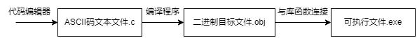
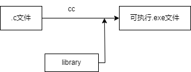
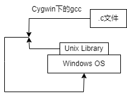
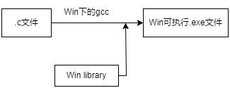
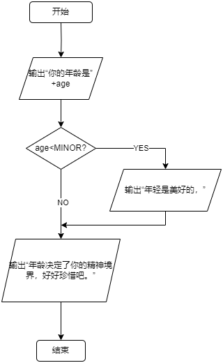
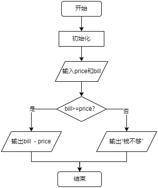

## 程序设计入门——C语言

**翁恺**

### 第一章：程序设计与C语言

#### 1.计算机和编程语言

**课程目的**

​		通过学习编程，来理解计算机是怎样解决问题的。

**人和计算机的区别**

​		人：What to do

​		计算机：How to do

​		重复是计算机最擅长的事情

​		程序设计语言必须具有**数据表达**和**数据处理(称为控制)**的能力，程序设计语言的3个基本内容——数据表达、运算和流程控制

**程序的执行**

​		解释：借助一个程序，那个程序能试图理解你的程序， 然后按照你的要求执行 

​		编译：借助一个程序，就像一个翻译，把你的程序翻译成计算机真正能懂的语言——机器语言——写的程序，然后，这个机器语言写的程序就能直接执行了

**解释语言vs编译语言**

​		语言本无编译/解释之分，只是常用的执行方式而已

​		解释型语言有特殊的计算能力(比如计算中修改代码)

​		编译型语言有确定的运算性能

**课后讨论1.1.1：关于编程语言和计算机**

> ​		计算机里的CPU可以直接运行人类编写的程序吗？为什么说编程语言不是和计算机交谈的语言。
>

​		答：不能，因为cpu可以直接识别的是机器语言，而编程语言要经过转换才能形成0101的机器语言，所以不能直接运行；编程语言是要求计算机做事情，是要求，而不是交谈，交谈是我点开了一个app，他能给我显现个内容（这也是交互性吧）

**课后讨论1.1.2：编译执行与解释执行**

> ​		有的编程语言，源代码经过编译后形成目标代码，但是这样的目标代码不能直接在CPU上执行，而是需要由一个仿真器程序来解释执行。这样的执行方式是编译的还是解释的？
>

​		答：判断是解释执行还是编译执行最根本的方法是判断是否产生可直接运行的机器代码。编译执行的步骤，一般包括：编译、链接和执行。在编译、链接后，会产生可直接运行的机器代码。在产生机器代码之后，可以单独运行执行（VC中的！，DEV—C＋＋中的F10）程序即可重复运行。不需要再次编译和链接。在本题中，目标代码必须要仿真器程序才能得到再次执行，说明在执行过程中没有产生并保存机器代码。仿真器程序的本质还是对目标代码进行逐条解释，并执行。所以，认为是解释执行的。

#### 2.C语言

**为什么历史选择了C**

​		单片机、操作系统等等很多地方都往往用C来编写。而Java等语言有很多可以替代的语言。

​		现代的编程语言在语法上的差异很小

​		几乎都是C-like语言，语言的能力和适用领域主要是由库和传统决定的

​		C语言起源于1969年夏天，“It was the summer of '69'”

**C语言的发展**

​		C语言是从B语言发展而来的，B语言是从BCPL发展而来的，BCPL是从 FORTRAN发展而来的

​		BCPL和B都支持**指针间接方式**，所以C也支持了

​		C语言还受到了PL/1的影响，还和PDP-11的机器语言有很大的关系

​		1973年3月，第三版的Unix上出现了C语言的编译器

​		1973年11月，第四版的Unix（System Four）发布了，这个版本是完全用C语言重新写的

**C的发展与版本**

​		经典教材：K&R the C

​		The C Programming Language, by Brian Kernighan and Dennis Ritchie, 2nd Edition, Prentice Hall

**C的发展与版本-标准**

​		1989 —— ANSI C

​		1990 —— ISO接受了ANSI的标准 C89

​		1995和1999两次更新，分别为C95和C99

​		所有当代的编译器都支持C99标准了

**C语言用在哪里**

​		操作系统 

​		嵌入式系统

​		驱动程序

​		底层驱动

​		图形引擎、图像处理、声音效果

**C语言是一种工业语言**

​		开发效率>>学习过程

​		开发效率>>开发乐趣

​		日常应用很少直接用C语言编写

​		学习C的过程主要是写练习代码而非真实软件

**结构化程序**

​		结构化程序由三种基本结构组成，三种基本结构组成的算法<u>可以完成任何复杂的任务</u>。

​		结构化程序的设计方法：a.自顶向下 b.逐步求精 c.模块化 d.结构化

**C语言需要编译运行**

​		所以你需要编译器、编辑器或者IDE(Integrated Development Environment)集成开发环境

​		推荐的编译器——Dev C++(可以在代码托管网站——soureceforge.net上下载)

​		C语言的编译器很多，因为早期为其配置编译器的厂家很多，所以会导致很多个人因素夹杂其中的“方言”

​		后面很多语言，为其做编译器的厂商往往只掌握在少数厂商手上，反而容易选了:)

**C语言的编辑-编译-连接**

​		C语言编写的程序称为**源程序**，它以ASCII代码形式存放在一个文本文件中，NotePad++,Source Insight，Visual Studio Code是常用的文本代码编辑器，该文件一般以“**.c**”作为文件扩展名。

​		编译是指将已经编辑好的源程序编译成二进制代码表示的**目标程序**的过程。编译分为预处理和编译处理，如果存在语法错误，编译程序会指出语法错误所在，不会生成二进制代码，没有语法错误则生成一个二进制文件，后缀为"**.obj**"。

​		上述过程产生的文件还不能直接运行，还需要编程环境提供的库函数进行连接(Link)，形成**可执行的程序**，是一个二进制机器指令文件，后缀为“**.exe**”。

​		源程序中的每条可执行语句最终都将被转换成二进制机器指令，而像注释这样的非执行语句将会在编译时就被忽略。



<center style="color:#C0C0C0">图1.0 编辑-编译-连接</center>

#### 3.第一个C程序

**程序框架**

```c
#include<stdio.h>

int main()
{
 	/*Code*/
    return 0;
}
```

​		C语言规定必须用main作为主函数名，程序将从此开始执行，在此结束，一个C源程序至少应包含一个main()函数。

​		C程序的基本组成单位是<u>语句</u>。

​		C程序中，{ }括起的许多语句成为<u>复合</u>语句。

**输出 `printf()`**

```c
printf("Hello World!\n");
```

​		①""里面的叫字符串，`printf()`会将其中的内容原封不动的输出。

​		②如果需要在最终黑色的控制台调整输出内容，可以加入转义字符，比如'\n'

​			\n表示需要在输出结果后面换一行

​		③后面可以插入表达式做运算

```c
printf("%d\n", 20 + 25);
```

​		④C程序实现的算法可以没有输入，但是必须要有输出(没输出这个程序有什么意义呢?)

​		⑤保留2位小数，以及保留2位，以及补零。

```c
printf("%m.nf", x);  //m为宽度限定词，意为保留宽度m，不足m则左端补空格，大于m则按实际输出; 小数点后n位。
printf("%.2f", x);   //保留两位小数
printf("%2f", x);    //保留两位宽度
printf("%02f", x);   //保留两位宽度，不足前面补零
```

**程序中的错误**

​		C语言的代码可以写在不同的两行，是符合语法的。

​		编译的时候发现的错误所在的地方会以红色的底表示出来 (Dev-C++为例)

​		具体的错误原因以英文列在下方的窗口里

​		C的编译器给出的错误提示往往不那么好“猜”

​		不要用中文，C编译器只能识别半角的英文符号

​		关于数字0，为了防止和英文字母O混淆，编译器往往在0的中间加点或者斜线区分，这个是有一定历史渊源的

​		调试是在程序中查找错误并修改错误的过程。(错误包括<u>逻辑错误(语义错误)</u>和<u>语法错误</u>)

​		有时调试可以不借助编译器的调试工具，而是在程序某些节点插入printf()，把值直接打印出来观察是否有异常。

**关于GCC**

​		C编译器最早是机器自带的，cc指的是Compile Collection(*编译器生成器*)

​		gcc就是GNU操作系统下的CC，后来GNU的编译器打败了Unix自己做的编译器，于是很多Unix机器也开始使用GCC，90年代，GCC也跑在Linux上

​		同样，DOS(Disk Operating System)磁盘操作系统上，最早使用的是mscc(微软的cc)，也就是后来VS 6、VS20xx的前身。

**那么如何移植GCC到个人计算机的主流系统Windows上呢？**

①移植gcc本身

​	gcc→API(应用程序接口)→windows

②移植library库



<center style="color:#C0C0C0">图1.1 连接的过程</center>

如何移植library有两种方案

a.使用Cygwin(一个在Windows平台上运行的类UNIX模拟环境)

​		在Windows上给一个Unix Lib.，Cygwin下gcc编译的.c文件在和Unix lib.共同努力下，变成一个可以在Windows上运行的Unix程序



<center style="color:#C0C0C0">图1.2 利用Cygwin移植library</center>

​		可以知道，Cygwin底下的gcc编译出的程序，不是在Windows上直接运行的，而是在Unix上可以直接运行的，但Cygwin给了一个可以在windows上运行Unix程序的接口，于是你的程序就可以运行了。

b.使用MinGW(Minimalist GNU for Windows——Windows上可以跑的最小GNU的集合)

​		它是一个可自由使用和自由发布的Windows特定头文件和使用GNU工具集导入库的集合，允许你在GNU/Linux和Windows平台生成本地的Windows程序而不需要第三方C运行时（C Runtime）库。目前已经停更很多年了，原来版本是MinGW32，现在最新的是MinGW64。另外，现在也有其它选择——<u>TDM-GCC</u>，这是衍生自 MinGW 和 MinGW-w64 的类似项目，但是由另外的机构开发的，分为 32 位与 64 位两个版本，32 位版本的编译目标仅兼容 32 位应用程序，此外，MinGW-w64 还有基于 <u>LLVM 构建的 Clang</u> 编译器。TDM-GCC安装较为简单，所以可以优先选用。

​		MinGW(读音“民基W”，不要读成“明W”)，MinGW的做法如下



<center style="color:#C0C0C0">图1.3 利用MinGW移植library</center>

​		MinGW和Cygwin的区别是，MinGW用GNU编译出Windows下可以运行的程序，而Cygwin编写的是Unix可以直接运行的程序。

**GCC下载与安装**

TDM-GCC官网：tdm-gcc.tdragon.net

Visual Studio Code官网：code.visualstudio.com

​		注意，Visual Studio是一个编辑器，一开始是不能直接运行C/C++程序的，应该使用拓展插件。

​		下载**C/C++** 语法高亮*、***Code Runner**两个插件就可以

​		多个.c文件处理就比较复杂，Visual Studio肯定不只是用来解决一个.c文件的处理，多文件处理应该使用**Work Space(工作区)**，Work space建立方式不能直接建立，而是通过**新建文件夹→Open Folder**来建立。

**Work Space的使用**

​		①如果工作区初始完全为空，则通过new file建立文件

​		②如果工作区初始非空，VS会自动识别文件夹内的工程文件，并显示在左侧边文件预览栏内，但此时不能直接Run我们想要运行的第一个.c文件，会显示编译不成功。因为VS只能认当前那第一个.c文件内的代码，其他使用到的work space里的其他库文件没有成功编译进去。解决方法有两个：

​		a.使用View下的Terminal(终端)

​		在Terminal内编译需要的其他.c文件，将这些文件一起编译。
​		b.使用Make file.

​		把make file拷贝到目录下，在terminal内，使用自带的mingw32-make，通过make把这些.c文件合并为一个大文件。

**课后讨论1.3.1：我们是在学习GCC吗？**

> ​		常听到有人说他学的是Visual C，有人学的是Turbo C，不是我们学的什么Dev C，是他们的比我们的高级吗？还有GCC到底是什么？

​	答：

​		1、Visual C、Turbo C和Dev C都是C语言的开发工具，Visual C是由微软公司开发维护C/C++的开发工具（1993年首次推出），Turbo C由美国Borland公司开发的一套C语言开发工具，它出现最早，于1987年首次推出，Dev C由个人开发者Colin Laplace主导开发维护，目前已经不再更新维护，而包含Visual C的Visual Studio一直在更新，但是Visual Studio非常庞大，如果需要轻量的编译工具，推荐Code Blocks。当然，Code Blocks与上述这些工具没有本质上的区别。

​		C语言可移植性体现在不依赖具体实现，也就是说在Visual C下成功编译并执行的代码，用Turbo C和Dev C也能编译并成功执行，而且功能一致。这些工具之间的区别在于其所提供的代码编辑功能等有差异，比如有些工具不支持代码高亮或C语言关键字着色等等。当然，也有相似功能但操作方式不一样的情况，比如调试功能的操作方式。

​		2、GCC原名为GNU C Compile，原本只能处理C语言，后来发展成为Fortran、Pascal、Objective-C、Java、Ada,Go等多种语言的编译器，便改名为GNU Compiler Collection。

**课后讨论1.3.2：main()的样子**

> ​		为什么看到有的书上的`main()`是`void main()`，而我们课件上是`int main()`？还有`main()`里面那句`return 0`; 是必须的吗？
>

答：

​		main函数的返回值用于说明程序的退出状态。如果返回0，则代表程序正常退出。返回其它数字的含义则由系统决定。通常，返回非零代表程序异常退出。

1.void main（）

​		有一些书上的，都使用了void main( ) ，其实这是错误的。C/C++ 中从来没有定义过`void main( ) `。C++ 之父 Bjarne Stroustrup 在他的主页上的 FAQ 中明确地写着 “The definition void main( ) { /* … */ } is not and never has been C++, nor has it even been C.”

　　这可能是因为 在 C 和 C++ 中，不接收任何参数也不返回任何信息的函数原型为“void foo(void);”。可能正是因为这个，所以很多人都误认为如果不需要程序返回值时可以把main函数定义成void main(void) 。然而这是错误的！main 函数的返回值应该定义为 int 类型，C 和 C++ 标准中都是这样规定的。虽然在一些编译器中，void main（） 可以通过编译，但并非所有编译器都支持 `void main（）` ，因为标准中从来没有定义过 void main 。g++3.2 中如果 main 函数的返回值不是 int 类型，就根本通不过编译。而 gcc3.2 则会发出警告。所以，为了程序拥有很好的可移植性，一定要用` int main （）`。

2.main（）

​		那既然main函数只有一种返回值类型，那么是不是可以不写？规定：不明确标明返回值的，默认返回值为int，也就是说 main()等同于`int main()`，而不是等同于`void main()`。在C99中，标准要求编译器至少给` main() `这种用法来个警告，而在c98中这种写法是被允许的。但为了程序的规范性和可读性，还是应该明确的指出返回值的类型。

**课后作业：输出“Hello World”（5分）**

> **题目内容：**
>
> 请输出一行，内容为
>
> Hello World
>
> 请注意大小写。
>
> 由于这一周只是简单地介绍了C程序的基本框架，还不能做很多事情，甚至还不能做数据的输入，所以这一周的题目也非常简单。第二周会仔细介绍如何在中M和拼题A做题，如果你一时无法搞定如何提交这周的作业，没关系，可以先在在线编程环境或IDE中做好程序，下周学过之后再来提交作业。。所以，你可以慢慢来，一点点能跟上来就可以了。
>
> **输入格式:**
>
> 无输入
>
> **输出格式：**
>
> 一行文字
>
> **输入样例：**
>
> 无
>
> **输出样例：**
>
> Hello World
>
> 时间限制：500ms内存限制：32000kb

---

```c
#include<stdio.h>

int main()
{
    printf("Hello World");
    
    return 0;
}
```


### 第二章：计算

#### 1.变量

```c
#include <stdio.h>

int main()
{
	const int AMOUNT = 100;           /*Line 1*/
	int price = 0;					/*Line 2*/

	printf("请输入金额（元）：");
	scanf("%d", &price);

	int change = AMOUNT - price;

	printf("找您%d元。\n", change);

	return 0;
}
```

​		受到之前`printf()`做计算的启发，我们想到能否不要每次都输入`printf()`，而是只给两个数字就能计算呢？这就要利用到变量来实现了。

**变量的设想与定义**

​		我们需要：1.有地方放输入的数字 2.有办法输入数字 3.输入的数字能参与计算

​		上述程序`int price = 0`，定义了一个变量，变量的名字是price，类型是int，初始值是0。

​		变量就是一个保存数据的地方，只有用变量保存了数据，这个数据才能参与到后面的运算中去。

​		变量定义的一般形式是：<类型名称><变量名称>

​		变量需要一个名称，变量的名字就是一种“标识符”

​		标识符有标识符的构造规则，基本规则是只能由**下划线、字母、数字**组成，数字不能出现在第一个位置上，C语言的<u>关键字</u>(或叫<u>保留字</u>)，不可用做标识符。

**如何输入**

​		a.输入也在终端窗口中。

​		b.输入是以行为单位进行的，行结束标志就是你按下回车键，在你按下回车键之前程序不会读到任何内容。

​		c.C语言中，数据的输入和输出都是通过函数调用实现的。

**变量的赋值和初始化**

​		`int price = 0`除了定义了一个新变量，还是一个赋值语句，"="表示将右边的值赋值给左边的变量。因为这个语句是在定义变量时赋值，所以又称为**初始化**。对C语言来说，赋值和初始化差异并不大，但对其他语言两者差异可能会比较大。

```c
<类型名称><变量名称> = <初始值>  /*初始化操作*/
```

​		注意，一行如果有多个变量要初始化，你必须一个一个赋值，而不能只赋给一个，那样其他变量值不确定。

​		赋值与数学不同，a=b在数学中表示关系，即a、b的值一样，但在C语言中表示动作，把b的值赋给a。关系是静态的，动作是动态的，前者a=b和b=a是等价的，但后者意义却截然相反。

​		C语言不强制要求所有变量都在定义的地方做初始化，但是所有变量在第一次被使用(出现在赋值运算符的右侧)之前，应该被赋值一次。

​		赋值“=”也是运算符，有运算符的式子就叫**表达式**。

**变量类型**

​		C是一种有类型的语言，所有变量在使用之前必须定义或声明，所有的变量必须有确定的数据类型。数据类型表示变量可以存放什么样的数据，变量中也只能存放指定类型的数据，程序运行过程中也不能改变变量类型。

​		ANSI C只能在开头定义变量，C99支持任何要使用时定义变量即可。

**scanf()**

```c
	scanf("%d", &price);
	scanf("%d %d", &a, &b);
	scanf("%d,%d", &a, &b);
```

​		`scanf()`是C语言中的一个输入函数,用于从标准输入设备(通常是键盘)读取数据。**它的全称是“scan formatted”**,表示按照指定的格式扫描输入数据。

​		a.要求这个函数读入下一个整数，读到的结果赋值给变量price。

​		b.小心price前面的&

​		c.特别注意，`scanf()`两个双引号之间，是你要输入的内容，而不是它会展示的内容，比如中间如果有逗号，你两个整数输入中间也要输入逗号，`scanf()`才能正确运行。

​		d.`scanf()`可以读多个变量

​		e.如果格式控制符和变量类型不对应，比如double类型用了%f输入，则`scanf()`会输出0。

```C
#include <stdio.h>

int main()
{
	int a;
	int b;

	printf("请输入两个整数：");
	scanf("%d %d", &a, &b);
	printf("%d + %d = %d\n", a, b, a + b);

	return 0;
}
```


**常量**

```c
int change = 100 - price;
const int AMOUNT = 100;    //更好的方式
```

​		固定不变的数，是常数。直接写在程序里，我们称作直接量(literal)。

​		更好的方式，是定义一个常量，如上面第二行代码。

​		我们把出现在程序里面莫名其妙的数字叫Magic Number

**const**

​		const是一个修饰符，加在int的前面，用来给这个变量加上一个const(不变的)属性。这个const属性表示这个变量只要初始化了，就不能再修改了。一般用全大写字母突出强调该变量是const变量。

```c
int change = AMOUNT -price;
```

​		如果你试图对常量做修改，把它放在赋值运算符的左边，编译器会报错。

```c
[Error] assignment of read-only variable 'a'
```

​		如果我们想让用户输入AMOUNT初始值，而不是使用固定初始值，可以使用下述代码。

```c
	int amount = 100;           /*给个初值没问题*/
	int price = 0;

	printf("请输入金额（元）：");
	scanf("%d", &price);

	printf("请输入票面（元）：");
	scanf("%d", &amount);

	int change = amount - price;

	printf("找您%d元。\n", change);
```


#### 2.计算

```c
#include <stdio.h>

int main()
{
	printf("请分别输入身高的英尺和英寸，"
		"如输入\"5 7\"表示5英尺7英寸：");

	double foot;
	double inch;

	scanf("%lf %lf", &foot, &inch);

	printf("身高是%f米。\n", 
		((foot + inch / 12) * 0.3048));

	return 0;
}
```

**C语言世界的数字运算**

​		两个整数的运算结果只能是整数

​		10/3*3 = 9

​		10和10.0在C中是完全不同的数

​		10.0是浮点数

**浮点数**

​		带小数点的数值。浮点意思就是这个数小数点是可以浮动的，是计算机内部表达数字的一种方式，另一种方式叫**定点数**。不过C语言中你不会遇到定点数，人们借用浮点数这个词来表达所有带小数点的数。

​		但整数和浮点数放在一起运算时，C语言会将整数转换为浮点数，然后进行浮点数的运算。

​		根据上一条，我们发现只要把其中一个变量设为浮点数并参与运算，表达式的结果就会转换为浮点数了，但需要注意，将整型变量赋值`sum = 0.5;`sum的结果依然为0。

```c
//执行以下程序段，sum的值是1。
int i, sum;
sum = 0;
for (i = 1; i <= 2; i++){
    sum = sum + 1.0/i;
}
//执行以下程序段，sum的值是0。
int i;
double sum;
sum = 0;
for (i = 2; i <= 4; i = i + 2){
    sum = sum + 1/i;
}
```

**double**

​		double的意思是“双”，它本来是“双精度浮点数”的第一个单词，人们用来表示浮点数类型。除了double，还有float，表示单精度浮点数。

​		double类型的变量，`scanf()`和`printf()`函数都需要更改相应格式控制符。

```c
int a; float b; double c;
scanf("%d", &a); printf("%d", a);
scanf("%f", &b); printf("%f", b);
scanf("%ld", &c); printf("%f", c);
```

**整数**

​		数据类型不能表达小数部分的数，整数和整数的运算结果还是整数。

​		计算机里面会有纯粹的整数，因为它运算快，占空间小。而现实生活中也在大量做整数的运算，所以整数的作用还是很大的。

#### 3.表达式

​		**表达式**是一切运算符运算符和算子的组合，用来计算一个值。

```c
total = 57;
count = count + 1;    //注意，count 和 赋值运算符 和 右边的count + 1一起构成表达式。
```

**运算符&算子、取余运算**

​		运算符（operator）是指进行运算的动作，比如加法运算符“+”，减法运算符“-”；

​		算子（operand）是指参与运算的值(也可以称为操作数)，这个值可能是常数，也可能是变量，还可能是一个方法的返回值。

​		取余运算就是求两个整数相除后的余数，用A%B来表示。C语言中，求余运算符两边，必须为整型数。

**计算时间差**

​		如果直接分别减，有可能会出现分钟借位的情况，所以要有所处理。

```c
int hour1, minute1;
int hour2, minute2;

scanf("%d %d", &hour1, &minute1);
scanf("%d %d", &hour2, &minute2);

int t1 = hour1 * 60 + minute1;    //转换为分钟单位
int t2 = hour2 * 60 + minute2;

int t = t2 - t1;

printf("时间差是%时%分。", t/60, t%60);  //t÷60小时部分 t%60分钟部分
```

**运算符优先级**

```c
//求平均值
#include <stdio.h>

int main()
{
	int a,b;

	scanf("%d %d", &a, &b);

	double c = (a+b)/2.0;
	
	printf("%d和%d的平均值=%f\n", a, b, c);

	return 0;
}
```

| 优先级 | 运算符 |   运算   | 结合关系 | 举例  |
| :----: | :----: | :------: | :------: | :---: |
|   1    |   +    | 单目不变 | 自右向左 | a* +b |
|   1    |   -    | 单目取负 | 自右向左 | a* -b |
|   2    |   *    |    乘    | 自左向右 | a * b |
|   2    |   /    |    除    | 自左向右 | a / b |
|   2    |   %    |   取余   | 自左向右 | a % b |
|   3    |   +    |    加    | 自左向右 | a + b |
|   3    |   -    |    减    | 自左向右 | a - b |
|   4    |   =    |   赋值   | 自右向左 | a = b |

​		运算符优先级：算术 > 关系 > 逻辑 > 赋值 > 逗号

**赋值运算符**

​		赋值也是运算，也有结果

​		`a = 6`的结果是a被赋予值6

​		由于赋值运算符是自右向左结合，所以`a = b = 6`等价于`a = (b = 6)`;

​		<u>嵌入式赋值</u>:不利于阅读，且容易产生错误，不建议使用。

```c
int a = 6;
int b;
int c = 1 + (b = a);
```

​		<u>复合赋值</u>：+ - * / %都可以和赋值运算符“=”结合起来，形成复合赋值运算符

​		如“+=”、“-=”、“*=”、“/=”、“%=”

​		注意符合赋值运算符的两个运算符中间不要有空格，否则编译器会提示语法错误，“**[Error] expected expression before '=' token**”

```c
total += 2;
total = total + 2;   //二者等价
```

**课后讨论2.3.1：不好的表达式**

> 看看如何分析这个表达式：
>
> a=5;
>
> c = (b=a+2) - (a=2);

答：

​		括号先算，从左往右，所以应该是b=5+2=7，后面的括号a=2，再是7-2=5，这个值在赋给c，所以c是5。最后结果是a = 2，b = 7，c = 5.

**交换两个变量的值**

​		程序是顺序执行的，所以简单的`a = b`，`b = a`是不行的，这样只能让两个变量都成为b的值。

​		为了交换两个容器的值，我们想到可以借用第三个容器。

```c
#include<stdio.h>

int main()
{
    int a = 2;
    int b = 5;
    int t;
    t = a;
    a = b;
    b = t;
    printf("a = %d, b = %d", a, b);
    
    return 0;
}
```

​		可以通过调试功能，观察上述各变量在交换过程中值是如何变化的。调试过程中可以在某一行设置断点，程序运行到此处时就会暂停，调试界面可以看到各变量的值。

​		上述代码就是C语言中，交换两个数的一般做法。学习编程，只学习语法是不够的，还需要积极积累“套路”，了解这个问题一般别人是怎么解决的，这样以后遇到类似问题处理起来就能得心应手了。学习套路的方式之一就是阅读。

```c
	a = a + b; 
	b = a - b; 
	a = a - b;
//上述代码可以实现不依靠中间变量交换两者的值
```

**递增递减运算符**

​		“++”、“--”是两个很特殊的运算符，它们是单目运算符，这个算子还必须是变量。这两个运算符分别叫作递增和递减运算符，它们的作用就是给这个变量+1、-1。

```c
count ++;
count = count + 1;
count += 1;      //三者等价
```

​		前缀、后缀：++、--既可以放在变量前面，叫作前缀形式，也可以放在变量后面，叫后缀形式。

​		`a++`的值(结果)是a+1以前的值，`++a`的值是a+1之后的值，但无论如何，这两段代码执行后a自己的值都+1了。

```c
int a;
a = 10;
printf("a++ = %d\n", a);
printf("a = %d\n", a);
printf("++a = %d\n", a);
printf("a = %d\n", a);
//输出结果
a++ = 10
a = 11
++a = 12
a = 12
```

| 表达式  |    运算    |   表达式的值    |
| :-----: | :--------: | :-------------: |
| count++ | 给count加1 |  count原来的值  |
| ++count | 给count加1 | count+1之后的值 |
| count-- | 给count减1 |  count原来的值  |
| --count | 给count减1 | count-1之后的值 |

​		这两个运算符有其历史来源

​		可以单独使用，但是不要组合进表达式里

```c
++i++;
i++++;
a = b += c ++ -d + --e/-f;   //组合进表达式就太复杂了
```

**课后讨论2.3.2：上课提到的那个复杂表达式该怎么理解？**

> a = b+=c++-d+--e/-f 

答：这个表达式包含了多个赋值和增减操作。为了更好地理解它，我们可以逐步拆解：

\1. **c++**: 这是后置自增操作。它返回`c`的当前值，并在返回之后将`c`增加1。

\2. **--e**: 这是前置自减操作。在返回`e`的值之前，它将`e`减少1。

\3. **b += ...**: 这是复合赋值操作。它将`b`的当前值加上`...`的结果，并将结果赋给`b`。

\4. **a = ...**: 这是普通的赋值操作。它将`...`的结果赋给`a`。

现在，我们可以结合上述操作来分析整个表达式：

```c
a = b += c++ - d + --e / -f
```

按照操作的优先级和结合性，这个表达式可以解释为：

\1. 首先计算`c++ - d`。这将使用`c`的当前值（然后`c`会增加1）和`d`的值。

\2. 接下来，计算`--e / -f`。首先，`e`会减少1，然后将结果除以`-f`。

\3. 将上述两个结果相加，得到`b += ...`的右侧的值。

\4. 更新`b`的值，并将结果赋给`a`。

​		请注意，这个表达式虽然在语法上是有效的，但是从代码可读性和维护性的角度来看，它是复杂的，因为它在一个简短的语句中包含了很多操作。这使得其他开发者（或甚至是你自己在一段时间后）很难理解其含义和目的。因此，在实践中，我们通常建议将这种复杂的表达式分解为多个更简单、更直观的语句。

```c
	int a = 1;
	int b = 3;
	int c = 7;
	int d = 15;
	int e = 24;
	int f = 35;
	
	a=b+=c++-d+--e/-f;
	
	printf("a=%d  b=%d  c=%d  d=%d e=%d  f=%d", a, b, c, d, e, f);
	
	//输出结果：a=-5  b=-5  c=8  d=15 e=23  f=35
```

#### 4.在线评判系统(Online Judge、OJ)

**注意事项**

​		除了题目要求的输出，不能输出其他内容，也不用设置任何用户友好型提示。

**各类提交状态提示**

​		**①**通过**(Accept，AC)**

​			表示代码通过了OJ的所有测试点

​		**②**答案错误**(Wrong Answer，WA)**

​			表示代码有错误，需要debug

​		**③**运行时间超限**(Time Limit Exceeded，TLE)**

​			有两种情况

​			a.代码运行过程中出现了死循环，需要进行 debug
​			b.代码时间复杂度过高，无法在规定时间之内处理所有数据，需要优化
​			解决方法：printf()调试大法、优化算法时间复杂度

​		**④**编译错误**(Compile Error，CE)**

​			说明代码中有不合法语句，需根据提示进行修改

​		**⑤**运行空间超限**(Memory Limit Exceeded，MLE)**

​			一般有两种情况

​			a.递归栈爆了
​			b.数组空间开太多了

​		**⑥**格式错误**(Presentation Error，PE)**

​			说明结果没按题目要求输出，请检查空格、换行符等等。

​		**⑦**段错误**(Segmentation Fault，SF)**

​			错误原因比较多，就是访问了不可访问的内存。

**边界测试**

​		程序的边界最容易出错，所以测试程序经常使用边界数据，如有效范围两端的数据、特殊的倍数等等

​		常用的边界数据：端点、0、负数等等

**课后作业：逆序的三位数**

> 程序每次读入一个正3位数，然后输出按位逆序的数字。注意：当输入的数字含有结尾的0时，输出不应带有前导的0。比如输入700，输出应该是7。
>
> ### 输入格式：
>
> 每个测试是一个3位的正整数。
>
> ### 输出格式：
>
> 输出按位逆序的数。
>
> ### 输入样例：
>
> ```in
> 123
> ```
>
> ### 输出样例：
>
> ```out
> 321
> ```
>

解答：

```c
#include<stdio.h>

int main()
{
  int n = 0;
  scanf("%d",&n);
  printf("%d",(n%10)*100 + (n%100/10)*10 + (n/100);
  //printf("%d",(n%10)*100 + (n/10%10)*10 + (n/100);也可以
  return 0;
}
```


### 第三章：判断与循环

#### 1.判断

**if语句-根据条件做还是不做**

​		根据之前计算时间差的讨论，如果这次我们就采用直接分别减的方案，判断有没有出现借位可以吗？

​		借位的结果是分钟小于0，出现借位我们再调整，我们从这里入手。

```c
int hour1, minute1;
int hour2, minute2;

scanf("%d %d", &hour1, &minute1);
scanf("%d %d", &hour2, &minute2);

int ih = hour2 - hour1;  
int im = minute2 - minute1;
if(im < 0)
{
    im = 60 + im;
    ih --;
}

printf("时间差是%时%分。", ih, im);  
```

​		上述代码中，我们使用了C语言中的条件判断语句，我们可以根据条件成立与否来判断接下来的动作是做还是不做。

```c
//if语句 写法
if(条件成立)
{
    ... 做复合语句内动作 ...
}
```

​		if语句后面可以不用大括号，但是if只对紧随其后的一句语句有效，注意，if语句结束的地方不在条件成立那个圆括号后，而是在后面的语句之后。

**判断的条件-关系运算符**

​		计算两个值之间的关系运算，所以又称为关系运算符。

| 运算符 |    意义    |
| :----: | :--------: |
|   ==   |    相等    |
|   !=   |   不相等   |
|   >    |    大于    |
|   >=   | 大于或等于 |
|   <    |    小于    |
|   <=   | 小于或等于 |

​		关系运算的结果只有0和1，如果关系成立，则为1，否则为0。

​		再次强调运算优先级：**算术 > 关系** > 逻辑 > 赋值 > 逗号

​		而同样在关系运算符内，判断相等的`==`和判断不等的`!=`优先级比其他关系运算符更低，为什么这么设定，是由于可以方便的做出诸如`5 > 3 == 6 > 4`的表达式。

​		连续的关系运算符是<u>从左到右</u>进行的

```c
5 > 3 == 6 > 4   //结果为1
6 > 5 > 4        //结果为0
a == b == 6      //结果为0
a == b > 0       //结果和a、b的值有关
```

**找零计算器-判断、注释、流程图**

​		找零计算器需要用户做的两个操作：输入购买的金额、输入支付的票面

​		找零计算器根据用户输入做的动作：计算并打印找零或者提示用户余额不足

​		从计算机角度看，就是意味着程序需要读用户的两个输入，然后进行一些计算和判断，最终输出结果。

```c
#include <stdio.h>

int main()
{
	//	初始化
	int price = 0;
	int bill = 0;
	//	读入金额和票面
	printf("请输入金额：");
	scanf("%d", &price);
	printf("请输入票面：");
	scanf("%d", &bill);
	//	判断票面够不够并计算找零
	if ( bill >= price ) 
    {
		printf("应该找您：%d\n", bill - price);
	}
    else 
    {
		printf("你的钱不够\n");
	}

	return 0;
}
```

​		上述程序我们使用了**注释(comment)**，把程序分成了清晰的三部分。注释是插入在程序代码内部，用来向读者提供解释信息，它们对程序功能没有任何影响，编译程序如何处理注释的请看课后讨论3.1.2。

​		延续多行的注释，使用`/*... ...*/`来写，注释内容由`/*`开始到`*/`结束，也可以用于一行内的注释。

​		注意，`//`单行注释是C99的注释，ANSI C不支持，而多行注释是一直都有的形式。

​		为了加深对条件判断的理解，这里提供第二个例子，可以画流程图辅助理解。

```c
#include <stdio.h>

int main()
{
	const int MINOR = 35;
	int age = 0;

	printf("请输入你的年龄: ");
	scanf("%d", &age);

	printf("你的年龄是%d岁。\n", age);  //人机交互常用方案：先输出刚才读取的内容，方便用户验证和阅览

	if ( age < MINOR ) 
    {
    	printf("年轻是美好的，");
	}

	printf("年龄决定了你的精神世界，好好珍惜吧。\n");

	return 0;
}
```



<center style="color:#C0C0C0">图3.0 年龄判断流程图</center>

**else{}语句-条件不成立应该做什么？**

​		我们前面知道，if语句满足条件判断，就会执行内部的复合语句，不满足则会执行if语句的下一条语句。可是，如果钱不够，条件不成立，应当做什么呢？简单的在if语句后面添加一条`printf("你的钱不够\n");`，会导致无论够不够，都会输出这句话，在钱足够的时候，该程序就会出现BUG。

​		C语言提供了一种方法，可以在if条件不满足时，执行另外的动作，这就是else()语句，else表示否则。



<center style="color:#C0C0C0">图3.1 找零计算器流程图</center>

​		else和if一样，后面可以不加大括号，但是else只对紧随其后的一句语句有效。

​		利用条件分支结构，可以很容易实现一个简单的功能——比较两数大小。

```c
int max1(int a, int b)
{
	int max = b;
	if ( a > b )
		max = a;
    
	return max;
}

int max2(int a, int b)
{
	int max = 0;
    if(a > b)
        max = a;
    else
        max = b;
    
	return max;
}
```

​		max1()似乎更聪明，更简洁，但max2()足够的傻，傻到任何人都能看懂，从某些评价角度看，也许第二种——让更多人能读懂的代码，要更好一些。

**典例一、应付薪水**

```c
#include <stdio.h>

int main()
{
	const double RATE = 8.25;  
	const int STANDARD = 40;   
	double pay = 0.0;
	int hours;

	printf("请输入工作的小时数: ");
	scanf("%d", &hours);
	printf("\n");
	if (hours > STANDARD)
   		pay = STANDARD * RATE + 
   			(hours-STANDARD) * (RATE * 1.5);
	else
   		pay = hours * RATE;
	printf("应付工资: %f\n", pay);

	return 0;
}
```

**典例二、成绩是否通过**

```c
#include <stdio.h>

int main()
{
	const int PASS=60;
	int score;

	printf("请输入成绩: ");
	scanf("%d", &score);
	
	printf("你输入的成绩是%d.\n", score);
	if ( score < PASS )
		printf("很遗憾，这个成绩没有及格。");
	else {
		printf("祝贺你，这个成绩及格了。");
		printf("再见\n");
	}

	return 0;
}
```

**课后讨论3.1.1：为什么强调if和else后面要用{ }**

答：

​		 能够明确地标识出这些语句属于if和else语句的范围，避免了可能的歧义，增加了代码的可读性和可维护性。 如果没有使用花括号，if和else语句只能控制其后的单个语句。 如果在单个语句后紧接着编写另一条语句，那么这条语句将始终会被执行，而不管if或else语句的条件是否为真或假。 因此，强调在 if 和 else 语句后使用花括号是为了确保代码的正确性和可读性。

**课后讨论3.2.2：/* */会被替换为什么？**

> ​		这个讨论是深入的讨论，第一次学习C语言的同学可以围观一下，看不懂也没关系。
> ​		/* */是注释，编译器不管其中的内容。但是有没有想过编译器会把它替换成什么呢？是一个空格？还是不留痕迹？可以写代码来测试你用的编译器吗？

答：

​		把代码翻译成汇编代码前，有个预处理的步骤，在处理过程中会把注释代码删掉。编译器替换内容，需要看注释在语句中的位置，位置不同，替换内容也不同，语句前及语句中的注释会被替换成空格，语句前注释被替换成等长空格，句中注释被替换成一个空格，语句末的注释 是直接删除。


#### 2.循环

**有些事情就得用循环才能解决**

​		if语句可以判断条件满足时才做相应的动作，而循环语句可以在满足条件时，不断地重复执行一些动作。

判断数的位数——程序要读入一个4位(含4位)的正整数， 然后输出这个整数的位数。

​		人直接通过眼睛看数位，判断数的位数，而计算机不擅长做这个，计算机擅长通过比较数在什么区间判断数的位数，而人是不擅长的，人对文字的处理能力比对数字的处理能力更强。

```c
#include<stdio.h> 

int main()
{
	int x; 
	int n = 1;

	scanf("%d", &x); 
	if( x > 999 )
    	n = 4;
	else if ( x > 99 )
		n = 3;
	else if( x > 9 ) 
		n = 2; 
	else
    	n = 1; 
   
 	printf("%d", n);
    
 	return 0;
}
```

​		上述程序有一个经典错误，就是将else全部改成if，即四个if判断四次。但是你需要注意，你写的程序是对步骤的描述，而不是关系或者说明，如果改写成四个if，那每个都会运行判断一次，最后都会输出 n = 1，显然是不对的。

​		题目明确了输入的是不超过四位的正整数，所以我们的程序可以按上面那样简化判断条件。

​		而且注意我们上面的程序是从高处往低处判断，这样每次判断可以排除掉一个确定的数位区间或者直接确定数位。

```c
	if( x > 0 )
    	n = 1;
	else if ( x > 9 )
		n = 2;
	else if( x > 99 )
		n = 3; 
	else
    	n = 4; 
```

​		如果像这样反过来，我们发现任何数都满足`x > 0`于是后面的条件判断都失效了，所以反过来是不可以的。

​		也可以得到推论，判断 x 大于某数，应该从高处往低处判断，x小于某数，应该从低处往高处判断。

​		但是，本节开篇的代码也有一定局限性，如果位数有很多位的时候，就需要非常多层if-else嵌套才能实现数位的判断，如何写一个通用的整数数位判断程序呢？受到人数数（数一个划掉一个）的启发，我们也可以让计算机“数数”，通过x = x/10，“数”一个数把最右边的一个数划掉，并且让计数器n ++，最终统计划掉所有数后n的值即可。

```c
#include<stdio.h>

int main()
{
	int x;
	int n = 0;
	
	scanf("%d", &x);
	
	while( x > 0 )
	{
		n ++;
		x /= 10;
	}
	
	printf("%d", n);
	
	return 0;
}
```

​		int型在计算机内部有表示整数的范围，所以上述程序依然不能判断任意一个数的整数位数哦！

**课后讨论3.2.1最大能数多大的数**

> 用课程中的那个数数的位数的程序，你能数到多大的数？

答：

​		C语言中，int型数据在内存中的存储形式是**补码**，32位补码所能表示的整数范围为$[-2^{-31},2^{31}-1]$，$2^{31}-1$ = 2147483647，所以最大可以数到10位正整数。

**while循环-条件满足就不停执行后面的语句**

​		如果我们把while翻译作“当”，while循环就是条件满足时，不断重复循环体内的语句。

```c
while( x > 0 )
{
    x /= 10;
    n ++;
}
```

```flow
st=>start: 前面的语句
 
cond=>condition: 条件满足？
 
while=>operation: 循环体
 
e=>end: 后续语句
 
st->cond
 
cond(yes, bottom)->while(left)->cond
 
cond(no)->e

```

<center style="color:#C0C0C0">图 while循环流程图</center>

​		循环体内要有改变条件的机会，否则会导致死循环（或称无限循环）。

​		根据while的执行逻辑，while里的循环体有可能一次都不执行。

​		没有计算机如何验证循环程序的结果？——答案是**手工模拟**：在纸上列出所有变量，随着程序的进行，按步骤不断重新计算变量的值并记录。当程序运行结束之后，手工模拟表格最后得到的值就是程序的最终运行结果。

**do-while循环：不管三七二十一，先做一次循环**

​		进入循环的时候不做检查，而是在执行完一轮循环体的代码之后，再来检查循环的条件是否满足，如果满足，则进入下一轮循环，不满足则结束循环。

​		do-while和while很像，区别只是什么时候判断条件，结果是do-while至少会做一次，而while有可能一次都不做。

```c
do{
    <循环体语句>
}while(<循环条件>);    //记得语句结尾有个;表示语句结束，语句结束用{ }或;
```

```flow
st=>start: 前面的语句

cond=>condition: 条件满足？

while=>operation: 循环体

e=>end: 后续语句

st->while

while->cond(yes)->while

cond(no,left)->e
```

<center style="color:#C0C0C0">图 do-while循环流程图</center>

**for循环**

​		for循环像一个计数循环：设定一个计数器，初始化它，然后在计数器达到某值之前重复执行循环体，而每执行一次循环体，计数器就进行一次值的调整。for中的三个表达式，每个表达式都是可以省略的`for(;条件;)`等价于`while(条件)`

```c
for(初始动作, 条件, 每轮的动作)
{
    ... ...
}
```

​		事实上，for循环一定可以和while循环相互转化。

```c
for(int i = 1; i <= n; i++)
{
    fact *= i;
}
//等价于
int i = 1;
while(i <= n)
{
    fact *= i;
    i ++;
}
```


```flow
st=>start: 前面的语句
 
cond=>condition: 条件满足？
 
for=>operation: 循环体

iadd=>operation: i ++

initialization=>operation: i = 1
 
e=>end: 后续语句
 
st->initialization->cond
 
cond(yes, bottom)->for(left)->iadd->cond
 
cond(no)->e
```

<center style="color:#C0C0C0">图 for循环流程图</center>

​		for可以读作“对于”，于是下面的for循环可以读成：“对于一开始`i = 10`，当`i > 0`时，重复执行循环体，每一轮执行完循环体内语句后，令`i --`。”

```c
for(int i = 10; i > 0; i--)
{
    .../*Code*/...
}
```

​		下面两种for循环的循环次数都是一样的，都为n，区别在于第一次循环i的值以及循环结束后i的值。注意，循环结束后，第一段代码的i为n，第二段代码的i为n+1，即对于for循环，i最终的值是<u>不满足</u>循环条件的值。

```c
for(i = 0; i < n; i ++)
{
	.../*Code*/...
}
for(i = 1; i <= n; i ++)
{
	.../*Code*/...
}
```

​		试编写程序，让用户输入n，计算阶乘$n! = 1 × 2×3 ... ×n$

```c
double factorial_a(int n)
{
    double product = 1;          //小套路：求积初值设为1，求和初值设为0。
    for(int i = 1; i <= n; i++)  //仅有C99支持for语句内定义初值i，这里从i从2开始也没问题，可以自行验证
        product *= i;

    return product;
}
//也可以逆向递减计数，实现的功能相同
double factorial_b(int n)
{
    double product = 1;          
    for(int i = n; i > 1; i--)   
        product *= i;

    return product;
}
```

**课后讨论3.2.2：为什么老师说for循环很怪？**

> ​		for循环是高级语言出现的第一种循环，它和现代的程序设计理念是否存在差距？为什么Python语言就没有C语言这种形式的for循环了？

答：

​		 for循环不符合人类的语言逻辑，不易理解，因此就造成了第一次接触语言的人觉得for循环很怪。而现代程序设计理念更强调与人类语言的逻辑统一性，所以在新兴的python语言中祛除掉了C中的for循环逻辑。但由于for循环抽象程度高，所以在掌握语言基础后，其表现逻辑更为简洁易于回溯反而更方便使用。

​		Python语言就没有for循环的另一个原因是Python里没有累加器。

**循环的选择**

​		本节三种循环体应该如何选？

​		①如果有固定次数，用for 

​		②如果必须要做一次，用do-while 

​		③其他情况用while