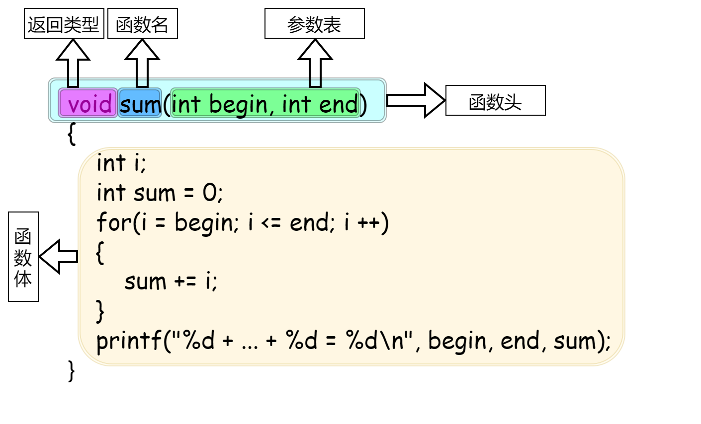

## 程序设计入门——C语言

**翁恺**

### 第一章：程序设计与C语言

#### 1.计算机和编程语言

**课程目的**

​		通过学习编程，来理解计算机是怎样解决问题的。

**人和计算机的区别**

​		人：What to do

​		计算机：How to do

​		重复是计算机最擅长的事情

​		程序设计语言必须具有**数据表达**和**数据处理(称为控制)**的能力，程序设计语言的3个基本内容——数据表达、运算和流程控制

**程序的执行**

​		解释：借助一个程序，那个程序能试图理解你的程序， 然后按照你的要求执行 

​		编译：借助一个程序，就像一个翻译，把你的程序翻译成计算机真正能懂的语言——机器语言——写的程序，然后，这个机器语言写的程序就能直接执行了

**解释语言vs编译语言**

​		语言本无编译/解释之分，只是常用的执行方式而已

​		解释型语言有特殊的计算能力(比如计算中修改代码)

​		编译型语言有确定的运算性能

**课后讨论1.1.1：关于编程语言和计算机**

> ​		计算机里的CPU可以直接运行人类编写的程序吗？为什么说编程语言不是和计算机交谈的语言。
>

​		答：不能，因为cpu可以直接识别的是机器语言，而编程语言要经过转换才能形成0101的机器语言，所以不能直接运行；编程语言是要求计算机做事情，是要求，而不是交谈，交谈是我点开了一个app，他能给我显现个内容（这也是交互性吧）

**课后讨论1.1.2：编译执行与解释执行**

> ​		有的编程语言，源代码经过编译后形成目标代码，但是这样的目标代码不能直接在CPU上执行，而是需要由一个仿真器程序来解释执行。这样的执行方式是编译的还是解释的？
>

​		答：判断是解释执行还是编译执行最根本的方法是判断是否产生可直接运行的机器代码。编译执行的步骤，一般包括：编译、链接和执行。在编译、链接后，会产生可直接运行的机器代码。在产生机器代码之后，可以单独运行执行（VC中的！，DEV—C＋＋中的F10）程序即可重复运行。不需要再次编译和链接。在本题中，目标代码必须要仿真器程序才能得到再次执行，说明在执行过程中没有产生并保存机器代码。仿真器程序的本质还是对目标代码进行逐条解释，并执行。所以，认为是解释执行的。

#### 2.C语言

**为什么历史选择了C**

​		单片机、操作系统等等很多地方都往往用C来编写。而Java等语言有很多可以替代的语言。

​		现代的编程语言在语法上的差异很小

​		几乎都是C-like语言，语言的能力和适用领域主要是由库和传统决定的

​		C语言起源于1969年夏天，“It was the summer of '69'”

**C语言的发展**

​		C语言是从B语言发展而来的，B语言是从BCPL发展而来的，BCPL是从 FORTRAN发展而来的

​		BCPL和B都支持**指针间接方式**，所以C也支持了

​		C语言还受到了PL/1的影响，还和PDP-11的机器语言有很大的关系

​		1973年3月，第三版的Unix上出现了C语言的编译器

​		1973年11月，第四版的Unix（System Four）发布了，这个版本是完全用C语言重新写的

**C的发展与版本**

​		经典教材：K&R the C

​		The C Programming Language, by Brian Kernighan and Dennis Ritchie, 2nd Edition, Prentice Hall

**C的发展与版本-标准**

​		1989 —— ANSI C

​		1990 —— ISO接受了ANSI的标准 C89

​		1995和1999两次更新，分别为C95和C99

​		所有当代的编译器都支持C99标准了

**C语言用在哪里**

​		操作系统 

​		嵌入式系统

​		驱动程序

​		底层驱动

​		图形引擎、图像处理、声音效果

**C语言是一种工业语言**

​		开发效率>>学习过程

​		开发效率>>开发乐趣

​		日常应用很少直接用C语言编写

​		学习C的过程主要是写练习代码而非真实软件

**结构化程序**

​		结构化程序由三种基本结构组成，三种基本结构组成的算法<u>可以完成任何复杂的任务</u>。

​		结构化程序的设计方法：a.自顶向下 b.逐步求精 c.模块化 d.结构化

**C语言需要编译运行**

​		所以你需要编译器、编辑器或者IDE(Integrated Development Environment)集成开发环境

​		推荐的编译器——Dev C++(可以在代码托管网站——soureceforge.net上下载)

​		C语言的编译器很多，因为早期为其配置编译器的厂家很多，所以会导致很多个人因素夹杂其中的“方言”

​		后面很多语言，为其做编译器的厂商往往只掌握在少数厂商手上，反而容易选了:)

**C语言的编辑-编译-连接**

​		C语言编写的程序称为**源程序**，它以ASCII代码形式存放在一个文本文件中，NotePad++,Source Insight，Visual Studio Code是常用的文本代码编辑器，该文件一般以“**.c**”作为文件扩展名。

​		编译是指将已经编辑好的源程序编译成二进制代码表示的**目标程序**的过程。编译分为预处理和编译处理，如果存在语法错误，编译程序会指出语法错误所在，不会生成二进制代码，没有语法错误则生成一个二进制文件，后缀为"**.obj**"。

​		上述过程产生的文件还不能直接运行，还需要编程环境提供的库函数进行连接(Link)，形成**可执行的程序**，是一个二进制机器指令文件，后缀为“**.exe**”。

​		源程序中的每条可执行语句最终都将被转换成二进制机器指令，而像注释这样的非执行语句将会在编译时就被忽略。


<center style="color:#C0C0C0">图1.0 编辑-编译-连接</center>

#### 3.第一个C程序

**程序框架**

```c
#include<stdio.h>

int main()
{
 	/*Code*/
    return 0;
}
```

​		C语言规定必须用main作为主函数名，程序将从此开始执行，在此结束，一个C源程序至少应包含一个main()函数。

​		C程序的基本组成单位是<u>语句</u>。

​		C程序中，{ }括起的许多语句成为<u>复合</u>语句。

​		下面是本课程个人喜欢的程序框架，注释之间有空行代表代码有空行。

```c
//头文件区start
#include<stdio.h>
#include<math.h>
//end
int main()
{
    /*
		定义区
    */
    
    /*
    	初始化区(包括一些scanf()也可以放这里)
    */
    /*
    	程序核心算法区
    */
    /*
    	输出区printf()
    */

    return 0;
}
```

**输出 `printf()`**

```c
printf("Hello World!\n");
```

​		①""里面的叫字符串，`printf()`会将其中的内容原封不动的输出。

​		②如果需要在最终黑色的控制台调整输出内容，可以加入转义字符，比如'\n'

​			\n表示需要在输出结果后面换一行

​		③后面可以插入表达式做运算

```c
printf("%d\n", 20 + 25);
```

​		④C程序实现的算法可以没有输入，但是必须要有输出(没输出这个程序有什么意义呢?)

​		⑤保留2位小数，以及保留2位，以及补零。

```c
printf("%m.nf", x);  //m为宽度限定词，意为保留宽度m，不足m则左端补空格，大于m则按实际位数输出; 小数点后n位。
printf("%.2f", x);   //保留两位小数
printf("%2f", x);    //保留两位宽度
printf("%02f", x);   //保留两位宽度，不足前面补零
```

**程序中的错误**

​		C语言的代码可以写在不同的两行，是符合语法的。

​		编译的时候发现的错误所在的地方会以红色的底表示出来 (Dev-C++为例)

​		具体的错误原因以英文列在下方的窗口里

​		C的编译器给出的错误提示往往不那么好“猜”

​		不要用中文，C编译器只能识别半角的英文符号

​		关于数字0，为了防止和英文字母O混淆，编译器往往在0的中间加点或者斜线区分，这个是有一定历史渊源的

​		调试是在程序中查找错误并修改错误的过程。(错误包括<u>逻辑错误(语义错误)</u>和<u>语法错误</u>)

​		有时调试可以不借助编译器的调试工具，而是在程序某些节点插入printf()，把值直接打印出来观察是否有异常。

**关于GCC**

​		C编译器最早是机器自带的，cc指的是Compile Collection(*编译器生成器*)

​		gcc就是GNU操作系统下的CC，后来GNU的编译器打败了Unix自己做的编译器，于是很多Unix机器也开始使用GCC，90年代，GCC也跑在Linux上

​		同样，DOS(Disk Operating System)磁盘操作系统上，最早使用的是mscc(微软的cc)，也就是后来VS 6、VS20xx的前身。

**那么如何移植GCC到个人计算机的主流系统Windows上呢？**

①移植gcc本身

​	gcc→API(应用程序接口)→windows

②移植library库


<center style="color:#C0C0C0">图1.1 连接的过程</center>

如何移植library有两种方案

a.使用Cygwin(一个在Windows平台上运行的类UNIX模拟环境)

​		在Windows上给一个Unix Lib.，Cygwin下gcc编译的.c文件在和Unix lib.共同努力下，变成一个可以在Windows上运行的Unix程序


<center style="color:#C0C0C0">图1.2 利用Cygwin移植library</center>

​		可以知道，Cygwin底下的gcc编译出的程序，不是在Windows上直接运行的，而是在Unix上可以直接运行的，但Cygwin给了一个可以在windows上运行Unix程序的接口，于是你的程序就可以运行了。

b.使用MinGW(Minimalist GNU for Windows——Windows上可以跑的最小GNU的集合)

​		它是一个可自由使用和自由发布的Windows特定头文件和使用GNU工具集导入库的集合，允许你在GNU/Linux和Windows平台生成本地的Windows程序而不需要第三方C运行时（C Runtime）库。目前已经停更很多年了，原来版本是MinGW32，现在最新的是MinGW64。另外，现在也有其它选择——<u>TDM-GCC</u>，这是衍生自 MinGW 和 MinGW-w64 的类似项目，但是由另外的机构开发的，分为 32 位与 64 位两个版本，32 位版本的编译目标仅兼容 32 位应用程序，此外，MinGW-w64 还有基于 <u>LLVM 构建的 Clang</u> 编译器。TDM-GCC安装较为简单，所以可以优先选用。

​		MinGW(读音“民基W”，不要读成“明W”)，MinGW的做法如下


<center style="color:#C0C0C0">图1.3 利用MinGW移植library</center>

​		MinGW和Cygwin的区别是，MinGW用GNU编译出Windows下可以运行的程序，而Cygwin编写的是Unix可以直接运行的程序。

**GCC下载与安装**

TDM-GCC官网：tdm-gcc.tdragon.net

Visual Studio Code官网：code.visualstudio.com

​		注意，Visual Studio是一个编辑器，一开始是不能直接运行C/C++程序的，应该使用拓展插件。

​		下载**C/C++** 语法高亮*、***Code Runner**两个插件就可以

​		多个.c文件处理就比较复杂，Visual Studio肯定不只是用来解决一个.c文件的处理，多文件处理应该使用**Work Space(工作区)**，Work space建立方式不能直接建立，而是通过**新建文件夹→Open Folder**来建立。

**Work Space的使用**

​		①如果工作区初始完全为空，则通过new file建立文件

​		②如果工作区初始非空，VS会自动识别文件夹内的工程文件，并显示在左侧边文件预览栏内，但此时不能直接Run我们想要运行的第一个.c文件，会显示编译不成功。因为VS只能认当前那第一个.c文件内的代码，其他使用到的work space里的其他库文件没有成功编译进去。解决方法有两个：

​		a.使用View下的Terminal(终端)

​		在Terminal内编译需要的其他.c文件，将这些文件一起编译。
​		b.使用Make file.

​		把make file拷贝到目录下，在terminal内，使用自带的mingw32-make，通过make把这些.c文件合并为一个大文件。

**课后讨论1.3.1：我们是在学习GCC吗？**

> ​		常听到有人说他学的是Visual C，有人学的是Turbo C，不是我们学的什么Dev C，是他们的比我们的高级吗？还有GCC到底是什么？

​	答：

​		1、Visual C、Turbo C和Dev C都是C语言的开发工具，Visual C是由微软公司开发维护C/C++的开发工具（1993年首次推出），Turbo C由美国Borland公司开发的一套C语言开发工具，它出现最早，于1987年首次推出，Dev C由个人开发者Colin Laplace主导开发维护，目前已经不再更新维护，而包含Visual C的Visual Studio一直在更新，但是Visual Studio非常庞大，如果需要轻量的编译工具，推荐Code Blocks。当然，Code Blocks与上述这些工具没有本质上的区别。

​		C语言可移植性体现在不依赖具体实现，也就是说在Visual C下成功编译并执行的代码，用Turbo C和Dev C也能编译并成功执行，而且功能一致。这些工具之间的区别在于其所提供的代码编辑功能等有差异，比如有些工具不支持代码高亮或C语言关键字着色等等。当然，也有相似功能但操作方式不一样的情况，比如调试功能的操作方式。

​		2、GCC原名为GNU C Compile，原本只能处理C语言，后来发展成为Fortran、Pascal、Objective-C、Java、Ada,Go等多种语言的编译器，便改名为GNU Compiler Collection。

**课后讨论1.3.2：main()的样子**

> ​		为什么看到有的书上的`main()`是`void main()`，而我们课件上是`int main()`？还有`main()`里面那句`return 0`; 是必须的吗？
>

答：

​		main函数的返回值用于说明程序的退出状态。如果返回0，则代表程序正常退出。返回其它数字的含义则由系统决定。通常，返回非零代表程序异常退出。

1.void main（）

​		有一些书上的，都使用了void main( ) ，其实这是错误的。C/C++ 中从来没有定义过`void main( ) `。C++ 之父 Bjarne Stroustrup 在他的主页上的 FAQ 中明确地写着 “The definition void main( ) { /* … */ } is not and never has been C++, nor has it even been C.”

　　这可能是因为 在 C 和 C++ 中，不接收任何参数也不返回任何信息的函数原型为“void foo(void);”。可能正是因为这个，所以很多人都误认为如果不需要程序返回值时可以把main函数定义成void main(void) 。然而这是错误的！main 函数的返回值应该定义为 int 类型，C 和 C++ 标准中都是这样规定的。虽然在一些编译器中，void main（） 可以通过编译，但并非所有编译器都支持 `void main（）` ，因为标准中从来没有定义过 void main 。g++3.2 中如果 main 函数的返回值不是 int 类型，就根本通不过编译。而 gcc3.2 则会发出警告。所以，为了程序拥有很好的可移植性，一定要用` int main （）`。

2.main（）

​		那既然main函数只有一种返回值类型，那么是不是可以不写？规定：不明确标明返回值的，默认返回值为int，也就是说 main()等同于`int main()`，而不是等同于`void main()`。在C99中，标准要求编译器至少给` main() `这种用法来个警告，而在c98中这种写法是被允许的。但为了程序的规范性和可读性，还是应该明确的指出返回值的类型。

**章末习题：Hello World”（5分）**

> **题目内容：**
>
> 请输出一行，内容为
>
> Hello World
>
> 请注意大小写。
>
> 由于这一周只是简单地介绍了C程序的基本框架，还不能做很多事情，甚至还不能做数据的输入，所以这一周的题目也非常简单。第二周会仔细介绍如何在中M和拼题A做题，如果你一时无法搞定如何提交这周的作业，没关系，可以先在在线编程环境或IDE中做好程序，下周学过之后再来提交作业。。所以，你可以慢慢来，一点点能跟上来就可以了。
>
> **输入格式:**
>
> 无输入
>
> **输出格式：**
>
> 一行文字
>
> **输入样例：**
>
> 无
>
> **输出样例：**
>
> Hello World
>

---

```c
#include<stdio.h>

int main()
{
    printf("Hello World");
    
    return 0;
}
```


### 第二章：计算

#### 1.变量

```c
#include <stdio.h>

int main()
{
	const int AMOUNT = 100;           /*Line 1*/
	int price = 0;					/*Line 2*/

	printf("请输入金额（元）：");
	scanf("%d", &price);

	int change = AMOUNT - price;

	printf("找您%d元。\n", change);

	return 0;
}
```

​		受到之前`printf()`做计算的启发，我们想到能否不要每次都输入`printf()`，而是只给两个数字就能计算呢？这就要利用到变量来实现了。

**变量的设想与定义**

​		我们需要：1.有地方放输入的数字 2.有办法输入数字 3.输入的数字能参与计算

​		上述程序`int price = 0`，定义了一个变量，变量的名字是price，类型是int，初始值是0。

​		变量就是一个保存数据的地方，只有用变量保存了数据，这个数据才能参与到后面的运算中去。

​		变量定义的一般形式是：<类型名称><变量名称>

​		变量需要一个名称，变量的名字就是一种“标识符”

​		标识符有标识符的构造规则，基本规则是只能由**下划线、字母、数字**组成，数字不能出现在第一个位置上，C语言的<u>关键字</u>(或叫<u>保留字</u>)，不可用做标识符。

**如何输入**

​		a.输入也在终端窗口中。

​		b.输入是以行为单位进行的，行结束标志就是你按下回车键，在你按下回车键之前程序不会读到任何内容。

​		c.C语言中，数据的输入和输出都是通过函数调用实现的。

**变量的赋值和初始化**

​		`int price = 0`除了定义了一个新变量，还是一个赋值语句，"="表示将右边的值赋值给左边的变量。因为这个语句是在定义变量时赋值，所以又称为**初始化**。对C语言来说，赋值和初始化差异并不大，但对其他语言两者差异可能会比较大。

```c
<类型名称><变量名称> = <初始值>  /*初始化操作*/
```

​		注意，一行如果有多个变量要初始化，你必须一个一个赋值，而不能只赋给一个，那样其他变量值不确定。

​		赋值与数学不同，a=b在数学中表示关系，即a、b的值一样，但在C语言中表示动作，把b的值赋给a。关系是静态的，动作是动态的，前者a=b和b=a是等价的，但后者意义却截然相反。

​		C语言不强制要求所有变量都在定义的地方做初始化，但是所有变量在第一次被使用(出现在赋值运算符的右侧)之前，应该被赋值一次。

​		赋值“=”也是运算符，有运算符的式子就叫**表达式**。

**变量类型**

​		C是一种有类型的语言，所有变量在使用之前必须定义或声明，所有的变量必须有确定的数据类型。数据类型表示变量可以存放什么样的数据，变量中也只能存放指定类型的数据，程序运行过程中也不能改变变量类型。

​		ANSI C只能在开头定义变量，C99支持任何要使用时定义变量即可。

**scanf()**

```c
	scanf("%d", &price);
	scanf("%d %d", &a, &b);
	scanf("%d,%d", &a, &b);
```

​		`scanf()`是C语言中的一个输入函数,用于从标准输入设备(通常是键盘)读取数据。**它的全称是“scan formatted”**,表示按照指定的格式扫描输入数据。

​		a.要求这个函数读入下一个整数，读到的结果赋值给变量price。

​		b.小心price前面的&

​		c.特别注意，`scanf()`两个双引号之间，是你要输入的内容，而不是它会展示的内容，比如中间如果有逗号，你两个整数输入中间也要输入逗号，如果格式控制符是连续的，你也必须连续输入，`scanf()`才能正确运行，。

​		d.`scanf()`可以读多个变量

​		e.如果格式控制符和变量类型不对应，比如double类型用了%f输入，则`scanf()`会输出0。

```C
#include <stdio.h>

int main()
{
	int a;
	int b;

	printf("请输入两个整数：");
	scanf("%d %d", &a, &b);
	printf("%d + %d = %d\n", a, b, a + b);

	return 0;
}
```


**常量**

```c
int change = 100 - price;
const int AMOUNT = 100;    //更好的方式
```

​		固定不变的数，是常数。直接写在程序里，我们称作直接量(literal)。

​		更好的方式，是定义一个常量，如上面第二行代码。

​		我们把出现在程序里面莫名其妙的数字叫Magic Number，别人很难快速理解其含义。

**const**

​		const是一个修饰符，加在int的前面，用来给这个变量加上一个const(不变的)属性。这个const属性表示这个变量只要初始化了，就不能再修改了。一般用**全大写字母**突出强调该变量是const变量。

```c
int change = AMOUNT -price;
```

​		如果你试图对常量做修改，把它放在赋值运算符的左边，编译器会报错。

```c
[Error] assignment of read-only variable 'a'
```

​		如果我们想让用户输入AMOUNT初始值，而不是使用固定初始值，可以使用下述代码。

```c
	int amount = 100;           /*给个初值没问题*/
	int price = 0;

	printf("请输入金额（元）：");
	scanf("%d", &price);

	printf("请输入票面（元）：");
	scanf("%d", &amount);

	int change = amount - price;

	printf("找您%d元。\n", change);
```


#### 2.计算

```c
#include <stdio.h>

int main()
{
	printf("请分别输入身高的英尺和英寸，"
		"如输入\"5 7\"表示5英尺7英寸：");

	double foot;
	double inch;

	scanf("%lf %lf", &foot, &inch);

	printf("身高是%f米。\n", 
		((foot + inch / 12) * 0.3048));

	return 0;
}
```

**C语言世界的数字运算**

​		两个整数的运算结果只能是整数

​		10/3*3 = 9

​		10和10.0在C中是完全不同的数

​		10.0是浮点数

**浮点数**

​		带小数点的数值。浮点意思就是这个数小数点是可以浮动的，是计算机内部表达数字的一种方式，另一种方式叫**定点数**。不过C语言中你不会遇到定点数，人们借用浮点数这个词来表达所有带小数点的数。

​		但整数和浮点数放在一起运算时，C语言会将整数转换为浮点数，然后进行浮点数的运算。

​		根据上一条，我们发现只要把其中一个变量设为浮点数并参与运算，表达式的结果就会转换为浮点数了，但需要注意，将整型变量赋值`sum = 0.5;`sum的结果依然为0。

```c
//执行以下程序段，sum的值是1。
int i, sum;
sum = 0;
for (i = 1; i <= 2; i++){
    sum = sum + 1.0/i;
}
//执行以下程序段，sum的值是0。
int i;
double sum;
sum = 0;
for (i = 2; i <= 4; i = i + 2){
    sum = sum + 1/i;
}
```

**double**

​		double的意思是“双”，它本来是“双精度浮点数”的第一个单词，人们用来表示浮点数类型。除了double，还有float，表示单精度浮点数。

​		double类型的变量，`scanf()`和`printf()`函数都需要更改相应格式控制符。

```c
int a; float b; double c;
scanf("%d", &a); printf("%d", a);
scanf("%f", &b); printf("%f", b);
scanf("%ld", &c); printf("%f", c);
```

**整数**

​		数据类型不能表达小数部分的数，整数和整数的运算结果还是整数。

​		计算机里面会有纯粹的整数，因为它运算快，占空间小。而现实生活中也在大量做整数的运算，所以整数的作用还是很大的。

#### 3.表达式

​		**表达式**是一切运算符运算符和算子的组合，用来计算一个值。

```c
total = 57;
count = count + 1;    //注意，count 和 赋值运算符 和 右边的count + 1一起构成表达式。
```

**运算符&算子、取余运算**

​		运算符（operator）是指进行运算的动作，比如加法运算符“+”，减法运算符“-”；

​		算子（operand）是指参与运算的值(也可以称为操作数)，这个值可能是常数，也可能是变量，还可能是一个方法的返回值。

​		取余运算就是求两个整数相除后的余数，用A%B来表示。C语言中，求余运算符两边，必须为整型数。

​		`x % n`的结果是[0，n - 1]的一个整数。

**计算时间差**

​		如果直接分别减，有可能会出现分钟借位的情况，所以要有所处理。

```c
int hour1, minute1;
int hour2, minute2;

scanf("%d %d", &hour1, &minute1);
scanf("%d %d", &hour2, &minute2);

int t1 = hour1 * 60 + minute1;    //转换为分钟单位
int t2 = hour2 * 60 + minute2;

int t = t2 - t1;

printf("时间差是%时%分。", t/60, t%60);  //t÷60小时部分 t%60分钟部分
```

**运算符优先级**

```c
//求平均值
#include <stdio.h>

int main()
{
	int a,b;

	scanf("%d %d", &a, &b);

	double c = (a+b)/2.0;
	
	printf("%d和%d的平均值=%f\n", a, b, c);

	return 0;
}
```

<center style="color:#C0C0C0">表-运算符优先级</center>

| 优先级 | 运算符 |   运算   | 结合关系 | 举例  |
| :----: | :----: | :------: | :------: | :---: |
|   1    |   +    | 单目不变 | 自右向左 | a* +b |
|   1    |   -    | 单目取负 | 自右向左 | a* -b |
|   2    |   *    |    乘    | 自左向右 | a * b |
|   2    |   /    |    除    | 自左向右 | a / b |
|   2    |   %    |   取余   | 自左向右 | a % b |
|   3    |   +    |    加    | 自左向右 | a + b |
|   3    |   -    |    减    | 自左向右 | a - b |
|   4    |   =    |   赋值   | 自右向左 | a = b |

​		运算符优先级：算术 > 关系 > 逻辑 > 赋值 > 逗号

**赋值运算符**

​		赋值也是运算，也有结果

​		`a = 6`的结果是a被赋予值6

​		`a = b`的结果是b。

​		由于赋值运算符是自右向左结合，所以`a = b = 6`等价于`a = (b = 6)`;

​		赋值表达式的运算过程：

​		①计算赋值运算符右侧表达式的值

​		②将赋值运算符右侧表达式的值赋给赋值运算符左侧的变量

​		③将赋值运算符左侧的变量的值作为赋值表达式的值

​		<u>嵌入式赋值</u>:不利于阅读，且容易产生错误，不建议使用。

​		根据赋值运算符的优先级，x = 2和y = 2可以写成x = y = 2的**连赋值**形式。

```c
int a = 6;
int b;
int c = 1 + (b = a);
```

​		<u>复合赋值</u>：+ - * / %都可以和赋值运算符“=”结合起来，形成复合赋值运算符

​		如“+=”、“-=”、“*=”、“/=”、“%=”

<center style="color:#C0C0C0">表-复合算术赋值运算符</center>

| 运算符 | 名称     | 等价关系          |
| ------ | -------- | ----------------- |
| +=     | 加赋值   | x+=a等价于x=x+a   |
| -=     | 减赋值   | x-=a等价于x=x-a   |
| *=     | 乘赋值   | x\*=a等价于x=x\*a |
| /=     | 除赋值   | x/=a等价于x=x/a   |
| %=     | 取余赋值 | x%=a等价于x=x%a   |

​		注：a可以常量、变量、表达式，若a为表达式，则外侧自带括号。比如x /= y + 5 等价于x =x / (y + 5 )

​		注意符合赋值运算符的**两个运算符中间**不要有空格，否则编译器会提示语法错误，“**[Error] expected expression before '=' token**”

```c
total += 2;
total = total + 2;   //二者等价
```

**课后讨论2.3.1：不好的表达式**

> 看看如何分析这个表达式：
>
> a=5;
>
> c = (b=a+2) - (a=2);

答：

​		括号先算，从左往右，所以应该是b=5+2=7，后面的括号a=2，再是7-2=5，这个值在赋给c，所以c是5。最后结果是a = 2，b = 7，c = 5.

**交换两个变量的值**

​		程序是顺序执行的，所以简单的`a = b`，`b = a`是不行的，这样只能让两个变量都成为b的值。

​		为了交换两个容器的值，我们想到可以借用第三个容器。

```c
#include<stdio.h>

int main()
{
    int a = 2;
    int b = 5;
    int t;
    t = a;
    a = b;
    b = t;
    printf("a = %d, b = %d", a, b);
    
    return 0;
}
```

​		可以通过调试功能，观察上述各变量在交换过程中值是如何变化的。调试过程中可以在某一行设置断点，程序运行到此处时就会暂停，调试界面可以看到各变量的值。

​		上述代码就是C语言中，交换两个数的一般做法。学习编程，只学习语法是不够的，还需要积极积累“套路”，了解这个问题一般别人是怎么解决的，这样以后遇到类似问题处理起来就能得心应手了。学习套路的方式之一就是阅读。

```c
	a = a + b; 
	b = a - b; 
	a = a - b;
//上述代码可以实现不依靠中间变量交换两者的值
```

**递增递减运算符**

​		“++”、“--”是两个很特殊的运算符，它们是单目运算符，这个算子还必须是**变量**。这两个运算符分别叫作递增和递减运算符，它们的作用就是给这个变量+1、-1。

```c
count ++;
count = count + 1;
count += 1;      //三者等价
```

​		前缀、后缀：++、--既可以放在变量前面，叫作前缀形式，也可以放在变量后面，叫后缀形式。

​		`a++`的值(结果)是a+1以前的值，`++a`的值是a+1之后的值，但无论如何，这两段代码执行后a自己的值都+1了。

```c
int a;
a = 10;
printf("a++ = %d\n", a);
printf("a = %d\n", a);
printf("++a = %d\n", a);
printf("a = %d\n", a);
//输出结果
a++ = 10
a = 11
++a = 12
a = 12
```

<center style="color:#C0C0C0">表-自增自减运算符</center>

| 表达式  |    运算    |   表达式的值    |
| :-----: | :--------: | :-------------: |
| count++ | 给count加1 |  count原来的值  |
| ++count | 给count加1 | count+1之后的值 |
| count-- | 给count减1 |  count原来的值  |
| --count | 给count减1 | count-1之后的值 |

​		这两个运算符有其历史来源

​		可以单独使用，但是不要组合进表达式里

​		自增自减运算符，它们的运算对象可以是char型变量、int型变量和float型变量

```c
++i++;
i++++;
a = b += c ++ -d + --e/-f;   //组合进表达式就太复杂了
```

**课后讨论2.3.2：上课提到的那个复杂表达式该怎么理解？**

> a = b+=c++-d+--e/-f 

答：这个表达式包含了多个赋值和增减操作。为了更好地理解它，我们可以逐步拆解：

\1. **c++**: 这是后置自增操作。它返回`c`的当前值，并在返回之后将`c`增加1。

\2. **--e**: 这是前置自减操作。在返回`e`的值之前，它将`e`减少1。

\3. **b += ...**: 这是复合赋值操作。它将`b`的当前值加上`...`的结果，并将结果赋给`b`。

\4. **a = ...**: 这是普通的赋值操作。它将`...`的结果赋给`a`。

现在，我们可以结合上述操作来分析整个表达式：

```c
a = b += c++ - d + --e / -f
```

按照操作的优先级和结合性，这个表达式可以解释为：

\1. 首先计算`c++ - d`。这将使用`c`的当前值（然后`c`会增加1）和`d`的值。

\2. 接下来，计算`--e / -f`。首先，`e`会减少1，然后将结果除以`-f`。

\3. 将上述两个结果相加，得到`b += ...`的右侧的值。

\4. 更新`b`的值，并将结果赋给`a`。

​		请注意，这个表达式虽然在语法上是有效的，但是从代码可读性和维护性的角度来看，它是复杂的，因为它在一个简短的语句中包含了很多操作。这使得其他开发者（或甚至是你自己在一段时间后）很难理解其含义和目的。因此，在实践中，我们通常建议将这种复杂的表达式分解为多个更简单、更直观的语句。

```c
	int a = 1;
	int b = 3;
	int c = 7;
	int d = 15;
	int e = 24;
	int f = 35;
	
	a=b+=c++-d+--e/-f;
	
	printf("a=%d  b=%d  c=%d  d=%d e=%d  f=%d", a, b, c, d, e, f);
	
	//输出结果：a=-5  b=-5  c=8  d=15 e=23  f=35
```

#### 4.在线评判系统(Online Judge、OJ)

**注意事项**

​		除了题目要求的输出，不能输出其他内容，也不用设置任何用户友好型提示。

**各类提交状态提示**

​		**①**通过**(Accept，AC)**

​			表示代码通过了OJ的所有测试点。有些OJ系统设有部分通过的提示，说明有些测试点或者边界条件没有通过。

​		**②**答案错误**(Wrong Answer，WA)**

​			表示代码有错误，需要debug

​		**③**运行时间超限**(Time Limit Exceeded，TLE)**

​			有两种情况

​			a.代码运行过程中出现了死循环，需要进行 debug
​			b.代码时间复杂度过高，无法在规定时间之内处理所有数据，需要优化
​			解决方法：printf()调试大法、优化算法时间复杂度

​		**④**编译错误**(Compile Error，CE)**

​			说明代码中有不合法语句，需根据提示进行修改

​		**⑤**运行空间超限**(Memory Limit Exceeded，MLE)**

​			一般有两种情况

​			a.递归栈爆了
​			b.数组空间开太多了

​		**⑥**格式错误**(Presentation Error，PE)**

​			说明结果没按题目要求输出，请检查空格、换行符等等。

​		**⑦**段错误**(Segmentation Fault，SF)**

​			错误原因比较多，就是访问了不可访问的内存。

​			a.数组下标越界。

**边界测试**

​		程序的边界最容易出错，所以测试程序经常使用边界数据，如有效范围两端的数据、特殊的倍数等等

​		常用的边界数据：端点、0、负数等等

**章末习题：逆序的三位数**

> 程序每次读入一个正3位数，然后输出按位逆序的数字。注意：当输入的数字含有结尾的0时，输出不应带有前导的0。比如输入700，输出应该是7。
>
> ### 输入格式：
>
> 每个测试是一个3位的正整数。
>
> ### 输出格式：
>
> 输出按位逆序的数。
>
> ### 输入样例：
>
> ```in
> 123
> ```
>
> ### 输出样例：
>
> ```out
> 321
> ```
>

解答：

```c
#include<stdio.h>

int main()
{
  int n = 0;
  scanf("%d",&n);
  printf("%d",(n%10)*100 + (n%100/10)*10 + (n/100);
  //printf("%d",(n%10)*100 + (n/10%10)*10 + (n/100);也可以
  return 0;
}
```


### 第三章：判断与循环

#### 1.判断

**if语句-根据条件做还是不做**

​		根据之前计算时间差的讨论，如果这次我们就采用直接分别减的方案，判断有没有出现借位可以吗？

​		借位的结果是分钟小于0，出现借位我们再调整，我们从这里入手。

```c
int hour1, minute1;
int hour2, minute2;

scanf("%d %d", &hour1, &minute1);
scanf("%d %d", &hour2, &minute2);

int ih = hour2 - hour1;  
int im = minute2 - minute1;
if(im < 0)
{
    im = 60 + im;
    ih --;
}

printf("时间差是%时%分。", ih, im);  
```

​		上述代码中，我们使用了C语言中的条件判断语句，我们可以根据条件成立与否来判断接下来的动作是做还是不做。

```c
//if语句 写法
if(条件成立)
{
    ... 做复合语句内动作 ...
}
```

​		if语句后面可以不用大括号，但是if只对紧随其后的一句语句有效，注意，if语句结束的地方不在条件成立那个圆括号后，而是在后面的语句之后。

**判断的条件-关系运算符**

​		计算两个值之间的关系运算，所以又称为关系运算符。

<center style="color:#C0C0C0">表-关系运算符及意义</center>

| 运算符 |    意义    |
| :----: | :--------: |
|   ==   |    相等    |
|   !=   |   不相等   |
|   >    |    大于    |
|   >=   | 大于或等于 |
|   <    |    小于    |
|   <=   | 小于或等于 |

​		关系运算的结果是个逻辑量，取值只有0和1，如果关系成立，则为1，否则为0。

​		再次强调运算优先级：**算术 > 关系** > 逻辑 > 赋值 > 逗号

​		而同样在关系运算符内，判断相等的`==`和判断不等的`!=`优先级比其他关系运算符更低，为什么这么设定，是由于可以方便的做出诸如`5 > 3 == 6 > 4`的表达式。

​		连续的关系运算符是<u>从左到右</u>进行的

```c
5 > 3 == 6 > 4   //结果为1
6 > 5 > 4        //结果为0
a == b == 6      //结果为0
a == b > 0       //结果和a、b的值有关
```

**找零计算器-判断、注释、流程图**

​		找零计算器需要用户做的两个操作：输入购买的金额、输入支付的票面

​		找零计算器根据用户输入做的动作：计算并打印找零或者提示用户余额不足

​		从计算机角度看，就是意味着程序需要读用户的两个输入，然后进行一些计算和判断，最终输出结果。

```c
#include <stdio.h>

int main()
{
	//	初始化
	int price = 0;
	int bill = 0;
	//	读入金额和票面
	printf("请输入金额：");
	scanf("%d", &price);
	printf("请输入票面：");
	scanf("%d", &bill);
	//	判断票面够不够并计算找零
	if ( bill >= price ) 
    {
		printf("应该找您：%d\n", bill - price);
	}
    else 
    {
		printf("你的钱不够\n");
	}

	return 0;
}
```

​		上述程序我们使用了**注释(comment)**，把程序分成了清晰的三部分。注释是插入在程序代码内部，用来向读者提供解释信息，它们对程序功能没有任何影响，编译程序如何处理注释的请看课后讨论3.1.2。

​		延续多行的注释，使用`/*... ...*/`来写，注释内容由`/*`开始到`*/`结束，也可以用于一行内的注释。

​		注意，`//`单行注释是C99的注释，ANSI C不支持，而多行注释是一直都有的形式。

​		为了加深对条件判断的理解，这里提供第二个例子，可以画流程图辅助理解。

```c
#include <stdio.h>

int main()
{
	const int MINOR = 35;
	int age = 0;

	printf("请输入你的年龄: ");
	scanf("%d", &age);

	printf("你的年龄是%d岁。\n", age);  //人机交互常用方案：先输出刚才读取的内容，方便用户验证和阅览

	if ( age < MINOR ) 
    {
    	printf("年轻是美好的，");
	}

	printf("年龄决定了你的精神世界，好好珍惜吧。\n");

	return 0;
}
```


<center style="color:#C0C0C0">图3.0 年龄判断流程图</center>

**else{}语句-条件不成立应该做什么？**

​		我们前面知道，if语句满足条件判断，就会执行内部的复合语句，不满足则会执行if语句的下一条语句。可是，如果钱不够，条件不成立，应当做什么呢？简单的在if语句后面添加一条`printf("你的钱不够\n");`，会导致无论够不够，都会输出这句话，在钱足够的时候，该程序就会出现BUG。

​		C语言提供了一种方法，可以在if条件不满足时，执行另外的动作，这就是else()语句，else表示否则。


<center style="color:#C0C0C0">图3.1 找零计算器流程图</center>

​		else和if一样，后面可以不加大括号，但是else只对紧随其后的一句语句有效。

​		利用条件分支结构，可以很容易实现一个简单的功能——比较两数大小。

```c
int max1(int a, int b)
{
	int max = b;
	if ( a > b )
		max = a;
    
	return max;
}

int max2(int a, int b)
{
	int max = 0;
    if(a > b)
        max = a;
    else
        max = b;
    
	return max;
}
```

​		max1()似乎更聪明，更简洁，但max2()足够的傻，傻到任何人都能看懂，从某些评价角度看，也许第二种——让更多人能读懂的代码，要更好一些。

​		★典例一：应付薪水

```c
#include <stdio.h>

int main()
{
	const double RATE = 8.25;  
	const int STANDARD = 40;   
	double pay = 0.0;
	int hours;

	printf("请输入工作的小时数: ");
	scanf("%d", &hours);
	printf("\n");
	if (hours > STANDARD)
   		pay = STANDARD * RATE + 
   			(hours-STANDARD) * (RATE * 1.5);
	else
   		pay = hours * RATE;
	printf("应付工资: %f\n", pay);

	return 0;
}
```

​		★典例二：成绩是否通过

```c
#include <stdio.h>

int main()
{
	const int PASS=60;
	int score;

	printf("请输入成绩: ");
	scanf("%d", &score);
	
	printf("你输入的成绩是%d.\n", score);
	if ( score < PASS )
		printf("很遗憾，这个成绩没有及格。");
	else {
		printf("祝贺你，这个成绩及格了。");
		printf("再见\n");
	}

	return 0;
}
```

​		(多选题)以下程序段（ ）的功能是：输入一批整数，用负数作为输入的结束标志，统计其中大于85的数据个数。

```c
//A
int count = 0, score;
while(score >= 0){
     scanf ("%d", &score);
     if(score > 85){
         count++;
     }
}
printf("%d\n", count);
//B
int count = 0, score;
scanf ("%d", &score);
while(score >= 0){
     scanf ("%d", &score);
     if(score > 85){
         count++;
     }
}
printf("%d\n", count);
//C
int count = 0, score;
while(1){
      scanf ("%d", &score);
      if(score < 0) break;
      if(score > 85){
          count++;
      }
}
printf("%d\n", count);
//D
int count = 0, score;
scanf ("%d", &score);
while(score >= 0){
     if(score > 85){
         count++;
     }
     scanf ("%d", &score);
}
printf("%d\n", count);
```

​		解析：第一个选项进循环前没有对score赋值，有可能出问题。第二个选项无法只读入一个合法成绩，而且读入两个或更多合法成绩时第一个成绩会被覆盖，不会被统计，由于是多选题，所以选CD。

**课后讨论3.1.1：为什么强调if和else后面要用{ }**

答：

​		 人类可以采用多层缩进的书写格式，使程序层次分明，但C语言编译器会忽略缩进符。使用{...}能够明确地标识出这些语句属于if和else语句的范围，避免了可能的歧义，增加了代码的可读性和可维护性。 如果没有使用花括号，if和else语句只能控制其后的单个语句。 如果在单个语句后紧接着编写另一条语句，那么这条语句将始终会被执行，而不管if或else语句的条件是否为真或假。 因此，强调在 if 和 else 语句后使用花括号是为了确保代码的正确性和可读性。

**课后讨论3.2.2：/* */会被替换为什么？**

> ​		这个讨论是深入的讨论，第一次学习C语言的同学可以围观一下，看不懂也没关系。
> ​		/* */是注释，编译器不管其中的内容。但是有没有想过编译器会把它替换成什么呢？是一个空格？还是不留痕迹？可以写代码来测试你用的编译器吗？

答：

​		把代码翻译成汇编代码前，有个预处理的步骤，在处理过程中会把注释代码删掉。编译器替换内容，需要看注释在语句中的位置，位置不同，替换内容也不同，语句前及语句中的注释会被替换成空格，语句前注释被替换成等长空格，句中注释被替换成一个空格，语句末的注释 是直接删除。


#### 2.循环

**有些事情就得用循环才能解决**

​		if语句可以判断条件满足时才做相应的动作，而循环语句可以在满足条件时，不断地重复执行一些动作。

判断数的位数——程序要读入一个4位(含4位)的正整数， 然后输出这个整数的位数。

​		人直接通过眼睛看数位，判断数的位数，而计算机不擅长做这个，计算机擅长通过比较数在什么区间判断数的位数，而人是不擅长的，人对文字的处理能力比对数字的处理能力更强。

```c
#include<stdio.h> 

int main()
{
	int x; 
	int n = 1;

	scanf("%d", &x); 
	if( x > 999 )
    	n = 4;
	else if ( x > 99 )
		n = 3;
	else if( x > 9 ) 
		n = 2; 
	else
    	n = 1; 
   
 	printf("%d", n);
    
 	return 0;
}
```

​		上述程序有一个经典错误，就是将else全部改成if，即四个if判断四次。但是你需要注意，你写的程序是对步骤的描述，而不是关系或者说明，如果改写成四个if，那每个都会运行判断一次，最后都会输出 n = 1，显然是不对的。

​		题目明确了输入的是不超过四位的正整数，所以我们的程序可以按上面那样简化判断条件。

​		而且注意我们上面的程序是从高处往低处判断，这样每次判断可以排除掉一个确定的数位区间或者直接确定数位。

```c
	if( x > 0 )
    	n = 1;
	else if ( x > 9 )
		n = 2;
	else if( x > 99 )
		n = 3; 
	else
    	n = 4; 
```

​		如果像这样反过来，我们发现任何数都满足`x > 0`于是后面的条件判断都失效了，所以反过来是不可以的。

​		也可以得到推论，判断 x 大于某数，应该从高处往低处判断，x小于某数，应该从低处往高处判断。

​		但是，本节开篇的代码也有一定局限性，如果位数有很多位的时候，就需要非常多层if-else嵌套才能实现数位的判断，如何写一个通用的整数数位判断程序呢？受到人数数（数一个划掉一个）的启发，我们也可以让计算机“数数”，通过x = x/10，“数”一个数把最右边的一个数划掉，并且让计数器n ++，最终统计划掉所有数后n的值即可。

```c
#include<stdio.h>

int main()
{
	int x;
	int n = 0;
	
	scanf("%d", &x);
	
	while( x > 0 )
	{
		n ++;
		x /= 10;
	}
	
	printf("%d", n);
	
	return 0;
}
```

​		int型在计算机内部有表示整数的范围，所以上述程序依然不能判断任意一个数的整数位数哦！

**课后讨论3.2.1最大能数多大的数**

> 用课程中的那个数数的位数的程序，你能数到多大的数？

答：

​		C语言中，int型数据在内存中的存储形式是**补码**，32位补码所能表示的整数范围为$[-2^{-31},2^{31}-1]$，$2^{31}-1$ = 2147483647，所以最大可以数到10位正整数。

**while循环-条件满足就不停执行后面的语句**

​		如果我们把while翻译作“当”，while循环就是条件满足时，不断重复循环体内的语句。while的条件判断表达式可以是任意合法的表达式，循环体语句只能是一条语句(一般为{ }构成的复合语句)。

```c
while( x > 0 )
{
    x /= 10;
    n ++;
}
```

```flow
st=>start: 前面的语句
 
cond=>condition: 条件满足？
 
while=>operation: 循环体
 
e=>end: 后续语句
 
st->cond
 
cond(yes, bottom)->while(left)->cond
 
cond(no)->e

```

<center style="color:#C0C0C0">图 while循环流程图</center>

​		循环体内要有改变循环条件真假性的操作，否则会导致死循环（或称无限循环）。

​		根据while的执行逻辑，while里的循环体有可能一次都不执行。

​		没有计算机如何验证循环程序的结果？——答案是**手工模拟**：在纸上列出所有变量，随着程序的进行，按步骤不断重新计算变量的值并记录。当程序运行结束之后，手工模拟表格最后得到的值就是程序的最终运行结果。

**do-while循环：不管三七二十一，先做一次循环**

​		进入循环的时候不做检查，而是在执行完一轮循环体的代码之后，再来检查循环的条件是否满足，如果满足，则进入下一轮循环，不满足则结束循环。

​		do-while和while很像，区别只是什么时候判断条件，结果是do-while至少会做一次，而while有可能一次都不做。

​		记得do - while语句结束小括号外有个分号`;`表示语句结束。语句结束一般用`{ }`或`;`，某些语句没结束会导致C语言编译不通过。

```c
do{
    <循环体语句>
}while(<循环条件>);    
```

```flow
st=>start: 前面的语句

cond=>condition: 条件满足？

while=>operation: 循环体

e=>end: 后续语句

st->while

while->cond(yes)->while

cond(no,left)->e
```

<center style="color:#C0C0C0">图 do-while循环流程图</center>

**for循环**

​		for循环像一个计数循环：设定一个计数器，初始化它，然后在计数器达到某值之前重复执行循环体，而每执行一次循环体，计数器就进行一次值的调整。for中的三个表达式，每个表达式都是可以省略的`for(;条件;)`等价于`while(条件)`

```c
for(初始动作, 条件, 每轮的动作)
{
    ... ...
}
```

​		事实上，for循环一定可以和while循环相互转化。

```c
for(int i = 1; i <= n; i++)
{
    fact *= i;
}
//等价于
int i = 1;
while(i <= n)
{
    fact *= i;
    i ++;
}
```


```flow
st=>start: 前面的语句
 
cond=>condition: 条件满足？
 
for=>operation: 循环体

iadd=>operation: i ++

initialization=>operation: i = 1
 
e=>end: 后续语句
 
st->initialization->cond
 
cond(yes, bottom)->for(left)->iadd->cond
 
cond(no)->e
```

<center style="color:#C0C0C0">图 for循环流程图</center>

​		for可以读作“对于”，于是下面的for循环可以读成：“对于一开始`i = 10`，当`i > 0`时，重复执行循环体，每一轮执行完循环体内语句后，令`i --`。”

```c
for(int i = 10; i > 0; i--)
{
    .../*Code*/...
}
```

​		下面两种for循环的循环次数都是一样的，都为n，区别在于第一次循环i的值以及循环结束后i的值。注意，循环结束后，第一段代码的i为n，第二段代码的i为n+1，即对于for循环，i最终的值是**不满足**循环条件的值。

```c
for(i = 0; i < n; i ++)
{
	.../*Code*/...
}
for(i = 1; i <= n; i ++)
{
	.../*Code*/...
}
```

​		试编写程序，让用户输入n，计算阶乘$n! = 1 × 2×3 ... ×n$

```c
double factorial_a(int n)
{
    double product = 1;          //小套路：求积初值设为1，求和初值设为0。
    for(int i = 1; i <= n; i++)  //仅有C99支持for语句内定义初值i，这里从i从2开始也没问题，可以自行验证
        product *= i;

    return product;
}
//也可以逆向递减计数，实现的功能相同
double factorial_b(int n)
{
    double product = 1;          
    for(int i = n; i > 1; i--)   
        product *= i;

    return product;
}
```

​		下面是常见的计算**阶乘和**的方法（假设下列变量都已经正确定义），也可以调用函数计算。

```c
//二重循环写法
sum = 0;
for(i = 1; i <= n; i++){
     item = 1;
     for (j = 1; j <= i; j++){
         item = item * j;
     }
     sum = sum + item;
}
printf("%.0f\n", sum)
```

```c
//单重循环写法
sum = 0;
item = 1;
for(i = 1; i <= n; i++){
    item = item * i;
    sum = sum + item;
}
printf("%.0f\n", sum);
```

**课后讨论3.2.2：为什么老师说for循环很怪？**

> ​		for循环是高级语言出现的第一种循环，它和现代的程序设计理念是否存在差距？为什么Python语言就没有C语言这种形式的for循环了？

答：

​		 for循环不符合人类的语言逻辑，不易理解，因此就造成了第一次接触语言的人觉得for循环很怪。而现代程序设计理念更强调与人类语言的逻辑统一性，所以在新兴的python语言中祛除掉了C中的for循环逻辑。但由于for循环抽象程度高，所以在掌握语言基础后，其表现逻辑更为简洁易于回溯反而更方便使用。

​		Python语言就没有for循环的另一个原因是Python里没有累加器。

**循环的选择**

​		本节三种循环体应该如何选择？

​		①如果有固定循环次数，首选for语句。它看起来最清晰，组成部分一目了然。

​		②如果必须先进入循环，循环条件要在循环体中明确，用do-while 

​		③其他情况——循环次数未知、但循环条件进入循环时已经明确的，用while

​		程序设计时一般如果没有指定输入数据的个数，需要自己设置，一般有两种方法

​		①先输入一个正整数n，代表数据个数，再输入n个数据，循环重复n次，此时可以用for实现。

​		②设定一个**特殊的数据（伪数据）**作为循环结束的标志，比如成绩输入系统可以选负数作为输入结束的标志。由于循环次数未知，此时可以考虑用while来实现。

**章末习题：时间换算（5分）**

> **题目内容：**
>
> UTC是世界协调时，BJT是北京时间，UTC时间相当于BJT减去8。现在，你的程序要读入一个整数，表示BJT的时和分。整数的个位和十位表示分，百位和千位表示小时。如果小时小于10，则没有千位部分；如果小时是0，则没有百位部分；如果小时不是0而分小于10分，需要保留十位上的0；如果小时是0而分小于10分的，则不需要保留十位上的0。如1124表示11点24分，而905表示9点5分，36表示0点36分，7表示0点7分。
>
> 有效的输入范围是0到2359，即你的程序不可能从测试服务器读到0到2359以外的输入数据。
>
> 你的程序要输出这个时间对应的UTC时间，输出的格式和输入的相同，即输出一个整数，表示UTC的时和分。整数的个位和十位表示分，百位和千位表示小时。如果小时小于10，则没有千位部分；如果小时是0，则没有百位部分；如果小时不是0而分小于10分，需要保留十位上的0；如果小时是0而分小于10分的，则不需要保留十位上的0。
>
> 提醒：要小心跨日的换算。
>
> **输入格式**
>
> 一个整数，表示BJT的时和分。整数的个位和十位表示分，百位和千位表示小时。如果小时小于10，则没有千位部分；如果小时是0，则没有百位部分；如果小时不是0而分小于10分，需要保留十位上的0；如果小时是0而分小于10分的，则不需要保留十位上的0。
>
> **输出格式：**
>
> 一个整数，表示UTC的时和分。整数的个位和十位表示分，百位和千位表示小时。如果小时小于10，则没有千位部分；如果小时是0，则没有百位部分；如果小时不是0而分小于10分，需要保留十位上的0；如果小时是0而分小于10分的，则不需要保留十位上的0。
>
> **输入样例：**
>
> 803
>
> **输出样例：**
>
> 3

解答：

```c
#include<stdio.h>

int main()
{
    int BJT;
    scanf("%d", &BJT);
    
    int hour1, minute1, t1;
    int hour2, minute2, t2;
    
    hour1 = BJT / 100;
    minute1 =  BJT  % 100;
    t1 = 60 * hour1 + minute1;
    t2 = t1 - 60 * 8;
    
    if(t2 >= 0 )
    {
        hour2 = t2 / 60;
        minute2 = t2 % 60;
    }else{
        t2 = 24 * 60 + t2;
        hour2 = t2 / 60;
        minute2 = t2 % 60;
    }    
    if(hour2 == 0)
        printf("%d", minute2);
    else if(minute2 < 10) 
    	printf("%d%02d", hour2, minute2);
    else
    	printf("%d%d", hour2, minute2);
    
    return 0;
}
```

**章末习题：分队列（5分）**

> **题目内容：**
>
> 班级第一次列队，通常老师会让同学按身高排成一列，然后1、2报数，喊到1的同学向前一 步，就这样，队伍就变成两列了。假设现在一个班级有n个同学，并且他们已经按身高排成了一列，同学按身高从1到n编号，你能告诉我最后哪些编号的同学站在了第一列么? 
>
> **输入格式:**
>
> 输入一个正整数n，表示班级的人数。
>
> **输出格式：**
>
> 按顺序输出所有在第一列的同学对应的编号，每两个编号之间用一个空格隔开，最后一个编号后面没有空格。
>
> **输入样例：**
>
> 11
>
> **输出样例：**
>
> 1 3 5 7 9 11

解答：

```c
#include<stdio.h>

int main()
{
    int n;
    scanf("%d", &n);
    
    int odd = 1;
    if(n % 2 == 0)
        odd = 0;
    
    for(int i = 1; i <= n; i = i + 2)
    {
        printf("%d", i);
        if(odd == 1)
		{
        	if(i != n)
        		printf(" ");
		} 
        else
        {
        	if(i != n - 1)
                printf(" ");
		}       
    }
    
    return 0;
}
```


### 第四章：进一步的判断与循环

#### 1.逻辑类型与运算

**bool类型**

​		bool类型(布尔类型)：最早C语言是没有bool类型的，C89开始有这类逻辑运算类型的苗头，C99正式确立了这种新的类型。它不是C语言真正的原生类型，包含#include<stbool.h>头文件之后，就可以使用bool、true和false。

​		注意，bool其实不是一个新类型，它也属于整数类型。

​		C语言中最简单的数据类型包括：整型、实型、字符型。

**逻辑运算**

​		**逻辑运算**是对逻辑量进行的运算，结果只有0或1

​		**逻辑量**是关系运算或者逻辑运算的结果

​		用逻辑运算符将关系表达式或逻辑量连接起来的式子，称为**逻辑表达式**。

<center style="color:#C0C0C0">表-逻辑运算符</center>

| 运算符 |  描述  |   示例   |                             结果                             |
| :----: | :----: | :------: | :----------------------------------------------------------: |
|   !    | 逻辑非 |    !a    |             如果a是true，结果就是false，反之则反             |
|   &&   | 逻辑与 |  a && b  | 如果a和b都是true，结果才是true，其中有一个为false，结果就为false |
|  \|\|  | 逻辑或 | a \|\| b | 如果a和b有一个为true，结果就是true，两个都为false，结果才为false |

​		第三次强调运算符优先级：括号 > 算术 > 关系 > 逻辑 > 赋值 > 逗号

​		但是有一个特殊的地方，逻辑非是单目运算符，还有另一套适用规则

​		优先级：单目运算符 > 双目运算符

​		因此对于表达式`!age < 20`，由于`!age`只能为0或1，所以`!age < 20`表达式永远为1。

> 注记：
>
> 反之亦然：( p → q ) ↔ ( q → p );
>
> 反之则反：( p → q ) ↔ ( ﹁p → ﹁q );

​		同样的，逻辑运算符内部的优先级也不一样，将已学过的所有运算符整理为下表

<center style="color:#C0C0C0">表-逻辑运算符优先级与结合性</center>

| 优先级 |    运算符     |        结合性         |
| :----: | :-----------: | :-------------------: |
|   1    |      ()       |       从左到右        |
|   2    |  ! + - ++ --  | ★从右到左(单目的+和-) |
|   3    |     * / %     |       从左到右        |
|   4    |      + -      |       从左到右        |
|   5    |   < <= > >=   |       从左到右        |
|   6    |     == !=     |       从左到右        |
|   7    |      &&       |       从左到右        |
|   8    |     \|\|      |       从左到右        |
|   9    | = += -= *= /= |       ★从右到左       |

​		`a||3+10&&2`等价于`a||((3+10)&&2)`

​		如果要表达数学中的区间，如x∈(2,5)，应该如何写C的表达式呢？

​		通过第三章及本章，我们可以知道C语言描述关系和数学语言有一点不同，`2 < x < 5`的表达式在C中表达的是一个逻辑值0或1，正确的C语言表达式是：`x > 2 && x < 5`

**字符型数据**

​		**字符型常量**指的是单个字符，用一对**单引号**及其括起来的字符来表示，每个字符都有一个唯一的次序值，即**ASCII码**。

​		`'$'、''、'\n'、'\063'、'\x41'`都是合法的字符常量，第二个两个单引号之间没任何东西，叫做空字符常量。第三个是合法的转义字符常量，`'/'`是合法的字符常量，但`'\'`是非法的字符常量。`'\ddd'`表示 1到3位8进制整数所代表的字符(d不能大于等于8)；形式`'\xhh'`表示1到2位16进制整数所代表的字符。C语言字符集中的任何一个字符均可用转义字符来表示。上面的`'\ddd'`和`'\xhh'`正是为此而提出的，分别为八进制和十六进制的ASCII代码。

​		有一些字符，比如回车符、退格符等控制码，它们不能在屏幕上显示，也无法从键盘上输入，只能用转义字符来表示。转义字符由反斜杠加上一个字符或者数字组成，，它表示将反斜杠后面的字符或者数字转换成别的意义。它在形式上由多个字符组成，但实际只代表一个字符。

​		数字字符'0'，'1'，...，'9'、大写字母'A'，'B'，...，'Z'、小写字母'a'，'b'，...，'c'，**分别**都是按ASCII码升序连续排列，所以判断一个字符c是否为大写字母，可以使用`c>='A' && c <= 'Z'`来判断。

<center style="color:#C0C0C0">表-常见ASCII码表</center>

|     字符     | ASCII码 |
| :----------: | :-----: |
| 空字符('\0') |    0    |
|  空格(' ')   |   32    |
|    0('0')    |   48    |
|    A('A')    |   65    |
|    a('a')    |   97    |

​		可以知道，数字、大写字母、小写字母的ASCII码三块，块内连续升序排列但块间不是连续的，而且小写字母的ASCII码比大写字母更大。

```c
	//ch 是空格或者回车。
	ch == ' ' || ch == '\n'  //要两个ch分别判断，和文字描述有点区别，不能ch == ' ' || '\n'
    //number是偶数
    number % 2 == 0
    //year是闰年，即year能被4整除但不能被100整除，或year能被400整除
    (year % 4 == 0 && year % 100 != 0) || (year % 400 == 0)
    //ch不是小写字母，注意是“或”
    ch < 'a' || ch > 'z'
    //ch是英文字母。
	(ch >= 'A' && ch  <= 'Z') || (ch >= 'a' && ch  <= 'z')
    //x为零
    x == 0
    !x
    //x和y不同时为零(可以列真值表验证)
    !(x == 0 && y == 0)
    x != 0 ||  y != 0
    x || y
```

​		**字符型变量**在定义时用类型名char，例如`char op;`定义了一个字符型变量op，它的值是字符型数据。`op='+'`将字符型常量`'+'`赋给字符型变量op。char是一种有符号的整数类型，取值范围为-128~127。

​		`scanf()`和`printf()`也可以处理字符型数据的输入输出，在函数调用的格式控制串中相应的格式控制说明为%c。

```c
scanf("%lf%c%lf", &value1, &op, &value2);
```

​		上述代码就是读入两个操作数和一个运算符，操作数和运算符之间不能出现空格，因为空格本身也是个字符，会被作为输入字符。

**字符型数据的输入与输出**

​		调用字符输入函数`getchar()`可以从键盘输入**一个**字符，设ch是字符变量，函数`getchar()`的一般调用格式为：

```c
ch = getchar();
//下面的表达式可以实现输入和比较两种运算
(ch = getchar()) != '\n';
//注意，上式不可以省略括号写成c h= getchar() != '\n';
```

​		功能是从键盘输入一个字符，并赋值给变量ch。

​		由于`getchar()`每次只能读入一个字符，要输入多个字符一般采用**循环调用**的方式。

​		输入多个字符时，这些字符之间不能有间隔，因为间隔符（如空格）本身也是字符，会被作为输入字符。

​		调用字符输出函数`putchar()`可以输出一个字符，函数`putchar()`的一般调用格式为：

```c
putchar(输出参数);
```

​		其功能是输出字符型变量或字符型常量

​		字符常量在程序中有单引号，但用户输入输出时，字符两侧没有单引号。

​		下列程序顺序输入`'Q'`后，输出`'`

```c
#include<stdio.h>

int main()
{
	char ch;
	ch = getchar();
	putchar(ch);
	
	return 0;
}
```

**短路**

​		逻辑运算是自左向右进行的，如果左边的结果已经能够决定右边的结果了，就不会做右边的表达式。

​		对于`&&`来说，左边为false时就不做右边了

​		对于`||`来说，左边为true时就不做右边了

​		因此，不要把赋值语句或者复合赋值组合进表达式，这样就不会因为C语言的短路特性导致代码出错。

**条件运算和逗号运算**

​		条件运算符最初起源于BCPL程序设计语言，而B语言就是C语言的前身，所以条件运算符也属于历史遗留问题

```c
//条件运算符格式
条件判断 ? 条件满足 : 条件不满足
```

​		条件运算符的优先级高于赋值运算符，但是低于其他的所有运算符。

​		条件运算符是**自右向左**结合的，所以如果遇到复杂的嵌套条件运算，需要先把分支算清楚再回溯到最外层。

​		条件运算符看似将if-else的选择结构简化为了一句语句，但如果表达式存在赋值语句或者存在嵌套条件运算，会大大增加阅读和维护代码的难度，因此不建议使用嵌套的条件表达式。

**逗号运算**

​		逗号在C语言中属于一种运算符，其优先级是所有运算符中最低的，甚至比赋值运算还低。

​		带括号的逗号表达式，结果是逗号**后面那个表达式**

```c
 //i的结果为7
i = 2 + 5, 5 + 6;
//i的结果为11
i = (2 + 5, 5 + 6);
```

​		因此，C语言中以下a、b变量初始化的方式是错误的，它会导致a的初值不确定，b被赋初值0；

```c
int a, b = 0;
```

​		目前，逗号表达式主要用于for语句，如果在for内三块区域需要进行多个计算，就可以在区域内使用逗号表达式实现

```c
for(i = 0, j = 10; i < j; i ++, j-- )
```

**位运算**

​		位运算是C语言相比其他高级语言一个比较有特色的地方，利用位运算可以实现很多**汇编语言**才能实现的功能。

​		位运算是指进行**二进制位的运算**

<center style="color:#C0C0C0">表-位运算符</center>

| 运算符 | 名称       | 操作数个数 | 类型         | 优先级 |
| ------ | ---------- | ---------- | ------------ | ------ |
| &      | 按位“与”   | 二目       | 位逻辑运算符 | 3      |
| \|     | 按位“或”   | 二目       | 位逻辑运算符 | 5      |
| ^      | 按位“异或” | 二目       | 位逻辑运算符 | 4      |
| ~      | 取反       | ★单目      | 位逻辑运算符 | 1      |
| <<     | 左移       | 二目       | 移位运算符   | 2      |
| >>     | 右移       | 二目       | 移位运算符   | 2      |

​		注意：

​		①位运算所有操作数只能是**整型(int)**或**字符型(char)**的数据以及它们的变体。

​		②位运算的移位运算不改变原操作数的值

​		C语言的位运算符分为**位逻辑运算符**和**移位运算符**两类。

​		**位逻辑运算符**

<center style="color:#C0C0C0">表-二进制位逻辑运算真值表</center>

| A    | B    | ~A   | A\|B | A&B  | A^B  |
| ---- | ---- | ---- | ---- | ---- | ---- |
| 0    | 0    | 1    | 0    | 0    | 0    |
| 0    | 1    | 1    | 1    | 0    | 1    |
| 1    | 0    | 0    | 1    | 0    | 1    |
| 1    | 1    | 0    | 1    | 1    | 0    |

​		位逻辑运算符的运算规则：先将两个操作数化为二进制数，然后按位运算。

​		位非运算~，将操作数按二进制数逐位取反，即1变为0，0变为1。
$$
\frac{\quad\ 01\ 010\ 100(84的二进制数)\\\&)00\ 111 \ 011(59的二进制数)}{\quad00\ 010\ 000(16的二进制数)}
$$
​		注意二进制位逻辑运算和普通逻辑运算的区别。

​		假设x=0，y=25，则x&y等于0，x|y等于25，而x&&y等于0，x||y等于1。

​		对于位“**异或**”运算^有几个特殊的操作。

​		① `a^a = 0`

​		② `a^~a = 二进制全1`（如果a以16位二进制表示，则为65535）

​		③ `~(a^~a) = 0`

​		④ `a ^= b ^= a ^= b`，可以不借助临时变量交换a和b的值。

​		语句④可以这么理解，

```c
b ^= a ^= b;//可解释为: b = b ^ (a ^ b) ⇔ a ^ b ^ b ⇔ a ^ 0 = a;
/*因为操作数的位运算不改变原操作数的值，除了第1个b外，其余的a、b都是指原来的a、b*/
a = a ^ b;//可解释为: a = a ^ b ⇔ (a ^ b) ^ (b ^ a ^ b) ⇔ a ^ a ^ b ^ b ^ b = b;
//可见异或运算满足交换律
```

​		**移位运算**

​		移位运算是指对操作数以二进制位单位进行左移或右移的操作。

​		a >> b表示将a的二进制右移b位，要求a和b都是整型，b只能为正数，且不能超过机器字所表示的二进制位数。

​		移位运算具体实现有三种方式：**循环移位**、**逻辑移位**和**算术移位（带符号）**

​		①循环移位：在循环移位中，移入的位等于移出的位

​		②逻辑移位：在逻辑移位中，移出的位丢失，移入的位取0。

​		③算术移位：在算术移位（带符号）中，移出的位丢失，左移入的位取0，**右移入的位取符号位**，即最高位代表数据符号，保持不变。

​		C语言中的移位运算方式与具体的C语言编译器有关，通常实现中，左移位运算后右端出现空位补0，移至左端之外的位则舍弃；右移运算与操作数的数据类型是否带符号位有关，不带符号位的操作数右移位时，左端出现的空位补0，移至右端之外的位则舍弃，带符号位的操作数右移位时，左端出现的空位按符号位复制，其余位补0，移至右端之外的位则舍弃。

​		例如，假设a = 58 = 00111010， a << 2的值为：

​		11101000 = 232 = 58 * 4

​		a >> 1的值为：

​		00011101 = 29 = 58 / 2

​		可见，在数据可表达的范围里，一般左移1位相当于乘2，右移1位相当于除2.

​		再次提醒，**操作数的移位运算不改变原操作数的值**，即经过上述移位运算，a仍为58，除非通过赋值a = a >> 1，改变a的值。

​		复合位赋值运算符就是在=前加上位运算符。

**其他运算符**

​		**①长度运算符**

​		`siezeof()`见第八章数据类型

​		**②特殊运算符**

​		`( )`括号：改变运算顺序

​		`[ ]`下标：表示数值元素

​		`*`和`&`：与指针运算有关

​		`->`和`.`：用来表示结构分量

#### 2.级联和嵌套的分支结构

**级联的else if语句**

​		else if语句是最常用的实现多分支（多路选择）的方法，其一般形式为：

```c
if(表达式1)
    语句1;
else if(表达式2)
    语句2;
...
else if(表达式n-1)
    语句n-1;
else
    语句n;
```

​		这里把它称为级联的else if语句，执行流程图如下所示。


<center style="color:#C0C0C0">图4.0 else if 流程图</center>

​		else if语句在仍然保持逻辑清晰的前提下，简化了代码的写法。当然，我们可以把任何一个级联的else if分支结构改成只用if和else语句的分支结构，不过这样就需要利用缩进不断向右缩进，层数很多时代码会变得不简洁、不美观。

​		利用else if语句，可以方便地描述下面的分段函数，并打印不同自变量下f的值。
$$
y=f(x) = \begin{cases}
  -1 &  x < 0 \\
  0 &  x= 0 \\
  2x & x>0
\end{cases}
$$

```c
int f;
if(x < 0)
    f = -1;
else if(x == 0)
    f = 0;
else
    f = 2 * x;
printf("%d", f);
//另外的实现方式
if(x < 0)
    printf("%d", -1);
else if(x == 0)
    printf("%d", 0);
else
    printf("%d", 2 * x);
```

​		上述两段代码各自都能实现相同的功能，但是从程序设计角度看，更倾向于选择第一种写法。因为它属于**单一出口**(出口是指程序结束的地方，第二段代码有三处地方直接用`printf()`把结果返回给用户看了，第一段代码只有最后一处地方向用户打印值)。

​		第一种写法最后才打印f的值，之前不涉及对f的操作，如果之后要额外对f进行其他计算或者通过函数返回到高层都很容易方便、灵活的添加；

​		而第二种写法，固定了这段代码就只能把分段函数不同自变量下的函数值返回给用户看，不够灵活。如果一个很复杂的工程文件，有个复杂的模块中间有好几个出口，也会给软件测试增大难度。

**嵌套的if-else语句**

​		当if或else条件满足或者不满足的时候执行的语句也可以是一条if或者else语句，这就是嵌套的if-else语句。

​		下面的代码就实现了4路分支，必要时第三层语句还可以是基本的if else语句，从而实现更多路的分支。

```c
int a, b, c;
scanf("%d %d %d", &a, &b, &c);

int max = 0;
//虽然下面采用省略{}的if-else语句，但要注意，这样做编译器、其他阅读者有误解这些if-else对应匹配的可能。
//缩进字符只能让人类更便于阅读和理解，并不能在C语言中表明if-else的匹配
if(a > b)
    if(a > c)
        max = a;
	else
        max = c;
else
    if(b > c)
        max = b;
	else
        max = c;

printf("Tha max number is %d", max);
```


<center style="color:#C0C0C0">图4.1 比较三个数的大小 流程图</center>

​		else总是和之前与其最近的且不带else的那个if匹配，通过加大括号，可以改变if-else对应的匹配，比如将上面的程序修改为下面这段程序，此时第二个if就没有对应的else和它匹配了。

```c
if(a > b)
{
	if(a > c)
	max = a;
}
	else
        max = c;
```

​		代码中使用缩进字符只能让人类更便于阅读和理解，并不能在C语言中表明if-else对应的匹配关系。有时候，虽然某个else和if书写格式对齐，但由于它与第二个if距离最近，于是会与第二个if匹配。

​		我们可以保持一个好的代码习惯，使用C语言时，在if和else后面，即使只有一条语句也始终加上大括号{... ...}，这样可以避免很多不必要的麻烦。

​		如果不使用{ }，则需要注意对应关系，且不要随意省略else部分，即使其为空语句，这样if和else数量相同，从内层到外层一一对应，结构清晰，不易出错。

#### 3.switch-case多路分支

**switch-case语句：多分支选择**

​		switch语句可以处理多分支选择问题，根据其中break语句的不同用法，可以实现不同的功能。

```c
switch(控制表达式)
{
    case 常量表达式1:
   		语句段1
    	...
    case 常量表达式2:
   		语句段2
    	...
    default:
    	语句段3
    	...
}
```

​		控制表达式只能是整数型的结果

​		常量表达式包括整型或字符型，也可以是常量的运算表达式，所有的常量表达式的值<u>不能相等</u>。相等的话编译器会报错，[Error] duplicate case value 和 [Error] previously used here。

​		case后面**不能**是**关系表达式**，也不能是**变量**或**变量表达式**，比如

```c
case op == '+': printf("%d\n", value1 + value2); break;
//
case n % 3: printf("one");
```

​		语句段可以有若干条语句，也可以为空语句

​		default可以省略，省略之后，若控制表达式不满足任何一个常量表达式的值，则什么都不做。

​		case也可以没有，没有case就直接执行default后面的语句。

**break语句**

​		switch语句可以看作是一种基于计算的跳转，由下面虚线框可以看到，switch语句中的“case常量表达式”和“default”的作用相当于语句标号（分支标号）。计算控制表达式的值后，程序会跳转到相匹配的case（分支标号）处。		

​		分支标号只是说明switch内部位置的路标，在执行完分支中的最后一条语句后，如果后面没有break，就会<u>顺序执行到下面的case里去，直到遇到一个break</u>，或者switch结束为止。

​		由此可见，在switch语句的所有语句段的末尾使用break，可以简单、清晰地实现多分支选择，这也是switch语句的主要使用方法。


<center style="color:#C0C0C0">图4.2 swich语句 流程图</center>

​		break的用法：

​		①**只能**在循环体内或switch语句体内使用break语句。

​		②当break出现在循环体中的switch语句体内时，其作用只是跳出该switch语句体。

​		③break用于循环体中，用于提前中断**本层**循环(区别continue只是跳过本轮循环continue后面的语句，进入一下轮，而且continue只能用于循环体中)

​		④break和continue都只能对它所在的那层循环生效，continue一般也要与if语句配合使用。

​			 for结构中break和continue的区别如下图，左一是宏观描绘，右边两幅图是微观描绘，虚线框为for的循环体。


<center style="color:#C0C0C0">图 for结构中break和continue的区别</center>

​		也可以选择仅仅在某些语句段末尾使用break以实现特殊功能，比如下述代码可以识别读入字符的是不是回车或者空格字符二者其中之一。

```c
char ch = getchar();
int blank = 0;
switch(ch)
{
    case ' ':
    case '\n':
        blank++;
        break;
}
```

​		下面是一个将一个百分制成绩转换为五分制成绩的程序。类似地，也可以编写一个输入月份转换为对应英文单词的程序。

```c
#include<stdio.h>

int main()
{
    int grade;
    scanf("%d", &grade);
    grade /= 10;

    switch( grade )
    {
        case 10:
        case 9:
            printf("A\n");
            break;
         case 8:
            printf("B\n");
            break;
         case 7:
            printf("C\n");
            break;
         case 6:
            printf("D\n");
            break;
         default:
            printf("E\n");
            break;
    }

    return 0;
}
```

​		这段代码不符合“单一出口”的原则，学习过字符或者字符串数据的处理章节之后可以回过头来把这个程序改写成单一出口的程序。月份转换的程序也可以在学习过数组章节再回过头改写得更加简洁和漂亮。

**课后讨论4.3.1分段函数可以用switch-case吗？划算吗？**

> 分段函数可以用switch-case吗？划算吗？视频中最后的那个分段函数，真的可以用switch-case吗？  

解答：

​		可以使用，但是还是少不了判断，使用了相当于多了很多步骤，不划算；而且分段函数的自变量x是范围，如果硬要用switch-case语句实现，需要先做一次判断转化为整型。

```c
int main()
{
    int x, n;
    
    scanf("%d", &x);
    
    if(x < 0)
        n = 1;
    else if(x == 0)
        n = 2;
    else
        n = 3;
    
    switch(n)
    {
        case 1: printf("f = -1\n"); break;
        case 2: printf("f = 0\n"); break;
        case 3: printf("f = %d\n", 2 * x); break;
    }
    
    return 0;
}
```

#### 4.循环的典例

**循环计算**

​		★典例一：计算$log_2 m$

```c
int x;
int ret = 0;

scanf("%d", &x);
int t = x;
while(x > 1)
{
    x /= 2;
    ret ++;
}

printf("log2 of %d is %d", t, ret);
```

​		小套路：循环过程中可能发生改变的值，可以先保存原始值，后面有可能有用。

​		现在问题是，上述程序代码中，ret的初值以及while满足的条件是如何确定的呢？这两个值其实是息息相关的，而且也不一定只有唯一答案。

​		一个思路是，直接考虑边界条件，1以2为底的对数是0，所以希望`x = 1`时，不进入while循环，于是可以知道ret = 0，while里面的条件是`x > 1`或者`x >=  2`，反过来考虑，假如我就想让while里面的条件是`X > 0`呢？此时1会进入循环，然后`ret ++`，所以，此时的ret初值应该设置为`ret = 0`；

​		当然，此类问题初值的确定，主要还是依靠个人经验，熟能生巧。

​		★典例二：计数循环

```c
int count = 100;
while(count >= 0)
{
    count --;
    printf("%d\n", count);
}
printf("发射！\n");
```

​		这个循环需要执行多少次？循环结束后，有没有输出最后的0？循环结束后，count的值为多少？循环最后输出的数字是多少？

​		小套路：要回答上述四个问题，我们可以模拟运行上述程序。如果要模拟运行一个很大次数的循环，可以手工模拟较少的循环次数，然后根据规律归纳并做出推断。

​		手工模拟运行程序，假设count = 3；模拟后，由下面的表格可以知道count = 3时，循环执行了4次，0输出了，循环结束后count的值为-1，循环最后输出-1。所以四个原问题的答案为：101次、有、-1、-1。

<center style="color:#C0C0C0">表-循环的手工模拟</center>

|  n   | 输出结果：2 1 0 -1 |
| :--: | :----------------: |
|  3   |                    |
|  2   |                    |
|  1   |                    |
|  0   |                    |
|  -1  |                    |

**求平均数**

​		思考，该程序需要哪些变量？

​		①平均数要怎么算？$Average = \frac{\sum_{i = 1}^{n}{x_i}}{n} $

​		②一个读整数的变量变量。

​		③一个累加变量。不需要永久记录每个成绩数据，只需要把它依次加到累加里变量里，读完所有成绩后再除以读到个数即可。

​		④一个记录累加次数的变量。


<center style="color:#C0C0C0">图4.3 求平均数 流程图</center>

```c
#include<stdio.h>

int main()
{
    int number;
    int sum;
    int count;
    
    scanf("%d", number);
    while(number != -1)
    {
        sum += number;
        count ++;
        scanf("%d", &number);
    }
    
    printf("%.2f", 1.0 * sum / count);
        
    return 0;
}
```

**猜数游戏**

​		让计算机来想一个数，然后让用户来猜，用户每输入一个数，就告诉它是大了还是小了，直到用户猜中为止，最后还要告诉用户它猜了多少次。

​		因为需要不断重复让用户猜，所以需要用到循环

​		在实际写出程序之前，我们可以先用文字描述程序的思路

​		核心重点是循环的条件，人们往往会考虑循环终止的条件

​		文字描述：

​		1．计算机随机想一个数，记在变量number里；

​		2．一个负责计次数的变量count初始化为0；

​		3．让用户输入一个数字a；

​		4．count递增（加一）；

​		5．判断a和number的大小关系，如果a大，就输出“大”；如果a小就输出“小”；

​		6．如果a和number是不相等的（无论大还是小），程序转回到第3步；

​		7．否则，程序输出“猜中”和次数，然后结束。

```c
#include<stdio.h>
#include<stdlib.h>
#include<time.h>

int main()
{
	srand(time(0));
	int number = rand()%100+1;
	int count = 0 ;
	int a = 0;

	printf("我已经想好了一个1到100之间的数。");
    do{
		printf("请猜这个1到100之间数：");
         scanf("%d", &a);
		count ++;
		if( a > number )
    	{
		printf("你猜的数大了。");
    	} else if ( a < number ){ 
        printf("你猜的数小了。");
    	}

	}while (a != number);

	printf("太好了，你用了%d次就猜到了答案。\n", count);
    
    return 0;
}
```

​		`rand()`是一个库函数，每次调用可以得到一个随机数。

​		使用`srand(time(0));`语句保证每次产生的随机数不一样。

**课后讨论4.4.1：为什么100以内的数猜7次就够了？**

> 课程中的猜数游戏，为什么100以内的数猜7次就够了？  

答：

​		使用二分查找在每次进行猜数的时候范围都会缩小1/2，也换句话来说也就是每次的每猜测一次，剩下的数的数量就会减少一半，而2的7次方是128，所以最多也就猜7次。

**整数求逆**

​		整数的分解：

​		①一个整数是由一至多位数字组成的，要想获得他的逆序，一个思路是分解出它每一位上的数字，然后处理。

​		②对一个整数做%10运算，可以获得它的个位。

​		③对一个整数做/10的操作，就去掉了它的个位，然后再对结果%10，就得到原来整数的十位，以此类推。

```c
#include<stdio.h>

int main()
{
    int x;
    scanf("%d", &x);
    
    int digit;
    int ret = 0;
    
    while(x > 0)
    {
        digit = x % 10;
        ret = 10 * ret + digit;
        //printf("x = %d, digit = %d, ret = %d\n", x, digit, ret); //调试信息
        x /= 10;
    }
    
    printf("%d", ret);
    
    return 0;
}
```

​		如果要让逆序之后的数，即使为0也保留数位并逆序，比如输入700，输出007，可以简单修改上述代码获得。

```c
  while(x > 0)
    {
        digit = x % 10;
      	printf("%d", digit);
        ret = 10 * ret + digit;
        x /= 10;
    }
    
    //printf("%d", ret);
```

#### 5.判断和循环的常见错误

**代码风格**

​		①if和else之后必须加上大括号形成语句块。

​		②大括号内的语句缩进一个tab的位置。

```c
//风格一：可以看的代码行数多、紧凑
if(x < 0){
    f = -1;
}else if(x == 0){
    f = 0;
}else{
    f = 2 * x;
}
//风格二：中庸、括号匹配更清晰
if(x < 0){
    f = -1;
}else if(x == 0)
{
    f = 0;
}else
{
    f = 2 * x;
}
//风格三：括号匹配最清晰、松散、方便用快捷键注释多行
if(x < 0){
    f = -1;
}
else if(x == 0)
{
    f = 0;
}
else
{
    f = 2 * x;
}
```

​		“风格是三观……”，上面三种风格依照个人喜好及需要都可以用，但请尽量遵守前两点规则。

**经典考点**

​		★典例一、设变量已正确定义，以下____是合法的switch语句。(本题假设，在考虑每一句switch语句时，其他的switch语句都是被注释的状态)

```c
#include<stdio.h>

int main()
{
	char op = '+';
	int value1, value2;
	value1 = value2 = 2; 
	//语句A：
	switch(op)
	{
       default: printf("Error\n"); break;
	}
	//语句B：
	switch('/'){
       case '*': printf("%d\n", value1 * value2); break;
       case '-': printf("%d\n", value1 - value2); break;
       case '+': printf("%d\n", value1 + value2); break;
       default: printf("Error\n"); break;
	}		
	//语句C：case后面不能跟关系表达式
	switch(op){
       case op == '+': printf("%d\n", value1 + value2); break;
       default: printf("Error\n"); break;
	}
	//语句D：
	switch(op+1){
       default: printf("Error\n"); break;
       case '*': printf("%d\n", value1 * value2); break;
       case '+': printf("%d\n", value1 + value2); break;
	}
	//语句E：有两处case值为'*'
	switch(op){
       case '*': printf("%d\n", value1 * value2); break;
       case '+': printf("%d\n", value1 + value2); break;
       case '-': printf("%d\n", value1 - value2); break;
       case '*': printf("%d\n", value1 * value2); break;
       default: printf("Error\n"); break;
	}
	
	return 0;
}
//答案：ABD
```

​		★典例二、default位置变了，会对结果产生什么影响。下面代码输入`100 90 82 72 69`，请问输出是____。

```c
#include<stdio.h>

int main()
{
	char grade;
	int i, score;
	for( i = 1; i < 6; i++)
	{
    scanf("%d", &score);
    score = score/10;
    switch(score) 
	{
        case 10: 
        case 9: 
        default: grade = 'F'; break;
        case 8: grade = 'A'; break;
        case 7: grade = 'P'; break;
    }
    putchar(grade);
	}
	
	return 0;
}
//答案：FFAPF
```

​		我们可以推测出以下结论：不管你编写的代码中default放在那里，这里的条件判断都是先按顺序比较其他非default值，当这些条件都不满足的时候，才跳转到default的相应代码处执行，可以参考switch语句翻译成的汇编语言来理解。

​		值得注意的是，这并不意味着default的位置不影响结果，事实上，如果default提前，当其他case都不满足时，会从default位置执行default后面的语句以及之后的case语句，直到break或switch结束。

​		典例三、写出与以下switch语句等价的else-if语句。

```c
switch (ch){
    case '0' : case '1' : case '2' : case '3' : case '4' :
    case '-': 
        minus++; break; 
    case '5' : case '6' : case '7' : case '8' : case '9' : 
        digit ++;break;
    default: 
       other ++; break; 
}   
```

答：

```c
if(ch == '-' || (ch >= '0' && ch <= '4'))
 {
    minus++; 
 }
else if(ch >= '5' && ch <= '9')
{
    digit ++;
}
else 
{ 
	other ++;
}
```

​		典例四、结尾不要输出空格！

​		输入一个正整数n，再输入n个整数，输出其中的偶数。要求相邻数字中间用一个空格分开，行末不得有多余空格。补全代码。

```c
# include <stdio.h>
//补全下面注释处的代码(4分)
int main()
{
    char ch;
    int first, k, n, x; 

    scanf("%d", &n);
    /*             */
    for(k = 1; k <= n; k++){
        scanf("%d", &x); 
        /*             */
		{
            if ( first == 1 )
            { 
                printf("%d", x); 
               	/*         */
            }
            else
            { 
           		/*        */ 
            }
        }
    }

    return 0;
}
```

​		答案：四处按顺序依次为①`first = 1;` ②`if (x % 2 == 0); `③`first = 0; `④`printf(" %d", x);`

**课后讨论4.5.1你犯过哪些错误**

> 做完这几周的编程题，再回来看看这个常见错误的视频，汇报一下你曾经犯过哪些错误。

答：

​		①scanf输入忘记加&

​		②采用中文输入法

​		③if(条件判断)后面加分号；

​		这样会导致编译器认为你if后面是空语句。

​		④忘记加{ }导致匹配逻辑错误

​		每个if、else后面都习惯性写上{ }即可避免该错误

​		⑤赋值运算符"="和条件运算符"=="混淆

​		a = b的值是b，也可以通过编译器，但会提示warning，请尊重warning！

**章末习题：奇偶个数（5分）**

> **题目内容：**
>
> 你的程序要读入一系列正整数数据，输入-1表示输入结束，-1本身不是输入的数据。程序输出读到的数据中的奇数和偶数的个数。
>
> **输入格式:**
>
> 一系列正整数，整数的范围是（0,100000）。如果输入-1则表示输入结束。
>
> **输出格式：**
>
> 两个整数，第一个整数表示读入数据中的奇数的个数，第二个整数表示读入数据中的偶数的个数。两个整数之间以空格分隔。
>
> **输入样例：**
>
> 9 3 4 2 5 7 －1 
>
> **输出样例：**
>
> 4 2

解答：

```c
#include<stdio.h>

int main()
{
	int n;
	int odd = 0;
	int even = 0;
	
	scanf("%d", &n);
	while(n != -1)
	{
		scanf("%d", &n);
		if(n % 2 == 0)
			even ++;
		else
			odd ++;
	}
	
	printf("%d %d", odd, even);
	
	return 0;
}
```

**章末习题：数字特征值（5分）**

> **题目内容：**
>
> 对数字求特征值是常用的编码算法，奇偶特征是一种简单的特征值。对于一个整数，从个位开始对每一位数字编号，个位是1号，十位是2号，以此类推。这个整数在第n位上的数字记作x，如果x和n的奇偶性相同，则记下一个1，否则记下一个0。按照整数的顺序把对应位的表示奇偶性的0和1都记录下来，就形成了一个二进制数字。比如，对于342315，这个二进制数字就是001101。
>
> 这里的计算可以用下面的表格来表示：
>
> |    数字    |  3   |  4   |  2   |  3   |  1   |  5   |
> | :--------: | :--: | :--: | :--: | :--: | :--: | :--: |
> |    数位    |  6   |  5   |  4   |  3   |  2   |  1   |
> |  数字奇偶  |  奇  |  偶  |  偶  |  奇  |  奇  |  奇  |
> |  数位奇偶  |  偶  |  奇  |  偶  |  奇  |  偶  |  奇  |
> |  奇偶一致  |  0   |  0   |  1   |  1   |  0   |  1   |
> | 二进制位值 |  32  |  16  |  8   |  4   |  2   |  1   |
>
> 你的程序要读入一个非负整数，整数的范围是[0,1000000]，然后按照上述算法计算出表示奇偶性的那个二进制数字，输出它对应的十进制值。
>
> *提示：将整数从右向左分解，数位每次加1，而二进制值每次乘2。*
>
> **输入格式:**
>
> 一个非负整数，整数的范围是[0,1000000]。
>
> **输出格式：**
>
> 一个整数，表示计算结果。
>
> **输入样例：**
>
> 342315
>
> **输出样例：**
>
> 13

解答：

```c
#include<stdio.h>

int main()
{
	int n;
	int val = 0;
	int digit = 1;
	int i = 1;
	
	scanf("%d", &n);
	while(n != 0)
	{
		if(n % 2 == digit % 2)
			{
				val += i;
			}
		i *= 2;
		digit ++;
		n /= 10;
	}
	
	printf("%d", val);
	
	return 0;
}
```


### 第五章：循环控制

#### 1.循环控制

**循环控制**

​		判断素数的程序：

```c
#include<stdio.h>

int main()
{
    int x;
    
    scanf("%d", &x);
    
    int i;
    int isPrime = 1;
    for(i = 2; i < x; i ++)
    {
        if(x % i == 0)
        {
            isPrime = 0;
            break;
        }
    }
   	if(isPrime == 1)
    {
        printf("是素数\n");
    }
    else
    {
         printf("不是素数\n");
    }
    
    return 0;
}
```

​		`isPrime`的初值设置是有讲究的，不是乱设置的。首先能保证边界条件，x = 2的时候即使不进入循环，程序也可以判断2是素数。

​		其次由于该程序实质上是枚举找反例证伪，找到反例就证明该数不是素数，所以初值设置为1，如果找到反例就把`isPrime`设为0，找完全部可能性都找不到，就说明是素数，让它保持初值1。

​		由于x不可能被大于x/2的数整除，所以上述i的区间可以缩小为[2，x/2]，由于C语言中int型的运算特性——x/2是向下取整的，所以应该是闭区间。

​		然而... ...还有高手！其实，i只需要在区间[2，$\sqrt{x}$]取值即可。现作简要说明：因为如果一个数不是素数是合数，那么一定可以由两个自然数相乘得到，其中一个大于或等于它的平方根，一个小于或等于它的平方根，并且成对出现。所以找不到小于或等于x的平方根的一个数能整除x，就说明x是素数了。比如6是合数，2<=根号6<=3，是可以找到2整除6的。

**课后讨论5.1.1：利用循环变量来判断素数不好吗？**

> 课程中提到有种“聪明”的做法，可以不设isPrime，直接利用循环出口处循环变量和终点值的关系来判断循环是否break了。你觉得这种做法好吗？
>
> ```c
>   for(i = 2; i < x; i ++)
>     {
>         if(x % i == 0)
>             break;
>     }
>    	if(i < x)
>         printf("是素数\n");
>     else
>         printf("不是素数\n");
> ```

答：

​		这段代码可能存在以下问题：

​		①当输入的数小于等于 1 时，程序无法正确判断素数。因为在这种情况下，程序内部的 for  循环不会执行，导致无法区分该数是素数还是合数。

​		②声明的变量调用的目的越单一越好，减少多处不同目的的调用造成的错误的可能性，也便于阅读理解。

​		③变量的命名不够规范，例如变量 i 不易于理解其含义。

​		④没有对用户输入进行错误处理。如果用户输入的不是整数，程序就会出现意料之外的错误。变量 i 的类型为  int，如果要判断的数比较大，可能会导致整型溢出的问题。

​		⑤程序中没有考虑多线程的情况，可能会导致线程安全性问题。

#### 2.多重循环

**嵌套的循环：在循环里面还是循环**

​		输出100以内的素数：

​		将前一小节的程序稍加改造即可，此时x就不是读出来的，而是额外加一层for循环，在外层再从2开始到100依次把x的值赋给内层for循环，判断为素数的输出。这种循环体外面还是循环体，这种循环就称为嵌套循环(或者多重循环)。

​		内外层循环变量不能相同。

```c
#include<stdio.h>

int main()
{
    int x; 
    int i;
    
    for(x = 2; x < 100; x ++)
    {
		int isPrime = 1;
		for(i = 2; i < x; i ++)
		{
		    if(x % i == 0)
		    {
		        isPrime = 0;
		        break;
		    }
		}
		if(isPrime == 1)
		{
	    	printf("%d ", x);
		} 
	}
    
    return 0;
}
```

​		类似地，增加计数器变量`int cnt = 0`，对上面的程序稍微改造，也可以输出前100个素数，不过此时用while循环会更合适一点，可以参考章末习题——素数和。

**从嵌套的循环中跳出**

​		**“接力”break**

​		利用一角、两角、五角凑硬币，使得面额为x元，注意：只需要输出一种方案。

```c
int x;
int one, two, five;
int exit = 0;

scanf("%d", &x);
for(one = 1; one < x * 10; one ++)
{
    for(two = 1; one < x * 10 / 2; two ++)
    {
        for(five = 1; five < x * 10 / 5; five ++)
        {
            if(one + two * 2 + five * 5 == x * 10)
            {
                printf("可以用%d个1角加%d个2角加%d个5角得到%d元\n", one, two, five, x);
                exit = 1;
                break;
            }
        }
        if(exit) break;
    }
    if(exit) break;
}
```

​		计算机最擅长做这种枚举的问题，只要从1开始把三种硬币的组合方案都枚举一遍，所以利用3层for循环解决问题。为什么用for循环呢？因为其实枚举的上限，也就是每层循环次数上限是固定的，10x个1角、5x个2角、2x个5角就已经足够凑出x元了，所以不用枚举更多。

​		题目要求只输出一种方案，可是：break只能跳出其所在的循环，如果利用break只能跳出最内层的for循环，仍然有可能输出很多组方案。于是我们设想，在每层都设一个break，内层的break跳到外一层的break以此类推，这种方案称为**接力break**。为了防止不满足条件也执行语句break，所以我们要在每层的break外添加上一个条件判断，当最内层找到一种方案时，才把exit设为1，这样才能正确地跳出外面所有的循环。

​		**goto语句**

​		`goto`的语法如下，out为**标号**，自定义其他合法的标识符也是可以的。当程序遇到goto语句，就会跳转到out所指的地方开始执行。

```c
goto out;
//
//
out:
```

​		`goto`语句被很多人认为是有害的，不过在上面凑硬币问题中，需要从最内层循环直接跳出多重循环的场合，`goto`语句还是很方便的，但其他地方尽量不要使用`goto`语句。

**课后讨论5.2.1 ``goto``怎么了？**

> 这是扩展的讨论内容，初学者可以只是围观看看，看不懂也没关系。
> 为什么课程中说``goto``的名声不好？用``goto``会怎么不好了？

答：

​		如果谨慎使用，``goto``或许不会让人感到迷惑，然而一旦引入``goto``语句，它们就会遍布于代码之间，就像房子里有了白蚁。一旦允许使用``goto``，那么坏的``goto``就会与好的混在一起，所以最好还是禁止使用它们。

​		一、反对`goto`的人的观点

​		普遍理由是：没有使用`goto`的代码就是高质量的代码，更容易证明其正确性。

​		原因一：含有`goto`的代码很难安排好格式。用缩进来显示`goto`及其目标的逻辑结构非常难。

​		原因二：使用`goto`的代码破坏编译器的优化特性。有些优化要求程序的控制流程位于不多的几个语句之间，而无条件的`goto`却使得流程变得很难分析，从而削弱了编译器优化代码的能力。

​		原因三：在实践中，使用`goto`会违背代码应该严格自上而下运行的原则，破坏结构化设计风格。

​		原因四：经常带来错误或者隐患，可能跳过变量的初始化以及重要的计算等。

​		二、支持`goto`的人的观点：

​		`goto`的支持者通常都会强调要在特定的场合下谨慎地使用`goto`。

​		条件一：如果使用位置恰当，`goto`可以减少重复的代码。如果不能一致地修改，重复的代码就会带来问题。重复代码还增加了源代码和可执行文件的体积。与代码重复所带来的问题相比，`goto`所具有的一些负面影响就显得不那么重要了。

​		条件二：`goto`在分配资源.使用资源后再释放资源的子程序里非常有用。通过使用`goto`，你可以在一段代码里执行清理操作。这将减少你在某个检测错误的位置发现问题后忘记释放资源的可能。

​		条件三：在某些情况下，使用`goto`会让代码的运行速度更快，体积更小。

#### 3.循环应用

**前n项求和**

​		典例一、求$ 1 + 1/2 + 1/3 + ... $的前N项之和：

```c
#include<stdio.h>

int main()
{
    double sum = 0;
    int n;
    scanf("%d", &n);

    for(int i = 1; i <= n; i++)
        sum += 1.0/i;

    printf("sum = %.6f", sum);
    
    return 0;
}
```

​		典例二、求交错序列 $1-2/3+3/5-4/7+5/9-6/11+... $的前N项之和。

```c
#include<stdio.h>

int main()
{
    double sum = 0, denominator = 1, numerator = 1;
    int n;
    scanf("%d", &n);
    double flag = 1;

    for(int i = 1; i <= n; i++)
    {
        sum += flag * numerator / denominator;
        flag = -flag;
        numerator ++;
        denominator += 2;
    }

    printf("%.3f\n", sum);
    
    return 0;
}
```

**求最大公约数**

​		**枚举**

​		可以通过枚举法来利用计算机求最大公约数，枚举步骤如下

​		①．设t为2；

​		②．如果u和v都能被t整除，则记下这个t

​		③．t加1后重复第2步，直到t等于u或v

​		④．那么，曾经记下的最大的可以同时整除u和v的t就是gcd(Greatest Common Divisor)

```c
int a, b;

scanf("%d %d", &a, &b);

int ret = 0;
int i;
for(i = 1; i < ((a < b)? a : b); i ++)
{
    if(a % i == 0 && b % i == 0)
    {
    	ret = i;  
    }
}

printf("%d和%d的最大公约数是%d。\n", a, b, ret);
```

​		该程序如果没有最大公约数，那程序也会返回ret = 1，这是我们所希望的。

​		上面的算法可以解决问题，但是效率不高，因为要枚举所有可能的数。

​		**辗转相除法**

​		辗转相除法更难理解，但是效率更高，算法思想如下：

​		①如果b等于0，则计算结束，最大公约数就是a

​		②否则，计算a除以b的余数，让a等于b，而b等于结果的余数

​		③回到第一步

```c
#include<stdio.h>

int main()
{
    int a, b;
    int t;
    scanf("%d %d", &a, &b);
    while (b != 0)
    {
        t = a % b;
        a = b;
        b = t;
        printf("a = %d, b = %d, t = %d\n", a, b, t);
    }
    printf("gcd = %d", a);
    
    return 0;
}
```

​		利用代码内插入`printf()`可以方便的看到每一步的执行结果和变量变化，也属于调试代码的一种方法。

​		两个数最小公倍数lcm（Least Common Multiple）和gcm的乘积为这两个数的乘积（证见数论或离散数学）。
$$
a*b=GCD(a,b)*LCM(a,b)
$$
**整数分解**

​		将一个正整数按数位顺序分解，中间每个数位之间有空格间隔，但最后一位数没有空格。

```c
#include<stdio.h>

int main()
{
 	int x;
    scanf("%d", &x);
    
    x = 0;
    int mask = 1;
    int t = x;
    while(t > 9)
    {
        t /= 10;
        mask *= 10;
    }
	
    while(mask > 0)
    {
        int d = x / mask;
        printf("%d", d);
        if(mask > 9)
        {
            printf(" ");
        }
        x %= mask;
        mask /= 10;
    }
    
    return 0;
}
```

​		第一个while的目的是获取和原来数一样位数的mask，第二个while目的是通过原数除以mask依次获取各个数位的值，这个过程中记得修改相应的变量的值，为下一轮循环做准备。

**章末习题**

1.若变量已正确定义，以下while循环正常结束时，**累加到pi的最后一项**item的值满足____

```c
flag = 1;
denominator = 1;
item = 1.0;
pi = 0;
while(fabs(item) >= 0.0001){
    pi = pi + item;
    flag = -flag;
    denominator = denominator + 2;
    item = flag * 1.0 / denominator;
}
```

​		解析：注意item在累加到pi的语句前还是后是有区别，这里累加到pi的最后一项item的值满足item>=0.0001，如果item<0.0001，下一次条件判断就会出循环，不会累加到pi上。

**章末习题：素数和（5分）**

> **题目内容：**
>
> 我们认为2是第一个素数，3是第二个素数，5是第三个素数，依次类推。
>
> 现在，给定两个整数n和m，0<n<=m<=200，你的程序要计算第n个素数到第m个素数之间所有的素数的和，包括第n个素数和第m个素数。
>
> **输入格式:**
>
> 两个整数，第一个表示n，第二个表示m。
>
> **输出格式：**
>
> 一个整数，表示第n个素数到第m个素数之间所有的素数的和，包括第n个素数和第m个素数。
>
> **输入样例：**
>
> 2 4
>
> **输出样例：**
>
> 15

解答：

​		注意每处理完内层一个素数，都要在外层循环把`isPrime`置为1，不要把循环初始化语句放错了位置，混淆了外层循环和内层循环的初始化。

```c
#include<stdio.h>

int main()
{
	int count = 0;
	int isPrime;
	int n, m;
	int sum = 0;

	scanf("%d %d", &n, &m);
	
	int i, j;
	j = 2;
	while(count < m) 
	{
		isPrime = 1;
		for(i = 2; i < j; i ++)
		{
			if(j % i == 0)
			{
				isPrime = 0;
				break;
			}
		}
		if(isPrime == 1)
		{
			count ++;
			if(count >= n && count <= m)
			{
				sum += j; 
			} 
		}
		j ++;
	}
	
	printf("%d", sum);
	
	return 0;
}
```

**章末习题：念整数（5分）**

> **题目内容：**
>
> 你的程序要读入一个整数，范围是[-100000,100000]。然后，用汉语拼音将这个整数的每一位输出出来。
>
> 如输入1234，则输出：
>
> yi er san si
>
> 注意，每个字的拼音之间有一个空格，但是最后的字后面没有空格。当遇到负数时，在输出的开头加上“fu”，如-2341输出为：
>
> fu er san si yi
>
> **输入格式:**
>
> 一个整数，范围是[-100000,100000]。
>
> **输出格式：**
>
> 表示这个整数的每一位数字的汉语拼音，每一位数字的拼音之间以空格分隔，末尾没有空格。
>
> **输入样例：**
>
> -30
>
> **输出样例：**
>
> fu san ling

解答：

```c
#include<stdio.h>

int main()
{
	int x;
	int mask = 1;
	scanf("%d", &x);
	
	if(x < 0)
	{
		printf("fu ");
		x = -x;
	}
	
	int t = x;
	while(t > 9)
	{
		t /= 10;
		mask *= 10;
	}
	while(mask > 0)
	{
		int d = x / mask;
		switch(d)
		{
			case 0: printf("ling"); break;
			case 1: printf("yi"); break;
			case 2: printf("er"); break;
			case 3: printf("san"); break;
			case 4: printf("si"); break;
			case 5: printf("wu"); break;
			case 6: printf("liu"); break;
			case 7: printf("qi"); break;
			case 8: printf("ba"); break;
			case 9: printf("jiu"); break;
		}
		if(mask > 9)
		{
			printf(" ");
		}
		x %= mask;
		mask /= 10;
	}
    
	return 0;
}
```

### 第六章：数组与函数

#### 1.数组

**初试数组**

​		数据可以存放在变量里，每一个变量有一个名字，有一个类型，还有它的生存空间。如果我们需要保存一些相同类型、相似含义、相同生存空间的数据，我们可以用数组来保存这些数据，而不是用很多个独立的变量。

​		数组是长度固定的数据结构，用来存放指定的类型的数据。一个数组里可以有很多个数据，所有的数据的类型都是相同的。

​		第四章我们已经了解过求成绩平均分和及格人数的程序，那个程序并不需要使用数组来记录，因为每次读入数据都可以直接统计总分并统计及格人数，最后可以用总分/人数获得平均分。但现在如果要输出所有大于平均分的分数，就需要利用数组了，因为首次读入数据时并不知道平均分，也就不知道这个分数是否要输出。

```c
#include<stdio.h>

int main()
{
  	int x;
    double sum = 0;
    int cnt = 0;
    int number[100];                           //定义数组
    scanf("%d", &x);
    while(x != 0)
    {
        number[cnt] = x;                       //对数组元素赋值
        sum += x;
        cnt ++;
        scanf("%d", &x);
    }
    if(cnt > 0)
    {
        int i;
        double average = sum / cnt;
        for(int i = 0; i < cnt ; i ++)         //18行
        {
            if(number[i]  > average)
            {
                printf("%d", number[i]);        //使用数组元素
            }
        }                                       //24行，18-24行是遍历数组
    }
    
    return 0;
}
```

​		上面的程序其实有安全隐患，因为从来没有检查下标是否会越界，这个程序输入数据是有可能超过100个的。

​		一个解决方法是，C99支持定义时数组下标设为变量，可以先让用户输入合适的数组大小，再计算。

**定义数组**

​		数组的定义：

​		先要写出数组里每个元素的数据类型，简称数组类型，然后再用中括号里写上数组中元素的数量，格式如下：

```c
<Elementype>name[66];
//例子:
int grade[100];
double weight[20];
```

​		元素的数量必须是整数，C99之前，数组的下标必须是字面量，不能是变量。

​		数组像一种容器（放东西的东西），数组的特点：

​		①其中所有的元素具有相同的数据类型

​		②一旦创建，不能改变大小

​		③数组中的元素在内存中是连续排列的

​		容器是现代程序设计里非常重要的一个基本概念，语言提供容器能力的大小，是语言能力大小的一个重要评判标准。

​		int a[10]；就是一个数组：

​		①它是一个int型数组

​		②有10个单元：a[0]、a[1]、...、a[9]（注意，虽然定义int a[10]，但a[10]其实是无效的单元，同理，你也可以定义一个长度为0的数组，int a[0]，但是没有意义，因为它没有任何一个有效的单元）

​		内存中是连续排列的→|a[0]|a[1]|a[2]|a[3]|a[4]|a[5]|a[6]|a[7]|a[8]|a[9]

​		每个单元就是一个int类型的变量

​		③可以出现在赋值号的左边或者右边

​		出现在左边，就是用来赋值，出现在右边，就是用来读值。

​		出现在赋值左边的叫作左值，出现在赋值右边的叫作右值。

​		④使用数组时，放在[ ]内的数字叫下标或者索引，下标从0开始计数。

​		其实从0开始计数也是有历史渊源的，fortran语言就有组数了，但是数组下标从零开始是从C语言开始的，如果数组固定从零开始，其编译器可以简化很多事情。后面很多C like语言也遵从了这一设定，又因为C语言的影响力太大了，所以很多人印象中，程序员都是从零开始数数的。

​		有效的下标范围：

​		①无论是对数组单元做读还是写，编译器和运行环境都很少会检查数组下标是否越界，最多是给个Warning提示。

​		②一旦程序运行，越界的数组访问可能造成问题，导致程序崩溃——segmentation fault。

​		③即使越界，有可能因为运气好没有造成严重后果。有时能运行，有时不能运行；有些机器能运行，其他地方运行不了，有可能就是这个原因。

​		④程序的责任之一是保证程序只使用有效的下标范围：[0, 数组大小 - 1]

**课后讨论6.1.1：字符可以做下标吗？**

> 数组的下标必须是整数，那么字符可以做下标吗？比如：
>
> ```c
> int a[255]; 
> a['A'] = 1;
> ```
>
> 这样的代码可行吗？为什么？

解答：

​		可以，因为字符串会被识别为ASCII码对应的数字，这些数字都是整数所以可以做下标，以下为示例：

```c
#include <stdio.h> 
int main()
{ 
    int a[255]; 
    a['A']=1; 
    printf("a['A']=%d\t'A'=%d\n", a['A'], 'A'); return 0; 
}
```

**用数组做散列计算**

```c
#include <stdio.h>

int main()
{
	const int number = 10;            //数组的大小 
	int x, i;
	int count[number];                //定义数组 
	
	for ( i = 0; i < number; i ++)    //for loop 初始化数组 →
	{ 
		count[i] = 0;          
	}                                 //←
	scanf("%d", &x);
	while (x != -1) 
	{
		if ( x >= 0 && x <= 9 ) 
		{
			count[x] ++;               //数组参与运算 
		}
		scanf("%d", &x);
	}
	for ( i = 0; i < number; i++)      //遍历数组输出 →
	{    
		printf("%d:%d\n", i, count[i]);
	}                                  //←
	return 0;		 
 } 
```

​		一般来说，使用数组的程序都需要以上这些环节。

#### 2.函数的定义与使用

**初见函数**

​		第五章第3节章末习题求素数和代码，我们可以把判定素数这个功能很单纯的代码部分拿出来，单独写成一个函数，到时候只要函数调用即可，而且其他地方也能方便的使用。

```c
#include<stdio.h>
#include<math.h>

int isprime(int x)
{
    int ret = 1;
    for(int i = 2; i <= sqrt(x); i ++)
    {
        if(x % i == 0)
        {
            ret = 0;
            break;
        }
    }

    return ret;
}
```

​		注意，变量名和函数名不要同名，以免引起阅读歧义，而且全局变量和函数名同名会导致编译出错。

​		例子：求1到10，20到30，35到45三组数的和，试着编写求和函数计算。

```c
#include<stdio.h>

void sum(int begin, int end)
{
	int i;
	int sum = 0;
	for(i = begin; i <= end; i ++)
	{
		sum += i;
	}
	printf("%d + ... + %d = %d\n", begin, end, sum);
}

int main()
{
	sum(1, 10);
	sum(20, 30);
	sum(35, 45);
	
	return 0;
}
```

​		如果不利用函数，我们就需要ctrl + c/v 复制三段for循环放到程序里，然后改变循环条件。

​		“代码复制”（Code Duplication）是程序质量不良的表现，程序内部尽量不要出现多段几乎一模一样的代码。因为你要维护代码时，可能面临要把代码修改多处的问题。解决方法是把代码重复的部分，提炼改写成一个函数。

**课后讨论6.2.1：为什么要用函数？**

> 写了函数有什么好处？有没有什么亲身感受能体会到函数的好、函数的美？

答：

​		①.将代码划分为较小的功能块，每个功能块由一个函数实现，使得代码更易于理解和维护。每个函数都可以看作是一个独立的模块，这有助于提高代码的模块化程度。

​		②.函数允许将一段代码抽象为一个可重用的单元。如果需要在程序的不同部分执行相似的操作，可以调用同一个函数，减少了代码的冗余。

​		③.将功能划分为函数使得单元测试更加容易。可以独立测试每个函数，确保其行为符合预期，从而提高代码的可靠性		

​		④.通过将代码分解成小的、可管理的部分，整体的复杂性得以降低。这使得调试和修改代码更为容易。

​		⑤.在团队中工作时，使用自定义函数可以促进分工合作。每个团队成员可以负责实现和测试特定的功能，而不会过于依赖其他部分的具体实现。

**函数的定义和使用**

​		**什么是函数**？

​		函数是一块代码，接收零个或多个参数，做一件事，并返回零个或一个值。从计算功能上看，它和数学里的函数$y = f(x)$十分相似。函数是一个完成特定工作的独立程序模块，包括**库函数**和**自定义函数**两种。

​		**函数的组成**



<center style="color:#C0C0C0">图. 函数的组成</center>

​		返回类型空类型就是没有返回值的函数

​		函数命需要命名清晰，方便理解

​		大括号里面的语句叫函数体，函数无论如何不可以省略大括号

​		参数表由若干变量类型以及变量组成，参数表两边的圆括号可以说是辨别函数的一大特征，没有这对圆括号，你就很难辨别是变量还是函数。

​		C语言不允许函数的嵌套定义，但是可以在函数里放另一个函数的声明。

​		**调用函数**

​		①函数名(参数值)，其中()起到了表示函数调用的重要作用，即使没有参数也需要()。

​		②如果有参数，则需要给出正确的数量和顺序，这些值会被按照顺序依次用来初始化函数中的参数（可以参考上面的求和函数sum(a，b)）

​		③可以传递给函数的值是表达式的结果，包括：字面量、变量、函数的返回值、计算的结果

​		④函数的调试，Dev cpp里可以采用“**单步进入**”的方法调试，观察函数内部是否有逻辑错误。

​		⑤调用函数f(a, b)时，圆括号里的逗号仅仅是标点符号，不是运算符，但如果是f((a,b))，里面的逗号就是运算符了，二者的区别是传了两个，还是一个表达式的值进函数。

```c
#include<stdio.h>

void cheer()
{
    printf("cheer\n");
}

int main()
{
    cheer;
    cheer();
    
    return 0;
}
```

​		上述例子，可以正常编译，有些编译器会给警告——warning: expression result unused，但是只会打印一个cheer，也就是第一个`cheer;`语句不会执行，函数指针那个章节，你就知道这个`cheer;`到底是什么意思。

**从函数中返回**

​		**从函数中返回值**：

```c
#include<stdio.h>

int max(int a, int b)
{
    int ret;
    if(a > b)
        ret = a;
    else
        ret = b;
    
    return ret;
}

int main()
{
    int a, b, c;
    a = 2;
    b = 5;
    c = max(2, 5);
    c = max(a, b);
    c = max(c, 25);
    printf("%d\n", max(a, b));
    
    return 0;
}
```

​		运行上述代码，我们可以发现，从函数中返回的值，可以：

​		①赋值给变量

​		②再传递个函数

​		③直接丢弃，甚至直接丢弃编译器和环境也不会给warning和error，因为有时候不需要用其返回值。

​		**函数返回**：

​		①被调函数知道每一次是哪里调用它，执行完毕会返回到主调函数正确的地方。

​		②`return `停止函数的执行，并送回**一个**值。可以使用`return ;`或者`return 表达式;`表达式外面有括号也可以，但不要这么写，多此一举，而且有把return误解为函数的可能性。表达式的类型要和函数类型一致，不一致则以后者为准。

​		③一个函数可以出现多个return语句，但不符合单一出口的理念，不是一个好的写法。

​		**没有返回值的函数**：

​		①`void 函数名(参数表)`**不能**使用**带值**的return，可以没有return；没有return的void类型的函数，当函数体内所有语句执行完毕后遇到大括号返回主调函数。如果函数有返回值，则必须使用带值的return。

​		②不返回结果的函数定义中，void不能省略；否则，函数类型被**默认**定义为int。

​		③调用的时候不能做返回值的赋值

#### 3.函数的参量和变量

**函数原型**

​		函数的先后关系

​		参照前面的例子，max()要写在main()的上面，这是因为C的编译器是自上而下顺序分析你的代码，这样在main()中看到max(2, 5)时，它就知道函数要几个参数，每个参数类型如何，返回什么类型，这样编译器才能检查你对函数的调用是否正确。如果不知道，它会猜测一个函数和返回类型，然后继续往后面编译，不同编译器处理方法可能有所不同。

​		函数原型

​		①函数头以分号“;”结尾，就构成了函数原型(声明)，原型声明不是函数。

​		②函数原型的目的是告诉编译器这个函数长什么样——名称、参数（数量及类型）、返回类型

​		③旧标准习惯一般把函数原型声明写在调用它的函数里面，C语言接受`int i, j, sum(int a, int b);`这种声明。

​		④现在标准一般把原型声明写在调用它的函数前面，编译器后面仍然会检查函数原型和函数定义的类型是否一致。

​		⑤原型里可以不写参数名字，甚至只用类型对，变量名称不和函数定义一致都行，但是一般写上，而且保持和函数定义的函数头一致，方便人类阅读和理解。

```c
#include<stdio.h>

int max(int a, int b);

int main()
{
    int a, b, c;
    a = 2;
    b = 5;
    c = max(2, 5);
    c = max(a, b);
    c = max(c, 25);
    printf("%d\n", max(a, b));
    
    return 0;
}

int max(int a, int b)
{
   ... ...
}
```

​		当原型声明没有参数时，比如是用void f(void)；还是void f()；

​		前者是明确表示没有参数，但是后者在传统C中**表示f的参数表未知，并不表示没有参数**，但是“正确的”，能通过编译器，编译器遇到原型声明的参数表为空的时候，编译器会猜测函数参数的类型。而且，由上面④点，编译器虽然会检查原型和定义类型会不会一致，但由于原型是空参数表，之后函数定义中参数类型是任意一种都有可能，所以欺骗过了编译器，也不会报错。

​		于是导致，有可能编译器前面猜测了两个int类型的数，并成功编译了，但是实际上函数定义是double，就会导致出错。因此，不要写出空参数表的函数原型，一定要把函数原型写全。

**参数传递**

​		**类型不匹配？**

​		调用函数时给的值与参数不匹配是C语言传统上最大的漏洞，编译器总是悄悄替你把类型转换好，但是这很可能不是你所期望的，后续的语言，比如C++/Java在这方面很严格。

​		**值传递**

​		C语言在调用函数时，永远只能传值给函数，所以下面的swap函数不能交换a和b的值，swap里面的a和b和main里面的a和b只有值是一样的，即使swap中的a和b的值发生改变，也不会影响main中a和b的值。调试可以发现，从main进入swap函数时，main里面的a和b变量显示“Not found in current context”。

​		每个函数都有自己的变量空间，参数也位于这个独立的空间中，和其他函数没有关系。

​		过去，对于函数参数表中的参数，叫做“**形式参数**”，调用函数时给的值，叫做“**实际参数**”。由于容易让初学者误会实际参数就是实际在函数中进行计算的参数，误会调用函数的时候把变量而不是值传进去了，所以我们不建议继续用这种古老的方式来称呼它们。

​		我们认为，它们是参数和值的关系，在两者之间，C语言函数发生的只有一件事情——传值。

```c
void swap(int a, int b)
{
    int t = a;
    a = b;
    b = t;
}

int main()
{
    int a = 2;
    int b = 5;
    
    swap(a, b);
    printf("a = %d, b = %d", a, b);
    
    return 0;
}
```

**局部变量**

​		函数的每次运行，就产生了一个独立的**变量空间**，在这个空间中的变量，是函数的这次运行所独有的，称作局部变量（Local Variable、本地变量、自动变量(关于变量生存期的命名)）

​		使用局部变量可以避免各函数之间的变量相互干扰，不同函数可以使用同名变量，它们有各自不同的变量实体和使用范围，不会互相干扰，C语言这个特性在结构化程序设计中非常有用。

​		定义在函数内部的变量就是本地变量，参数也是本地变量

​		**变量的生存期和作用域**

​		生存期：什么时候这个变量开始出现(开始分配存储单元)了，到什么时候它消亡(存储单元被回收)了

​		作用域：在（代码的）什么范围内可以访问这个变量（什么地方这个变量可以起作用）。

​		有时候，变量不在作用域，但是还在生存期里，比如上例中main()中的a和b，在swap函数内，不是他们的作用域，在当前的上下文无法访问他们，但是出了swap它们又可以访问了，并没有消亡。

​		对于本地变量，这两个问题的答案是统一的：大括号内——块

​		大括号可以是函数的大括号，也可以是if的大括号，甚至可以单独不依附任何语句的大括号内，定义在块内的变量，生存期和作用域都在块内。

​		**本地变量的规则**

​		本地变量是定义在块内的，它可以是定义在函数的块内，也可以定义在语句的块内，甚至可以随便拉一对大括号来定义变量

​		程序运行进入这个块之前，其中的变量不存在，离开这个块，其中的变量就消失了

​		块外面定义的变量在里面仍然有效，块里面定义了和外面同名的变量则掩盖了外面的

​		不能在一个块内定义同名的变量

​		本地变量不会被默认初始化

​		参数在进入函数的时候被初始化了

**全局变量**

​		局部变量虽然保证了函数的独立性，但程序设计有时还要考虑不同函数之间的数据交流，及各函数的某些统一配置。

​		当一些变量需要被多个函数共用时，参数传递虽然是一个办法，但必须通过调用函数才能实现，并且函数最多只能返回一个结果，很大限制了程序设计。为了解决这个问题，C语言允许定义全局变量。

​		定义在函数外而不属于任何函数的变量称为全局变量，全局变量(Global Variable)也称环境变量，不过非自动变量有两种，全局变量和静态变量（static variable）。

​		全局变量的作用范围是从定义开始到程序所在文件的结束，它对作用范围内所有函数都起作用，**一般**把全局变量写在程序最前面。

​		**变量存储的内存分布**

​		自动变量和全局变量的生存周期不同，为了方便计算机的存储管理，C语言把保存所有变量的数据区分成动态存储区和静态存储区。它们的管理方式完全不同，动态存储区用堆和栈管理。


<center style="color:#C0C0C0">图. 变量存储的内存分布</center>

​		根据内存的分配情况，分为静态存储区和动态存储区;

​		①.**静态存储区**按读写方式可分为：只读数据（READONLY DATA）区、读写数据（RW DATA）区、未初始化区（BSS）。它们都是在程序编译连接阶段确定的，在程序执行的阶段不会改变。

​		②.**动态存储区**分为堆和栈。都是程序执行的过程中动态分配的，大小也随之动态变化。

​		代码区——程序执行代码存放在代码区，其值不能修改（若修改则会出现错误），字符串常量和define定义的常量也有可能存放在代码区。

​		文字常量区——程序运行期间，常量区的内容不可以被修改。

​		静态区——通常是用于那些在编译期间就能确定存储大小的变量的存储区，但它用于的是在整个程序运行期间都可见的全局变量和静态变量。 全局区有 .bss段 和 .data段组成，可读可写。

​		BSS段——通常是指用来存放程序中未初始化的或者初始化为0的全局变量和静态变量的一块内存区域。特点是可读写的，在程序执行之前BSS段会自动清0。

​		堆区——由程序员分配内存和释放。若程序员不释放，程序结束时可能由操作系统回收。

​		栈区——由编译器自动分配释放，由操作系统自动管理，无须手动管理。

​		冷知识：局部const变量既然在栈中，那其本身就应该处于可以修改的内存位置，运用指针等某些非常规手段可以修改。全局const变量是存放于rodata区的，无论如何都不能修改。

​		**静态变量**

​		静态区里除了有全局变量外，还有一种特殊的局部变量——静态(static)局部变量。它存放在静态存储区，不会信普通局部变量那样因为函数调用结束而被系统收回，它的**生命周期会持续到程序结束**。但静态局部变量受变量作用范围限制，不能作用于其他函数（包括主函数）。

​		由于存储单元被保留，一旦含有静态局部变量的函数被再次调用，则静态局部变量会被重新激活，上一次函数调用后的值仍然保存着，可供本次调用继续使用。

​		静态变量的定义格式：

```c
static 类型名 变量表
```

​		自动变量如果没有赋初值，其存储单元将是随机值，而对静态变量和全局变量而言，如果没有赋初值，系统会自动赋初值0。并且赋初值只在函数第一次调用时起作用，以后每次调用都按前一次调用保留的值使用该变量。

​		**关于main()**

​		①int main（）也是一个函数

​		②要不要写成int main（void）？完全可以，如果不需要main的返回值的话。

​		③main是C语言程序的入口，虽然是你写的代码中第一个被执行的地方，但其实不是程序被执行的第一条代码

​		④return的0有人看吗？有的，main是函数，也有返回值，会返回给调用它的一小段代码，然后这段代码会报告给你的操作系统main()的执行情况。下面三个系统可以用不同指令看到返回值，return 0是正常的，其他值都是异常的。

​		    Windows批处理: if error level 1...

​		    Unix Bash: echo $?

​		     Csh: echo $status

​		冷知识，return -1，返回的值是255，由于返回值是8位unsigned数，只能取0~255，-1的补码表示是11111111，所以unsigned的数为255。

#### 4.二维数组

**二维数组**

​		`int a[2][5]`通常指的是一个2行5列的矩阵，其实在内存中和一维数组是一样的连续排列成一行。

```c
	|a[0][0]|a[0][1]|a[0][2]|a[0][3]|a[0][4]|
	|a[1][0]|a[1][1]|a[2][2]|a[3][3]|a[4][4]|
```

​		二维数组需要一个二重循环才能遍历整个数组，外面遍历行号，内层遍历列号。

```c
for(i = 0; i < 2; i ++)
{
    for(j = 0; j < 5; j ++)
    {
        a[i][j] = i * j;
    }
    printf("\n");
}
```

​		`a[i][j]`是一个int类型的数，表示第i行第j列上的数(从零开始编号)，`a[i, j]`等价于a[j]，不是二维数组的正确表达方式。

​		**二维数组的初始化**

```c
int a[][5] = 
{
    {0, 1, 2, 3, 4},
    {2, 3, 4, 5, 6},
}
```

​		列数是必须给出的，行数可以由编译器来数

​		每行一个｛｝，逗号分隔。给出列数可以看成是现在定义了一个大数组，里面每个小数组都有5个元素，所以大括号里面还需要大括号。

​		最后的逗号可以存在，有古老的传统

​		如果省略，表示补零

​		也可以用定位，直接用两个中括号给出具体单元的值。（＊C99 ONLY）

​		**tic-tac-toe游戏**

​		读入一个3X3的矩阵，矩阵中的数字为1表示该位置上有一个X，为O表示为O

​		程序判断这个矩阵中是否有获胜的一方，输出表示获胜一方的字符X或O，或输出无人获胜

```c
#include<stdio.h>

int main()
{
	const int size = 3;
	int board[size][size];
	int i, j;
	int numOfX;
	int numOfO;
	int result = -1;       //-1没人赢，1：X赢，0：O赢 
	//读入矩阵
	for(i = 0; i < size; i ++)
	{
		for(j = 0; j < size; j ++)
		{
			scanf("%d", &board[i][j]);
		}
	}
	//检查行
	for(i = 0; i < size && result == -1; i ++)
	{
		numOfO = numOfX = 0;
		for(j = 0; j < size; j ++)
		{
			if(board[i][j] == 1)
			{
				numOfX ++;
			}
			else
			{
				numOfO ++;
			}
		}
		if(numOfO == size)
		{
			result = 0;
		}
		else if(numOfX == size)
		{
			result = 1;
		}
	}
	//检查列
	if(result == -1)
	{
		for(j = 0; j < size && result == -1; j ++)
		{
			numOfO = numOfX = 0;
			for(i = 0; i < size; i ++)
			{
				if(board[i][j] == 1)
				{
					numOfX ++;
				}
				else
				{
					numOfO ++;
				}
			}
			if(numOfO == size)
			{
				result = 0;
			}
			else if(numOfX == size)
			{
				result = 1;
			}
		}
	}
	//检查主对角线
	if(result == -1)
	{
		numOfO = numOfX = 0;
		for(i = 0; i < size; i ++)
		{
			if(board[i][i] == 1)
			{
				numOfX ++;
			}
			else
			{
				numOfO ++;
			}
		}
		if(numOfO == size)
		{
			result = 0;
		}
		else if(numOfX == size)
		{
			result = 1;
		}
	}
	//检查副对角线
	if(result == -1)
	{
		numOfO = numOfX = 0;
		for(i = 0; i < size; i ++)
		{
			if(board[i][size - i - 1] == 1)
			{
				numOfX ++;
			}
			else
			{
				numOfO ++;
			}
		}
		if(numOfO == size)
		{
			result = 0;
		}
		else if(numOfX == size)
		{
			result = 1;
		}
	}
	
	printf("返回值为：%d\n", result); 
	
	return 0;
}
```

**课后讨论6.4.1：如何用一个两重循环实现行和列的检查？**

> 视频中所说的用一个两重循环实现行和列的检查该怎么做？

答：

​		将循环中判断行列的`i`和`j`调换位置，即`board[i][j]`判断行，`board[j][i]`判断列，在遍历的同时一起进行判断即可；

```c
#include <stdio.h>
int main()
{
	const int size = 3;
	int board[size][size];
	int i, j;
	int numOfX,numOfXX;
	int numOfO,numOfOO;
	int result =-1;        //  -1:没人赢，1：X赢，0:0赢；
	
	for(i = 0; i < size; i ++)
    {
		for(j = 0; j < size; j ++)
         {
			scanf("%d", &board[i][j]);
		}
	} 
	for(i = 0; i < size && result == -1; i ++)
    {
		numOfO = numOfX = 0;
        numOfXX = numOfOO = 0;
		for(j = 0; j < size; j ++)
        {
		   if(board[i][j] == 1)
            {
				numOfX ++; 
			}
            else if(board[i][j] == 0)
            { 
				numOfO ++;
		    }
		   if(board[j][i] == 1)
            {
				numOfXX ++;
			}
            else if(board[j][i] == 0)
             {
				numOfOO ++;
			}
		} 
	}
	if(numOfO == size || numOfOO == size)
    {
		result = 0;
	}
    else if(numOfX == size || numOfXX == size)
    {
		result = 1;
	}
	
	return 0;
}
```

**章末习题：高精度小数（10分）**

> **题目内容：**
>
> 由于计算机内部表达方式的限制，浮点运算都有精度问题，为了得到高精度的计算结果，就需要自己设计实现方法。
>
> (0,1)之间的任何浮点数都可以表达为两个正整数的商，为了表达这样两个数的商，可以将相除的结果以多个整数来表示，每个整数表示结果的一位。即商的第一位用一个整数来表示，第二位用另一个整数来表示，以此类推，就可以输出一个高精度的除法结果了。
>
> 如16/19的结果0.8421052631...就可以依次输出8、4、2、1、0、5、2、6、3、1...。
>
> 而除法的过程，则可以模仿人工列竖式做除法的方式，先将被除数乘以10，得到一位商以后，将余数乘以10作为下一轮计算的被除数：
>
>   160/19->8余8
>
>   80/19->4余4
>
>   ...
>
> 当某次余数为0时，则表明除尽。
>
> 现在，请写一个程序，输入一个分数，计算出它的小数形式。无论是否可以除尽，输出最多小数点后200位。
>
> **输入格式:**
>
> 形如
>
>  		a/b
>
> 的两个数，其中10<=a<b<100。也就是说，这个小数一定是小于1的正数。
>
> 提示：输入是带着两个数中间的“/”的，所以scanf应采用“%d/%d”这样的输入格式。
>
> **输出格式：**
>
> 形如
>
> ​		0.xxxxxxxxx
>
> 的小数，小数点后最多200位。输出结束的时候要带着回车换行。如果a/b是一个有限不循环小数，则输出完所有的有效位就可以了，不需要再输出后面的0来凑满200位。
>
> **输入样例：**
>
> 16/19
>
> **输出样例：**
>
> 0.84210526315789473684210526315789473684210526315789473684210526315789473684210526315789473684210526315789473684210526315789473684210526315789473684210526315789473684210526315789473684210526315789473684

解答：

```c

```


### 第七章：数组运算

#### 1.数组运算

**数组运算**

**数组例子：素数**

#### 2.搜索

**线性搜索**

**搜索的例子**

**二分搜索**

#### 3.排序初步

**选择排序**

**章末习题：多项式加法（5分）**

> **题目内容：**
>
> 一个多项式可以表达为x的各次幂与系数乘积的和，比如：
>
> 2x6+3x5+12x3+6x+20
>
> 现在，你的程序要读入两个多项式，然后输出这两个多项式的和，也就是把对应的幂上的系数相加然后输出。
>
> 程序要处理的幂最大为100。
>
> **输入格式:**
>
> 总共要输入两个多项式，每个多项式的输入格式如下：
>
> 每行输入两个数字，第一个表示幂次，第二个表示该幂次的系数，所有的系数都是整数。第一行一定是最高幂，最后一行一定是0次幂。
>
> 注意第一行和最后一行之间不一定按照幂次降低顺序排列；如果某个幂次的系数为0，就不出现在输入数据中了；0次幂的系数为0时还是会出现在输入数据中。
>
> **输出格式：**
>
> 从最高幂开始依次降到0幂，如：
>
> 2x6+3x5+12x3-6x+20
>
> 注意其中的x是小写字母x，而且所有的符号之间都没有空格，如果某个幂的系数为0则不需要有那项。
>
> **输入样例：**
>
> 6 2
>
> 5 3
>
> 3 12
>
> 1 6
>
> 0 20
>
> 6 2
>
> 5 3
>
> 2 12
>
> 1 6
>
> 0 20
>
> **输出样例：**
>
> 4x6+6x5+12x3+12x2+12x+40

解答：

```c

```

**章末习题：鞍点（5分）**

> **题目内容：**
>
> 给定一个n*n矩阵A。矩阵A的鞍点是一个位置（i，j），在该位置上的元素是第i行上的最大数，第j列上的最小数。一个矩阵A也可能没有鞍点。
>
> 你的任务是找出A的鞍点。
>
> **输入格式:**
>
> 输入的第1行是一个正整数n, （1<=n<=100），然后有n行，每一行有n个整数，同一行上两个整数之间有一个或多个空格。
>
> **输出格式：**
>
> 对输入的矩阵，如果找到鞍点，就输出其下标。下标为两个数字，第一个数字是行号，第二个数字是列号，均从0开始计数。
>
> 如果找不到，就输出
>
> NO
>
> 题目所给的数据保证了不会出现多个鞍点。
>
> **输入样例：**
>
> 4 
>
> 1 7 4 1 
>
> 4 8 3 6 
>
> 1 6 1 2 
>
> 0 7 8 9
>
> **输出样例：**
>
> 2 1

解答：

```c

```

### 第八章：数据类型

#### 1.数据的存储和基本数据类型

**引言**

​		C语言是有类型的语言，C语言的变量必须在使用前**定义**并**确定类型**。

​		C以后的语言向两个方向发展：

​		C++/Java更强调类型，对类型的检查更严格 

​		JavaScript、Python、PHP不看重类型，甚至不需要事先定义

​		**类型安全**

​		支持强类型的观点认为明确的类型有助于尽早发现程序中的简单错误

​		反对强类型的观点认为过于强调类型迫使程序员面对底层、实现而非事务逻辑

​		总的来说，早期语言强调类型，面向底层的语言强调类型

​		C语言需要类型，但是对类型的安全检查并不足够

​		**C语言的类型(下划线的是C99的类型)**

​		整数：char、short、int、long、<u>long long</u>、<u>bool</u>(逻辑)

​		浮点数：float、double、<u>long double</u>

​		指针

​		自定义类型

​		**类型有何不同**

​		类型名称：int、long、double

​		输入输出时的格式化：%d、%ld、%lf

​		所表达的数的范围：char < short < int < float < double < long double

​		内存中所占据的大小：1个字节到16个字节

​		内存中的表达形式：二进制数（补码）、编码

​		**sizeof()**

​		是**长度运算符**，给出某个类型或变量在内存中所占据的字节数，如`sizeof(int)`和`sizeof(i)`。

​		sizeof是一个单目运算符

​		是静态运算符，它的结果在编译时刻就决定了，可以增强程序的可移植性，使之不受具体计算机数据类型长度的限制

​		不要在sizeof的括号里做运算，这些运算不会做的

 ```c
int a = 25;
printf("sizeof(a + 1.0) = %ld", sizeof(a + 1.0));
//输出结果为8，因为1.0是double，a+1.0运算结果也是double，sizeof在编译时就会确定为8了。
 ```

#### 2.整数

​		char：1字节（8比特）

​		short：2字节 

​		int：取决于编译器（CPU），通常的意义是“1个字”，在32位机器和64机器中int类型都占用4个字节。

​		long：取决于编译器（CPU），通常的意义是“1个字” 

​		long long：8字节

​		**整数的内部表达**

​		计算机内部一切都是二进制，正数、零和负数各自都是怎么表达的呢？

​		正数和零比较简单，但是负数用二进制表示比较复杂。

​		正数的原码、反码和补码相同，即符号位是0，其余各位表示数值。

​		十进制用“-”来表示负数，在做计算的时， 加减是做相反的运算。乘除时当作正数，计算完毕后对结果的符号取反

​		**二进制负数**

​		1个字节可以表达的数：00000000 — 11111111 (0-255)

​		三种方案：

​		①仿照十进制，有一个特殊的标志表示负数

​		②取中间的数为0，如1000000表示0，比它小的是负数，比它大的是正数

​		③补码

​		**补码**

​		补码的意义就是拿补码和原码可以加出一个溢出的“零”

​		考虑-1，我们希望-1＋1→0。如何能做到？

​		0 → 00000000   1 → 00000001

​		11111111 + 00000001 → 100000000

​		因为0 - 1 = -1，

​		所以，-1＝(1)00000000 - 00000001 → 11111111

​		11111111被当作纯二进制看待时，是255，被当作补码看待时是-1

​		同理，对于-a，其补码就是0 - a，实际是$2^n - a$，n是这种类型的位数

​		**整数的范围**

​		对于一个字节（8位），可以表达的是：00000000 - 11111111

​		其中：00000000 —> 0  

​		11111111 ~ 10000000 —> -1 ~ -128  

​		00000001 ~ 01111111 —> 1 ~ 127

```c
char c = 255;
int i = 255;
printf("c = %d, i = %d\n", c, i);
//c是11111111
//i是00000000 00000000 00000000 11111111
/*所以输出结果是c = -1， i = 255*/
```

​		**unsigned类型**

​		在整形类型前加上unsigned使得它们成为无符号的整数，即不把他看成补码，看成纯二进制。

​		内部的二进制表达没变，变的是如何看待它们，比如11111111，对于char，是-1，对于unsigned char，是255。

​		如何输出

​		如果一个字面量常数想要表达自己是unsigned，可以在后面加u或U，比如255U。

​		用l或L表示long(long)

​		unsigned的初衷并非扩展数能表达的范围，而是为了做纯二进制运算，主要是为了移位

<center style="color:#C0C0C0">表8.2-整型数据类型</center>

|               类型名               | 数据长度 |                     取值范围                     |
| :--------------------------------: | :------: | :----------------------------------------------: |
|         int——[有符号]整型          |   32位   | $-2147483648\sim2147483648(-2^{31}\sim2^{31}-1)$ |
|    short [int]——[有符号]短整型     |   16位   |      $-32768\sim32767(-2^{15}\sim2^{15}-1)$      |
|     long [int]——[有符号]长整型     |   32位   | $-2147483648\sim2147483648(-2^{31}\sim2^{31}-1)$ |
|     unsigned [int]——无符号整型     |   32位   |         $0\sim4294967295(0\sim2^{32}-1)$         |
| unsigned short [int]——无符号短整型 |   16位   |           $0\sim65535(0\sim2^{16}-1)$            |
| unsigned long [int]——无符号长整型  |   32位   |         $0\sim4294967295(0\sim2^{32}-1)$         |

注：方括号[ ]中的内容可以省略

​		**整数越界**

​		整数是以纯二进制方式进行计算的，所以：

​		11111111 + 1 —> 100000000 —> 0

​		01111111 + 1 —> 10000000 —> -128

​		10000000 - 1 —> 01111111 —> 127


<center style="color:#C0C0C0">图8.2 整数越界</center>

**整数的输入输出**

只有两种形式：int或long long，长度大于int的，选后者，反之选前者。

%d：int

%u：unsigned

 %ld：long long

%lu：unsigned long long

```c
char c = -1;
int i = -1;
printf("c = %u, i = %u\n", c, i);
//两者输出都为4294967295
//二者-1的补码都是二进制全1，按无符号数输出就是最大的正数。
```

​		**8进制和16进制**

​		一个以0开始的数字字面量是8进制，一个以0x开始的数字字面量是16进制

​		%o用于8进制，%x用于16进制，%X可以输出以大写字母为格式的16进制。

​		8进制和16进制只是如何把数字表达为字符串，与内部如何表达数字无关，内部永远都是二进制存储。

​		16进制很适合表达二进制数据，因为4位二进制正好是一个16进制位；8进制的一位数字正好表达3位二进制。

​		因为早期计算机的字长是12的倍数，而非8的倍数

<center style="color:#C0C0C0">表-整型数据格式控制说明</center>

<table>
<thead>
  <tr>
    <th rowspan="2">数据类型</th>
    <th colspan="3">输入输出形式</th>
  </tr>
  <tr>
    <th>十进制</th>
    <th>八进制</th>
    <th>十六进制</th>
  </tr>
</thead>
<tbody>
  <tr>
    <td>int</td>
    <td>%d</td>
    <td>%o</td>
    <td>%x</td>
  </tr>
  <tr>
    <td>long</td>
    <td>%ld</td>
    <td>%lo</td>
    <td>%lx</td>
  </tr>
  <tr>
    <td>unsigned</td>
    <td>%u</td>
    <td>%o</td>
    <td>%x</td>
  </tr>
  <tr>
    <td>unsigned long</td>
    <td>%lu</td>
    <td>%lo</td>
    <td>%lx</td>
  </tr>
</tbody>
</table>

<center style="color:#C0C0C0">表-整型数据基本格式控制说明的含义</center>

| 格式 |                含义                |
| :--: | :--------------------------------: |
|  %d  |    以十进制形式输入输出一个整数    |
|  %u  | 以十进制形式输入输出一个无符号整数 |
|  %o  |    以八进制形式输入输出一个整数    |
|  %x  |   以十六进制形式输入输出一个整数   |

​		**选择整数的类型**

​		为什么整数要有那么多种？→ 为了准确表达内存，做底层程序的需要

​		没有特殊需要，就选择int，因为现在的CPU的字长普遍是32位或64位，一次内存读写就是一个int，一次计算也是一个int，选择更短的类型不会更快，甚至可能更慢

​		现代的编译器一般会设计**内存对齐**，所以更短的类型实际在内存中有可能也占据一个int的大小（虽然sizeof告诉你更小）

​		unsigned与否只是输出的不同，内部计算是一样的。

#### 3.浮点数

**浮点类型**

​		浮点类型有两种，float和double。

<center style="color:#C0C0C0">表-浮点数数据类型</center>

|         类型         | 数据长度 |                     表示范围                      | 有效数字 |
| :------------------: | :------: | :-----------------------------------------------: | :------: |
| float(单精度浮点型)  |   32位   |  $±(1.20×10^{-38} \sim 3.40×10^{38}),0,±inf,nan$  |    7     |
| double(双精度浮点型) |   64位   | $±(2.20×10^{-308} \sim 1.79×10^{308}),0,±inf,nan$ |    15    |

​		用这个类型表达有效数字之外的数是不准确的。

​		inf是infinity，表示无穷大的意思。

​		nan是not a number，表示不是一个有效的数字。

​		printf输出inf表示超过范围的浮点数：±∞

​		printf输出nan表示不存在的浮点数

```c
printf("%f\n", 25.0 / 0.0);
printf("%f\n", -25.0 / 0.0);
printf("%f\n", -0.0 / 0.0);
printf("%d\n", 25 / 0);
//结果分别是：inf、-inf、nan、编译失败
//因为浮点数虽然有效数字不包含无穷大，但是专门设计了一种情况表示无穷大，而整型无法表示无穷大。
```

​		**浮点的输入输出**

<center style="color:#C0C0C0">表-浮点数格式控制说明</center>

<style>
  table td,table th {
    text-align:center;/*表格文字水平居中*/
    vertical-align:middle;/*表格文字垂直居中*/
  }
 table tr:odd{
    background:#faa;/*表格偶数行颜色灰色*/
 }
</style>
<table>
<thead>
  <tr>
    <th>函数</th>
    <th>数据类型</th>
    <th>格式</th>
    <th>含义</th>
  </tr>
</thead>
<tbody>
  <tr>
    <td rowspan="2">printf</td>
    <td>float</td>
    <td>%f</td>
    <td>以小数形式输出浮点数（保留6位小数）</td>
  </tr>
  <tr>
    <td>double</td>
    <td>%e</td>
    <td>以指数形式输出浮点数（小数点前有且仅有一位非零的数字）</td>
  </tr>
  <tr>
    <td rowspan="4">scanf<br><br></td>
    <td rowspan="2">float</td>
    <td>%f</td>
    <td rowspan="2">以小数形式或指数形式输入一个单精度浮点数</td>
  </tr>
  <tr>
    <td>%e</td>
  </tr>
  <tr>
    <td rowspan="2">double</td>
    <td>%lf</td>
    <td rowspan="2">以小数形式或指数形式输入一个双精度浮点数</td>
  </tr>
  <tr>
    <td>%le</td>
    <td></td>
  </tr>
</tbody>
</table>

​		%e、%E是按科学计数法的格式输出。

​		printf的%f说明符的确既可以输出float型又可以输出double型。 根据"默认参数提升"规则（在printf这样的函数的可变参数列表中 ，不论作用域内有没有原型，都适用这一规则）float型会被提升为double型。因此printf()只会看到双精度数。

​		对于scanf，情况就完全不同了，它接受指针，这里没有类似的类型提升。（通过指针）向float存储和向double存储大不一样，因此，scanf区别%f和%lf。double型数据的输入格式控制必须用%lf或%le。

​		在输出格式控制说明中可以加**宽度限定词**，指定浮点型数据的输入输出。例如输出格式控制说明`%m.nf`，指定输出浮点型数据时保留n位小数，且输出宽度是m（包括符号位和小数点）。若数据的实际位数小于m，左端补空格，若大于m，按实际位数输出。

​		**科学计数法**

​		之前，我们在C编程时对浮点型常量使用的都是**浮点表示法**，实数由正号、负号、阿拉伯数字0~9和小数点组成，必须有小数点，且小数点前后至少有一边要有数字。实数的浮点表示法又称实数的小数形式。

​		下面介绍用于很大或者很小的浮点型变量的表示方法——**科学计数法**。

```c
-5.67E+16
6.026E-27
2e4
```

​		①可选+、-号

​		②E前必须有数，但这个数是小数的话可以省略整数部分或者小数部分，是整数可以省略小数点。

​		③E可以用e或E

​		④E后也必须有数，符号+、-皆可，而且这个数必须为整数

​		⑤整个词中间不能有空格

​		**输出精度**

​		由于float和double的特性，不是所有小数都可以在计算机内部准确表达的，有时候实际存储的数与想表达的数是不一样的。

​		在%和f之间加上.n可以指定输出小数点后几位，这样的输出是做**4舍5入**的

```c
printf("%.3f\n", -0.0049);

printf("%.30f\n", -0.0049);

printf("%.3f\n", -0.00049);
```

​		**浮点运算精度**

```c
float a, b, c;

a = 1.345f;
b = 1.123f;
c = a + b;
if(c == 2.468)
    printf("相等\n");
else
    printf("不相等，c = %.10f，或%f", c, c);
```

​		带小数点的字面量是double类型，float要用f或者F后缀来表面身份。

​		f1 == f2可能失败，需要用：fabs(f1-f2) < 1e-12，一般比有效数字的精度小即可，即float为1e-8。

​		数值精度和取值范围是两个不同的概念，比如1234567.89在单精度浮点型数据的取值范围内，但它的有效数字超过了8位，如果将它赋值给单精度浮点型变量，该变量的值就是1234567.80，最后一位是一个随机数，损失了有效数字，降低了精度。

​		**浮点数的内部表达**


<center style="color:#C0C0C0">图-double的内部表达</center>

​		存储浮点型(实型)数据时，分为**符号位**、**阶码**和**尾数**三部分。

​		浮点数在计算时是由专用的硬件部件实现的

​		计算double和float所用的部件是一样的

​		**选择浮点类型**

​		如果没有特殊需要，只使用double

​		现代CPU能直接对double做硬件运算，性能不会比 float差，在64位的机器上，数据存储的速度也不比 float慢

#### 4.类型转换

**自动类型转换**

​		**①非赋值运算的类型转换**

​		当运算符的两边出现不一致的类型时，会自动转换成表达的数的范围更大的类型

​		char —> short —> int —> long —> long long

​		int —> float —> double

​		对于printf，任何小于int的类型会被转换成int；float会被转换成double

​		但是scanf不会，要输入short，需要%hd

​		自动转换由C语言**编译系统自动完成**

​		系统会先进行水平方向的转化，如果这些参加运算的数据的类型仍然不相同，再将这些数据自动转换成其中最高级别的类型。


<center style="color:#C0C0C0">图-数据类型的自动转换规则</center>

​		举个例子，设变量a的类型为char，变量b的类型为int，变量c的类型是double，求解表达式a + b - c。运算次序是先计算a+b，将a转换为int后求和，结果是int型；再将a+b的和转换为double型，再与d相减，结果是double型。

​		**②赋值运算的类型转换**

​		赋值运算时，将赋值号**右侧表达式的类型**自动转换成赋值号**左侧变量的类型**。

​		比如x的类型是double，计算表达式x = 1，会先将int型常量1转换为double型常量1.0，然后赋值给x，结果为double型。所以如果**右侧表达式的类型比赋值号左侧变量的类型级别高，运算精度会降低**。

```c
double x;
x = 1;
int y;
y = 2.5
printf("x = %f, y = %d", x, y);
```

​		因此我们可以知道，赋值号两侧数据的类型最好相同，至少右侧数据的类型比左侧数据的类型级别低，或者在左侧取值范围内，否则会导致精度降低，甚至出现意料之外的结果。

**强制类型转换**

​		强制转换通过特定的运算完成

​		要把一个量强制转换成另一个类型（通常是较小的类型），需要：(类型命)表达式

```c
(int)20.25
(short)32
(short)32768
```

​		注意这时候的安全性，小的变量不总能表达大的量，比如上面的`(short)32768`

```c
printf("%d\n", (short)32768);
printf("%d\n", (char)32768);
```

​		第一个结果是-32768，第二个结果是0，因为32768在内存中是1000 0000 0000 0000，对于short来说能表达的最大范围是-32768~32767，所以32768发生上溢了，直接变成-32768(可参考图-整数越界)，恰好是short能表示的最小的负数。而char型只有8位，取低8位即为0。

```c
int i = 32768;
short s = (short)i;
printf("%d\n", i);
//输出结果为32768
```

​		强制类型转换只是从那个变量临时计算出了一个新的类型的值，它并不改变数据的定义，无论是**值**还是**类型**都不改变。

```c
double a = 2.5;
double b = 0.5;
int i = (int)a / b;
printf("%d\n", i);
//输出结果为4
double a = 2.5;
double b = 0.5;
int i = (int)(a / b);
printf("%d\n", i);
//输出结果为5
```

​		强制类型转换的**优先级高于四则运算**，所以要注意在合适的地方添加括号，以满足计算的需要。


### 第九章：指针与字符串

#### 1.指针

**取地址运算：&运算符取得变量的地址**

**指针：指针变量就是记录地址的变量**

**指针与数组：为什么数组传进函数后的sizeof不对了**

**课后讨论8.1.1：数组变量和指针的关系**

> 老师说数组变量可以被看作是const的指针变量，到底是“**可以被看作**”，还是“**就是**”指针呢？
>
> 用程序证据（而不是搜索教科书）来说明你的观点。
>
> （提示：如果对const指针的所有的操作都可以对数组变量做，而且结果一致，就说明数组变量就是指针；如果有某个操作不能做，或者结果不一致，就说明不是指针）

解答：

​		数组变量不等于const指针变量 ， 在使用sizeof进行返回大小时使用数组变量和使用const指针变量返回的大小是不同的。可以看到在下述的代码中，我声明了一个数组arr_1它可以保存10个int类型的元素 ， 而下面我使用函数malloc开辟了一段内存空间同样可以保存10个int类型的元素，然后我使用一个const指针指向该内存空间 ， 最后我使用sizeof返回空间的大小 ， 此时可以发现只有数组变量可以成功返回空间的大小 ， 而使用const指针只是返回了指针的大小，所以数组变量并不完全等于const类型的指针，只是在某些情况下我们可以将数组变量暂时看做是一个const指针变量方便我们的理解

```c
#include<stdio.h>
#include<stdlib.h>
#define ARRLEN 10

int main()
{
    int arr_1[ARRLEN];
    int* const p = (int*)malloc(sizeof(int) * ARRLEN);
    
    printf("arr_1 size：%zd\n", sizeof(arr_1));
    printf("p size: %zd\n", sizeof(p));
    free(p);
        
    return 0;
}
```


#### 2.字符类型

**字符类型**

**逃逸字符**

#### 3.字符串

**字符串**

**字符串变量**

#### 4.字符串计算

**字符串输入输出**

**字符串函数**

**章末习题：单词长度（4分）**

> **题目内容：**
>
> 你的程序要读入一行文本，其中以空格分隔为若干个单词，以‘.’结束。你要输出这行文本中每个单词的长度。这里的单词与语言无关，可以包括各种符号，比如“it's”算一个单词，长度为4。注意，行中可能出现连续的空格。
>
> **输入格式:**
>
> 输入在一行中给出一行文本，以‘.’结束，结尾的句号不能计算在最后一个单词的长度内。
>
> **输出格式：**
>
> 在一行中输出这行文本对应的单词的长度，每个长度之间以空格隔开，行末没有最后的空格。
>
> **输入样例：**
>
> It's great to see you here.
>
> **输出样例：**
>
> 4 5 2 3 3 4

解答：

```c


```

**章末习题：GPS数据处理（6分）**

> **题目内容：**
>
> NMEA-0183协议是为了在不同的GPS（全球定位系统）导航设备中建立统一的BTCM（海事无线电技术委员会）标准，由美国国家海洋电子协会（NMEA-The National Marine Electronics Associa-tion）制定的一套通讯协议。GPS接收机根据NMEA-0183协议的标准规范，将位置、速度等信息通过串口传送到PC机、PDA等设备。
>
> NMEA-0183协议是GPS接收机应当遵守的标准协议，也是目前GPS接收机上使用最广泛的协议，大多数常见的GPS接收机、GPS数据处理软件、导航软件都遵守或者至少兼容这个协议。
>
> NMEA-0183协议定义的语句非常多，但是常用的或者说兼容性最广的语句只有`$GPGGA`、`$GPGSA`、`$GPGSV`、`$GPRMC`、`$GPVTG`、`$GPGLL`等。
>
> 其中`$GPRMC`语句的格式如下：
>
>   `$GPRMC`,024813.640,A,3158.4608,N,11848.3737,E,10.05,324.27,150706,,,A*50
>
> 这里整条语句是一个文本行，行中以逗号“,”隔开各个字段，每个字段的大小（长度）不一，这里的示例只是一种可能，并不能认为字段的大小就如上述例句一样。
>
>   字段0：`$GPRMC`，语句ID，表明该语句为Recommended Minimum Specific GPS/TRANSIT Data（RMC）推荐最小定位信息
>
>   字段1：UTC时间，hhmmss.sss格式
>
>   字段2：状态，A=定位，V=未定位
>
>   字段3：纬度ddmm.mmmm，度分格式（前导位数不足则补0）
>
>   字段4：纬度N（北纬）或S（南纬）
>
>   字段5：经度dddmm.mmmm，度分格式（前导位数不足则补0）
>
>   字段6：经度E（东经）或W（西经）
>
>   字段7：速度，节，Knots
>
>   字段8：方位角，度
>
>   字段9：UTC日期，DDMMYY格式
>
>   字段10：磁偏角，（000 - 180）度（前导位数不足则补0）
>
>   字段11：磁偏角方向，E=东W=西
>
>   字段16：校验值
>
> 这里，“`*`”为校验和识别符，其后面的两位数为校验和，代表了“`$`”和“`*`”之间所有字符（不包括这两个字符）的异或值的十六进制值。上面这条例句的校验和是十六进制的50，也就是十进制的80。
>
> 提示：`^`运算符的作用是异或。将`$`和`*`之间所有的字符做`^`运算(第一个字符和第二个字符异或，结果再和第三个字符异或，依此类推)之后的值对65536取余后的结果，应该和*后面的两个十六进制数字的值相等，否则的话说明这条语句在传输中发生了错误。注意这个十六进制值中是会出现A-F的大写字母的。
>
> 现在，你的程序要读入一系列GPS输出，其中包含`$GPRMC`，也包含其他语句。在数据的最后，有一行单独的
>
>   END
>
> 表示数据的结束。
>
> 你的程序要从中找出`$GPRMC`语句，计算校验和，找出其中校验正确，并且字段2表示已定位的语句，从中计算出时间，换算成北京时间。一次数据中会包含多条`$GPRMC`语句，以最后一条语句得到的北京时间作为结果输出。
>
> 你的程序一定会读到一条有效的`$GPRMC`语句。
>
> **输入格式:**
>
> 多条GPS语句，每条均以回车换行结束。最后一行是END三个大写字母。
>
> **输出格式：**
>
> 6位数时间，表达为：
>
>   hh:mm:ss
>
> 其中，hh是两位数的小时，不足两位时前面补0；mm是两位数的分钟，不足两位时前面补0；ss是两位数的秒，不足两位时前面补0。
>
> **输入样例：**
>
> $GPRMC,024813.640,A,3158.4608,N,11848.3737,E,10.05,324.27,150706,,,A*50
>
> END
>
> **输出样例：**
>
> 10:48:13

解答：

```c

```


